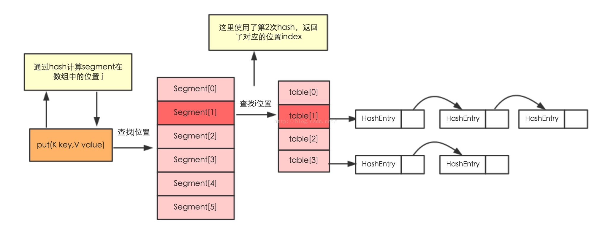

# HashMap & ConcurrentHashMap

[toc]

## jdk1.7 HashMap

- 在HashMap中,使用数组和链表(单向链表 A->B->C )来做底层数据容器,线程不安全,表现有如下几种
  1. 多个线程同时调用put方法时(2个线程的key发生hash碰撞),正好当前table[i]指向的对象为null,那么thread1和thread2同时会新建一个Entry对象方到指定位置,这样,先放上去的数据会丢失 (createEntry方法导致)
  2. 多个线程同时调用put方法时(2个线程的key发生hash碰撞),当前table[i]已经指向了一条链表了(这两链表中没有当前线程所要插入的key),跑的快得会将头节点换成自己的Entry,而慢的刚好拿到了刚才的头结点组成的链表,又把自己追加上去了,形成了类似 A'->A->B->C 的链表 (createEntry方法导致)
  3. 由于使用头插法(这种方法在替换的过程中逻辑比较简单,直接将原链表追到自己后面,将自己设置到数组中即可),使用这种简单的操作会使的 A->B->C 链表在resize的过程中逆序为 C->B->A ,谁后插入谁是头.这种逻辑下,如果两个线程同时做扩容操作,就可能同时进入transfer方法,然后走到 `Entry<K,V> next = e.next;` 这句,同时获取到 e->A ,e.next->B,然后thread1率先跑完2圈逻辑,将A追加到了新table上,同时将B也追加到了新table上,新table : B->A ,然后thread2开始将A往新table上放,先是将 B->A 链表放到自己尾部,然后让自己替换掉新table的头结点,形成了 A->B->A 环形链表 (resize#transfer方法导致死循环)
- modCount用于记录HashMap的修改次数,在HashMap的put(),get(),remove(),Interator()等方法中,都使用了该属性由于HashMap不是线程安全的,所以在迭代的时候,会将modCount赋值到迭代器的expectedModCount属性中,然后进行迭代,如果在迭代的过程中HashMap被其他线程修改了,modCount的数值就会发生变化,这个时候expectedModCount和ModCount不相等,迭代器就会抛出ConcurrentModificationException()异常
> 这里补充一点,put(),get(),remove()都会自增这个值,所以集合在遍历的时候,不能调用集合对象自己的删除方法,因为自己的删除方法改了值,但是遍历时并不知道,如果想要删除,可以调用迭代器的删除,因为迭代器的删除方法在删除的时候会同步一下这个值,保证不出错,所以应该是 it.remove() , 而不是 list.remove(obj)

- 构造器

  ```java
  public HashMap(int initialCapacity, float loadFactor) {
    if (initialCapacity < 0)
      throw new IllegalArgumentException("Illegal initial capacity: " +
                         initialCapacity);
    if (initialCapacity > MAXIMUM_CAPACITY) // MAXIMUM_CAPACITY =  1 << 30
      initialCapacity = MAXIMUM_CAPACITY;
    if (loadFactor <= 0 || Float.isNaN(loadFactor))
      throw new IllegalArgumentException("Illegal load factor: " +
                         loadFactor);
    this.loadFactor = loadFactor; // 默认 0.75
    threshold = initialCapacity; // initialCapacity默认16 同时将阈值也设置成了16 ,这个方法没有保存容量这个参数,因为这个参数可能会被调整为2的整数次幂,所以这里只是用threshold记录了一下,并不表示threshold的真实值,也不表示容量
    init(); //空方法
  }
  ```

- put

  ```java
  public V put(K key, V value) {
    if (table == EMPTY_TABLE) { //如果当前Entry[]为空集合,就用构造器中设置好的阈值(16),初始化table对象
      inflateTable(threshold); //填充table , 下面有解释
    }
    if (key == null)
      return putForNullKey(value); //生成一个 key = null 的键值对 ,主要是null无法hash,所以这里单独写了个方法,hash写死0
    int hash = hash(key); //下面有解释
    int i = indexFor(hash, table.length); // 计算当前 key 在table中的位置
    for (Entry<K,V> e = table[i]; e != null; e = e.next) { //然后开始遍历那个位置的链表
      Object k;
      if (e.hash == hash && ((k = e.key) == key || key.equals(k))) { //如果key相同,则覆盖,返回原值
        V oldValue = e.value;
        e.value = value;
        e.recordAccess(this);
        return oldValue;
      }
    }

    modCount++; // 增加修改次数,遍厉时会检查这个值,如果发现不一样,也就是hashmap在遍历过程中被修改了,则抛出ConcurrentModificationException异常
    addEntry(hash, key, value, i); // 添加一个新元素
    return null;
  }
  ```

- inflateTable

  ```java
  private void inflateTable(int toSize) {
    // Find a power of 2 >= toSize  找到一个最接近 toSoze 的2的整数次方幂
    int capacity = roundUpToPowerOf2(toSize); //此时计算真实容量

    threshold = (int) Math.min(capacity * loadFactor, MAXIMUM_CAPACITY + 1); //修正阈值的值 -> 16 * 0.75 = 12
    table = new Entry[capacity]; //创建一个新的Entry[]
    initHashSeedAsNeeded(capacity); //初始化一个hashseed ,这个种子的意义在于加大hash冲突的难度,如果为0则表示禁用hashseed,默认为0,这个方法最后结果也是0
  }
  ```

- initHashSeedAsNeeded

  ```java
  final boolean initHashSeedAsNeeded(int capacity) {
    //hashseed 实例化对象时赋默认值 0 ,所以这里currentAltHashing第一次可以认定为false
    boolean currentAltHashing = hashSeed != 0;
    //sun.misc.VM.isBooted() 代码返回 true ,可以自己调用这段代码尝试
    //Holder.ALTERNATIVE_HASHING_THRESHOLD 最后逻辑返回是 int 最大值
    //这里 useAltHashing = false
    boolean useAltHashing = sun.misc.VM.isBooted() &&
        (capacity >= Holder.ALTERNATIVE_HASHING_THRESHOLD);
    // false ^ false = false
    boolean switching = currentAltHashing ^ useAltHashing;
    if (switching) {
      hashSeed = useAltHashing
        ? sun.misc.Hashing.randomHashSeed(this)
        : 0;
    }
    return switching;
  }
  ```

- hash

  ```java
  final int hash(Object k) {
    // 这里获取到 种子 , 默认是 0 ,  inflateTable 得到的也是 0
    int h = hashSeed;
    if (0 != h && k instanceof String) { //如果有种子且key类型为String , 就调用方法计算hash
      return sun.misc.Hashing.stringHash32((String) k);
    }

    h ^= k.hashCode(); // 0 ^ 任何数 = 任何数 ,就是去取了个hashcode
    //最终计算一个hashcode
    h ^= (h >>> 20) ^ (h >>> 12);
    return h ^ (h >>> 7) ^ (h >>> 4);
  }
  ```

- addEntry

  ```java
  void addEntry(int hash, K key, V value, int bucketIndex) {
    // 注意这个 &&
    if ((size >= threshold) && (null != table[bucketIndex])) { // 如果当前size长度大于等于阈值 且同时 table当前位置已存在链表,才开始走扩容逻辑
      //先扩容,再添加新节点
      resize(2 * table.length); // 扩容2倍
      hash = (null != key) ? hash(key) : 0; //算当前节点hash值
      bucketIndex = indexFor(hash, table.length); //计算节点在新table的位置
    }

    createEntry(hash, key, value, bucketIndex); //创建新节点
  }
  ```

- **resize**

  ```java
  void resize(int newCapacity) {
    Entry[] oldTable = table;
    int oldCapacity = oldTable.length;
    if (oldCapacity == MAXIMUM_CAPACITY) { //调整容量和阈值,如果容量等于最大值了,阈值也就不再扩容了,也赋值最大值,且不再扩容,但依然能添加新数据
      threshold = Integer.MAX_VALUE;
      return;
    }

    Entry[] newTable = new Entry[newCapacity];
    transfer(newTable, initHashSeedAsNeeded(newCapacity)); //数据转移
    table = newTable; //重新赋值
    threshold = (int)Math.min(newCapacity * loadFactor, MAXIMUM_CAPACITY + 1); //重洗计算新的阈值
  }
  ```

- **transfer**

  ```java
  void transfer(Entry[] newTable, boolean rehash) {
    int newCapacity = newTable.length;
    for (Entry<K,V> e : table) {
      while(null != e) {
        Entry<K,V> next = e.next;
        if (rehash) {
          e.hash = null == e.key ? 0 : hash(e.key);
        }
        int i = indexFor(e.hash, newCapacity);
        e.next = newTable[i]; // 头插法
        newTable[i] = e;
        e = next;
      }
    }
  }
  ```

- createEntry

  ```java
  void createEntry(int hash, K key, V value, int bucketIndex) {
    //头插发
    Entry<K,V> e = table[bucketIndex];
    table[bucketIndex] = new Entry<>(hash, key, value, e);
    size++;
  }
  ```

## jdk1.8 HashMap

- 数据结构
  - 由数组和链表组成,首先会以数组加链表方式存储数据,当某个位置上的链表长度超过8个(>8/>=9)的时候,会执行treeifyBin,这个方法不是一定会树化链表,而是还判断了一下当前table数组长度,如果 < 64,则会走resize扩容,而不是树化,如果超过了64长度,才会单独树化当前链表
  - 如果现在数据结构由数组和红黑树组成,不停调用remove方法,并不保证将红黑树链表化,只有满足`(root == null || root.right == null || (rl = root.left) == null || rl.left == null)`这个条件的时候,才会调用untreeify方法回退为链表,也就是如果树结构不符合条件,即便小于 6 这个阈值,也不会回退为链表
  - resize的作用有2个,一个是初始化table,一个是扩容,在扩容的时候,由于要进行红黑树拆分,这时拆分出来的2个新树如果有长度 <= 6 的,才会进行红黑树变链表(调用untreeify方法)
  > 也就是,扩容的时候可能会树化,也可能会链表化,而remove的时候,有可能会链表化,下图为可链表化最大树节点示例图,满足第四个条件,`rl.left == null`,即便有10个节点,也会链表化
  > 

- 构造器

  ```java
  public HashMap(int initialCapacity, float loadFactor) {
    if (initialCapacity < 0)
      throw new IllegalArgumentException("Illegal initial capacity: " +
                         initialCapacity);
    if (initialCapacity > MAXIMUM_CAPACITY) // 1 << 30
      initialCapacity = MAXIMUM_CAPACITY;
    if (loadFactor <= 0 || Float.isNaN(loadFactor))
      throw new IllegalArgumentException("Illegal load factor: " +
                         loadFactor);
    this.loadFactor = loadFactor;
    this.threshold = tableSizeFor(initialCapacity); //也是计算一个跟你传入的容量最接近的 2 的整数次幂
  }
  ```

- put

  ```java
  public V put(K key, V value) {
    return putVal(hash(key), key, value, false, true);
  }

  final V putVal(int hash, K key, V value, boolean onlyIfAbsent,
           boolean evict) {
    Node<K,V>[] tab; Node<K,V> p; int n, i;
    if ((tab = table) == null || (n = tab.length) == 0) // 如果table还未初始化,就调用resize方法初始化,就是返回一个new Node[容量],空集合
      n = (tab = resize()).length; // n 赋值为新table的长度

    if ((p = tab[i = (n - 1) & hash]) == null) //接着计算新key的位置,如果位置上为null,则直接赋新node到指定位置上
      tab[i] = newNode(hash, key, value, null);
    else {
      Node<K,V> e; K k;
      // p 在上面已经被赋值了 , p = tab[i = (n - 1) & hash] ,理解为table某个位置的头结点
      if (p.hash == hash &&
        ((k = p.key) == key || (key != null && key.equals(k)))) // 如果头结点数据和当前key一样,则用e指向p,保存一份旧的头结点数据
        e = p;
      else if (p instanceof TreeNode) // 如果链表头结点已经是红黑树了
        e = ((TreeNode<K,V>)p).putTreeVal(this, tab, hash, key, value); // 使用putTreeVal去做添加逻辑
      else { //只有table位置存在链表时进入这个方法
        for (int binCount = 0; ; ++binCount) { //binCount用来计数
          if ((e = p.next) == null) { //将下一个值赋值给 e,如果下一个值为null, 说明这个链表走到尾了,同时上面判断了这个节点的key也没和新key冲突,所以不用判断头结点
            p.next = newNode(hash, key, value, null); //尾插发 , 新建一个新节点,追加到链表尾部
            if (binCount >= TREEIFY_THRESHOLD - 1) // -1 for 1st ,如果插入前链表长度超过7个,也就是>=8,就进行树化 , 也就是插入之前当前链表长度已经是8,我插入第九个元素,或者覆盖第八个元素的时候,会树化
              treeifyBin(tab, hash); //数据在上面已经添加了,树化即可,同时会检查是否需要resize,如果table数组长度小于64,会走resize,而不是树化
            break;
          }
          if (e.hash == hash &&
            ((k = e.key) == key || (key != null && key.equals(k)))) //如果key冲突,则赋值给e,跳出循环
            break;
          p = e; //重置p,循环下一个节点
        }
      }
      if (e != null) { // 可能是头结点key冲突了,则覆盖头结点数据,返回旧值,也可能是链表中间节点key冲突,则覆盖结点数据,返回旧值
        V oldValue = e.value;
        if (!onlyIfAbsent || oldValue == null) // onlyIfAbsent 表示是否不存在值,只有不存在值才覆盖,否则不会出现key相同value被覆盖,默认false,表示覆盖
          e.value = value;
        afterNodeAccess(e); //空方法,给子类预留的
        return oldValue;
      }
    }
    ++modCount; // 自增修改次数
    // 如果添加完这个节点超过了阈值,则扩容,与jdk7不同,jdk8的hashmap是先增加数据,再扩容,jdk7是先扩容,再增加数据
    // 原因是一个是头插法,需要将数据倒序插入新的table,如果先增加数据,再扩容,还得再重复一遍转移新数据操作
    // 而jdk8是尾插发,直接头结点追加到新table位置,无需挨个移动链表上数据,所以可以先添加数据,再扩容
    if (++size > threshold)
      resize();
    afterNodeInsertion(evict); //空方法,给子类预留的
    return null;
  }
  ```

- resize
  - 这个方法既能初始化table,也能扩容table

  ```java
  final Node<K,V>[] resize() {
    Node<K,V>[] oldTab = table;
    int oldCap = (oldTab == null) ? 0 : oldTab.length; // 初始化时 = 0
    int oldThr = threshold; // 初始化时,是构造器传来的值,默认 16
    int newCap, newThr = 0;
    if (oldCap > 0) { //如果是初始化不会进这里
      if (oldCap >= MAXIMUM_CAPACITY) { //如果已经超过最大容量,则不再扩容,依然能添加节点,只是不扩容了
        threshold = Integer.MAX_VALUE;
        return oldTab;
      }
      else if ((newCap = oldCap << 1) < MAXIMUM_CAPACITY &&    //容量扩大一倍
           oldCap >= DEFAULT_INITIAL_CAPACITY)
        newThr = oldThr << 1; // double threshold 阈值也扩大1倍,容量 16->32 阈值 12->24 ,正好不用计算
    }
    else if (oldThr > 0) // 只有初始化会进
      newCap = oldThr;
    else {               // zero initial threshold signifies using defaults 构造hashmap时,2个数据都传0进这里
      newCap = DEFAULT_INITIAL_CAPACITY;
      newThr = (int)(DEFAULT_LOAD_FACTOR * DEFAULT_INITIAL_CAPACITY);
    }
    if (newThr == 0) { //初始化时会进
      float ft = (float)newCap * loadFactor; // loadFactor = 0.75  计算新的阈值
      newThr = (newCap < MAXIMUM_CAPACITY && ft < (float)MAXIMUM_CAPACITY ?
            (int)ft : Integer.MAX_VALUE); //赋值新阈值为计算的值或者int最大值
    }
    threshold = newThr; //从 newThr = oldThr << 1; 赋值过来的新的阈值
    @SuppressWarnings({"rawtypes","unchecked"})
      Node<K,V>[] newTab = (Node<K,V>[])new Node[newCap]; // 新的table
    table = newTab; //先把旧table给换掉了,旧table现在在oldTab变量中,如果是初始化,到这里已经创建了新的table,就完了
    if (oldTab != null) { // 如果旧table中有值,则开始转移数据
      for (int j = 0; j < oldCap; ++j) {
        Node<K,V> e;
        if ((e = oldTab[j]) != null) { // e -> table中某个位置的头结点, == null,跳过不用移动,!=null,开始移动
          oldTab[j] = null; // 帮助GC,把旧结点数据跟旧table断开,旧数据在e中存了一份,没有丢
          if (e.next == null) //单一节点
            newTab[e.hash & (newCap - 1)] = e; //直接赋值新的节点即可
          else if (e instanceof TreeNode) //如果是红黑树,需要拆分红黑树链表,因为数据可能被分散到2个位置,因为扩容后的位置不是原来位置就是(原来位置+旧数组长度)的位置,所以要把链表一拆二,同时决定是否需要树化
            ((TreeNode<K,V>)e).split(this, newTab, j, oldCap); //在split方法中,才会决定是否数据会退化为链表
          else { // 原来位置是链表,链表肯定不用树化,但是也可能会拆成2个链表
            Node<K,V> loHead = null, loTail = null;
            Node<K,V> hiHead = null, hiTail = null;
            Node<K,V> next;
            do {
              next = e.next;
              if ((e.hash & oldCap) == 0) {
                if (loTail == null)
                  loHead = e;
                else
                  loTail.next = e;
                loTail = e;
              }
              else {
                if (hiTail == null)
                  hiHead = e;
                else
                  hiTail.next = e;
                hiTail = e;
              }
            } while ((e = next) != null);
            if (loTail != null) {
              loTail.next = null;
              newTab[j] = loHead;
            }
            if (hiTail != null) {
              hiTail.next = null;
              newTab[j + oldCap] = hiHead;
            }
          }
        }
      }
    }
    //返回新table
    return newTab;
  }
  ```

- aa

  ```java
    final void split(HashMap<K,V> map, Node<K,V>[] tab, int index, int bit) {
        TreeNode<K,V> b = this;
        // Relink into lo and hi lists, preserving order
        TreeNode<K,V> loHead = null, loTail = null;
        TreeNode<K,V> hiHead = null, hiTail = null;
        int lc = 0, hc = 0;
        for (TreeNode<K,V> e = b, next; e != null; e = next) {
            next = (TreeNode<K,V>)e.next;
            e.next = null;
            if ((e.hash & bit) == 0) {
                if ((e.prev = loTail) == null)
                    loHead = e;
                else
                    loTail.next = e;
                loTail = e;
                ++lc;
            }
            else {
                if ((e.prev = hiTail) == null)
                    hiHead = e;
                else
                    hiTail.next = e;
                hiTail = e;
                ++hc;
            }
        }

        if (loHead != null) {
            if (lc <= UNTREEIFY_THRESHOLD)
                tab[index] = loHead.untreeify(map);
            else {
                tab[index] = loHead;
                if (hiHead != null) // (else is already treeified)
                    loHead.treeify(tab);
            }
        }
        if (hiHead != null) {
            if (hc <= UNTREEIFY_THRESHOLD)
                tab[index + bit] = hiHead.untreeify(map);
            else {
                tab[index + bit] = hiHead;
                if (loHead != null)
                    hiHead.treeify(tab);
            }
        }
    }
  ```

- get
  - 就是找指定key对应的value

- remove
  - remove要注意就是当数据量小于6时,会将红黑树链表化

## jdk1.7 ConcurrentHashMap

- 整体结构

  - 这个数据中使用~~16个~~固定长度的segment对象来装载数据,而真实的数据储存在segment对象中的HashEntry[]中,数组中每一个HashEntry都是一条链表,默认一开始每个segment中HashEntry[]长度至少为2,所以初始的ConcurrentHashMap可以理解为一共有32个HashEntry用来存数据,但是其中没有用到的HashEntry,其在数组中设置的值还是null,同时某个segemnt中的扩容方法rehash的操作只影响自己的segment,不会影响别的segment
  

  ```java
    public static void main(String[] args) throws NoSuchFieldException, IllegalAccessException {
      ConcurrentHashMap<Object,Object> map = new ConcurrentHashMap();
      for (int i = 0; i < 1280*1280 ; i++) {
        map.put(i+"","1");
      }

      //1.7中的ConcurrentHashMap中的单位是segments,固定是16个
      //不论上面数据多大都是这么长
      Field segments = map.getClass().getDeclaredField("segments");
      segments.setAccessible(true);
      Object segmentArray = segments.get(map);
      System.out.println("这个对象是个数组\t"+segmentArray);
      Object[] obj = (Object[])segmentArray;
      System.out.println("此数组固定是16单位\t"+obj.length);
      int size = map.size();
      System.out.println("map的size\t"+size);


      Object segment0 = obj[0];
      //1.7中的segments中的 HashEntry 真实存储数据
      Field table = segment0.getClass().getDeclaredField("table");
      table.setAccessible(true);
      Object HashEntryArray = table.get(segment0);
      Object[] ooo = (Object[])HashEntryArray;
      System.out.println("每个segment中有多少entryEntity\t"+ooo.length);


      System.out.println("=============entryEntity中的数据=================");
      for (int i = 0; i < ooo.length; i++) {
        System.out.println(i+"\t"+ooo[i]);
      }

    }
  ```

- 构造方法

```java
  public ConcurrentHashMap() {
    //DEFAULT_INITIAL_CAPACITY : 默认容量 16
    //DEFAULT_LOAD_FACTOR : 加载因子 默认0.75
    //DEFAULT_CONCURRENCY_LEVEL : 并发级别,1.7是段锁,有几段就相当于并发级别是几,这个值默认是16,所以上面演示的代码固定长度为16,可以通过下面的构造函数自定义
    //此值可以理解为 segment 数组的长度
      //此数据定义规则 :
    this(DEFAULT_INITIAL_CAPACITY, DEFAULT_LOAD_FACTOR, DEFAULT_CONCURRENCY_LEVEL);
  }

  public ConcurrentHashMap(int initialCapacity,
               float loadFactor, int concurrencyLevel) {
    //入参必须 > 0
    if (!(loadFactor > 0) || initialCapacity < 0 || concurrencyLevel <= 0)
      throw new IllegalArgumentException();
    //如果设定的 segments 长度超过最大值,就设定为最大值
    if (concurrencyLevel > MAX_SEGMENTS)  // MAX_SEGMENTS = 1 << 16 , 65535 , 这个是个保守值 ,最大可设置 1 << 24, 16777216
      concurrencyLevel = MAX_SEGMENTS;
    // 由于map中设置的长度的值需要设定为 2 的整数次幂,所以这里用户如果没有经验,随便设置了一个concurrencyLevel,需要将其调整为最接近 2 的 整数次幂的值 ,就是下面的 ssize
      //按照默认值 16 个长度来算 ,这里计算的到的 sshift = 4 , ssize = 16
    int sshift = 0;
    int ssize = 1; //最终会计算出来一个合适的值
    while (ssize < concurrencyLevel) { //如果这个值小于 你设置的 concurrencyLevel ,就再扩大一倍
      ++sshift; //记录左移了几次
      ssize <<= 1; //左移一次并赋值 ,就是 乘2
    }
    // 因为一个int长度就是32位用32-上面左移次数,就能获取一个int数的前导0的个数
    // 比如 上面左移了 4 次,那个数据肯定是 00000000 00000000 00000000 00010000,左移5次,就是 00000000 00000000 00000000 00100000
    // 获得的值就是 00000000 00000000 00000000 0001 => 28长度 ,  00000000 00000000 00000000 001 -> 27长度
    // 这里把1的位置也计算了,是因为 segmentMask 是在 10000 或者 100000 上减一,得到的位数自然少了一位,所以这里正好等于 32 - 左移次数
      // 其实就是这里算个差,一个int 32 位,我这里的数组长度16,之后put的时候用的是16-1是15,也就是1111,4位,我还有28位没用,这个28 用 32 - 4 就得到了
      // 既然下面我对数据的hashcode的值做 & 运算的时候,是跟 1111 做 & 运算,那么算出来的值就不能超过15,也就是1111, & 是位运算,我拿32位和4位与结果就可能超过15
      // 所以,最保险就是4位和4位与(其他情况同理,如果之后我跟11111111,8位与,也得让hashcode变成8位),怎么变呢,就是这里算 int 中我有几位没用到,比如记录一个28位没用到
      // 等到,我算出hashcode以后,我用他右移28位,相当于舍掉了后28位,取了高四位,然后用高4位和1111与
    this.segmentShift = 32 - sshift;
    //2的整数次幂的作用就体现在这里,他们二进制都长这样 10  100  1000  10000, 减一之后都是 1 11 111 1111 ,
    //这样的数字做&操作的时候最能发挥被操作数自己本身的特点,尽量将数据均匀分开(具体这里可以自行百度 [ 为何map长度要设置为16 ] )
    this.segmentMask = ssize - 1;
    //如果你设置的容量超过最大容量,则设置为最大容量
    if (initialCapacity > MAXIMUM_CAPACITY) //1073741824 , 1 << 30
      initialCapacity = MAXIMUM_CAPACITY;
    int c = initialCapacity / ssize; // 你传入的容量 / 推算出来的容量 = 一个 segment 中 HashEntry[] 的长度
    if (c * ssize < initialCapacity) //由于地板除法会舍掉小数部分,所以这里再反着推算一遍,如果舍掉就再给加上
      ++c;
    int cap = MIN_SEGMENT_TABLE_CAPACITY; // MIN_SEGMENT_TABLE_CAPACITY = 2 , 这里表示一个 segment 中的 HashEntry[] 的长度,也就是初始化segment时默认初始化几个长度
    while (cap < c) // 同样道理, segment 中的 HashEntry[] 的长度也得是2的整数次幂,所以得自己算
      cap <<= 1;
    // 根据上面求出的数据先创建一个segment对象,传入loadFactor(0.75),阈值-这个值决定了数组什么时候扩容(Segment中HashEntry[]长度 * 0.75),创建一个HashEntry[],长度为上面计算出来的值
    Segment<K,V> s0 =
      new Segment<K,V>(loadFactor, (int)(cap * loadFactor),
               (HashEntry<K,V>[])new HashEntry[cap]);
    //创建一个segment[],长度为上面推算出来的值(之后这个对象长度就固定了)
    Segment<K,V>[] ss = (Segment<K,V>[])new Segment[ssize];
    //使用unsafe安全的将 创建的 segment 放入 segment[0] 中
    UNSAFE.putOrderedObject(ss, SBASE, s0); // ordered write of segments[0]
    //整个类中就这里对 segments 对象赋值,所以上面计算的segments[]长度是多少,就固定死了
    this.segments = ss;
  }
```

- put方法

```java
  public V put(K key, V value) {
    Segment<K,V> s;
    if (value == null)
      throw new NullPointerException();
    int hash = hash(key);
    // 这里用上了上面 32 - 左移次数的结果 segmentShift , 也就是有几位没有用到,我把这几位舍弃掉,然后&运算,算出此数据在segment中的位置
    // segmentMask 现在肯定是好几个1,比如segment数组容量16,segmentMask 就是 16 - 1 = 15 , 即 1111
    int j = (hash >>> segmentShift) & segmentMask;
    // 用unsafe到内存中查看下这个位置的segment初始化好了么,没好就调用ensureSegment方法去初始化这个segment,好了就直接调用put方法保存值了
    if ((s = (Segment<K,V>)UNSAFE.getObject          // nonvolatile; recheck
      (segments, (j << SSHIFT) + SBASE)) == null) //  in ensureSegment
      s = ensureSegment(j);
    return s.put(key, hash, value, false);
  }
```

- ensureSegment 方法

```java
  private Segment<K,V> ensureSegment(int k) {
    final Segment<K,V>[] ss = this.segments;
    long u = (k << SSHIFT) + SBASE; // raw offset
    Segment<K,V> seg;
    // 查看当前位置的segment对象是否已经被别的线程初始化了 第一次
    if ((seg = (Segment<K,V>)UNSAFE.getObjectVolatile(ss, u)) == null) {
      //没初始化就把0位上那个segment拿出来,(那个是构造器中肯定已经初始化好了的对象),把它的属性拿出来,复制一个新的segment对象
      Segment<K,V> proto = ss[0]; // use segment 0 as prototype
      int cap = proto.table.length;
      float lf = proto.loadFactor;
      int threshold = (int)(cap * lf);
      HashEntry<K,V>[] tab = (HashEntry<K,V>[])new HashEntry[cap];
      // 查看当前位置的segment对象是否已经被别的线程初始化了 第二次
      if ((seg = (Segment<K,V>)UNSAFE.getObjectVolatile(ss, u))
        == null) { // recheck
        // 这时再new segment对象
        Segment<K,V> s = new Segment<K,V>(lf, threshold, tab);
        // 查看当前位置的segment对象是否已经被别的线程初始化了 自旋方式不断设置,如果有值就退出循环
        while ((seg = (Segment<K,V>)UNSAFE.getObjectVolatile(ss, u))
             == null) {
          if (UNSAFE.compareAndSwapObject(ss, u, null, seg = s)) //成功就break,失败继续自旋
            break;
        }
      }
    }
    //返回这个位置上的segment
    return seg;
  }
```

- s.put方法,即将值put到segment中
  - 前提1 : Segment对象继承自ReentrantLock对象,所以可以使用锁
  ```java
    static final class Segment<K,V> extends ReentrantLock implements Serializable {
    ...
    }
  ```

```java
  final V put(K key, int hash, V value, boolean onlyIfAbsent) {
    //这里可能赋值为null,或者新节点
    HashEntry<K,V> node = tryLock() ? null :
      scanAndLockForPut(key, hash, value); //下面有源码分析
    V oldValue;
    try {
      //备一份当前segment中的 HashEntry[]
      HashEntry<K,V>[] tab = table;
      //二次hash,计算 key 在 HashEntry[] 中的索引
      int index = (tab.length - 1) & hash;
      //使用unsafe获取那个位置上的头结点
      HashEntry<K,V> first = entryAt(tab, index);
      for (HashEntry<K,V> e = first;;) {
        if (e != null) { //如果头节点不为null
          K k;
          if ((k = e.key) == key ||
            (e.hash == hash && key.equals(k))) { //判断当前key和这个节点的key是否相同,相同就获取之前的value,然后赋新值
            oldValue = e.value;
            if (!onlyIfAbsent) { //调用时传入的false , 所以这里稳定为 true
              e.value = value; //赋新值
              ++modCount; //增加取模的count
            }
            break;
          }
          e = e.next; // 否则继续对比下一个
        }
        else { // 为null,说明链表已经循环完了,都没找到 key 一样的,所以开始将新节点加入之前链表即可
          if (node != null)
            node.setNext(first); //头插法,由于加锁操作,所以不必担心ConcurrentHashMap会有头插法的线程安全问题
          else
            node = new HashEntry<K,V>(hash, key, value, first); // 这时候还为null,一般就是上面直接获取到了锁,直接得到了null,得新创建一个节点,同样是头插法
          int c = count + 1; //size + 1
          if (c > threshold && tab.length < MAXIMUM_CAPACITY) // 超过 HashEntry[].length * 0.75 ,而且未达到最大容量(1 << 30)时,扩容
            rehash(node); //数组长度扩容一倍,重新hash分散数据
          else
            setEntryAt(tab, index, node); // 通过unsafe,安全的将node设置到指定位置上,头插法的好处就在于这时候不用遍历整个链表添加,而是将自己做头,重新链了一个链表,然后替换掉之前链表即可
          ++modCount; //增加修改的次数
          count = c;
          oldValue = null; //新增节点,旧数据为null
          break;
        }
      }
    } finally {
      unlock();
    }
    return oldValue;
  }
```

- scanAndLockForPut
  - 这个方法会根据传入的key在当前segment对象中查找数据,逻辑为
  1. 根据这个key查找在HashEntry[]中的位置,然后获取到链表头
  2. 开始查看链表头跟我这个key一样不,如果一样,就不在继续向下查找,将e就是当前node,如果不是就查找下一个节点,还是判断key是否相同,如果一路查找下去都没有找到,这时这个e是null,则new 一个新节点,也就是这里一定会给e赋值一个节点,可能是头node,可能是链表中某个node,还可能是新node
  3. 然后开始循环重试获取锁,如果超过了最大重试次数,就调用lock稳定获取锁
  4. 没超过次数,就每奇数次查看当前持有的first还是不是之前获取到的first,因为可能有人改了头节点数据,如果是继续尝试获取锁,如果不是,就把e赋值为新头,然后重置循环次数,重新来过
  5. 最后返回node,node可能是新节点(即没有key相同的情况),也可能是null(注意 node 和 e 没关系)(即key相同),所以外面的put方法,只要判断返回的对象是否为null,就知道要不要做链表遍历了

```java
  private HashEntry<K,V> scanAndLockForPut(K key, int hash, V value) {
    //通过unsafe获取指当前segement中指定hashcode位置的HashEntry
    HashEntry<K,V> first = entryForHash(this, hash);
    //保存本地一份作为当前节点指针,不会影响上面first一直是头结点
    HashEntry<K,V> e = first;
    HashEntry<K,V> node = null;
    int retries = -1; // negative while locating node
    //开始自旋获取锁,获取到返回上面声明的空节点,没获取到进入while循环
    while (!tryLock()) {
      HashEntry<K,V> f; // to recheck first below
      if (retries < 0) { //一开始是 -1 ,进入这个分支
        if (e == null) { //如果从entryForHash中获取的HashEntry为null,进入分支
          if (node == null) // node为null,所以创建一个新节点
            node = new HashEntry<K,V>(hash, key, value, null);
          retries = 0; //进来就把 -1 改成 0
        }
        else if (key.equals(e.key)) //如果entryForHash获取到的HashEntry的key和传入的key相同,就将retries置为0,开始进行重试
          retries = 0;
        else //如果entryForHash获取到的HashEntry和我的key没关系,就顺着链表继续向下查找
          e = e.next;
      }
      else if (++retries > MAX_SCAN_RETRIES) { // MAX_SCAN_RETRIES 根据机器cpu核心判断,单核固定为1,多核固定为64
        //如果重试次数超过最大值,就使用lock稳定获取锁,这个方法会阻塞
        lock();
        break;
      }
      else if ((retries & 1) == 0 &&
          (f = entryForHash(this, hash)) != first) { //如果头已经被别人获取并修改了,就将e重置为新头,重新开始循环
        e = first = f; // re-traverse if entry changed
        retries = -1; //重置
      }
    }
    return node;
  }
```

- rehash

  ```java
    private void rehash(HashEntry<K,V> node) {
        HashEntry<K,V>[] oldTable = table;
        int oldCapacity = oldTable.length;
        int newCapacity = oldCapacity << 1;
        threshold = (int)(newCapacity * loadFactor);
        HashEntry<K,V>[] newTable =
            (HashEntry<K,V>[]) new HashEntry[newCapacity];
        int sizeMask = newCapacity - 1;
        for (int i = 0; i < oldCapacity ; i++) {
            HashEntry<K,V> e = oldTable[i];
            if (e != null) {
                HashEntry<K,V> next = e.next;
                int idx = e.hash & sizeMask;
                if (next == null)   //  Single node on list
                    newTable[idx] = e;
                else { // Reuse consecutive sequence at same slot
                    HashEntry<K,V> lastRun = e;
                    int lastIdx = idx;
                    for (HashEntry<K,V> last = next;
                          last != null;
                          last = last.next) {
                        int k = last.hash & sizeMask;
                        if (k != lastIdx) {
                            lastIdx = k;
                            lastRun = last;
                        }
                    }
                    newTable[lastIdx] = lastRun;
                    // Clone remaining nodes
                    for (HashEntry<K,V> p = e; p != lastRun; p = p.next) {
                        V v = p.value;
                        int h = p.hash;
                        int k = h & sizeMask;
                        HashEntry<K,V> n = newTable[k];
                        newTable[k] = new HashEntry<K,V>(h, p.key, v, n);
                    }
                }
            }
        }
        int nodeIndex = node.hash & sizeMask; // add the new node
        node.setNext(newTable[nodeIndex]);
        newTable[nodeIndex] = node;
        table = newTable;
    } 
  ```

- get
  - 简单的使用unsafe遍历获取了数据

- remove
  - 使用unsafe得到具体的segement,然后使用ReentrantLock加锁删除

## jdk1.8 ConcurrentHashMap


- 个人理解 : sync锁和CAS主要功能分为,在put真实数据的时候需要sync锁住数据,防止同时去做transfer的工作,所以同时transfer真实在移动数据的时候,也要使用sync锁住数据,防止在同一个位置的链表上进行put操作,还有replaceNode(remove方法)也会使用sync去操作数据,关键位置就是这三个地方的sync ; CAS主要作用是修改状态值,比如修改sizeCtl,或者在table某个位置上设置节点,由于使用CAS,所以用了大量的自旋

- 构造器

  ```java
  //使用类中默认值来构造
  public ConcurrentHashMap() {
  }

  //指定初始容量
  //ConcurrentHashMap的构造器里的初始化容量含义与上面3个初始化容量不一样,其他初始化容量表示的就是容量,所以其他都是根据初始化容量找一个2的次幂做容量即可
    //比如我传入容量16,其实表示的意思是我有16个对象要装,但是阈值根据16计算得到的是12,也就是我指定了容量希望优化,但是其实到了12个元素的时候,我还是会进行一次扩容
  //而1.8的这个值的意思更像是阈值,所以我们看源码没有再是根据这个值去取2的次幂,而是类似让这个值 n/0.75 , 算出来一个容量
    //比如我传入容量16,其实表示的意思是我有16个对象要装,于是根据16/0.75,计算得到一个21.33,再根据21.33去取2的次幂,得到容量32,这样阈值为24,我放16个元素绰绰有余
  public ConcurrentHashMap(int initialCapacity) {
    if (initialCapacity < 0)
      throw new IllegalArgumentException();
    int cap = ((initialCapacity >= (MAXIMUM_CAPACITY >>> 1)) ?
           MAXIMUM_CAPACITY :
           tableSizeFor(initialCapacity + (initialCapacity >>> 1) + 1)); //tableSizeFor方法用来取传入数据最接近的2的整数次幂
           //那我们传入的数据就很关键,之前传入的其实就是initialCapacity原值,但现在是 1.5倍的initialCapacity还加一,我们分析一下
           //比如上面的 16 / 0.75 -> 16 / 四分之三 -> 16 * 三分之四 -> 16 * 一又三分之一
           //而这里的可以推算为 16 + (16 / 2) + 1 -> 16 * 一又二分之一 + 1 ,这个值是不是最接近 16 * 一又三分之一 呢?
           //加一的目的我认为是为了防止initialCapacity传0,因为0最接近的整数次幂还是0,就无法初始化最小值了
    this.sizeCtl = cap;
  }

  public ConcurrentHashMap(int initialCapacity, float loadFactor) {
    this(initialCapacity, loadFactor, 1);
  }

  public ConcurrentHashMap(int initialCapacity,
               float loadFactor, int concurrencyLevel) { //此处并发数并无太大意义,1.8中的并发数是根据桶来确认的,也就是table的长度有多长,并发数就有多高
    if (!(loadFactor > 0.0f) || initialCapacity < 0 || concurrencyLevel <= 0)
      throw new IllegalArgumentException();
    if (initialCapacity < concurrencyLevel)   // Use at least as many bins
      initialCapacity = concurrencyLevel;   // as estimated threads
    long size = (long)(1.0 + (long)initialCapacity / loadFactor); // 这里就更像上面的算法了 16/0.75 = 21.33 ,但由于是地板除法,所以结果是21,然后在加一,肯定保证在你指定的初始化容量内加数据,不会扩容
    int cap = (size >= (long)MAXIMUM_CAPACITY) ?
      MAXIMUM_CAPACITY : tableSizeFor((int)size);
    this.sizeCtl = cap;
  }
  ```

- put

  ```java
  public V put(K key, V value) {
    return putVal(key, value, false);
  }

  final V putVal(K key, V value, boolean onlyIfAbsent) {
    if (key == null || value == null) throw new NullPointerException(); //不允许键或值为空
    int hash = spread(key.hashCode()); //计算hash值
    int binCount = 0;
    for (Node<K,V>[] tab = table;;) {
      Node<K,V> f; int n, i, fh;
      if (tab == null || (n = tab.length) == 0) //如果table未被初始化
        tab = initTable(); //下面有解释
      else if ((f = tabAt(tab, i = (n - 1) & hash)) == null) { //计算table[i]位置是否为null, 下面有解释
        if (casTabAt(tab, i, null,
               new Node<K,V>(hash, key, value, null))) //如果为空,则就使用casTabAt添加到头结点,尝试,如果不成功会自旋回来再次添加
          break;                   // no lock when adding to empty bin  插入成功,退出循环,否则继续循环
      }
      else if ((fh = f.hash) == MOVED) //table[i]位置hash值是否是MOVED(-1),如果是,就让当前线程帮助转移
        tab = helpTransfer(tab, f); //下面有解释
      else { //如果table[i]位置有节点,而且还没有在MOVED,就用synchronized锁住当前头结点
        V oldVal = null;
        synchronized (f) {
          if (tabAt(tab, i) == f) {//重新获取头节点,如果两个对象一致
            if (fh >= 0) { //这个节点状态为链表,因为其他状态都是负值,红黑树也是负值
              binCount = 1;
              for (Node<K,V> e = f;; ++binCount) { //循环两种情况
                K ek;
                if (e.hash == hash &&
                  ((ek = e.key) == key ||
                   (ek != null && key.equals(ek)))) { //一种key碰撞,覆盖原值,返回旧值,break
                  oldVal = e.val;
                  if (!onlyIfAbsent)
                    e.val = value;
                  break;
                }
                Node<K,V> pred = e;
                if ((e = e.next) == null) { // 另一种插入新值,尾插发,break;
                  pred.next = new Node<K,V>(hash, key,
                                value, null);
                  break;
                }
              }
            }
            else if (f instanceof TreeBin) { //如果头结点是树节点
              Node<K,V> p;
              binCount = 2; //将binCount置成2
              if ((p = ((TreeBin<K,V>)f).putTreeVal(hash, key,
                               value)) != null) { //将数据放入树中
                oldVal = p.val;
                if (!onlyIfAbsent)
                  p.val = value;
              }
            }
          }
        }
        if (binCount != 0) { //说明进入过处理链表那个的分支的循环,或者处理树的分支
          //TREEIFY_THRESHOLD = 8,这里好像写的跟hashmap中逻辑不一样,但其实是一样的,hashmap中binCount从0开始计数 >= 8-1,而这里binCount从1开始计数,>=8,逻辑一致,都是8个开始尝试树化
          //但由于是后计数,也就是我之前有7个节点,我新添加了一个节点,这时我不计算这个节点,也就是添加后节点数为8,但是binCount是7,这时不扩容,而是等到下次插入才开始尝试树化
          //也就是插入之前当前链表长度已经是8,我插入第九个元素,或者覆盖第八个元素的时候,可能会树化
          if (binCount >= TREEIFY_THRESHOLD)
            treeifyBin(tab, i); //下面有解释
          if (oldVal != null) //返回旧内容
            return oldVal;
          break;
        }
      }
    }
    addCount(1L, binCount);//使用cas来+1,如果传入binCount >= 0,则有可能去帮助扩容
    return null;
  }
  ```

- initTable

  ```java
    private final Node<K,V>[] initTable() {
      Node<K,V>[] tab; int sc;
      while ((tab = table) == null || tab.length == 0) { //再次判断table是否为null
        if ((sc = sizeCtl) < 0) //当我发现sc = -1 的时候,说明别的线程把sc数据改了,我放弃操作
          Thread.yield(); // lost initialization race; just spin
        else if (U.compareAndSwapInt(this, SIZECTL, sc, -1)) {//读取当前对象在内存偏移量SIZECTL位置的值,如果 == sc ,就将值设置为 -1
          try {
            if ((tab = table) == null || tab.length == 0) { // 再次判断
              int n = (sc > 0) ? sc : DEFAULT_CAPACITY; //设置容量为sc,第一次就是计算好的容量 16
              @SuppressWarnings("unchecked")
              Node<K,V>[] nt = (Node<K,V>[])new Node<?,?>[n];
              table = tab = nt;
              sc = n - (n >>> 2); // 16 - 4 = 12
            }
          } finally {
            sizeCtl = sc; //sizeCtl = 12
          }
          break;
        }
      }
      return tab;
    }
  ```

- tabAt

  ```java
    static final <K,V> Node<K,V> tabAt(Node<K,V>[] tab, int i) {
        return (Node<K,V>)U.getObjectVolatile(tab, ((long)i << ASHIFT) + ABASE);
    }
  ```

- casTabAt

  ```java
    static final <K,V> boolean casTabAt(Node<K,V>[] tab, int i,
                                        Node<K,V> c, Node<K,V> v) {
        return U.compareAndSwapObject(tab, ((long)i << ASHIFT) + ABASE, c, v);
    }
  ```

- helpTransfer

  ```java
    final Node<K,V>[] helpTransfer(Node<K,V>[] tab, Node<K,V> f) {
        Node<K,V>[] nextTab; int sc;
        if (tab != null && (f instanceof ForwardingNode) &&
            (nextTab = ((ForwardingNode<K,V>)f).nextTable) != null) {
            int rs = resizeStamp(tab.length);
            while (nextTab == nextTable && table == tab &&
                   (sc = sizeCtl) < 0) {
                if ((sc >>> RESIZE_STAMP_SHIFT) != rs || sc == rs + 1 ||
                    sc == rs + MAX_RESIZERS || transferIndex <= 0)
                    break;
                if (U.compareAndSwapInt(this, SIZECTL, sc, sc + 1)) {
                    transfer(tab, nextTab);  //最终还是调用transfer方法
                    break;
                }
            }
            return nextTab;
        }
        return table;
    }
  ```

- t

  ```java
    private final void treeifyBin(Node<K,V>[] tab, int index) {
        Node<K,V> b; int n, sc;
        if (tab != null) {
            if ((n = tab.length) < MIN_TREEIFY_CAPACITY) //MIN_TREEIFY_CAPACITY = 64,如果table长度不到64,
                tryPresize(n << 1); //扩容,长度翻一倍
            else if ((b = tabAt(tab, index)) != null && b.hash >= 0) { //树化
                synchronized (b) {
                    if (tabAt(tab, index) == b) {
                        TreeNode<K,V> hd = null, tl = null;
                        for (Node<K,V> e = b; e != null; e = e.next) {
                            TreeNode<K,V> p =
                                new TreeNode<K,V>(e.hash, e.key, e.val,
                                                  null, null);
                            if ((p.prev = tl) == null)
                                hd = p;
                            else
                                tl.next = p;
                            tl = p;
                        }
                        setTabAt(tab, index, new TreeBin<K,V>(hd));
                    }
                }
            }
        }
    }
  ```

- tryPresize

  ```java
    //如果传入16直接就是64
    private final void tryPresize(int size) { //传入的参数已经翻一倍了 16 -> 32
        int c = (size >= (MAXIMUM_CAPACITY >>> 1)) ? MAXIMUM_CAPACITY :
            tableSizeFor(size + (size >>> 1) + 1); //计算  32 + 16 + 1 最接近的 2的次幂 64
        int sc;
        while ((sc = sizeCtl) >= 0) { //sc = 12
            Node<K,V>[] tab = table; int n;
            if (tab == null || (n = tab.length) == 0) { //判断table未初始化,未初始化的话,sc是16,相当于创建了16个长度
                n = (sc > c) ? sc : c; //取大数 16
                if (U.compareAndSwapInt(this, SIZECTL, sc, -1)) { //修改状态,表示正在移动数据
                    try {
                        if (table == tab) { //如果上面返回true,表示我获取到了操作权
                            @SuppressWarnings("unchecked")
                            Node<K,V>[] nt = (Node<K,V>[])new Node<?,?>[n];
                            table = nt; //赋新值(空集合)
                            sc = n - (n >>> 2); // 16 - 4 = 12
                        }
                    } finally {
                        sizeCtl = sc;
                    }
                }
            }
            else if (c <= sc || n >= MAXIMUM_CAPACITY) //扩大到指定c的长度,或者最大了,不再扩容
                break;
            else if (tab == table) { //如果已经初始化过,现在table.length = n = 16 , size = 32, c = 64
                int rs = resizeStamp(n); // rs = Integer.numberOfLeadingZeros(16) | (1 << (16 - 1)) = 32795  , 根据当前未扩容的table长度计算一个值
                if (sc < 0) { //状态为别的线程正在调整
                    Node<K,V>[] nt;
                    if ((sc >>> RESIZE_STAMP_SHIFT) != rs || sc == rs + 1 ||
                        sc == rs + MAX_RESIZERS || (nt = nextTable) == null ||  //nextTable 全局变量(就是新table),只有在resize的时候才不为空
                        transferIndex <= 0) //得到的结果如果是true,表示当前不需要扩容
                        break;
                    if (U.compareAndSwapInt(this, SIZECTL, sc, sc + 1))
                        transfer(tab, nt); //帮助扩容,nt有可能是null,有可能有值,值为新的table
                else if (U.compareAndSwapInt(this, SIZECTL, sc,
                                             (rs << RESIZE_STAMP_SHIFT) + 2))
                    transfer(tab, null); //开始扩容
            }
        }
    }
  ```

- transfer
  - 传入当前table,和新table,如果新table为null,则自己内部创建并赋值给nextTable全局变量,让别的线程有机会来帮助扩容
  - nextTable 全局变量是 volatile 的,多线程都能看到最新改变
  > 注意 : **nextTab 是局部变量,nextTable是全局变量**

  ```java
    private final void transfer(Node<K,V>[] tab, Node<K,V>[] nextTab) {
        int n = tab.length, stride; // n = 16
        if ((stride = (NCPU > 1) ? (n >>> 3) / NCPU : n) < MIN_TRANSFER_STRIDE) //一个线程处理16个长度,充分利用多核处理器
            stride = MIN_TRANSFER_STRIDE; // subdivide range
        //nextTab是volatile的
        if (nextTab == null) {            // 如果是第一条线程过来转移数据,还没有创建新的table,就创建一个为之前长度2倍的table
            try {
                @SuppressWarnings("unchecked")
                Node<K,V>[] nt = (Node<K,V>[])new Node<?,?>[n << 1];
                nextTab = nt;
            } catch (Throwable ex) {      // try to cope with OOME
                sizeCtl = Integer.MAX_VALUE;
                return;
            }
            nextTable = nextTab;
            transferIndex = n;
        }
        int nextn = nextTab.length; // 32
        ForwardingNode<K,V> fwd = new ForwardingNode<K,V>(nextTab); //包装一下新table,用来占位,如果别的线程扫到这个点,不要处理
        boolean advance = true;
        boolean finishing = false; // to ensure sweep before committing nextTab

        for (int i = 0, bound = 0;;) {// 死循环,i 表示下标，bound 表示当前线程可以处理的当前桶区间最小下标
            // 对 i 减一，判断是否大于等于 bound （正常情况下，如果大于 bound 不成立，说明该线程上次领取的任务已经完成了。那么，需要在下面继续领取任务）
            // 如果对 i 减一大于等于 bound（还需要继续做任务），或者完成了，修改推进状态为 false，不能推进了。任务成功后修改推进状态为 true。
            // 通常，第一次进入循环，i-- 这个判断会无法通过，从而走下面的 nextIndex 赋值操作（获取最新的转移下标）。其余情况都是：如果可以推进，将 i 减一，然后修改成不可推进。如果 i 对应的桶处理成功了，改成可以推进。
            Node<K,V> f; int fh;
            while (advance) {
                int nextIndex, nextBound;
                if (--i >= bound || finishing)
                    advance = false;
                else if ((nextIndex = transferIndex) <= 0) {
                    i = -1;
                    advance = false;
                }
                else if (U.compareAndSwapInt
                         (this, TRANSFERINDEX, nextIndex,
                          nextBound = (nextIndex > stride ?
                                       nextIndex - stride : 0))) {
                    bound = nextBound;
                    i = nextIndex - 1;
                    advance = false;
                }
            }
            if (i < 0 || i >= n || i + n >= nextn) {
                int sc;
                if (finishing) { // 如果完成了扩容
                    nextTable = null; // 删除成员变量
                    table = nextTab; // 更新 table
                    sizeCtl = (n << 1) - (n >>> 1); // 更新阈值
                    return; //转移结束了
                }
                if (U.compareAndSwapInt(this, SIZECTL, sc = sizeCtl, sc - 1)) { // 尝试将 sc -1. 表示这个线程结束帮助扩容了，将 sc 的低 16 位减一。
                    if ((sc - 2) != resizeStamp(n) << RESIZE_STAMP_SHIFT) // 如果 sc - 2 不等于标识符左移 16 位。如果他们相等了，说明没有线程在帮助他们扩容了。也就是说，扩容结束了。
                        return;
                    finishing = advance = true;
                    i = n; // recheck before commit
                }
            }
            else if ((f = tabAt(tab, i)) == null) // 获取老 tab i 下标位置的变量，如果是 null，就使用 fwd 占位。
                advance = casTabAt(tab, i, null, fwd);
            else if ((fh = f.hash) == MOVED) // 如果不是 null 且 hash 值是 MOVED。
                advance = true; // already processed  说明被别的线程已经处理中
            else { // 到这里，说明这个位置有实际值了，且不是占位符。对这个节点上锁。为什么上锁，防止 putVal 的时候向链表插入数据
                synchronized (f) {
                    if (tabAt(tab, i) == f) {
                        Node<K,V> ln, hn;
                        if (fh >= 0) {
                            int runBit = fh & n;
                            Node<K,V> lastRun = f;
                            for (Node<K,V> p = f.next; p != null; p = p.next) {
                                int b = p.hash & n;
                                if (b != runBit) {
                                    runBit = b;
                                    lastRun = p;
                                }
                            }
                            if (runBit == 0) {
                                ln = lastRun;
                                hn = null;
                            }
                            else {
                                hn = lastRun;
                                ln = null;
                            }
                            for (Node<K,V> p = f; p != lastRun; p = p.next) {
                                int ph = p.hash; K pk = p.key; V pv = p.val;
                                if ((ph & n) == 0)
                                    ln = new Node<K,V>(ph, pk, pv, ln); //尾插法,创建了新的node组成新链表 ,这是低位链表
                                else
                                    hn = new Node<K,V>(ph, pk, pv, hn); //高位链表,所以链表逆序了,但是由于是新链表,所以不影响旧链表get
                            }
                            setTabAt(nextTab, i, ln); //低位链表放入新table中
                            setTabAt(nextTab, i + n, hn);//高位链表放入新table中
                            setTabAt(tab, i, fwd); // 旧table的这个位置上替换为fwd占位链表,而这里的fwd储存了新table的引用,get时,如果发现hsah<0,则会调用find方法去获取数据,而这个find方法是
                            advance = true;
                        }
                        else if (f instanceof TreeBin) { //树结构类似上面操作,还是拆成两棵树
                            TreeBin<K,V> t = (TreeBin<K,V>)f;
                            TreeNode<K,V> lo = null, loTail = null;
                            TreeNode<K,V> hi = null, hiTail = null;
                            int lc = 0, hc = 0;
                            for (Node<K,V> e = t.first; e != null; e = e.next) {
                                int h = e.hash;
                                TreeNode<K,V> p = new TreeNode<K,V>
                                    (h, e.key, e.val, null, null);
                                if ((h & n) == 0) {
                                    if ((p.prev = loTail) == null)
                                        lo = p;
                                    else
                                        loTail.next = p;
                                    loTail = p;
                                    ++lc;
                                }
                                else {
                                    if ((p.prev = hiTail) == null)
                                        hi = p;
                                    else
                                        hiTail.next = p;
                                    hiTail = p;
                                    ++hc;
                                }
                            }
                            ln = (lc <= UNTREEIFY_THRESHOLD) ? untreeify(lo) :
                                (hc != 0) ? new TreeBin<K,V>(lo) : t; //判断是否需要链表化
                            hn = (hc <= UNTREEIFY_THRESHOLD) ? untreeify(hi) :
                                (lc != 0) ? new TreeBin<K,V>(hi) : t;
                            setTabAt(nextTab, i, ln);
                            setTabAt(nextTab, i + n, hn);
                            setTabAt(tab, i, fwd);
                            advance = true;
                        }
                    }
                }
            }
        }
    }
  ```

- addCount

  ```java
    //check -1是删除，N是链表，2是红黑树
    private final void addCount(long x, int check) {
        CounterCell[] as; long b, s;
        if ((as = counterCells) != null ||
            !U.compareAndSwapLong(this, BASECOUNT, b = baseCount, s = b + x)) { // 利用CAS方法更新 baseCount 的值
            CounterCell a; long v; int m;
            boolean uncontended = true;
            if (as == null || (m = as.length - 1) < 0 ||
                (a = as[ThreadLocalRandom.getProbe() & m]) == null ||
                !(uncontended =
                  U.compareAndSwapLong(a, CELLVALUE, v = a.value, v + x))) {
                fullAddCount(x, uncontended); //这个方法内有自旋
                return;
            }
            if (check <= 1) //如果是删除或者链表长度小,就不在处理了,如果是树或者链表长度长,就继续向下判断是否需要扩容
                return;
            s = sumCount(); //这个方法用来计算元素个数
        }
        if (check >= 0) {//这一段类似于 tryPresize 方法
            Node<K,V>[] tab, nt; int n, sc;
            while (s >= (long)(sc = sizeCtl) && (tab = table) != null &&
                   (n = tab.length) < MAXIMUM_CAPACITY) { //s >= (long)(sc = sizeCtl)  s是元素个数 , sizeCtl之前的逻辑会被赋值为阈值,也就是个数大于阈值
                int rs = resizeStamp(n);
                if (sc < 0) { //小于0说明有别的线程需要扩容
                    if ((sc >>> RESIZE_STAMP_SHIFT) != rs || sc == rs + 1 ||
                        sc == rs + MAX_RESIZERS || (nt = nextTable) == null ||
                        transferIndex <= 0)
                        break;
                    if (U.compareAndSwapInt(this, SIZECTL, sc, sc + 1))
                        transfer(tab, nt); //帮助扩容
                }
                else if (U.compareAndSwapInt(this, SIZECTL, sc,
                                             (rs << RESIZE_STAMP_SHIFT) + 2))
                    transfer(tab, null); //开始扩容
                s = sumCount();
            }
        }
    }
  ```

- get
  - 如果数组未在扩容中,则直接查找,不阻塞
  - 如果数组扩容中,还未操作到这个索引上的数据,不阻塞 (1.8中的扩容操作是复制出新节点拼接到新table上,所以也不影响旧结点查找)
  - 如果数据扩容中,而且已经将此数据都转到新table上了,那么在transfer的时候会将旧table上的这个位置的节点替换成ForwardingNode,也就是hash=-1,get的时候会执行`else if (eh < 0)`的分支,调用find方法,此时这个find就是子类ForwardingNode的find方法了,他会到新节点上查找数据,也不会阻塞

  ```java
    public V get(Object key) {
        Node<K,V>[] tab; Node<K,V> e, p; int n, eh; K ek;
        int h = spread(key.hashCode());
        if ((tab = table) != null && (n = tab.length) > 0 &&
            (e = tabAt(tab, (n - 1) & h)) != null) {
            if ((eh = e.hash) == h) {
                if ((ek = e.key) == key || (ek != null && key.equals(ek)))
                    return e.val;
            }
            else if (eh < 0)
                return (p = e.find(h, key)) != null ? p.val : null;
            while ((e = e.next) != null) {
                if (e.hash == h &&
                    ((ek = e.key) == key || (ek != null && key.equals(ek))))
                    return e.val;
            }
        }
        return null;
    }
  ```

## 总结

### HashMap

#### 1.7

- 使用数组+链表方式
- 构造器中不完成table初始化,在put方法中初始化table,初始化table长度是通过传入的初始化容量计算出来的最接近的2的次方幂来确定的(默认16)
- put方法允许key为null,并为此提供了单独方法,原因是null无法计算hash值,这个方法内写死了hash值为0
- 然后计算当前插入值在table中的位置,先去遍历对应位置的链表上有没有key相同的情况,如果有,直接覆盖返回旧值,如果没有执行添加新节点操作
- 由于要添加新节点,所以先将modCount++,目的是在遍历过程中马上触发快速失败
- 添加新节点时先判断是否需要扩容,如果当前size >= 阈值(未添加前判断,所以可以理解为都是后扩容,加完之后不扩容,而是等到下次才扩容),且当前插入的位置不为null的时候,才扩容,扩容大小为之前tbale长度2倍
  - 如果需要扩容,先判断容量是否已经 = 最大容量,如果相等,将阈值调整为最大容量,停止扩容,正常增加节点,但不再扩容.如果还能扩容,就创建新的table,然后调用transfer方法转移数据,**等到转移完了才会将旧table替换为新table**
    - transfer方法由于是头插法,挨个遍历旧节点饭后计算在新tbale中位置,挨个插入,会使链表倒序
  - 如果不需要扩容或者扩容完毕后,计算新节点在新table中位置,然后插入(使用头插法)

- **扩容时机** : size >= 阈值,且当前插入的位置不为null的时候

- **可能出现的问题**
  - 多线程插入同时初始化table,table覆盖
  - 多线程插入key相同的节点,value覆盖
  - 多线程插入时数据正在扩容,可能出现A线程在transfer方法中刚获取到某个节点a,B线程就已经将a->b两个节点都转移完了,将链表倒序为b->a,然后A线程启动将b->a链追加到a后面,造成a->b->a环形链表
  - 在多线程同时扩容时调用get方法,由于链表转移时已经断裂,可能出现查找到null的问题

#### 1.8

- 使用数组+(链表/红黑树)的方式
- 与1.7类似,构造器中不初始化table,在put方法中初始化table,只不过在1.8中初始化和扩容共用resize方法,resize中会根据通过传入的初始化容量计算出来的最接近的2的次方幂来确定的(默认16)来初始化table长度
- put方法与jdlk7类似,也允许key为null值,只不过优化了hash方法,判断如果key==null,则返回0
- 接着计算key在table中的位置,如果位置上还是null,则直接插入一个新节点
- 如果不是null,就分情况查找key对应节点,不论是红黑树还是链表,都先做查找的步骤,如果有同key的,就返回同key的节点,否则最后添加新节点,然后返回null
  - 红黑树,找到就返回node,找不到就添加,然后平衡树 尾插法
  - 链表,找到就返回node,找不到就添加,然后判断是否超过了8个节点,如果超过,就树化 尾插法
- 接着判断上面返回的节点是否不等于null,如果!=null,说明找到了同key节点,直接做覆盖操作,返回旧值
  > 这两步说明如果key不同,就先添加新节点,如果key相同,则在外层去替换值
- 修改modCount,快速失败
- 然后判断当前数据量是否需要resize
  > 与1.7不同,1.7是后扩容,这里是添加完毕之后马上判断是否需要扩容
- 如果不需要需要扩容,直接返回null(**只有添加了新元素才会判断扩容否,覆盖直接就返回了,代码走不到这里**)
- 如果需要扩容,则先判断是否还能扩容,如果已经到了最大值,则不扩容
- 如果还能扩容,就先创建新table,容量为之前的2倍,然后同时赋值给全局变量
  > 这里和1.7不同,1.7是先转移,后将table替换,这里是先替换了table,然后才转移
- 由于旧节点中数据有两种,一种是链表,一种是树,代码里对此分了三种情况
  - 如果链表是单一节点,直接移动到新table上
  - 如果链表是链表,由于扩容后同hash的node,可能会分成2段链表(node类型都是链表的node),所以这里逻辑就是拆分链表,然后分别追加到新table对应的位置
  - 如果是红黑树,也是上面的逻辑,不过是拆分成两个链表(这两个链表的节点时TreeNode),然后根据链表长度是否<=6,判断要将TreeNode转成链表Node还是将其调整成红黑树
- 另外这里再提一下**remove方法** : 在remove的过程中,如果是链表节点被remove,跟正常理解一样,如果是TreeNode被remove,则判断这个红黑树是否满足(`(root == null || root.right == null || (rl = root.left) == null || rl.left == null)`)这个条件,如果满足,则会将树链表化,否则不处理
  > 也就是想要树化,只有在put时,链表添加节点前链表长度超过8个,和resize的时候,新TreeNode节点>6个的时候;想要变回链表,只有在remove的时候符合指定条件和resize的时候TreeNode节点数<=6,才会链表化

  - **扩容时机** : size > 阈值 , 长度不够64,先扩容,再树化

  - **可能出现的问题**
    - 两个线程同时resize,可能会出现table覆盖
    - resize时别的线程正在get,会获取到null
  - **与1.7的区别**
    - 使用红黑树使得查询变快,但是插入和删除会变慢
    - 1.7使用头插法,容易造成环形链表,1.8使用尾插法,不会出现这种情况
    - 1.8resize的时候不再重新hash,而是直接使用位运算计算新节点位置,之前是重算,现在直接位运算判断下是否加上原数组长度
    - 1.7是先判断扩容后插入新数据,1.8是先插入新数据,再判断扩容

### ConcurrentHashMap

#### 1.7

- 使用数组+链表方式 : 这里数组使用的是segment数组,一个segment中存储一个HashEntry[],HashEntry[]长度至少为2,也就是至少有2条链表,segment数组长度限制了并发量,而且这个长度在初始化指定后就定死了,之后扩容只是扩容HashEntry[]的长度,而且只扩容当前segment对象,不是所有segment对象都扩容,默认为16
- 在初始化时,同时初始化了segments(类比hashmap的table,就是segement数组),和其中第一个位置的segment对象,在segment对象中存储了关于扩容的阈值之类的数据
- put方法,**key和value不允许为null**,(但并未主动抛出异常,而是利用hash抛出异常)会先hash一下,这个key在segments中的位置,然后CAS去获取这个位置的segment对象,如果为null,则去创建新的segment对象,创建过程中多次CAS判断segment是否为null,最后使用自旋创建,保证只有一条线程能够创建这个对象,类似于双重检查
- 然后调用segment对象的put方法设置值,Segment对象继承自ReentrantLock对象,所以可以使用Lock锁
- segment#put会先尝试获取锁(tryLock),如果获取上,将node = null,否则调用scanAndLockForPut方法
  - scanAndLockForPut方法逻辑 : 会lock获取当前锁,首先根据hash值(二次hash)获取这个这个key在HashEntry[]中的头结点,如果这个头结点是null,则创建一个新节点出来,将node赋值为新节点并返回,如果这个头结点不是null,就遍历链表,如果有相同的key,则node不赋值,即还是null,如果遍历完毕后没有相同key则创建一个新节点,将node赋值为新节点,返回node,所以外层只要判断返回的对象是否为null,如果是,则是新加节点,如果不是则是需要遍历替换值,方法不解锁,等外层解锁
- 外层根据返回的node,遍历链表(锁已经在上一步中获取,所以无需担心后续操作线程不安全),如果key相同,则覆盖,如果不相同,则创建新node,数据长度 + 1,注意此时为将数据加入到链表
- 如果发现插入数据后,数据长度大于当前segment中记录的阈值且未达到数组最大值限制,则rehash扩容HashEntry[]数组,并且将node加入链表
  - rehash操作会遍历旧table中的数据重新hash插入到新table中(也是2倍),然后并不会直接使用原来旧table中的node,而是重新创建一个一抹一样的node组成一个新链表,放入新table对应位置中,所以get的时候其实还是旧链表,知道整个table被转移完毕,才会替换为新table
- 如果不需要扩容,则直接使用unsafe将数据加入到链表
- modCount++
- 解锁

- 扩容时机 : HashEntry[]中的数据个数>阈值

- **特点**
  - 使用段锁,每个段其实相当于原来的一个hashmap
  - 使用两次hash,第一次计算segemnt的位置第二次计算table中的位置,并未考虑2次hash其实只会分成2个位置的链表
  - 使用了Lock锁和CAS保证了线程安全
  - 不会快速失败

#### 1.8

- 使用数组 + (链表/红黑树)方式
- 构造器中传入的初始化容量不在是之前的意义,而是更接近于阈值的意思,保证你指定的大小的数据存入不会发生扩容,默认初始化16长度,构造过程中没有初始化table
- put操作不允许key和value为null,主动抛出异常,如果第一次put会使用自旋+CAS初始化table,长度为推算出来的长度,而后继续自旋判断table对应的位置上是否为null,如果是nul,就利用CAS将数据存入table[i]中,如果成功,退出自旋,如果失败继续自旋
- 如果发现要填入的位置上的hash值为-1,说明有线程在做扩容操作,此线程去帮助扩容
- 如果table[i]位置有不为空,而且还没有在MOVED,就用synchronized锁住当前头结点,开始添加数据
  - 如果table[i]位置的头结点是链表
    - 如果发现key相同,则覆盖,并返回旧值,退出自旋
    - 如果发现没有相同的key,就使用尾插法将节点插入链表
  - 如果table[i]位置的头结点是TreeNode
    - 就使用putTreeVal方法插入数据
- 然后判断是否循环次数是否>=8,如果是,则准备将链表树化,这里的循环次数如果是treeNode,固定是2,所以不会重复树化,只有在链表时才会不停计数,然后可能会超过8
  - 树化之前先判断,table长度是否小于64,如果小于,就扩容
  - 如果不小于,就树化,也就是优先扩容,然后树化
- 调用addCount方法
  - 这个方法除了计数以外,还有个功能就是检查是否需要扩容
  - 如果个数大于阈值,则会选择扩容或者帮助扩容

- 扩容时机 : 当链表长度>8,且table长度小于64,扩容 ; 当计数后发现元素长度大于阈值,则扩容

- 特点
  - 抛弃段锁概念,还是使用一个table
  - 抛弃了rehash的操作,直接通过位运算推算位置(利用了2的次幂的特点)
  - 只在关键位置使用sync来同步操作,其他位置使用CAS来完成原子操作
  - 利用多线程并发来帮助完成数据转移操作,put,remove,addCount都会帮助transfer
  - 不会快速失败
  - 扩容方法变成了transfer,由addCount,helpTransfer,tryPresize等方法触发