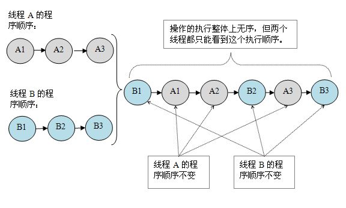

[](https://www.infoq.cn/article/java-memory-model-7)
[](https://www.infoq.cn/article/java-memory-model-6)
[](https://www.infoq.cn/article/java-memory-model-5)
[](https://www.infoq.cn/article/java-memory-model-4)
[](https://www.infoq.cn/article/java-memory-model-3)
[](https://www.infoq.cn/article/java-memory-model-2)
[](https://www.infoq.cn/article/java-memory-model-1)

JMM 属于语言级的内存模型，它确保在不同的编译器和不同的处理器平台之上，通过禁止特定类型的编译器重排序和处理器重排序，为程序员提供一致的内存可见性保证
内存可见性保证:就是说JMM规范了线程之间如何进行**通信**以及如何进行**同步**

线程之间如何进行**通信**以及如何进行**同步**
- 通信
在命令式编程中，线程之间的**通信**机制有两种：**共享内存**和**消息传递**
>在**共享内存**的并发模型里，线程之间共享程序的公共状态，线程之间通过写 - 读内存中的公共状态来隐式进行通信。
>在**消息传递**的并发模型里，线程之间没有公共状态，线程之间必须通过明确的发送消息来显式进行通信。

- 同步
**同步**是指程序用于控制不同线程之间操作发生相对顺序的机制。
>在**共享内存**并发模型里，同步是显式进行的。程序员必须显式指定某个方法或某段代码需要在线程之间互斥执行。
>在**消息传递**的并发模型里，由于消息的发送必须在消息的接收之前，因此同步是隐式进行的。

**Java 的并发采用的是共享内存模型**，Java 线程之间的通信总是隐式进行，整个通信过程对程序员完全透明。如果编写多线程程序的 Java 程序员不理解隐式进行的线程之间通信的工作机制，很可能会遇到各种奇怪的内存可见性问题。


- JMM通信同步主要作用对象
在 java 中，所有实例域、静态域和数组元素存储在**堆内存**中，堆内存在线程之间共享（本文使用“共享变量”这个术语代指实例域，静态域和数组元素）。
>局部变量（Local variables），方法定义参数（java 语言规范称之为 formal method parameters）和异常处理器参数（exception handler parameters）不会在线程之间共享，它们不会有内存可见性问题，也不受内存模型的影响

- JMM决定一个线程对共享变量的写入**何时**对另一个线程可见
Java 线程之间的通信由 Java 内存模型（本文简称为 JMM）控制，JMM 决定一个线程对共享变量的写入何时对另一个线程可见
>JMM 定义了线程和主内存之间的抽象关系：线程之间的共享变量存储在主内存（main memory）中，每个线程都有一个私有的本地内存（local memory），本地内存中存储了该线程以读 / 写共享变量的副本。**本地内存是 JMM 的一个抽象概念，并不真实存在**。它涵盖了缓存，写缓冲区，寄存器以及其他的硬件和编译器优化。


从上图来看，线程 A 与线程 B 之间如要通信的话，必须要经历下面 2 个步骤：
1.首先，线程 A 把本地内存 A 中更新过的共享变量刷新到主内存中去。
2.然后，线程 B 到主内存中去读取线程 A 之前已更新过的共享变量。


如上图所示，本地内存 A 和 B 有主内存中共享变量 x 的副本。假设初始时，这三个内存中的 x 值都为 0。线程 A 在执行时，把更新后的 x 值（假设值为 1）临时存放在自己的本地内存 A 中。当线程 A 和线程 B 需要通信时，线程 A 首先会把自己本地内存中修改后的 x 值刷新到主内存中，此时主内存中的 x 值变为了 1。随后，线程 B 到主内存中去读取线程 A 更新后的 x 值，此时线程 B 的本地内存的 x 值也变为了 1。

- 指令重排
在执行程序时为了提高性能，编译器和处理器常常会对指令做重排序。重排序分三种类型：
    - 编译器优化的重排序。编译器在不改变单线程程序语义的前提下，可以重新安排语句的执行顺序。
    - 指令级并行的重排序。现代处理器采用了指令级并行技术（Instruction-Level Parallelism， ILP）来将多条指令重叠执行。如果不存在数据依赖性，处理器可以改变语句对应机器指令的执行顺序。
    - 内存系统的重排序。由于处理器使用缓存和读 / 写缓冲区，这使得加载和存储操作看上去可能是在乱序执行。

从 java 源代码到最终实际执行的指令序列，会分别经历下面三种重排序：

上述的 1 属于编译器重排序，2 和 3 属于处理器重排序,这些重排序都可能会导致多线程程序出现内存可见性问题
>对于编译器，JMM 的编译器重排序规则会禁止特定类型的编译器重排序（不是所有的编译器重排序都要禁止）。
>对于处理器重排序，JMM 的处理器重排序规则会要求 java 编译器在生成指令序列时，插入特定类型的内存屏障（memory barriers，intel 称之为 memory fence）指令，通过内存屏障指令来禁止特定类型的处理器重排序（不是所有的处理器重排序都要禁止）。

- 处理器重排序与内存屏障指令
现代的处理器使用写缓冲区来临时保存向内存写入的数据。写缓冲区可以保证指令流水线持续运行，它可以避免由于处理器停顿下来等待向内存写入数据而产生的延迟。同时，通过以批处理的方式刷新写缓冲区，以及合并写缓冲区中对同一内存地址的多次写，可以减少对内存总线的占用。虽然写缓冲区有这么多好处，但每个处理器上的写缓冲区，仅仅对它所在的处理器可见。这个特性会对内存操作的执行顺序产生重要的影响：处理器对内存的读 / 写操作的执行顺序，不一定与内存实际发生的读 / 写操作顺序一致！

    - 比如 Processor A 和 Processor B 同时执行,初始状态：a = b = 0,处理器允许执行后得到结果：x = y = 0
    - Processor A : 
        - a = 1; //A1
        - x = b; //A2
    - Processor B
        - b = 2; //B1
        - y = a; //B2
    
>这里处理器 A 和处理器 B 可以同时把共享变量写入自己的写缓冲区（A1，B1），然后从内存中读取另一个共享变量（A2，B2），最后才把自己写缓存区中保存的脏数据刷新到内存中（A3，B3）。当以这种时序执行时，程序就可以得到 x = y = 0 的结果。

常见处理器允许的重排序类型的列表
Load-Load | Load-Store | Store-Store | Store-Load | 数据依赖
:--|:--|:--|:--|:--
sparc-TSO|N|N|N|Y|N
x86|N|N|N|Y|N
ia64|Y|Y|Y|Y|N
PowerPC|Y|Y|Y|Y|N
从上表我们可以看出：常见的处理器都允许 Store-Load 重排序；常见的处理器都不允许对存在数据依赖的操作做重排序。sparc-TSO 和 x86 拥有相对较强的处理器内存模型，它们仅允许对写 - 读操作做重排序(因为它们都使用了写缓冲区)


为了保证内存可见性，java 编译器在生成指令序列的适当位置会插入内存屏障指令来禁止特定类型的处理器重排序。JMM 把内存屏障指令分为下列四类
屏障类型|指令示例|说明
:--|:--|:--
LoadLoad Barriers|Load1; LoadLoad; Load2|确保 Load1 数据的装载，之前于 Load2 及所有后续装载指令的装载。
StoreStore Barriers|Store1; StoreStore; Store2|确保 Store1 数据对其他处理器可见（刷新到内存），之前于 Store2 及所有后续存储指令的存储。
LoadStore Barriers|Load1; LoadStore; Store2|确保 Load1 数据装载，之前于 Store2 及所有后续的存储指令刷新到内存。
StoreLoad Barriers|Store1; StoreLoad; Load2|确保 Store1 数据对其他处理器变得可见（指刷新到内存），之前于 Load2 及所有后续装载指令的装载。StoreLoad Barriers 会使该屏障之前的所有内存访问指令（存储和装载指令）完成之后，才执行该屏障之后的内存访问指令。

StoreLoad Barriers 是一个“全能型”的屏障，它同时具有其他三个屏障的效果。现代的多处理器大都支持该屏障（其他类型的屏障不一定被所有处理器支持）。执行该屏障开销会很昂贵，因为当前处理器通常要把写缓冲区中的数据全部刷新到内存中（buffer fully flush）。


**happens-before**
从 JDK5 开始，java 使用新的 JSR -133 内存模型（本文除非特别说明，针对的都是 JSR- 133 内存模型）。JSR-133 提出了 happens-before 的概念，通过这个概念来阐述操作之间的内存可见性。如果一个操作执行的结果需要对另一个操作可见，那么这两个操作之间必须存在 happens-before 关系。这里提到的两个操作**既可以是在一个线程之内，也可以是在不同线程之间**。 与程序员密切相关的 happens-before 规则如下：
- 程序顺序规则：一个线程中的每个操作，happens- before 于该线程中的任意后续操作。
- 监视器锁规则：对一个监视器锁的解锁，happens- before 于随后对这个监视器锁的加锁。
- volatile 变量规则：对一个 volatile 域的写，happens- before 于任意后续对这个 volatile 域的读。
- 传递性：如果 A happens- before B，且 B happens- before C，那么 A happens- before C。

>注意，两个操作之间具有 happens-before 关系，并不意味着前一个操作必须要在后一个操作之前执行！happens-before 仅仅要求前一个操作（执行的结果）对后一个操作可见，且前一个操作按顺序排在第二个操作之前（the first is visible to and ordered before the second）。happens- before 的定义很微妙，如果 A happens- before B，JMM 并不要求 A 一定要在 B 之前执行。JMM 仅仅要求前一个操作（执行的结果）对后一个操作可见，且前一个操作按顺序排在第二个操作之前。这里操作 A 的执行结果不需要对操作 B 可见；而且重排序操作 A 和操作 B 后的执行结果，与操作 A 和操作 B 按 happens- before 顺序执行的结果一致。在这种情况下，JMM 会认为这种重排序并不非法（not illegal），JMM 允许这种重排序。

happens-before 与 JMM 的关系如下图所示：

如上图所示，一个 happens-before 规则通常对应于多个编译器重排序规则和处理器重排序规则。对于 java 程序员来说，happens-before 规则简单易懂，它避免程序员为了理解 JMM 提供的内存可见性保证而去学习复杂的重排序规则以及这些规则的具体实现。简单讲就是JMM告诉你如何能够保证指令A一定在指令B前执行


数据依赖性
如果两个操作访问同一个变量，且这两个操作中有一个为写操作，此时这两个操作之间就存在数据依赖性。
名称|代码示例|说明
:--|:--|:--
写后读|a = 1;b = a;|写一个变量之后，再读这个位置。
写后写|a = 1;a = 2;|写一个变量之后，再写这个变量。
读后写|a = b;b = 1;|读一个变量之后，再写这个变量。
上面三种情况，只要重排序两个操作的执行顺序，程序的执行结果将会被改变。
>前面提到过，编译器和处理器可能会对操作做重排序。编译器和处理器在重排序时，会遵守数据依赖性，编译器和处理器不会改变存在数据依赖关系的两个操作的执行顺序。
>注意，这里所说的数据依赖性仅针对单个处理器中执行的指令序列和单个线程中执行的操作，不同处理器之间和不同线程之间的数据依赖性不被编译器和处理器考虑。

as-if-serial 语义
as-if-serial 语义的意思指：不管怎么重排序（编译器和处理器为了提高并行度），（单线程）程序的执行结果不能被改变。编译器，runtime 和处理器都必须遵守 as-if-serial 语义。我理解为就是看起来像没排过序一样,系统内部自动重排,我们不必操心这个事,原因是因为系统内部遵循as-if-serial
所以,as-if-serial 语义把**单线程程序**保护了起来，遵守 as-if-serial 语义的编译器，runtime 和处理器共同为编写**单线程程序**的程序员创建了一个幻觉：单线程程序是按程序的顺序来执行的。as-if-serial 语义使**单线程程序员**无需担心重排序会干扰他们，也无需担心内存可见性问题。`但是多线程as-if-serial就无可奈何了`

在计算机中，软件技术和硬件技术有一个共同的目标：在不改变程序执行结果的前提下，**尽可能的开发并行**。编译器和处理器遵从这一目标，从 happens- before 的定义我们可以看出，JMM 同样遵从这一目标。


**数据竞争**
当程序未正确同步时，就会存在数据竞争。java 内存模型规范对数据竞争的定义如下：
- 在一个线程中写一个变量，
- 在另一个线程读同一个变量，
- 而且写和读没有通过同步来排序。

JMM 对正确同步的多线程程序的内存一致性做了如下保证：
- 如果程序是正确同步的，程序的执行将具有顺序一致性（sequentially consistent）-- 即程序的执行结果与该程序在顺序一致性内存模型中的执行结果相同（马上我们将会看到，这对于程序员来说是一个极强的保证）。这里的同步是指广义上的同步，包括对常用同步原语（lock，volatile 和 final）的正确使用。

**顺序一致性内存模型  也是一个内存模型 与JMM同级**
顺序一致性内存模型是一个被计算机科学家**理想化了的理论参考模型**，它为程序员提供了极强的内存可见性保证。顺序一致性内存模型有两大特性：
- 一个线程中的所有操作必须按照程序的顺序来执行。类似单线程
- （不管程序是否同步）所有线程都只能看到一个单一的操作执行顺序。**在顺序一致性内存模型中，每个操作都必须原子执行且立刻对所有线程可见**。
    - 顺序一致性模型下同步 
        > 
    - 顺序一致性模型下不同步
        > 
    > 未同步程序在顺序一致性模型中虽然整体执行顺序是无序的，但所有线程都只能看到一个一致的整体执行顺序。之所以能得到这个保证是因为顺序一致性内存模型中的每个操作必须立即对任意线程可见。假设有两个线程 A 和 B 并发执行。其中 A 线程有三个操作，它们在程序中的顺序是：A1->A2->A3。B 线程也有三个操作，它们在程序中的顺序是：B1->B2->B3,不管是否同步,A 123 的顺序 和 B 123 的顺序都是 123这个顺序,未同步时,互相之间可以穿插,但是顺序还是123
- 但是，在 JMM 中就没有这个保证。未同步程序在 JMM 中不但整体的执行顺序是无序的，而且所有线程看到的操作执行顺序也可能不一致。比如，在当前线程把写过的数据缓存在本地内存中，且还没有刷新到主内存之前，这个写操作仅对当前线程可见；从其他线程的角度来观察，会认为这个写操作根本还没有被当前线程执行。只有当前线程把本地内存中写过的数据刷新到主内存之后，这个写操作才能对其他线程可见。在这种情况下，当前线程和其它线程看到的操作执行顺序将不一致。假设有两个线程 A 和 B 并发执行。其中 A 线程有三个操作，它们在程序中的顺序是：A1->A2->A3。B 线程也有三个操作，它们在程序中的顺序是：B1->B2->B3,在JMM模型中,这里的每段代码是可以内部重排的.JMM 会在退出监视器和进入监视器这两个关键时间点做一些特别处理，使得线程在这两个时间点具有与顺序一致性模型相同的内存视图（具体细节后文会说明）。虽然线程 A 在临界区内做了重排序，但由于监视器的互斥执行的特性，这里的线程 B 根本无法“观察”到线程 A 在临界区内的重排序。这种重排序既提高了执行效率，又没有改变程序的执行结果。
    - JMM和一致性模型对比(JMM允许指令重排,提高效率,不像一致性一样太过死板)
        >  
        > 从这里我们可以看到 JMM 在具体实现上的基本方针：在不改变（正确同步的）程序执行结果的前提下，尽可能的为编译器和处理器的优化打开方便之门。


JMM 不保证未同步程序的执行结果与该程序在顺序一致性模型中的执行结果一致。**因为未同步程序在顺序一致性模型中执行时，整体上是无序的，其执行结果无法预知**。保证未同步程序在两个模型中的执行结果一致毫无意义。
和顺序一致性模型一样，未同步程序在 JMM 中的执行时，整体上也是无序的，其执行结果也无法预知
同时，未同步程序在这两个模型中的执行特性有下面几个差异：
- 顺序一致性模型保证单线程内的操作会按程序的顺序执行，而 JMM 不保证单线程内的操作会按程序的顺序执行（比如上面正确同步的多线程程序在临界区内的重排序）。这一点前面已经讲过了，这里就不再赘述。
- 顺序一致性模型保证所有线程只能看到一致的操作执行顺序，而 JMM 不保证所有线程能看到一致的操作执行顺序。这一点前面也已经讲过，这里就不再赘述。
- JMM 不保证对 64 位的 long 型和 double 型变量的读 / 写操作具有原子性，而顺序一致性模型保证对所有的内存读 / 写操作都具有原子性。
第 3 个差异与处理器总线的工作机制密切相关。在计算机中，数据通过总线在处理器和内存之间传递。每次处理器和内存之间的数据传递都是通过一系列步骤来完成的，这一系列步骤称之为总线事务（bus transaction）。总线事务包括读事务（read transaction）和写事务（write transaction）。读事务从内存传送数据到处理器，写事务从处理器传送数据到内存，每个事务会读 / 写内存中一个或多个物理上连续的字。这里的关键是，总线会同步试图并发使用总线的事务。在一个处理器执行总线事务期间，总线会禁止其它所有的处理器和 I/O 设备执行内存的读 / 写

> 如上图所示，假设处理器 A，B 和 C 同时向总线发起总线事务，这时总线仲裁（bus arbitration）会对竞争作出裁决，这里我们假设总线在仲裁后判定处理器 A 在竞争中获胜（总线仲裁会确保所有处理器都能公平的访问内存）。此时处理器 A 继续它的总线事务，而其它两个处理器则要等待处理器 A 的总线事务完成后才能开始再次执行内存访问。假设在处理器 A 执行总线事务期间（不管这个总线事务是读事务还是写事务），处理器 D 向总线发起了总线事务，此时处理器 D 的这个请求会被总线禁止。总线的这些工作机制可以把所有处理器对内存的访问以串行化的方式来执行；在任意时间点，最多只能有一个处理器能访问内存。这个特性确保了单个总线事务之中的内存读 / 写操作具有原子性。


当我们声明共享变量为 volatile 后，对这个变量的读 / 写将会很特别。理解 volatile 特性的一个好方法是：把对 volatile 变量的单个读 / 写，看成是使用同一个监视器锁对这些单个读 / 写操作做了同步,比如代码1等价于代码2
- 代码1
```java
class VolatileFeaturesExample {
    volatile long vl = 0L;  // 使用 volatile 声明 64 位的 long 型变量 

    public void set(long l) {
        vl = l;   // 单个 volatile 变量的写 
    }

    public void getAndIncrement () {
        vl++;    // 复合（多个）volatile 变量的读 / 写 
    }


    public long get() {
        return vl;   // 单个 volatile 变量的读 
    }
}
```

- 代码2
```java
class VolatileFeaturesExample {
    long vl = 0L;               // 64 位的 long 型普通变量 

    public synchronized void set(long l) {     // 对单个的普通 变量的写用同一个监视器同步 
        vl = l;
    }

    public void getAndIncrement () { // 普通方法调用 
        long temp = get();           // 调用已同步的读方法 
        temp += 1L;                  // 普通写操作 
        set(temp);                   // 调用已同步的写方法 
    }
    public synchronized long get() { 
    // 对单个的普通变量的读用同一个监视器同步 
        return vl;
    }
}
```

简而言之，volatile 变量自身具有下列特性：
- 可见性。对一个 volatile 变量的读，总是能看到（任意线程）对这个 volatile 变量最后的写入。
- 原子性：对任意单个 volatile 变量的读 / 写具有原子性，但类似于 volatile++ 这种复合操作不具有原子性。


**volatile 写 - 读建立的 happens before 关系**
从 JSR-133 开始，volatile 变量的写 - 读可以实现线程之间的通信。
从内存语义的角度来说，volatile 与监视器锁有相同的效果：volatile 写和监视器的释放有相同的内存语义；volatile 读与监视器的获取有相同的内存语义。
volatile 写的内存语义如下：
- 当写一个 volatile 变量时，JMM 会把该线程对应的本地内存中的共享变量刷新到主内存。
volatile 读的内存语义如下：
- 当读一个 volatile 变量时，JMM 会把该线程对应的本地内存置为无效。线程接下来将从主内存中读取共享变量。
下面对 volatile 写和 volatile 读的内存语义做个总结：
- 线程 A 写一个 volatile 变量，实质上是线程 A 向接下来将要读这个 volatile 变量的某个线程发出了（其对共享变量所在修改的）消息。
- 线程 B 读一个 volatile 变量，实质上是线程 B 接收了之前某个线程发出的（在写这个 volatile 变量之前对共享变量所做修改的）消息。
- 线程 A 写一个 volatile 变量，随后线程 B 读这个 volatile 变量，这个过程实质上是线程 A 通过主内存向线程 B 发送消息。


**JMM 如何实现 volatile 写 / 读的内存语义**

从上表我们可以看出：
- 当第二个操作是 volatile 写时，不管第一个操作是什么，都不能重排序。这个规则确保 volatile 写之前的操作不会被编译器重排序到 volatile 写之后。
- 当第一个操作是 volatile 读时，不管第二个操作是什么，都不能重排序。这个规则确保 volatile 读之后的操作不会被编译器重排序到 volatile 读之前。
- 当第一个操作是 volatile 写，第二个操作是 volatile 读时，不能重排序。
为了实现 volatile 的内存语义，编译器在生成字节码时，会在指令序列中插入内存屏障来禁止特定类型的处理器重排序。对于编译器来说，发现一个最优布置来最小化插入屏障的总数几乎不可能，为此，JMM 采取保守策略。下面是基于保守策略的 JMM 内存屏障插入策略：
- 在每个 volatile 写操作的前面插入一个 StoreStore 屏障。
- 在每个 volatile 写操作的后面插入一个 StoreLoad 屏障。
- 在每个 volatile 读操作的后面插入一个 LoadLoad 屏障。
- 在每个 volatile 读操作的后面插入一个 LoadStore 屏障。
下面是保守策略下，volatile 写插入内存屏障后生成的指令序列示意图：

> 上图中的 StoreStore 屏障可以保证在 volatile 写之前，其前面的所有普通写操作已经对任意处理器可见了。这是因为 StoreStore 屏障将保障上面所有的普通写在 volatile 写之前刷新到主内存
下面是在保守策略下，volatile 读插入内存屏障后生成的指令序列示意图：

> 上图中的 LoadLoad 屏障用来禁止处理器把上面的 volatile 读与下面的普通读重排序。LoadStore 屏障用来禁止处理器把上面的 volatile 读与下面的普通写重排序。


示例代码
```java
class VolatileBarrierExample {
    int a;
    volatile int v1 = 1;
    volatile int v2 = 2;

    void readAndWrite() {
        int i = v1;           // 第一个 volatile 读 
        int j = v2;           // 第二个 volatile 读 
        a = i + j;            // 普通写 
        v1 = i + 1;          // 第一个 volatile 写 
        v2 = j * 2;          // 第二个 volatile 写 
    }

    …                    // 其他方法 
}
```

> 注意，最后的 StoreLoad 屏障不能省略。因为第二个 volatile 写之后，方法立即 return。此时编译器可能无法准确断定后面是否会有 volatile 读或写，为了安全起见，编译器常常会在这里插入一个 StoreLoad 屏障。

上面的优化是针对任意处理器平台，由于不同的处理器有不同“松紧度”的处理器内存模型，内存屏障的插入还可以根据具体的处理器内存模型继续优化。以 x86 处理器为例，上图中除最后的 StoreLoad 屏障外，其它的屏障都会被省略。
前面保守策略下的 volatile 读和写，在 x86 处理器平台可以优化成：

> 前文提到过，x86 处理器仅会对写 - 读操作做重排序。X86 不会对读 - 读，读 - 写和写 - 写操作做重排序，因此在 x86 处理器中会省略掉这三种操作类型对应的内存屏障。在 x86 中，JMM 仅需在 volatile 写后面插入一个 StoreLoad 屏障即可正确实现 volatile 写 - 读的内存语义。这意味着在 x86 处理器中，volatile 写的开销比 volatile 读的开销会大很多（因为执行 StoreLoad 屏障开销会比较大）

因此在旧的内存模型中 ，volatile 的写 - 读没有监视器的释放 - 获所具有的内存语义。**为了提供一种比监视器锁更轻量级的线程之间通信的机制，JSR-133 专家组决定增强 volatile 的内存语义：严格限制编译器和处理器对 volatile 变量与普通变量的重排序，确保 volatile 的写 - 读和监视器的释放 - 获取一样，具有相同的内存语义。从编译器重排序规则和处理器内存屏障插入策略来看，只要 volatile 变量与普通变量之间的重排序可能会破坏 volatile 的内存语意，这种重排序就会被编译器重排序规则和处理器内存屏障插入策略禁止。**

由于 volatile **仅仅保证对单个 volatile 变量的读 / 写具有原子性**，`而监视器锁的互斥执行的特性可以确保对整个临界区代码的执行具有原子性`。在功能上，监视器锁比 volatile 更强大；在可伸缩性和执行性能上，volatile 更有优势。如果读者想在程序中用 volatile 代替监视器锁，请一定谨慎。

**锁**
CAS 如何同时具有 volatile 读和 volatile 写的内存语义
> 编译器不会对 volatile 读与 volatile 读后面的任意内存操作重排序；编译器不会对 volatile 写与 volatile 写前面的任意内存操作重排序。组合这两个条件，意味着为了同时实现 volatile 读和 volatile 写的内存语义，编译器不能对 CAS 与 CAS 前面和后面的任意内存操作重排序
intel x86 处理器的源代码的中有一句LOCK_IF_MP(mp),表示程序会根据当前处理器的类型来决定是否为 cmpxchg 指令添加 lock 前缀。如果程序是在多处理器上运行，就为 cmpxchg 指令加上 lock 前缀（lock cmpxchg）。反之，如果程序是在单处理器上运行，就省略 lock 前缀（单处理器自身会维护单处理器内的顺序一致性，不需要 lock 前缀提供的内存屏障效果）。
intel 的手册对 lock 前缀的说明如下：
- 确保对内存的读 - 改 - 写操作原子执行。在 Pentium 及 Pentium 之前的处理器中，带有 lock 前缀的指令在执行期间会锁住总线，使得其他处理器暂时无法通过总线访问内存。很显然，这会带来昂贵的开销。从 Pentium 4，Intel Xeon 及 P6 处理器开始，intel 在原有总线锁的基础上做了一个很有意义的优化：如果要访问的内存区域（area of memory）在 lock 前缀指令执行期间已经在处理器内部的缓存中被锁定（即包含该内存区域的缓存行当前处于独占或以修改状态），并且该内存区域被完全包含在单个缓存行（cache line）中，那么处理器将直接执行该指令。由于在指令执行期间该缓存行会一直被锁定，其它处理器无法读 / 写该指令要访问的内存区域，因此能保证指令执行的原子性。这个操作过程叫做缓存锁定（cache locking），缓存锁定将大大降低 lock 前缀指令的执行开销，但是当多处理器之间的竞争程度很高或者指令访问的内存地址未对齐时，仍然会锁住总线。
- 禁止该指令与之前和之后的读和写指令重排序。
- 把写缓冲区中的所有数据刷新到内存中。
上面的第 2 点和第 3 点所具有的内存屏障效果，足以同时实现 volatile 读和 volatile 写的内存语义

如果我们仔细分析 concurrent 包的源代码实现，会发现一个通用化的实现模式：
- 首先，声明共享变量为 volatile；
- 然后，使用 CAS 的原子条件更新来实现线程之间的同步；
- 同时，配合以 volatile 的读 / 写和 CAS 所具有的 volatile 读和写的内存语义来实现线程之间的通信。


**final**
对 final 域的读和写更像是普通的变量访问。对于 final 域，编译器和处理器要遵守两个重排序规则：
- 在构造函数内对一个 final 域的写入，与随后把这个被构造对象的引用赋值给一个引用变量，这两个操作之间不能重排序。
    - JMM 禁止编译器把 final 域的写重排序到构造函数之外。
    - 编译器会在 final 域的写之后，构造函数 return 之前，插入一个 StoreStore 屏障。这个屏障禁止处理器把 final 域的写重排序到构造函数之外。
- 初次读一个包含 final 域的对象的引用，与随后初次读这个 final 域，这两个操作之间不能重排序。
    - 在一个线程中，初次读对象引用与初次读该对象包含的 final 域，JMM 禁止处理器重排序这两个操作（注意，这个规则仅仅针对处理器）。编译器会在读 final 域操作的前面插入一个 LoadLoad 屏障。
**JSR-133 为什么要增强 final 的语义**
- 在旧的 Java 内存模型中 ，最严重的一个缺陷就是线程可能看到 final 域的值会改变。比如，一个线程当前看到一个整形 final 域的值为 0（还未初始化之前的默认值），过一段时间之后这个线程再去读这个 final 域的值时，却发现值变为了 1（被某个线程初始化之后的值）。最常见的例子就是在旧的 Java 内存模型中，String 的值可能会改变（参考文献 2 中有一个具体的例子，感兴趣的读者可以自行参考，这里就不赘述了）。
- 为了修补这个漏洞，JSR-133 专家组增强了 final 的语义。通过为 final 域增加写和读重排序规则，可以为 java 程序员提供初始化安全保证：只要对象是正确构造的（被构造对象的引用在构造函数中没有“逸出”），那么不需要使用同步（指 lock 和 volatile 的使用），就可以保证任意线程都能看到这个 final 域在构造函数中被初始化之后的值


由于各种处理器内存模型的强弱并不相同，为了在不同的处理器平台向程序员展示一个一致的内存模型，JMM 在不同的处理器中需要插入的内存屏障的数量和种类也不相同。下图展示了 JMM 在不同处理器内存模型中需要插入的内存屏障的示意图

JMM 屏蔽了不同处理器内存模型的差异，它在不同的处理器平台之上为 java 程序员呈现了一个一致的内存模型。所以程序员就不用关系平台因素了


JMM 的设计示意图


**JMM 的内存可见性保证**
Java 程序的内存可见性保证按程序类型可以分为下列三类：
单线程程序。单线程程序不会出现内存可见性问题。编译器，runtime 和处理器会共同确保单线程程序的执行结果与该程序在顺序一致性模型中的执行结果相同。
正确同步的多线程程序。正确同步的多线程程序的执行将具有顺序一致性（程序的执行结果与该程序在顺序一致性内存模型中的执行结果相同）。这是 JMM 关注的重点，JMM 通过限制编译器和处理器的重排序来为程序员提供内存可见性保证。
未同步 / 未正确同步的多线程程序。JMM 为它们提供了最小安全性保障：线程执行时读取到的值，要么是之前某个线程写入的值，要么是默认值（0，null，false）。

只要多线程程序是正确同步的，JMM 保证该程序在任意的处理器平台上的执行结果，与该程序在顺序一致性内存模型中的执行结果一致。
**JSR-133 对旧内存模型的修补**
JSR-133 对 JDK5 之前的旧内存模型的修补主要有两个：
- 增强 volatile 的内存语义。旧内存模型允许 volatile 变量与普通变量重排序。JSR-133 严格限制 volatile 变量与普通变量的重排序，使 volatile 的写 - 读和锁的释放 - 获取具有相同的内存语义。
- 增强 final 的内存语义。在旧内存模型中，多次读取同一个 final 变量的值可能会不相同。为此，JSR-133 为 final 增加了两个重排序规则。现在，final 具有了初始化安全性。