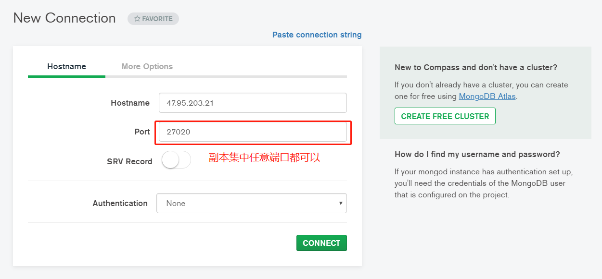
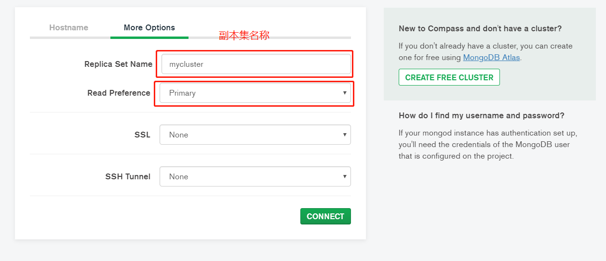

# mongdb

## 特点

- 高效存储和访问
- 数据模型灵活(无需使用二维表结构关系)
- 存储体量大 TB PB 级别
- 高性能,高可用,高扩展

## 应用场景

- 价值较低,对事物依赖性不强
- 不涉及少涉及join查询
- 访问量频繁

## 与mysql对应关系

- 数据库 - 数据库
- 表 - collection
- 行 - document

## 安装与启动

### 下载

- <https://www.mongodb.com/download-center/community>
  - 下载zip包,自己解压到磁盘

### 服务启动1

- 在bin目录同级新建 data/db/ 两个文件夹,用来存放数据

- 在bin目录下,打开powershell/cmd,执行以下命令

```shell
   ./mongod --dbpath=../data/db
```

### 服务启动2

- 在bin目录同级新建 conf/mongod.conf 文件,内容如下
  
  ```shell
    storage:
      # 注意:后要有空格
      dbPath: E:\mongodb4.2.3\data\db
  ```

- 使用一下命令启动
  
  ```shell
    mongod -f ../conf/mongod.conf
    mongod --config ../conf/mongod.conf
  ```

### 客户端连接

```shell
  # 连接本地 可以省略 -host=localhost -port=27017
  mongo.exe -host=localhost -port=27017
```

## 认识数据库

- 使用 `show dbs` 可以查看当前存在的库
  - admin : 这个是root数据库,要是将一个用户添加到这个数据库,这个用户自动继承所有数据库的权限,一些特定的服务器端命令也只能是从这个数据库中运行,比如列出所有的数据库或者关闭服务器
  - local : 这个数据库中数据永远不会被复制,可以用来存储限于本地的任意集合
  - config : 当数据库用于分片设置时,config数据库在内部使用,用于保存分片的相关信息
  
> admin   0.000GB
> config  0.000GB
> local   0.000GB

- 使用 `use dbName` 可以切换库,如果库不存在则会创建
  - 创建出来的库使用 `show dbs` 看不到,因为空库其实在内存中,还未写入磁盘,等到有数据才会写入磁盘

- 使用 `db` 可以查看当前所在的库

- 使用 `db.dropDatabase()` 删除当前所在数据库

## collection CRUD

- 使用 `db.createCollection("collectionName")` 来创建表

- 使用 `show collections` 查看当前库所有表

- 使用 `db.collectionName.drop()` 删除指定表 collectionName

- 还有一种类型的collection 是 capped collections,是固定大小的collection,如果插入的数据超过总大小,就会删除最早的一部分数据来腾出空间存新的数据

  - db.createCollection("mycoll", {capped:true, size:100000})  必须在创建时指定总大小,单位为byte
  - 在 capped collection 中，你能添加新的对象。
  - 能进行更新，然而，对象不会增加存储空间。比如你原来{name:"66"},value是2个字节,那么修改不能改成{name:"666"},超过2个字节,如果增加，更新就会失败,新值空间必须===旧值空间
  - 使用 Capped Collection 不能删除一个文档，可以使用 drop() 方法删除 collection 所有的行。
  - 删除之后，你必须显式的重新创建这个 collection。
  - 在32bit机器中，capped collection 最大存储为 1e9( 1X109)个字节。

## 数据的CRUD

- 使用 `db.collectionName.insert()` 插入一条数据,如果collectionName不存在,会隐式帮你创建这个表
  
  ```shell
    db.mycollection.insert({name:"aaa",age:14,date:2020-1-17})
  ```

- 使用 `db.collectionName.insertMany()` 插入多条数据

  ```shell
    db.mycollection.insertMany([
      {name:"aaa",age:14,date:2020-1-17},
      {name:"aaa",age:15,date:2020-1-17},
      {name:"aaa",age:16,date:2020-1-17}
    ])
  ```

- 使用 `db.collectionName.find()` 查询全部数据

- 带条件查询

  ```shell
    # 查询 age = 14 的所有数据
    db.mycollection.find({age:14})
    # 查询 age = 14 的第一条数据 类似 limit 1
    db.mycollection.findOne({age:14})
    # 查询部分列(投影查询) , 第二个bson参数就是部分列的列名,1显示,0隐藏
    db.mycollection.find({},{age:1,_id:0}) # 全查,只显示age
    db.mycollection.findOne({age:14},{age:1,_id:0}) # 查一条,条件为 age = 14 ,只显示age
  ```

- 使用 try catch 捕获并处理异常
  - 由于批量操作时mongo并不会因为某条数据失败而回滚数据,我们可以使用try catch处理它

  ```shell
    try{
      db.mycollection.insertMany([
        {_id:1,name:"这条成功1",age:14,date:new Date("2020-1-17")},
        {_id:1,name:"这条要出错,主键重复",age:15,date:new Date("2020-1-17")},
        {_id:2,name:"这条也插不进去",age:16,date:new Date("2020-1-17")}
      ])
    }catch(e){
      print(e);
    }
    ## 增加 {  ordered ： false  } ,就能让数据乱序插入,1 3都能成功,2失败
    try{
      db.mycollection.insertMany([
        {_id:1,name:"这条成功1",age:14,date:new Date("2020-1-17")},
        {_id:1,name:"这条要出错,主键重复",age:15,date:new Date("2020-1-17")},
        {_id:2,name:"这条能插入了",age:16,date:new Date("2020-1-17")}
      ],{ordered:false})
    }catch(e){
      print(e);
    }
  ```

- 修改数据

  ```shell
    # 全量覆盖 : 使用name=张三,把_id = ObjectId("5e6f72e29087af621cb1254a") 这条数据覆盖条,比如原来有5列,修改完就剩一列了
    db.mycollection.update({_id: ObjectId("5e6f72e29087af621cb1254a")},{name:"张三"})
    # 局部修改 : 修改_id: ObjectId("5e6f73589087af621cb1254b")这条数据中name为张三,其他数据不动
    db.mycollection.update({_id: ObjectId("5e6f73589087af621cb1254b")},{$set:{name:"张三"}})
    # mongo中默认数字是double类型,加上NumberInt强转为int
    db.mycollection.update({_id: ObjectId("5e6f73589087af621cb1254b")},{$set:{age:NumberInt(19)}})
    # 上面的update只修改符合条件的第一条数据
    # 比如想要修改符合 name = a 条件的数据,将 age 修改为 10 ,就只会修改符合条件的第一条数据
    # 如果想要修改全部符合条件的数据,则需要再增加第三个bson参数 {multi:true}
    db.mycollection.update({name:"张三"},{$set:{age:NumberInt(19)}},{multi:true})
  ```

- 列值增长

  ```shell
    # $inc 有 $set 的功能
    # 列值增长19
    db.mycollection.update({name:"张三"},{$inc:{age:NumberInt(19)}},{multi:true})
    # -1 表示自减
    db.mycollection.update({name:"张三"},{$inc:{age:NumberInt(-1)}},{multi:true})
  ```

- 数据删除

  ```shell
    # 删除name=张三的全部数据
    db.mycollection.remove({name:"张三"})
    # 清空表
    db.mycollection.remove({})
  ```

- 计数查询

  ```shell
    # 统计表中全部数据条数
    db.mycollection.count()
    # 统计表中符合条件的数据条数
    db.mycollection.count({name:"张三"})
  ```

- 分页查询

  ```java
    # skip 和 limit 配合使用 达到 limit 0,2, limit 2,2, limit 4,2 的效果
    db.mycollection.find().skip(0).limit(2)
    db.mycollection.find().skip(2).limit(2)
    db.mycollection.find().skip(4).limit(2)
  ```

- 排序
  
  ```shell
    # 1 表示升序,-1表示降序
    # 按照name升序,name相同时,按照age降序
    db.mycollection.find().sort({name:1,age:-1})
  ```

- 正则查询

  ```shell
    # 查询时可以写正则
    # 这个表示name中带a的
    db.mycollection.find({name:/a/})
  ```

- 比较查询

  ```shell
    # $gt $lt $gte $lte $ne
    db.mycollection.find({name:{$gt:"a"}})
  ```

- 包含查询 in

  ```shell
    # $in $nin
    db.mycollection.find({name:{$in:["a","ac"]}})
  ```

- 多条件组合查询
  - and & or

  ```shell
    db.mycollection.find({$and:[{name:"a"},{age:{$gt:10}}]})
    # and 可以不写默认and,多个条件,隔开
    db.mycollection.find( { "content" : { "$regex" : "111", "$options" : "" }, "nickName" : "2",articleId:"111" } )

    db.mycollection.find({$or:[{name:"a"},{age:{$gt:10}}]})
    db.mycollection.find({$and:[{$or:[{name:"a"},{name:"b"}]},{age:{$gt:10}}]})

    db.mycollection.find({"likes": {$gt:50}, $or: [{"by": "菜鸟教程"},{"title": "MongoDB 教程"}]})
  ```

## 索引

- 使用B-Tree

- 索引查看

  ```shell
    db.mc.getIndexes()
  ```

- 索引创建

  ```shell
    # 根据age倒序索引
    db.mc.createIndex({age:-1})
    db.mc.createIndex({age:-1},{background:true})
    # 并起名字
    db.mc.createIndex({name:-1},{name:"indexName"})
    # 联合索引
    db.mc.createIndex({name:-1,age:-1},{name:"unionindex"})
  ```

- 索引删除

  ```shell
    # 根据索引名删除索引
    db.mc.dropIndex("indexName")
    # 根据索引内容删除索引
    db.mc.dropIndex({name:-1,age:-1})
    # 删除全部索引 ( 不会删除_id 主键索引)
    db.mc.dropIndexes()
  ```

## 聚合 aggregate

- aggregate可以理解为有多个阶段在处理数据,第一个阶段处理完毕后处理第二个阶段,所以aggregate中接受一个json对象数组

```shell
  db.orders.aggregate([
    {
      阶段一:{}
    },
    {
      阶段二:{}
    },
    {
      阶段二:{}
    }
  ])
```

- 每个阶段管道限制为100MB的内存。如果一个节点管道超过这个极限,MongoDB将产生一个错误。为了能够在处理大型数据集,可以设置allowDiskUse为true来在聚合管道节点把数据写入临时文件。这样就可以解决100MB的内存的限制。
- db.collection.aggregate()可以作用在分片集合，但结果不能输在分片集合，MapReduce可以 作用在分片集合，结果也可以输在分片集合。就是aggregate的结果直接输出在控制台上,没有地方保存,但是MapReduce可以直接out出来一个新表,直接结果就存到数据库了
- db.collection.aggregate()方法可以返回一个指针{cursor)，数据放在内存中，直接操作。跟Mongo shell 一样指针操作
- db.collection.aggregate()输出的结果只能保存在一个文档中，BSON Document大小限制为16M。可以通过返回指针解决，版本2.6中后面：DB.collect.aggregate()方法返回一个指针，可以返回任何结果集的大小。

- 以下是常用阶段操作函数,无顺序之分
  
SQL 操作/函数  | mongodb聚合操作 | 作用
:--|:--|:--
where |\$match|用来做等值匹配,筛选
group by|\$group|用来根据某个field分组
having|\$match|用来做等值匹配,筛选
select|\$project|用来指定哪些列显示
order by|\$sort|用来根据执行field排序
limit　|\$limit|用来限制显示行数
sum()|\$sum|{\$sum:"\$Field"},指定列求和
count()|\$sum|{\$sum:1},统计行数
join| \$lookup(v3.2 新增)|用来联表

- \$group中可以使用的函数

名称 | 描述 | 类比sql
:--|:--|:--
$multiply|相乘|\$multiply:["\$aaa","\$bbb"]<br/>==><br/>select aaa*bbbb from dual;
$avg|计算均值 | avg
$first|返回每组第一个文档，如果有排序，按照排序，如果没有按照默认的存储的顺序的第一个文档|limit 0,1
$last|返回每组最后一个文档，如果有排序，按照排序，如果没有按照默认的存储的顺序的最后个文档|-
$max|根据分组，获取集合中所有文档对应值得最大值|max
$min|根据分组，获取集合中所有文档对应值得最小值|min
$push|将指定的表达式的值添加到一个数组中|-
$addToSet| 将表达式的值添加到一个集合中(无重复值，无序)|-
$sum|计算总和|sum
$stdDevPop|返回输入值的总体标准偏差(population standard deviation)|-
$stdDevSamp|返回输入值的样本标准偏差(the sample standard deviation)|-

- 示例数据

```shell
  db.orders.insert({
    cust_id:"abc123",
    ord_date:ISODate("2012-11-02T17:04:11.102Z"),
    status:'A',
    price:50,
    items: [{ sku: "xxx", qty: 25, price: 1 },
              { sku: "yyy", qty: 25, price: 1 }]
  })
```

- 分组 \$group
  
```shell
  # 根据某个列分组,用_id指定,固定语法,total是自己起的名,随便起,相当于后面计算出来的数据的别名
  # group中除了_id是固定语法,其他每增加一个参数,相当于增加一列信息
  db.orders.aggregate([
    {
      $group:{
        _id:"$cust_id",
        total:{$sum:"$price"},
        c:{$sum:1},
        avg:{$avg:"$price"}
      }
    }
  ])
  # 根据多个列分组,用_id指定
  db.orders.aggregate([
    {
      $group:{
        _id:{
          myid:"$cust_id",
          ord_date:"$ord_date"
        },
        total:{$sum:"$price"}
      }
    }
  ])
  # 时间字段,可以只按照年月分组,忽略日时分秒
  db.orders.aggregate([  
    {
      $group:{
        _id:{
          myid:"$cust_id",
          ord_date:{
            myyear:{$year:"$ord_date"},
            mymonth:{$month:"$ord_date"}
          }
        },
        totalxxx:{$sum:"$price"}
      }
    }
  ])
  # _id:null表示全查
  db.orders.aggregate([
    {
      $group:{
        _id:"$cust_id"
      }
    },
    {
      $group:{
        _id:null,
        count:{
          $sum:1
        }
      }
    }
  ])
```

- 匹配 \$match
  
```shell
  # 先分组后筛选(2个阶段)
  # $match 中的totalxxx必须使用上面查出来的数据表的列名(别名)
  db.orders.aggregate([  
    {
      $group:{
        _id:{
          myid:"$cust_id",
          ord_date:{
            myyear:{$year:"$ord_date"},
            mymonth:{$month:"$ord_date"}
          }
        },
        totalxxx:{$sum:"$price"}
      }
    },
    {
      $match:{
        totalxxx:{$gt:60}
      }
    }
  ])
  #先筛选,后分组,cust_id必须是orders表中的列名
  db.orders.aggregate([
      {
      $match:{
        cust_id:"abc123"
      }
    },
    {
      $group:{
        _id:{
          myid:"$cust_id",
          ord_date:{
            myyear:{$year:"$ord_date"},
            mymonth:{$month:"$ord_date"}
          }
        },
        totalxxx:{$sum:"$price"}
      }
    }
  ])
```

- \$unwind
  
  - 这个方法用来处理嵌套的json,比如一个json中某个a属性对应一个json数组,使用这个命令可以将数据变成一张json数组对应的2维表
  - 比如
  
  _id|a|b
  :--|:--|:--
  1|a|[{x:"x1",y:"y1"},{x:"x2",y:"y2"}]

  会被处理成
  _id|a|b
  :--|:--|:--|:--|:--
  1|a|{x:"x1",y:"y1"}
  1|a|{x:"x2",y:"y2"}

```shell
db.orders.aggregate([
  {$unwind:"$items"},
  {
    $group:{
      _id:"$cust_id",
      count:{$sum:1}
    }
  }
])
```

- \$count

```shell
# $count与$sum区分开,$count是个stage
# 用来统计数量,xxxx是别名,功能类似db.col.count(),但是比db.col.count()灵活,可以随时计数
db.orders.aggregate([
  {
    $match:{
      price:{$gt:40}
    }
  },
  {
    $count:"xxxx"  
  }
])
```

- \$push

```shell
# 增加的iii列中的数据是orders表的items列
db.orders.aggregate([
  {
    $group:{
      _id:"$price",
      iii:{
        $push:"$items"
      }
    }
  }
])
# 可以使用 . 运算符
db.orders.aggregate([
  {
    $group:{
      _id:"$price",
      iii:{
        $push:"$items.sku"
      }
    }
  }
])
# 可以使用$$ROOT 代表当前整个数据
db.orders.aggregate([
  {
    $group:{
      _id:"$price",
      iii:{
        $push:"$$ROOT"
      }
    }
  }
])
```

- 联表 \$lookup

```shell
  # 在 comment 表查询结果中增加一列 hahaha ,内容使用counters表中的_id = comment表中的content 的整行数据填充
  # from 连接哪张表
  # localField 当前表的关联列列名
  # foreignField from表的关联列列名
  # as 别名
  db.comment.aggregate({
    $lookup:{
      from: "counters",
      localField: "content",
      foreignField: "_id",
      as: "hahaha"
    }
  })
```

### mapReduce

- 作用与上面类似,更加灵活,直接会将结果输出到一张表

- 语法
  - db.col.mapReduce(function,function,json)

```shell
  db.comment.mapReduce(
    #map state 将query出来的数据每条跑一下这个方法,经过map操作后，相同键的文档的值被放到一起组成一个数组。
    function(){
      emit(k,v); # 必须使用emit方法
    },
    # reduce state 再将每个map的结果到这个方法里合并一下,如果一个键有多个值的话，进行reduce的操作，在进行reduce 操作的时候将所有的值进行累加
    # 如果一个健只有一个值的话就直接输出到结果集合,不执行reduce操作
    function(k,values){ //再将每个map的结果到这个方法里合并一下,如果一个键有多个值的话，进行reduce的操作，在进行reduce 操作的时候将所有的值进行累加,如果一个健只有一个值的话就直接输出到结果集合
      return "";
    },
    # query state
    {
      query:{}, // 这步是最先执行,{}表示全查
      out:"newcoll"  // Reduce完后将结果输出到预先定义好的结果集合中，即newcoll集合。真的会在当前库生成一张表,如果表存在则默认会覆盖之前数据
    }
  )
```

- 执行顺序
  - 会先执行第三个json参数中的query,先将数据过滤一遍
  - 再执行map阶段
  - 如果数据有需要再执行reduce阶段,所以reduce中接受的value不是单数,而是一个数组values
  - 最后将执行结果输出到第三个json参数中的out指定的位置

```shell
db.comment.mapReduce(
  function(){
    if(this.name != null){
      emit(this.name,this);
    }
  },
  function(k,values){
    print(k);
    var str = "";
    for(var i = 0 ;i<values.length;i++){
      str+=values[i];
    }
    return str;
  },
  {
    query:{},
    out:"newcoll"  
  }
)
# out中可以设置新数据是替换之前数据(默认replace,就是删了之前数据,重新插入)
# 还是有同名键再覆盖之前数据(merge)
# 还是整合新旧数据(reduce,按照当前传入的reduce逻辑,将旧值和新值整合成一个值)
db.comment.mapReduce(
  function(){
    if(!isNaN(this.likenum)){
      emit(this.name,this.likenum);
    }
  },
  function(k,values){
    print(k);
    var sum = 0;
    for(var i = 0 ;i<values.length;i++){
      sum+=values[i];
    }
    return sum;
  },
  {
    query:{},
    out:{
      reduce:"newcoll"
    }
  }
)
```

## Explain

- 使用
  
  ```shell
    db.mc.find({name:"a"}).explain()
    {
      "queryPlanner" : {
              "plannerVersion" : 1,
              "namespace" : "test.mc",
              "indexFilterSet" : false,
              "parsedQuery" : {
                      "name" : {
                              "$eq" : "a"
                      }
              },
              "queryHash" : "01AEE5EC",
              "planCacheKey" : "01AEE5EC",
              "winningPlan" : {
                      "stage" : "COLLSCAN",  # 全局扫描   FETCH 索引
                      "filter" : {
                              "name" : {
                                      "$eq" : "a"
                              }
                      },
                      "direction" : "forward"
              },
              "rejectedPlans" : [ ]
      },
      "serverInfo" : {
              "host" : "iZ2zeagh7rzyruvtwvfrl6Z",
              "port" : 27017,
              "version" : "4.2.3",
              "gitVersion" : "6874650b362138df74be53d366bbefc321ea32d4"
      },
      "ok" : 1
    }
  ```

## 副本集搭建

- 副本集作用
  - 复制提供了冗余并增加了数据可用性。在不同的数据库服务器上有多个数据副本，复制提供了对单个数据库服务器丢失的容错能力。
  - 副本集可以支持客户端读取，增加了mongo的读能力，且可以为灾难恢复和报告等提供特殊的副本。

- 副本集角色
  - Primary(主节点): 副本集的主节点，可读写，唯一可以进行写操作的节点，由集群自行选举出来。
  - Secondary(从节点)： 正常情况下，Seconary会参与Primary选举{自身也可能会被选为Primary)，并从Primary同步最新写入的数据，以保证与Primary存储相同的数据。Secondary可以提供读服务，增加Secondary节点可以提供副本集的读服务能力，提升副本集的可用性。
  - Arbiter(仲裁者)： Arbiter节点只参与投票，不能被选为Primary，并且不从Primary同步数据。非常轻量级的服务，当复制集成员为偶数时，最好加入一个Arbiter节点，以提升复制集可用性。

- 副本集仅有一个主节点，其它均为次节点,次节点可为多个，主节点可写可读，次节点仅可读，次节点会根据oplog同步主的数据

### 创建主节点

- 单机 : 写多份不同的配置文件,然后使用mongo分别启动他们
- 多机 : 每台机器分别安装mongo服务,编写自己的配置文件

- 创建三个文件夹,分别以副本名称_端口号命名
- 分别创建对应的conf配置文件
- 主要是每个节点必须添加如下配置
  
  ```shell
    replication:
      replSetName: XXX # 同一个集群,名称相同
  ```

- 脚本如下
  
  ```shell
    #!/bin/bash
    # 副本集配置根目录
    dest=$1
    clusterName=$2
    # 副本集开始端口
    beginPort=$3
    # 副本集个数
    clusNum=$4
    for ((i=$beginPort; i<($beginPort+$clusNum); i++))
    do  

        dir="${dest}/${clusterName}_${i}";
        echo $dir
        if [ ! -d "$dir/log" ]; then
            mkdir -p "$dir/log"
        fi
        if [ ! -d "$dir/data/db" ]; then
            mkdir -p "$dir/data/db"
        fi
        if [ ! -d "$dir/conf" ]; then
            mkdir -p "$dir/conf"
        fi

        confFile="$dir/conf/mongod.conf"
        if [ ! -f "$confFile" ]; then
            touch "$confFile"
        fi

        echo "systemLog:" >> $confFile
        echo "  destination: file" >> $confFile
        echo "  logAppend: true" >> $confFile
        echo "  path: $dir/log/mongodb.log" >> $confFile
        echo "storage:" >> $confFile
        echo "  dbPath: $dir/data/db" >> $confFile
        echo "  journal:" >> $confFile
        echo "    enabled: true" >> $confFile
        echo "processManagement:" >> $confFile
        echo "  fork: true" >> $confFile
        echo "  pidFilePath: $dir/conf/mongod.pid" >> $confFile
        echo "net:" >> $confFile
        echo "  port: $i" >> $confFile
        echo "  bindIp: 0.0.0.0" >> $confFile
        echo "replication:" >> $confFile
        echo "  replSetName: $clusterName" >> $confFile
    done
  ```

- 分别启动三个服务

  ```shell
    mongod -f /usr/local/mongo4.2/cluster/mycluster_27019/conf/mongod.conf
    mongod -f /usr/local/mongo4.2/cluster/mycluster_27020/conf/mongod.conf
    mongod -f /usr/local/mongo4.2/cluster/mycluster_27021/conf/mongod.conf
  ```

### 初始化副本集和主节点

- 三个接点启动但是之间还没有 相互联系
- 随便登陆其中一个节点

  ```shell
    mongo -port=27019
  ```

- 将其初始化

  ```shell
    > rs.initiate()
  ```

  > 这个命令得到的结果就是你的提示符变成了
  > mycluster:SECONDARY>
  > 说明你的这个服务器已经加入到mycluster这个集群中,状态是从节点,因为当前只有一个节点,所以这个节点会自动升级为主节点
  > 也就是你希望那个节点是初始主节点,就先在哪个节点上调用初始化方法
  > 只要再按下enter,就会发现这个节点以及变成主节点
  > mycluster:PRIMARY>

- 查看主节点配置

  ```shell
    mycluster:PRIMARY> rs.conf()  # 是rs.config()的别名
    mycluster:PRIMARY> rs.status()  # 是比rs.config()更详细的信息
  ```

- 通过主节点添加从节点和仲裁节点

  ```shell
    # 这里的ip如果是单机就写本机局域网ip,这样可以少开放一个端口号,多机就只能写公网ip了
    # 单机但是要是需要外界连,还是要写公网ip,否则外界连接不上,下面 compass连接副本集 里有修改主机地址的方法
    mycluster:PRIMARY> rs.add("172.17.117.250:27020") # 添加从节点
    mycluster:PRIMARY> rs.addArb("172.17.117.250:27021") # 添加仲裁节点
  ```

### 让从节点认同自己的位置

- 当前只是主节点添加了从节点,但从节点并不认可主节点
  - 从节点只能读不能写
  
  ```shell
    # 从节点无法查看数据库
    mycluster:SECONDARY> show dbs
    2020-03-18T11:43:11.863+0800 E  QUERY    [js] uncaught exception: Error: listDatabases failed:{
      "operationTime" : Timestamp(1584502990, 1),
      "ok" : 0,
      "errmsg" : "not master and slaveOk=false",   # 报错信息为当前节点并非主节点,但也不认为自己是从节点
      "code" : 13435,
      "codeName" : "NotMasterNoSlaveOk",
      "$clusterTime" : {
        "clusterTime" : Timestamp(1584502990, 1),
        "signature" : {
          "hash" : BinData(0,"AAAAAAAAAAAAAAAAAAAAAAAAAAA="),
          "keyId" : NumberLong(0)
        }
      }
    }
  ```

- 需要在从节点上调用以下命令

  ```shell
    mycluster:SECONDARY> rs.slaveOk()
    mycluster:SECONDARY> rs.slaveOk(false)  # 取消自己是从节点的位置
  ```

### 让仲裁者认同自己的位置

- 当前只是主节点添加了仲裁节点,但仲裁节点并不认可主节点
  - 仲裁节点上没有数据,只存配置信息
  
  ```shell
    # 仲裁节点无法查看数据库
    mycluster:ARBITER> show dbs
    2020-03-18T11:54:53.898+0800 E  QUERY    [js] uncaught exception: Error: listDatabases failed:{
      "ok" : 0,
      "errmsg" : "not master and slaveOk=false",
      "code" : 13435,
      "codeName" : "NotMasterNoSlaveOk"
    }
  ```

- 需要在仲裁节点上调用以下命令

  ```shell
    mycluster:ARBITER> rs.slaveOk()
    mycluster:ARBITER> rs.slaveOk(false)  # 取消自己是从节点的位置
  ```

- show dbs

  ```shell
    mycluster:ARBITER> show dbs   # 仲裁节点只能看到一个库
    local  0.000GB
  ```

## 副本集选举规则

- 选举逻辑
  - Bully算法是一种协调者{主节点)竞选算法，主要思想是集群的每个成员都可以声明它是主节点并通知其他节点。别的节点可以选择接受这个声称或是拒绝并进入主节点竞争。被其他所有节点接受的节点才能成为主节点。节点按照一些属性来判断谁应该胜出。这个属性可以是一个静态ID，也可以是更新的度量像最近一次事务ID{最新的节点会胜出)
  - 先得到每个服务器节点的最后操作时间戳。每个mongodb都有oplog机制会记录本机的操作，方便和主服务器进行对比数据是否同步还可以用于错误恢复。
  - 如果集群中大部分服务器down机了，保留活着的节点都为 secondary状态并停止，不选举了。
  - 如果集群中选举出来的主节点或者所有从节点最后一次同步时间看起来很旧了，停止选举等待人来操作。
  - 如果上面都没有问题就选择最后操作时间戳最新{保证数据是最新的)的服务器节点作为主节点。
  > 1. 最初集群有5个节点，节点5是一个公认的协调者。
  > 2. 假设节点5挂了，并且节点2和节点3同时发现了这一情况。两个节点开始竞选并发送竞选消息给ID更大的节点。
  > 3. 节点4淘汰了节点2和3，节点3淘汰了节点2。
  > 4. 这时候节点1察觉了节点5失效并向所有ID更大的节点发送了竞选信息。
  > 5. 节点2、3和4都淘汰了节点1。
  > 6. 节点4发送竞选信息给节点5。
  > 7. 节点5没有响应，所以节点4宣布自己当选并向其他节点通告了这一消息。

  ```none
    MongoDB的复制集具有自动容忍部分节点宕机的功能，在复制集出现问题时时，会触发选举相关的过程，完成主从节点自动切换。每个复制集成员都会在后台运行与复制集所有节点的心跳线程，在两种情况下会触发状态检测过程：
    复制集成员心跳检测结果发生变化，比如某个节点挂了或者新增节点；
    超过4s没有执行状态检测过程。在状态检测过程大致包含以下步骤：
    {1)检测自身是否处于选举过程，如果是，退出本次过程。
    {2)维护一个主节点的备用列表，列表中所有节点都可能被选举为主节点，每个节点都会检测自身以及全局条件是否满足：
    a. 是否看见复制集中有Majority在线。
    b. 自身priority大于0。
    c. 自身不为arbiter。
    d. 自身opTime不能落后于最新节点10s以上。
    e. 自身存储的集群程序按信息为最新。
    如果所有条件满足，则将自身添加到主节点备用列表中，否则，将自身从列表中移除。

    检测以下条件，若都满足，将主节点降为从节点{如果要降级的主节点是自身，直接调用降级方法，如果不为自身，调用replSetStepDown命令将复制集主节点降级为从节点：
        a. 集群中主节点存在。
        b. "主节点的备用列表”中存在比当前的主节点priority更高的节点。
        c. "主节点的备用列表”中priority最高的节点，其opTime要比其他所有节点最新的opTime落后10s以内。
        d. 检测自身是否为主，若为主，且自身无法看见复制集的Majority在线，将自身降级为从。
        e. 如果看不见集群中有主节点存在，检测自身是否在”主节点的备用列表”，若不在，打印log并退出此流程。
        f. 若自身在”主节点的备用列表”中，开始判断自身可否向复制集中发送选举自身为主节点的通知，判断过程包含：
            1> 自身是否可以看见复制集中的Majority在线。
            2>自身是否在”主节点的备用列表”。
    若条件满足，则设置”自身已经在选举过程中”标识位为true，并进入”选举自身为主节点”方法。
    方法中会验证自身是否满足以下条件：
    a. 此线程拿到了线程锁。
    b. 此节点没有被配置slaveDelay选项或者配置的slaveDelay为0。
    c. 此节点没有被配置为arbiter。
    若满足，则调用环境检测，若以下条件被触发，则不发送"选举我为主节点”投票：
    1> 当前时间小于steppedDown的结束冻结时间{为执行steppedDown时的时间+冻结设定时间，内部调用为60s)。
    2> 自己的opTime不是所有节点最新的。
    3> 若有节点opTime比自己新，直接退出此流程。
    如果其他最新的节点最多与自己一样新，每有一个这样的节点，随机sleep一段时间，之后继续判断。
    a. 自己上线5分钟内且复制集中不是所有节点在线。
    b. 如无其他问题，尝试获取自己进行投票时的票数，在此过程中，会判断自己在30s内是否进行过投票，如进行过，直接退出整个过程。
    经过以上种种复杂的检测，终于可以向复制集发送”选举我为主节点”的投票。
    发送之后，会接收来自所有节点的投票，若得票数小于等于一半，不将自己变为主节点，若超过一半，设置自己为主节点。
    投票结束后，设置”自身已经在选举过程中”标识位为false。
    可以看到，上面的判断逻辑有一些是重复判断，不过不影响最终结果，可能与判断逻辑较为复杂有关系，在每个决定之前都要验证所有条件是否满足，防止有条件被漏掉。
    在复制集中的节点收到其他节点发送的”选举我为主节点”投票信息时，会有以下的判断：
    a. 若自身存储的复制集配置版本过低，不投票。
    b. 若发起请求的节点存储的复制集配置版本过低，投反对票。
    c. 如果自身所在的复制集没有发起投票的节点，投反对票。
    d. 复制集中存在主节点，投反对票。
    可参与选举的节点中有priority高于请求为主的节点存在时，投反对票。
    如果所有条件通过，获取自身的投票数{同样会判断自身在30s内是否参加过投票，若参加过，不再投票)，投出票数。
    需要说一下的是，一个反对会将最终票数减10000，即在绝大多数情况下，只要有节点反对，请求的节点就不能成为主节点。
    选举过程很复杂，实际使用中总结为两点：
    一般情况下需要5s左右进行选主。
    如果新选举出的主节点立马挂掉，至少需要30s时间重新选主。
  ```

- 选举的触发条件：
  - 初始化一个副本集时
  - 副本集和主节点断开连接，可能是网络问题。
  - 主节点挂掉。
  - 人为介入,比如修改节点优先级等
  - 选举还有个前提条件，参与选举的节点数量必须大于副本集总节点数量的一半，如果已经小于一半了所有节点保持只读状态。

- 同步逻辑
  - 副本集中数据同步过程：Primary节点写入数据，Secondary通过读取Primary的oplog得到复制信息，开始复制数据并且将复制信息写入到自己的oplog。如果某个操作失败，则备份节点停止从当前数据源复制数据。如果某个备份节点由于某些原因挂掉了，当重新启动后，就会自动从自己的oplog的最后一个操作开始同步，同步完成后，将信息写入自己的oplog，由于复制操作是先复制数据，复制完成后再写入oplog，有可能相同的操作会同步两份，不过MongoDB在设计之初就考虑到这个问题，将oplog的同一个操作执行多次，与执行一次的效果是一样的

- 故障测试
  - 主节点挂掉 : 会选举出来一个从节点升级为主节点
  - 从节点挂掉 : 主节点依然运行
  - 仲裁节点和主节点挂掉 : 如果象上面3个节点的配置,就剩一个从节点了,他的票数不可能 > 3/2+1 ,所以集群只能读,不能提供写服务了
  - 仲裁节点和从节点挂掉 : 如果象上面3个节点的配置,就剩一个主节点了,他会在10s后进行服务降级,群只能读,不能提供写服务了
    - 服务降级: 在副本集的环境中，要是所有的Secondary都宕机了，只剩下Primary。最后Primary会变成Secondary，不能提供服务

## compass连接副本集

- 副本集中主节点可以单机连接,从节点和仲裁节点不能单机连接,因为从节点不能写
  
- 由于主节点初始化的时候默认用本机局域网设置ip,这样会导致外界连不上集群,所以需要修改主节点主机地址为公网ip(其他副本集节点也可以用这种方式修改ip地址)

  ```javascript
    //先使用 rs.config() 查看下哪些节点的host要修改
    //然后在使用如下代码修改,可以写js脚本,用load("绝对地址")方法在mongo客户端中执行
    var conf = rs.config();
    conf.members[0].host="47.95.203.21:27019";
    //conf.members[1].host="47.95.203.21:27020";
    //conf.members[2].host="47.95.203.21:27021";
    rs.reconfig(conf);
  ```

- 连接步骤
  
  
  点击连接即可
  > 其中Read Perfered
  > primary
  > 主节点，默认模式，读操作只在主节点，如果主节点不可用，报错或者抛出异常。
  > primaryPreferred
  > 首选主节点，大多情况下读操作在主节点，如果主节点不可用，如故障转移，读操作在从节点。
  > secondary
  > 从节点，读操作只在从节点， 如果从节点不可用，报错或者抛出异常。
  > secondaryPreferred 推荐
  > 首选从节点，大多情况下读操作在从节点，特殊情况{如单主节点架构)读操作在主节点。
  > nearest
  > 最邻近节点，读操作在最邻近的成员，可能是主节点或者从节点，关于最邻近的成员请参考

## springboot连接mongo集群

- yml
  
  ```yml
    spring:
      data:
        mongodb:
    #      database: test   集群不能用这三个属性连接了,得用uri连接
    #      host: 47.95.203.21
    #      port: 27017
          uri: mongodb://47.95.203.21:27020,47.95.203.21:27019/test?\
                slaveOk=true&replicaSet=mycluster&connect=replicaSet&readPreference=secondaryPreferred&connectTimeoutMS=300000
  ```

## 分片集群


id
进入切面