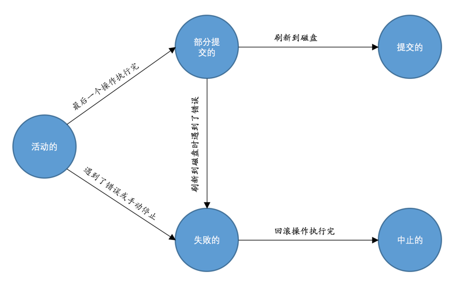

[toc]

# mysql的bin目录

- mysqld : 可执行文件,代表着MySQL服务器程序,调用此命令即可启动mysql服务端
- mysqld_safe : 脚本,间接调用mysqld,同时服务器程序的出错信息和其他诊断信息重定向到某个文件中，产生出错日志，这样可以方便我们找出发生错误的原因
- mysql.server : 脚本,间接调用mysqld_safe,这个 mysql.server 文件其实是一个链接文件，它的实际文件是 ../support-files/mysql.server
```powershell
mysql.server start
mysql.server stop
```
- mysqld_multi : 单机部署管理多台不同端口的(配置文件不同)服务端
- mysql : 可执行文件,代表MySQL客户端,调用此命令即可启动mysql服务端 
    常用参数 -h   -u   -p   -P 

# win下注册mysql服务
```powershell
"完整的可执行文件路径" --install [-manual] [服务名]
"C:\Program Files\MySQL\MySQL Server 5.7\bin\mysqld" --install MySQL
# 其中的-manual可以省略，加上它的话表示在Windows系统启动的时候不自动启动该服务，否则会自动启动
```
# centOS下注册mysql服务
```sh
#将mysql加入到可控制启动的服务的文件夹内，并命名mysql，即service可控制的服务名，至此可用service mysql start控制启动mysql
cp support-files/mysql.server /etc/init.d/mysql
#配置环境变量
echo 'export MYSQL_HOME=/usr/local/mysql' >> /etc/profile
echo 'export PATH=$PATH:$MYSQL_HOME/bin/' >> /etc/profile
#让配置文件立即生效
source /etc/profile
#开机自启动mysql服务
chkconfig --add mysql
chkconfig mysql on
#mysql服务启动与停止
systemctl [stop|start|restart] 服务名
```
# 启动mysql服务
```powershell
net start MySQL
net stop MySQL
```

# 客户端和服务器端连接方式  

```
TCP/IP : 常用
套接字文件
命名管道和共享内存
```

# 查询请求流程
## 1.客户端发出sql
## 2.连接管理 
**处理连接** :

```
每当请求进来,服务器端就会从线程池中分配一个线程来处理当前请求,线程池数量会影响服务器性能
```


## 3.解析与优化

**查询缓存** : 

```
如果两个查询请求在任何字符上的不同（例如：空格、注释、大小写），都会导致缓存不会命中。
另外，如果查询请求中包含某些系统函数、用户自定义变量和函数、一些系统表，如 mysql 、information_schema、 performance_schema 数据库中的表，那这个请求就不会被缓存
MySQL的缓存系统会监测涉及到的每张表，只要该表的结构或者数据被修改，如对该表使用了INSERT、 UPDATE、DELETE、TRUNCATE TABLE、ALTER TABLE、DROP TABLE或 DROP DATABASE语句，那使用该表的所有高速缓存查询都将变为无效并从高速缓存中删除
从MySQL 5.7.20开始，不推荐使用查询缓存，并在MySQL 8.0中删除
```
**语法解析** :
```
语法分析  
```
**查询优化** :
```
如外连接转换为内连接、表达式简化、子查询转为连接吧啦吧啦的一堆东西。
优化的结果就是生成一个执行计划，这个执行计划表明了应该使用哪些索引进行查询，表之间的连接顺序是啥样的。
我们可以使用EXPLAIN语句来查看某个语句的执行计划
```
## 4.存储引擎
```
根据不同的存储引擎与文件系统交互
为了方便管理,上面4步统称为mysql server功能,当前这步及与文件系统交互称之为存储引擎功能
```
## 5.最终数据落入文件系统


# 修改启动配置
```
1. 可以在mysqld命令启动时,在命令后加 -- 参数,比如 mysqld --verbose --help 可以查看有哪些参数可用,同理mysql --help 和 mysqld_safe --help 可以查看
2. 修改配置文件.ini或者.cnf
```
```
配置文件查找顺序
windows : %WINDIR%\my.ini , %WINDIR%\my.cnf , C:\my.ini , C:\my.cnf , BASEDIR\my.ini , BASEDIR\my.cnf , defaults-extra-file , %APPDATA%\MySQL\.mylogin.cnf  
    %WINDIR%指的是你机器上Windows目录的位置，通常是C:\WINDOWS,可以使用命令 echo %WINDIR% 查看
    BASEDIR指的是MySQL安装目录的路径
    --defaults-extra-file : 如  mysqld --defaults-extra-file=C:\Users\xiaohaizi\my_extra_file.txt 服务器启动时指定配置文件位置
    %APPDATA%表示Windows应用程序数据目录的值,可以使用命令 echo %APPDATA% 查看
    .mylogin.cnf配置文件有点儿特殊，它不是一个纯文本文件（其他的配置文件都是纯文本文件），而是使用mysql_config_editor实用程序创建的加密文件。文件中只能包含一些用于启动客户端软件时连接服务器的一些选项，包括 host、user、password、port和 socket。而且它只能被客户端程序所使用。
    MySQL安装目录下的bin目录下有一个可执行文件 mysql_config_editor ，这个实用程序有专用的语法来生成或修改 .mylogin.cnf 文件中的内容
UNIX : /etc/my.cnf , /etc/mysql/my.cnf , SYSCONFDIR/my.cnf , $MYSQL_HOME/my.cnf , defaults-extra-file , ~/.my.cnf , ~/.mylogin.cnf
    SYSCONFDIR表示在使用CMake构建MySQL时使用SYSCONFDIR选项指定的目录。默认情况下，这是位于编译安装目录下的etc目录
    MYSQL_HOME是一个环境变量，该变量的值是我们自己设置的
    --defaults-extra-file : 如  mysqld --defaults-extra-file=C:\Users\xiaohaizi\my_extra_file.txt 服务器启动时指定配置文件位置
配置文件优先级
    如果我们在多个配置文件中设置了相同的启动选项，那以最后一个配置文件中的为准
    配置文件中有组的概念,如果不同组都设置了同样的参数,那么谁写在后面谁生效
    如果命令行和配置文件中都设置了同样的参数,以命令行中设置为准
消除文件查找顺序
    如果不想使用上面的顺序查找配置文件,则可以使用 --defaults-file 选项
        如 : mysqld --defaults-file=/tmp/myconfig.txt
    注意`defaults-extra-file`和`defaults-file`的区别，使用`defaults-extra-file`可以指定额外的配置文件搜索路径（也就是说那些固定的配置文件路径也会被搜索）
```


# 配置文件格式
```ini
    [server]
    (具体的启动选项...)
    此处启动选项将作用于所有的服务器程序
    [mysqld]
    (具体的启动选项...)

    [mysqld_safe]
    (具体的启动选项...)

    [client]
    (具体的启动选项...)
    此处启动选项将作用于所有的客户端程序
    [mysql]
    (具体的启动选项...)

    [mysqladmin]
    (具体的启动选项...)
```

## 不同的命令可以读取的组
```
    启动命令        类别      能读取的组
    mysqld      启动服务器   [mysqld]、[server]
    mysqld_safe 启动服务器   [mysqld]、[server]、[mysqld_safe]
    mysql.server启动服务器   [mysqld]、[server]、[mysql.server]
    mysql       启动客户端   [mysql]、[client]
    mysqladmin  启动客户端   [mysqladmin]、[client]
    mysqldump   启动客户端   [mysqldump]、[client]

    mysql.server 仅支持start stop两个参数,其他参数想使用必须放在配置文件中
    我们可以在选项组的名称后加上特定的MySQL版本号，比如对于[mysqld]选项组来说，我们可以定义一个[mysqld-5.7]的选项组，它的含义和[mysqld]一样，只不过只有版本号为5.7的mysqld程序才能使用这个选项组中的选项。
```

# 系统变量查询
```sql
    SHOW [GLOBAL|SESSION] VARIABLES [LIKE 匹配的模式]; # 默认查看session范围的系统变量
```

# 服务器运行中设置系统变量
```sql
    语句一：SET GLOBAL default_storage_engine = MyISAM;
    语句二：SET @@GLOBAL.default_storage_engine = MyISAM;
    语句一：SET SESSION default_storage_engine = MyISAM;
    语句二：SET @@SESSION.default_storage_engine = MyISAM;
    语句三：SET default_storage_engine = MyISAM;  # 默认范围为 session
    如果某个客户端改变了某个系统变量在`GLOBAL`作用范围的值，并不会影响该系统变量在当前已经连接的客户端作用范围为`SESSION`的值，只会影响后续连入的客户端在作用范围为`SESSION`的值。 
```

# 字符集比较规则
```   
utf8_general_ci    general  通用比较规则   _ci 不区分大小写   _cs 区分大小写   _bin 以二进制方式比较
```

# 字符集默认规则查询
```sql 
    SHOW COLLATION
    SHOW COLLATION的返回结果中的Default列的值为YES的就是该字符集的默认比较规则
```

# 各级别的字符集和比较规则
```sql
一共有四个级别的字符集
    1.服务器级别
        提供了两个系统变量来表示服务器级别的字符集和比较规则,可以在命令行或者配置文件中配置
        character_set_server
        collation_server
        例如:
            [server]
            character_set_server=utf8mb4
            collation_server=utf8_general_ci

    2.数据库级别(不指定默认为服务器级别设置的字符集)
        创建数据库时,可以指定字符集
        CREATE DATABASE 数据库名
            [[DEFAULT] CHARACTER SET 字符集名称]
            [[DEFAULT] COLLATE 比较规则名称];

        ALTER DATABASE 数据库名
            [[DEFAULT] CHARACTER SET 字符集名称]
            [[DEFAULT] COLLATE 比较规则名称];

    3.表级别(不指定默认为数据库级别设置的字符集)
        CREATE TABLE 表名 (列的信息)
            [[DEFAULT] CHARACTER SET 字符集名称]
            [COLLATE 比较规则名称]]

        ALTER TABLE 表名
            [[DEFAULT] CHARACTER SET 字符集名称]
            [COLLATE 比较规则名称]

    4.列级别(不指定默认为表级别设置的字符集)
        CREATE TABLE 表名(
            列名 字符串类型 [CHARACTER SET 字符集名称] [COLLATE 比较规则名称],
            其他列...
        );

        ALTER TABLE 表名 MODIFY 列名 字符串类型 [CHARACTER SET 字符集名称] [COLLATE 比较规则名称];
```
# 字符集转换
```sql
总共涉及到三个系统变量( character_set_client , character_set_connection , character_set_results )
    SHOW VARIABLES LIKE 'character_set_client';
    SHOW VARIABLES LIKE 'character_set_connection';
    SHOW VARIABLES LIKE 'character_set_results';

1.客户端会发送一段sql到服务器(客户端的字符集编码过)
2.服务器使用character_set_client设定的字符集解码(所以客户端编码和服务器character_set_client设定的字符集应当统一)
3.然后在转成character_set_connection设置的字符集(这个字符集只涉及到内部转换,但要注意该字符集包含的字符范围一定涵盖请求中的字符，要不然会导致有的字符无法使用character_set_connection代表的字符集进行编码)
4.去数据库查询时,还会将刚才转好的字符串再次转成和表中列一致的字符集
5.将查询到的数据使用 character_set_results 设置的字符集编码,发送给客户端
6.客户端接到数据后,使用客户端字符集解码,就能获取正确内容显示了(所以客户端编码和服务器character_set_results设定的字符集应当统一)

为了方便我们一般统一设定这三个字符集
    SET NAMES 字符集名;
等同于
    SET character_set_client = 字符集名;
    SET character_set_connection = 字符集名;
    SET character_set_results = 字符集名;
等同于配置配置文件
    [client]
    default-character-set=utf8
```

# innodb
    将数据划分为若干个页，以页作为磁盘和内存之间交互的基本单位，InnoDB中页的大小一般为 16 KB。也就是在一般情况下，一次最少从磁盘中读取16KB的内容到内存中，一次最少把内存中的16KB内容刷新到磁盘中

## innodb行格式
```sql
    CREATE TABLE 表名 (列的信息) ROW_FORMAT=行格式名称
    ALTER TABLE 表名 ROW_FORMAT=行格式名称
```
```    
COMPACT行格式:
    一条完整的记录其实可以被分为  记录的额外信息   和   记录的真实数据  两大部分
    记录的额外信息 : 服务器为了描述这条记录而不得不额外添加的一些信息
        变长字段长度列表 : 逆序记录所有变长字段列中数据长度,如果没有变长字段,则这个列表也就不存在了
            使用一个字节或者两个字节(一个字节8位)表示长度,如果当前字节的第一位为0,表示是一个字节表示长度,如果第一位等于1,表示2个字节表示长度,最大表示128*128=16k的长度,如果超过此长度,则会页溢出,因为一页最大16k
        NULL值列表 : 逆序存储所有可以为null的列的标记,如果不存在可以为null的列,则这个列表也就不存在了
            一列一位,8位一个字节,如果有9列均可为null的列,则需要2个字节表示
        记录头信息 : 固定5个字节,40位
            预留位1 : 1
            预留位2 : 1
            delete_mask: 删除标记 1     值为0的时候代表记录并没有被删除，为1的时候代表记录被删除掉了
            min_rec_mask : B+树的每层非叶子节点中的最小记录都会添加该标记 1
            n_owned : 表示当前记录拥有的记录数 4
            heap_no : 表示当前记录在记录堆的位置信息 13   最小值最大值默认为 0 1 两个位置
            record_type : 表示当前记录的类型，0表示普通记录，1表示B+树非叶子节点记录，2表示最小记录，3表示最大记录 3
            next_record : 表示下一条记录的相对位置 16 类似链表
    
    真实数据 : 除了真实数据意以外,innodb会给每行数据增加三个隐藏列 DB_ROW_ID、DB_TRX_ID、DB_ROLL_PTR
        DB_ROW_ID : 在没有自定义主键以及Unique键的情况下才会添加该列 6字节
        DB_TRX_ID : 事务id 6字节
        DB_ROLL_PTR : 回滚指针 7字节
    
    真实有数据的列记录在真实数据部分,null记录在额外信息中,不会重复记录
    一行中的所有列（不包括隐藏列和记录头信息）占用的字节长度加起来不能超过65535个字节！ 如果是utf8字符集,不能超过21844字符
    页溢出 : 
        如果某一列中的数据非常多的话，在本记录的真实数据处只会存储该列的前768个字节的数据和一个指向其他页的地址，然后把剩下的数据存放到其他页中，这个过程也叫做行溢出，存储超出768字节的那些页面也被称为溢出页


Dynamic行格式:
    我现在使用的MySQL版本是5.7，它的默认行格式就是Dynamic
    类似于COMPACT行格式
    区别只在于对于页溢出的处理 : 如果某一列中的数据非常多的话，在本记录的真实数据处只会存储指向其他页的地址,所有数据放在其他页

Compressed行格式:
    类似于COMPACT行格式
    区别只在于对于页溢出的处理 : 如果某一列中的数据非常多的话，在本记录的真实数据处只会存储指向其他页的地址,所有数据放在其他页,且会使用压缩算法对页面进行压缩
```
## innodb页  
- File Header : <font color='#FF8000'>38字节</font>  页的一些通用信息
    FIL_PAGE_SPACE_OR_CHKSUM : 页的校验和（checksum值）  <font color='#FF8000'>4字节</font>
    FIL_PAGE_OFFSET : 页号  <font color='#FF8000'>4字节</font> 因为4个字节 = 32个比特位,也就是可以表示2<sup>32</sup>个页面,一个页16k,最多64TB的数据,表空间中不是所有的页都存数据,所以这里不是所有数据都是用户数据
    FIL_PAGE_PREV : 上一个页的页号,仅类型为FIL_PAGE_INDEX即索引页才会使用此字段  <font color='#FF8000'>4字节</font>
    FIL_PAGE_NEXT : 下一个页的页号,,仅类型为FIL_PAGE_INDEX即索引页才会使用此字段  <font color='#FF8000'>4字节</font>
    FIL_PAGE_LSN :  页面被最后修改时对应的日志序列位置（英文名是：Log Sequence Number）  <font color='#FF8000'>8字节</font>
    [FIL_PAGE_TYPE](#filPageType) : 该页的类型  <font color='#FF8000'>2字节</font>
    FIL_PAGE_FILE_FLUSH_LSN : 仅在系统表空间的一个页中定义，代表文件至少被刷新到了对应的LSN值  <font color='#FF8000'>8字节</font>
    FIL_PAGE_ARCH_LOG_NO_OR_SPACE_ID : 页属于哪个表空间  <font color='#FF8000'>4字节</font>  

- Page Header : <font color='#FF8000'>56字节</font>  数据页专有的一些信息
    PAGE_N_DIR_SLOTS : 当前页内的槽数量(就是Page Directory内组的数量,官方称为槽) <font color='#FF8000'>2字节</font>
    PAGE_HEAP_TOP : 还未使用的空间最小地址，也就是说从该地址之后就是Free Space <font color='#FF8000'>2字节</font>
    PAGE_N_HEAP : 本页中的记录的数量（包括最小和最大记录以及标记为删除的记录） <font color='#FF8000'>2字节</font>
    PAGE_FREE : 第一个已经标记为删除的记录地址（各个已删除的记录通过next_record也会组成一个单链表，这个单链表中的记录可以被重新利用）所以有头就能找到所有 <font color='#FF8000'>2字节</font>
    PAGE_GARBAGE : 已删除记录占用的字节数 <font color='#FF8000'>2字节</font>
    PAGE_LAST_INSERT : 最后插入记录的位置 <font color='#FF8000'>2字节</font>
    PAGE_DIRECTION : 记录插入的方向 <font color='#FF8000'>2字节</font>
    PAGE_N_DIRECTION : 一个方向连续插入的记录数量 <font color='#FF8000'>2字节</font>
    PAGE_N_RECS : 该页中记录的数量（不包括最小和最大记录以及被标记为删除的记录）<font color='#FF8000'>2字节</font>
    PAGE_MAX_TRX_ID : 修改当前页的最大事务ID，该值仅在二级索引中定义 <font color='#FF8000'>8字节</font>
    PAGE_LEVEL : 当前页的级别(会随着数据增多而变大,所以找到根页面的Page level,就能知道树高[=page level + 1]),如果3层,根节点为2,分支节点为1,叶节点为0 <font color='#FF8000'>2字节</font>
    PAGE_INDEX_ID : 索引ID，表示当前页属于哪个索引 <font color='#FF8000'>8字节</font>
    PAGE_BTR_SEG_LEAF : B+树叶子段的头部信息，仅在B+树的Root页定义 <font color='#FF8000'>10字节</font>
    PAGE_BTR_SEG_TOP : B+树非叶子段的头部信息，仅在B+树的Root页定义 <font color='#FF8000'>10字节</font>  
    
- Infimum + SuperMum : <font color='#FF8000'>26字节</font>   用户真实记录数据  最小记录和最大记录,这两条伪记录是系统自动添加的,格式类似于简化的一行数据,包含记录头和最大值单词(或者最小值单词,固定的)  
- User Records : 不确定         用户真实记录数据  用户记录    
- Free Space : 不确定 页中尚未使用的空间  
- Page Directory : 不确定 页目录 页中的某些记录的相对位置  
    这个是页目录的意思 : innodb按照一定规则将多条记录分为多个组,每组最后那条数据的n_owned头中,记录当前组中有多少数据
        规则为 : 对于最小记录所在的分组只能有 1 条记录，最大记录所在的分组拥有的记录条数只能在 1~8 条之间，剩下的分组中记录的条数范围只能在是 4~8 条之间
                也就是说,如果没有记录,则也有最大最小两条记录,分为2个组
                新记录进来,分到最大值所在组,超过8条后,会把数据分为两组,分别每组4,5条数据
        这样做的好处是 : 查询数据时(比如id=5),先根据组数进行2分法(比如有8个组,就找第四个组),然后根据当前组中最大的id判断要查询的id在当前组以前还是以后,(比如,第4组的最大的id=8,5<8,则从1-4组中间查找,继续二分法)
                        直到定位所在组,然后,遍历即可,因为一个组中最多就8条数据,性能基本无损耗,即可查到  
- File Trailer : <font color='#FF8000'>8字节</font> 校验页是否完整
    前4个字节代表页的校验和
    后4个字节代表页面被最后修改时对应的日志序列位置(LSN)

## mysql的数据目录
```sql
查看数据目录位置
    SHOW VARIABLES LIKE 'datadir';
数据库创库的时候,会做如下两步 :
    1.每个数据库都对应数据目录下的一个子目录，或者说对应一个文件夹
    2.在该与数据库名同名的子目录下创建一个名为db.opt的文件，这个文件中包含了该数据库的各种属性，比方说该数据库的字符集和比较规则是个啥。
创建表的时候,会做如下两步 : 
    1.如果是innodb引擎 : 创建 表名.frm 文件 和 表名.idb 文件
        .frm 表结构文件 (mysql 8.0 之后, Oracle 将FRM文件的信息及更多信息移动到叫做序列化字典信息（Serialized Dictionary Information，SDI），SDI被写在ibd文件内部，它是数据字典包含的信息的一个冗余副本)
        .idb 独立表空间文件(存储数据和索引)
    2.如果是myisam引擎 : 创建 表名.frm 文件 和 表名.myd 文件 和 表名.myi 文件
        .frm 表结构文件 (8.0是创建.sdi)
        .myd 表数据文件
        .myi 表索引文件
创建视图,会做如下操作
    新创建一个 视图名.frm 的文件 (8.0 中innodb直接创建在idb文件中, myisam的话可能是在.sdi文件或者其他数据文件中,但都不会新创文件)
```
## 表空间(可以理解为是存放了页的大池子,由多个页组成)

- 表空间中的每一个页都对应着一个页号，也就是FIL_PAGE_OFFSET，这个页号由4个字节组成，也就是32个比特位，所以一个表空间最多可以拥有2³²个页，如果按照页的默认大小16KB来算，一个表空间最多支持64TB的数据。表空间的第一个页的页号为0，之后的页号分别是1，2，3...依此类推

- 系统表空间
    直接放在MYSQLDATA目录下的<font color='#FFA500'>`ibdata1`</font>文件,默认<font color='#FFA500'>`12m`</font>,自动扩展大小
    可以在配置文件中配置这个名字(及默认大小)
        
    ```ini
    [server]
    innodb_data_file_path=data1:512M;data2:512M:autoextend  
    ```
    
    这样在MySQL启动之后就会创建这两个512M大小的文件作为系统表空间，其中的autoextend表明这两个文件如果不够用会自动扩展data2文件的大小。
    ```sql
    另外两个跟系统表空间有关的参数  
    innodb_data_file_path
    innodb_data_home_dir  
    ```
    
- 独立表空间
    每个表有自己独立的表空间,存放自己的数据,也就是表名.idb文件
    如果希望表数据存储在系统表空间,可以做如下配置  

    ```ini
    [server]
    innodb_file_per_table=0
    # 不过innodb_file_per_table参数只对新建的表起作用，对于已经分配了表空间的表并不起作用  
    ```

    如果我们想把已经存在系统表空间中的表转移到独立表空间，可以使用下边的语法  
    ```sql
    ALTER TABLE 表名 TABLESPACE [=] innodb_file_per_table;  
    ```
    
    或者把已经存在独立表空间的表转移到系统表空间，可以使用下边的语法  
    
    ```sql
    ALTER TABLE 表名 TABLESPACE [=] innodb_system;
    ```
- 表空间结构

    如果一页为<font color='#FFA500'>`16k`</font>,则64页为一个区(extent),一个区默认<font color='#FFA500'>`1M`</font>
    256个区为一个组
    一个表空间内有若干个组
    由于我们页之间可以使用上一页下一页组成双向链表,表示我每个页的位置可以随意放置,这样带来一个问题就是随机I/O成本增大
    所以区这个概念,是物理位置上的64个连续的页,每次分配按照区分配,这样可以减少一部分随机I/O 
    所以设计InnoDB的大叔们对B+树的叶子节点和非叶子节点进行了区别对待，
    也就是说叶子节点有自己独有的区，非叶子节点也有自己独有的区。
    存放叶子节点的区的集合就算是一个段（segment），存放非叶子节点的区的集合也算是一个段。
    也就是说一个索引会生成2个段，一个叶子节点段，一个非叶子节点段。 
    但是为了节省内存,不会在一开始就就整个区去分,而是先有一个碎片区的概念(fragment,也就是在一个碎片区中，并不是所有的页都是为了存储同一个段的数据而存在的)
        在刚开始向表中插入数据的时候，段是从某个碎片区以单个页面为单位来分配存储空间的。
        当某个段已经占用了32个页面之后，就会以完整的区(64页)为单位来分配存储空间。一次分64页
    所以现在段不能仅定义为是某些区的集合，更精确的应该是某些零散的页面以及一些完整的区的集合。
    所以这里有四种区的状态:
    状态名|含义
    :--|:--:|
    FREE|空闲的区
    FREE_FRAG|有剩余空间的碎片区
    FULL_FRAG|没有剩余空间的碎片区
    FSEG|附属于某个段的区

    处于FREE、FREE_FRAG以及FULL_FRAG这三种状态的区都是独立的，算是直属于表空间；而处于FSEG状态的区是附属于某个段的。

# <span id="filPageType">页类型</span>  
类型名称|十六进制|描述
:--|:--:|--:
FIL_PAGE_TYPE_ALLOCATED|0x0000|最新分配，还没使用
FIL_PAGE_UNDO_LOG|0x0002|Undo日志页
FIL_PAGE_INODE|0x0003|段信息节点
FIL_PAGE_IBUF_FREE_LIST|0x0004|Insert Buffer空闲列表
FIL_PAGE_IBUF_BITMAP|0x0005|Insert Buffer位图
FIL_PAGE_TYPE_SYS|0x0006|系统页
FIL_PAGE_TYPE_TRX_SYS|0x0007|事务系统数据
FIL_PAGE_TYPE_FSP_HDR|0x0008|表空间头部信息
FIL_PAGE_TYPE_XDES|0x0009|扩展描述页
FIL_PAGE_TYPE_BLOB|0x000A|BLOB页
FIL_PAGE_INDEX|0x45BF|索引页，也就是我们所说的数据页

不同的页类型只是中间内容不一样,`38字节`的fileHeader和`8字节`的fileTrailers是一样的
---------
- 首先表空间中前256个区(0-255)为一个组,256-511为第二组,512-767为第三个组
- 第一个组中,前三个页为特殊页,页类型为
    - FIL_PAGE_TYPE_FSP_HDR : 表空间头部信息,这个类型的页面是用来登记整个表空间的一些整体属性以及本组所有的区,也就是extent 0 ~ extent 255这256个区的属性,整个表空间只有一个FSP_HDR类型的页面,类似XDES页
        - FIL_PAGE_TYPE_FSP_HDR/FIL_PAGE_TYPE_XDES里的nodelist存
            - FREE链表
            - FREE_FRAG链表
            - FULL_FRAG链表
    - FIL_PAGE_IBUF_BITMAP : Insert Buffer位图,这个类型的页面是存储本组所有的区的所有页面关于INSERT BUFFER的信息
    - FIL_PAGE_INDEX : 索引页,这个类型的页面存储了许多称为INODE的数据结构
        - FIL_PAGE_INDEX里的nodelist存如下链表,新增数据后,由于碎片段中有多个页,还可能有多个区,所以为了区分哪些区属于哪个段,我们构建如下3个链表
            - FREE链表：同一个段中，所有页面都是空闲的区对应的XDES Entry结构会被加入到这个链表。注意和直属于表空间的FREE链表区别开了，此处的FREE链表是附属于某个段的。
            - NOT_FULL链表：同一个段中，仍有空闲空间的区对应的XDES Entry结构会被加入到这个链表
            - FULL链表：同一个段中，已经没有空闲空间的区对应的XDES Entry结构会被加入到这个链表。

- 第二和第三及后续组中,前两个页为特殊页
    - FIL_PAGE_TYPE_XDES : 扩展描述页,全称是extent descriptor,用来登记本组256个区的属性,也就是说对于在extent 256区中的该类型页面存储的就是extent 256 ~ extent 511这些区的属性,对于在extent 512区中的该类型页面存储的就是extent 512 ~ extent 767这些区的属性,和上边的 FIL_PAGE_TYPE_FSP_HDR 类型的页面其实和XDES类型的页面的作用类似，只不过 FIL_PAGE_TYPE_FSP_HDR 类型的页面还会额外存储一些表空间的属性
        - Segment ID : 段号 `8字节`
        - List Node : 链表节点,跟别的段组成链表 `12字节` 其中包含Pre Node Page Number `4字节` 和Pre Node Offset `2字节` 指向前一个XDES Entry的指针,Next Node Page Number `4字节` 和Next Node Offset `2字节` 的组合就是指向后一个XDES Entry的指针
            - 这里的前后XDES Entry不是物理意义上的前后位置,而是同一个段类型的XDES Entry
            - 把状态为FREE的区对应的XDES Entry结构通过List Node来连接成一个链表，这个链表我们就称之为FREE链表
            - 把状态为FREE_FRAG的区对应的XDES Entry结构通过List Node来连接成一个链表，这个链表我们就称之为FREE_FRAG链表
            - 把状态为FULL_FRAG的区对应的XDES Entry结构通过List Node来连接成一个链表，这个链表我们就称之为FULL_FRAG链表
            
        - State : 页状态 `4字节` ,FREE,FREE_FRAG,FULL_FRAG,FSEG
        - Page State Bitmap : `16字节` ,这个部分共占用16个字节，也就是128个比特位。我们说一个区默认有64个页，这128个比特位被划分为64个部分，每个部分2个比特位，对应区中的一个页。比如Page State Bitmap部分的第1和第2个比特位对应着区中的第1个页面，第3和第4个比特位对应着区中的第2个页面，依此类推，Page State Bitmap部分的第127和128个比特位对应着区中的第64个页面。这两个比特位的第一个位表示对应的页是否是空闲的，第二个比特位还没有用

    - FIL_PAGE_IBUF_BITMAP : Insert Buffer位图,这个类型的页面是存储本组所有的区的所有页面关于INSERT BUFFER的信息

- 链表小结
    综上所述，表空间是由若干个区组成的，每个区都对应一个XDES Entry的结构，直属于表空间的区对应的XDES Entry结构可以分成FREE、FREE_FRAG和FULL_FRAG这3个链表；每个段可以附属若干个区，每个段中的区对应的XDES Entry结构可以分成FREE、NOT_FULL和FULL这3个链表。每个链表都对应一个List Base Node的结构，这个结构里记录了链表的头、尾节点的位置以及该链表中包含的节点数。正是因为这些链表的存在，管理这些区才变成了一件so easy的事情


其实这里说这么多,这么复杂,无所谓就是表空间内有组的概念,一组又是256个区,每个区64页,一页64k,一开始分配是一页一页分配,然后分配在同一个段中,一个段表示多个连续的区,当发现这个段中一页一页分配了32页以后,就开始一个区一个区的去分配新的空间,
在表空间第一个组的第一个区中的第一个页,是个FIL_PAGE_TYPE_FSP_HDR,第二个页是FIL_PAGE_IBUF_BITMAP,第三个是FIL_PAGE_INDEX,每种页都有跟别的页组成链表的nodelist结构,方便直接获取页,而不用遍历整个空间内的entry

# 查找类型
1. const 常数,查找索引为聚簇索引或者唯一二级索引,做等值查询,查找内容不能为null,应为null可以对应有多条数据
2. ref 查找索引为普通的二级索引,做等值查询,如果是做跟null相关等值查询(is null),最多是这种查询速度,联合索引根据最左匹配原则,每列都做等值查询,可以使用此速度,但是如果有< > 比较,就不行了
3. ref_or_null 查找索引为普通的二级索引,同时做跟null相关查询,比如  a='aaa' or a is null
4. eq_ref 联表查询过程中,对被驱动表使用主键值或者唯一二级索引列的值进行等值查找的查询
5. range 范围查询,查找索引为聚簇索引或者二级索引,比如 a< 10 an a > 20;
6. index 索引查找,比如有个联合索引idx_a_b_c,这时我们查询的条件和显示的列全都在这个索引树中,这样就不用回表了,直接查询这个idx_a_b_c索引树即可
7. all 全表扫描

# 查询优化原理
1. mysql优化的时候,会将条件中,用不到索引的条件设置为true,比如b列用不到索引,`where a > 10 and b < 10`就会先被优化为`where a > 10 and true` ,即 `where a > 10`,如果关联是or,则为`where a > 10 or b < 10`,即 `where true` ,所以如果or连接的条件列不在索引树中,则会全表扫描
2. 索引合并 (index merge),如果一个sql中用到多个索引,可能会被索引合并,符合下面情况不代表一定会合并,还会根据查找到的数据回表成本计算,如果回表成本很低,没必要合并索引
    - Intersection 交集
        - 二级索引列是等值匹配的情况，对于联合索引来说，在联合索引中的每个列都必须等值匹配，不能出现只匹配部分列的情况。
            ```sql
            SELECT * FROM single_table WHERE key1 = 'a' AND key_part1 = 'a' AND key_part2 = 'b' AND key_part3 = 'c';
            ```
        - 但如果主键是范围查询,其他是等值匹配也可以,前提是根据二级索引查询出的结果集是按照主键值排序的
            ```sql
            SELECT * FROM single_table WHERE id > 100 AND key1 = 'a';
            ```
    - Union 并集
        - 二级索引列是等值匹配的情况，对于联合索引来说，在联合索引中的每个列都必须等值匹配，不能出现只出现匹配部分列的情况
        ```sql
        SELECT * FROM single_table WHERE key1 = 'a' OR ( key_part1 = 'a' AND key_part2 = 'b' AND key_part3 = 'c');
        ```
        - 主键列可以是范围匹配
        - 使用Intersection索引合并的搜索条件
        ```sql
        SELECT * FROM single_table WHERE key_part1 = 'a' AND key_part2 = 'b' AND key_part3 = 'c' OR (key1 = 'a' AND key3 = 'b');
        ```
    - Sort-Union
        - 必须保证各个二级索引列在进行等值匹配的条件下才可能被用到,操作逻辑是根据查找到的乱序的主键数据,再按照主键排序后再回表
    所以为了使用这个索引,我们完全可以建立联合索引,这样省的去合并索引(联合索引替代Intersection索引合并)
3. 条件化简
    - 移除不必要的括号 `((a = 5 AND b = c) OR ((a > c) AND (c < 5)))` -> `(a = 5 and b = c) OR (a > c AND c < 5)`
    - 常量传递 `a = 5 AND b > a` -> `a = 5 AND b > 5`
    - 等值传递 `a = b and b = c and c = 5` -> `a = 5 and b = 5 and c = 5`
    - 移除没用的条件 `(a < 1 and b = b) OR (a = 6 OR 5 != 5)` -> `(a < 1 and TRUE) OR (a = 6 OR FALSE)` -> `a < 1 OR a = 6`
    - 表达式计算 `a = 5 + 1` -> `a = 6`,列如果参与运算,则不会自动优化,最好让``索引列``以单独的形式出现在表达式中
4. HAVING子句和WHERE子句的合并
5. 查询语句中没有出现诸如SUM、MAX等等的聚集函数以及GROUP BY子句，优化器就把HAVING子句和WHERE子句合并起来
6. 常量表检测(以下两种情况查询起来会特别快,所以优化器会直接优化掉)
    - 查询的表中一条记录没有，或者只有一条记录。mysql依靠统计数据可以得知表中记录数,不过InnoDB的统计数据数据不准确，所以这一条不能用于使用InnoDB作为存储引擎的表，只能适用于使用Memory或者MyISAM存储引擎的表
    - 使用主键等值匹配或者唯一二级索引列等值匹配作为搜索条件来查询某个表
    ```sql
    SELECT * FROM table1 INNER JOIN table2
    ON table1.column1 = table2.column2 
    WHERE table1.primary_key = 1;
    ->
    SELECT table1表记录的各个字段的常量值, table2.* FROM table1 INNER JOIN table2 
    ON table1表column1列的常量值 = table2.column2;
    ```
7. 外连接消除
    - 内联接和外联接的区别:外联接可以查询出空值,如果我们能够在条件上增加被驱动表数据不能为null(或者隐含这层意思,比如被驱动表中数据等于某个值[如 = 2 也是不能为null的意思]),则会被优化器优化:并不是外联接被优化为内联接,而是查询优化器多了一种选择,可以通过评估表的不同连接顺序的成本，选出成本最低的那种连接顺序来执行查询
8. 子查询优化
    - 物化 如果 in 子查询中的数据量太多,会将其先生成在内存(使用Memory引擎,该表建立哈希索引)或者硬盘(使用磁盘设定引擎,该表建立B+索引),然后查询优化
    - 物化为内存还是磁盘,取决于结果集是否超过了系统变量tmp\_table\_size(34M)或者max\_heap\_table\_size(16M)设定的值
        - tmp\_table\_size 规定了内部内存临时表的最大值,每个线程都要分配.如果内存临时表超出了限制,MySQL就会自动地把它转化为基于磁盘的MyISAM表,存储在指定的tmpdir目录下,`show variables like "tmpdir"`,优化查询语句的时候，要避免使用临时表，如果实在避免不了的话，要保证这些临时表是存在内存中的。如果需要的话并且你有很多group by语句，并且你有很多内存，增大tmp_table_size(和max_heap_table_size)的值。这个变量不适用与用户创建的内存表(memory table).
        - max\_heap\_table\_size 这个变量定义了用户可以创建的内存表(memory table)的大小,这个值用来计算内存表的最大行数值.这个变量支持动态改变,即 `set @max_heap_table_size=N`.但对于已经存在的内存表就没有什么用了,除非这个表被重新创建(create table)或者修改(alter table)或者truncate table.服务重启也会设置已经存在的内存表为全局max\_heap\_table\_size的值。这个变量和tmp\_table\_size一起限制了内部内存表的大小.
    - 物化后的表可以和外层表做内联接查询
    - 半连接（semi-join) :mysql内部优化使用,用户无法写出这种sql

 

# 关于NULL
- 在数据库中 null != null
- 在统计列中不重复的内容时(group by),会将null作为相同的值去计数,原理是一个系统变量`innodb_stats_method`,可以自行设置
    ```sql
    SHOW  VARIABLES WHERE variable_name LIKE '%innodb_stats_method%' 
    ```
    - nulls\_equal：认为所有NULL值都是相等的。这个值也是innodb_stats_method的默认值。如果某个索引列中NULL值特别多的话，这种统计方式会让优化器认为某个列中平均一个值重复次数特别多，所以倾向于不使用索引进行访问。
    - nulls\_unequal：认为所有NULL值都是不相等的。如果某个索引列中NULL值特别多的话，这种统计方式会让优化器认为某个列中平均一个值重复次数特别少，所以倾向于使用索引进行访问。
    - nulls\_ignored：直接把NULL值忽略掉。
- 最好不在索引列中存放NULL值才是正解


# 关于in
in后面的集合长度与 `eq_range_index_dive_limit` 全局变量有关
```sql
SHOW VARIABLES LIKE 'eq_range_index_dive_limit';
```
在MySQL 5.6版本中引入`eq_range_index_dive_limit`参数，默认值为10，通常业务在使用IN时会超过10个值，因此在MySQL 5.7版本中将默认阀值设为200

>在使用IN或者OR等条件进行查询时，MySQL使用`eq_range_index_dive_limit`参数来判断使用index dive还是使用index statistics方式来进行预估：
1、当低于`eq_range_index_dive_limit`参数阀值时，采用index dive方式预估影响行数，该方式优点是相对准确，但不适合对大量值进行快速预估。
2、当大于或等于eq_range_index_dive_limit参数阀值时，采用index statistics方式预估影响行数，该方式优点是计算预估值的方式简单，可以快速获得预估数据，但相对偏差较大。
# EXPLAIN
- 语法
    ```sql
    EXPLAIN [FORMAT=JSON] SELECT语句
    ```
    FORMAT=JSON: 以json格式输出结果,同时会输出一些成本相关信息

    注意:如果在执行完 EXPLAIN 语句后,执行 `SHOW WARNINGS` ,可以查看与这个查询的执行计划有关的一些扩展信息,当Code值为1003时，Message字段展示的信息**类似于**查询优化器将我们的查询语句重写后的语句

- type

名称|描述|翻译
:--|:--|:--
SIMPLE|Simple SELECT (not using UNION or subqueries)|简单查询（不使用联合或子查询）
PRIMARY|Outermost SELECT|最外层选择
UNION|Second or later SELECT statement in a UNION|联合查询中的第二个或靠后的SELECT语句
UNION RESULT|Result of a UNION|联合的结果
SUBQUERY|First SELECT in subquery|子查询中的第一个条查询语句
DEPENDENT SUBQUERY|First SELECT in subquery, dependent on outer query|第一个依赖外部查询的子查询
DEPENDENT UNION|Second or later SELECT statement in a UNION, dependent on outer query|第二个及更靠后的联合查询,依赖外层查询
DERIVED|Derived table|派生表
MATERIALIZED|Materialized subquery|物化子查询
UNCACHEABLE SUBQUERY|A subquery for which the result cannot be cached and must be re-evaluated for each row of the outer query|第一个子查询，其结果不能被缓存，必须为外部查询的每一行重新计算
UNCACHEABLE UNION|The second or later select in a UNION that belongs to an uncacheable subquery (see UNCACHEABLE SUBQUERY)|属于不可缓存子查询的联合中的第二个或更靠后的查询（请参阅不可缓存子查询）
- Extra

名称|描述|示例
:--|:--|:--
No tables used|当查询语句的没有FROM子句时将会提示该额外信息| `EXPLAIN SELECT 1;`
Impossible WHERE|查询语句的WHERE子句永远为FALSE时将会提示该额外信息|`EXPLAIN SELECT * FROM s1 WHERE 1 != 1;`
No matching min/max row|当查询列表处有MIN或者MAX聚集函数，但是并没有符合WHERE子句中的搜索条件的记录时，将会提示该额外信息|`EXPLAIN SELECT MIN(key1) FROM s1 WHERE key1 = 'abcdefg';`
Using index|当我们的查询列表以及搜索条件中只包含属于某个索引的列，也就是在可以使用索引覆盖的情况下(不会回表)，在Extra列将会提示该额外信息|`EXPLAIN SELECT key1 FROM s1 WHERE key1 = 'a';`
Using index condition|有些搜索条件中虽然出现了索引列，但却不能使用到索引,(比如使用了:索引条件下推:一部分条件使用索引,然后从查到的数据中还能够根据当前索引树中数据继续排除其他条件,最后再回表)|`EXPLAIN SELECT * FROM s1 WHERE key1 > 'z' AND key1 LIKE '%b';`
Using where|1.使用全表扫描来执行对某个表的查询，并且该语句的WHERE子句中有针对该表的搜索条件时，在Extra列中会提示上述额外信息;2.使用索引访问来执行对某个表的查询，并且该语句的WHERE子句中有除了该索引包含的列之外的其他搜索条件时，在Extra列中也会提示上述额外信息|`EXPLAIN SELECT * FROM s1 WHERE common_field = 'a';`
Using join buffer (Block Nested Loop)|连接查询执行过程中，当被驱动表不能有效的利用索引加快访问速度，MySQL一般会为其分配一块名叫join buffer的内存块来加快查询速度，也就是我们所讲的基于块的嵌套循环算法|`EXPLAIN SELECT * FROM s1 INNER JOIN s2 ON s1.common_field = s2.common_field;`
Not exists|我们使用左（外）连接时，如果WHERE子句中包含要求被驱动表的某个列等于NULL值的搜索条件，而且那个列又是不允许存储NULL值的，那么在该表的执行计划的Extra列就会提示Not exists额外信息|`EXPLAIN SELECT * FROM s1 LEFT JOIN s2 ON s1.key1 = s2.key1 WHERE s2.id IS NULL;`
Using intersect(...)|准备使用Intersect索引合并的方式执行查询，括号中的...表示需要进行索引合并的索引名称|`EXPLAIN SELECT * FROM s1 WHERE key1 = 'a' AND key3 = 'a';`
Using union(...)|准备使用Union索引合并的方式执行查询|
Using sort_union(...)|准备使用Sort-Union索引合并的方式执行查询|
Zero limit|当我们的LIMIT子句的参数为0时，表示压根儿不打算从表中读出任何记录，将会提示该额外信息|`EXPLAIN SELECT * FROM s1 LIMIT 0;`
Using filesort|排序操作无法使用到索引，只能在内存中（记录较少的时候）或者磁盘中（记录较多的时候）进行排序|`EXPLAIN SELECT * FROM s1 ORDER BY common_field LIMIT 10;`
Using temporary|在执行许多包含DISTINCT、GROUP BY、UNION等子句的查询过程中，如果不能有效利用索引来完成查询，MySQL很有可能寻求通过建立内部的临时表来执行查询。如果查询中使用到了内部的临时表，在执行计划的Extra列将会显示Using temporary提示|`EXPLAIN SELECT DISTINCT common_field FROM s1;` `EXPLAIN SELECT common_field, COUNT(*) AS amount FROM s1 GROUP BY common_field;` 注意:使用group by时,会显示Using filesort是因为group的时候mysql会自动根据group列添加order by,不希望包含GROUP BY子句的查询进行排序，需要我们显式的写上ORDER BY NULL
Start temporary, End temporary|查询优化器会优先尝试将IN子查询转换成semi-join，而semi-join又有好多种执行策略，当执行策略为DuplicateWeedout时，也就是通过建立临时表来实现为外层查询中的记录进行去重操作时，驱动表查询执行计划的Extra列将显示Start temporary提示，被驱动表查询执行计划的Extra列将显示End temporary提示|`XPLAIN SELECT * FROM s1 WHERE key1 IN (SELECT key3 FROM s2 WHERE common_field = 'a');`
LooseScan|在将In子查询转为semi-join时，如果采用的是LooseScan执行策略，则在驱动表执行计划的Extra列就是显示LooseScan提示|`EXPLAIN SELECT * FROM s1 WHERE key3 IN (SELECT key1 FROM s2 WHERE key1 > 'z');`
FirstMatch(tbl_name)|在将In子查询转为semi-join时，如果采用的是FirstMatch执行策略，则在被驱动表执行计划的Extra列就是显示FirstMatch(tbl_name)提示|`EXPLAIN SELECT * FROM s1 WHERE common_field IN (SELECT key1 FROM s2 where s1.key3 = s2.key3);`


# innodb buffer pool
- 默认情况下Buffer Pool只有128M大小(innodb\_buffer\_pool\_size 单位是字节b)
    ```ini
    [server]
    innodb\_buffer\_pool\_size = 268435456
    ```
- 结构图
    
    每个控制块大约占用缓存页大小的5%，在MySQL5.7.21这个版本中，每个控制块占用的大小是808字节。而我们设置的innodb_buffer_pool_size并不包含这部分控制块占用的内存空间大小，也就是说InnoDB在为Buffer Pool向操作系统申请连续的内存空间时，这片连续的内存空间一般会比innodb_buffer_pool_size的值大5%左右
- 加载缓存过程
    - 所有未使用的控制块会组成一个free链表,如果有新的缓存进来,就从这个链表中获取一页去缓存数据,同时从free链表中删除此缓存页,每一个数据页都标记有表空间号和页号,我们以此为key,缓存页为value组成一个hash表
    - 然后,再有新页面要缓存,根据其表空间号和页号先去hash表中查询是否已有缓存,如果有就直接使用,如果没有重复上一步
    - 如果我们修改了某个已被缓存页缓存的数据,mysql不会立即同步这个页到磁盘,那这个缓存页就被称为脏页,我们将脏页对应的控制块作为节点加入到一个flush链表中,
- 清除缓存的算法
    - 简单点将叫LRU算法(Least Recently Used),我们将最近使用的缓存页对应的控制块作为节点加入到链表的头部,如果已有缓存页,就直接移动到头部,等到缓存不够用,就释放尾节点缓存
    - 但是mysql会有预读的操作 : 1.如果顺序访问了某个区（extent）的页面超过`innodb_read_ahead_threshold`系统变量的值(默认56页)(它是一个全局变量，注意使用SET GLOBAL命令来修改)，就会触发一次异步读取下一个区中全部的页面到Buffer Pool的请求;2.如果Buffer Pool中已经缓存了某个区的13个连续的页面(这13个页面在整个young区域的头1/4处)，不论这些页面是不是顺序读取的，都会触发一次异步读取本区中所有其的页面到Buffer Pool的请求,mysql提供了`innodb_random_read_ahead`系统变量，它的默认值为OFF，也就意味着InnoDB并不会默认开启随机预读的功能，如果我们想开启该功能，可以通过修改启动参数或者直接使用SET GLOBAL命令把该变量的值设置为ON
    - 还有全表扫描的情况,如果表非常大,则会把buufer pool大换血,导致之前我们缓存的很常用的数据被替换掉
    - 所以mysql将整个LRU链表按照`innodb_old_blocks_pct`全局变量分成两段,一段为热数据链(young),一段为冷数据链(old),`innodb_old_blocks_pct`全局变量表示冷数据链所占百分比(默认37%),可以通过如下设置
    ```ini
    [server]
    innodb\_old\_blocks\_pct = 40
    ```
    或者
    ```sql
    SET GLOBAL innodb\_old\_blocks\_pct = 40;
    ```
    - 当磁盘上的某个页面在初次加载到Buffer Pool中的某个缓存页时，该缓存页对应的控制块会被放到old区域的头部,这样针对预读到Buffer Pool却不进行后续访问的页面就会被逐渐从old区域逐出，而不会影响young区域中被使用比较频繁的缓存页
    - 在对某个处在old区域的缓存页进行第一次访问时就在它对应的控制块中记录下来这个访问时间，如果后续的访问时间与第一次访问的时间在某个时间间隔内，那么该页面就不会被从old区域移动到young区域的头部，否则将它移动到young区域的头部。某个时间间隔使用`innodb_old_blocks_time`系统变量设置,默认1000毫秒,表示如果后续访问时间在1s内,则不会移动到young区域的头部,可以通过如下设置
    ```ini
    [server]
    innodb\_old\_blocks\_time = 2000
    ```
    或者
    ```sql
    SET GLOBAL innodb\_old\_blocks\_time = 2000;
    ```
    - 为了防止young区域的数据频繁移动,只有被访问的缓存页位于young区域的1/4的后边，才会被移动到LRU链表头部，这样就可以降低调整LRU链表的频率，从而提升性能
- 刷新缓存
    - BUF\_FLUSH\_LRU 后台线程会定时从LRU链表尾部开始扫描一些页面，扫描的页面数量可以通过系统变量`innodb_lru_scan_depth`来指定，如果从里边儿发现脏页，会把它们刷新到磁盘
    - 后台线程也会定时从flush链表中刷新一部分页面到磁盘，刷新的速率取决于当时系统是不是很繁忙
- 多个pool实例
    - 我们可以设置多个pool的个数,每个pool都维护自己各自独立的链表
    ```ini
    [server]
    innodb\_buffer\_pool\_instances = 2
    ```
    每个缓存池占用大小为: `innodb_buffer_pool_size/innodb_buffer_pool_instances`
    但是当innodb\_buffer\_pool\_size的值小于1G的时候设置多个实例是无效的，InnoDB会默认把innodb\_buffer\_pool\_instances 的值修改为1
- chunk
    - mysql 5.7之后支持服务器运行过程中调整Buffer Pool大小,为了保证调整大小时不至于申请一整个连续内存空间用于复制,所以提出一个chunk的概念,每个poll由chunk组成,一个chunk是一段连续的内存空间,这样复制的时候会按照chunk为单位去申请空间,chunk大小通过,innodb\_buffer\_pool\_chunk\_size启动参数指定的，它的默认值是134217728，也就是128M,只能启动时设置
    - innodb\_buffer\_pool\_size必须是innodb\_buffer\_pool\_chunk\_size × innodb\_buffer\_pool\_instances 这主要是想保证每一个Buffer Pool实例中包含的chunk数量相同
    - 我们指定的innodb\_buffer\_pool\_size大于2G并且不是2G的整数倍，那么服务器会自动的把innodb\_buffer\_pool\_size的值调整为2G的整数倍
- 查询pool状态
    ```sql
    SHOW ENGINE INNODB STATUS
    ```
    - Total memory allocated：代表Buffer Pool向操作系统申请的连续内存空间大小，包括全部控制块、缓存页、以及碎片的大小。
    - Dictionary memory allocated：为数据字典信息分配的内存空间大小，注意这个内存空间和Buffer Pool没啥关系，不包括在Total memory allocated中。
    - Buffer pool size：代表该Buffer Pool可以容纳多少缓存页，注意，单位是页！
    - Free buffers：代表当前Buffer Pool还有多少空闲缓存页，也就是free链表中还有多少个节点。
    - Database pages：代表LRU链表中的页的数量，包含young和old两个区域的节点数量。
    - Old database pages：代表LRU链表old区域的节点数量。
    - Modified db pages：代表脏页数量，也就是flush链表中节点的数量。
    - Pending reads：正在等待从磁盘上加载到Buffer Pool中的页面数量。
    - 当准备从磁盘中加载某个页面时，会先为这个页面在Buffer Pool中分配一个缓存页以及它对应的控制块，然后把这个控制块添加到LRU的old区域的头部，但是这个时候真正的磁盘页并   - 没有被加载进来，Pending reads的值会跟着加1。
    - Pending writes LRU：即将从LRU链表中刷新到磁盘中的页面数量。
    - Pending writes flush list：即将从flush链表中刷新到磁盘中的页面数量。
    - Pending writes single page：即将以单个页面的形式刷新到磁盘中的页面数量。
    - Pages made young：代表LRU链表中曾经从old区域移动到young区域头部的节点数量。
    - 这里需要注意，一个节点每次只有从old区域移动到young区域头部时才会将Pages made young的值加1，也就是说如果该节点本来就在young区域，由于它符合在young区域1/4后边的要 - 求，下一次访问这个页面时也会将它移动到young区域头部，但这个过程并不会导致Pages made young的值加1。
    - Page made not young：在将innodb_old_blocks_time设置的值大于0时，首次访问或者后续访问某个处在old区域的节点时由于不符合时间间隔的限制而不能将其移动到young区域头    - 部时，Page made not young的值会加1。
    - 这里需要注意，对于处在young区域的节点，如果由于它在young区域的1/4处而导致它没有被移动到young区域头部，这样的访问并不会将Page made not young的值加1。
    - youngs/s：代表每秒从old区域被移动到young区域头部的节点数量。
    - non-youngs/s：代表每秒由于不满足时间限制而不能从old区域移动到young区域头部的节点数量。
    - Pages read、created、written：代表读取，创建，写入了多少页。后边跟着读取、创建、写入的速率。
    - Buffer pool hit rate：表示在过去某段时间，平均访问1000次页面，有多少次该页面已经被缓存到Buffer Pool了。
    - young-making rate：表示在过去某段时间，平均访问1000次页面，有多少次访问使页面移动到young区域的头部了。
    - 需要大家注意的一点是，这里统计的将页面移动到young区域的头部次数不仅仅包含从old区域移动到young区域头部的次数，还包括从young区域移动到young区域头部的次数（访问某个    - young区域的节点，只要该节点在young区域的1/4处往后，就会把它移动到young区域的头部）。
    - not (young-making rate)：表示在过去某段时间，平均访问1000次页面，有多少次访问没有使页面移动到young区域的头部。
    - 需要大家注意的一点是，这里统计的没有将页面移动到young区域的头部次数不仅仅包含因为设置了innodb_old_blocks_time系统变量而导致访问了old区域中的节点但没把它们移动到 - young区域的次数，还包含因为该节点在young区域的前1/4处而没有被移动到young区域头部的次数。
    - LRU len：代表LRU链表中节点的数量。
    - unzip_LRU：代表unzip_LRU链表中节点的数量（由于我们没有具体唠叨过这个链表，现在可以忽略它的值）。
    - I/O sum：最近50s读取磁盘页的总数。
    - I/O cur：现在正在读取的磁盘页数量。
    - I/O unzip sum：最近50s解压的页面数量。
    - I/O unzip cur：正在解压的页面数量。


# 事务
- 事务状态
    - 活动的（active）: 正在执行过程中
    - 部分提交的（partially committed） :  内容只更新了内存,并未同步到磁盘
    - 失败的（failed） : 在活动和部分提交状态下,事务由于某些原因失败了
    - 中止的（aborted） : 当回滚操作执行完毕时，也就是数据库恢复到了执行事务之前的状态，我们就说该事务处在了中止的状态
    - 提交的（committed） : 事务被提交
    
- 事务id分配时机
    - 同一个事务中,在第一次有写操作时才分配事务id,比如一个事务全是查,则不分配事务id,最后一句是写,则最后一句开始执行时才分配事务id
- 事务id分配机制
    - 每次分配事务id,会在内存中维护一个全局变量，每当需要为某个事务分配一个事务id时，就会把该变量的值当作事务id分配给该事务，并且把该变量自增1
    - 每当这个变量的值为256的倍数时，就会将该变量的值刷新到系统表空间的页号为5的页面中一个称之为Max Trx ID的属性处
    - 下次重启服务器后,会从这个值+256后的值开始分配事务id,因为上次系统关闭可能id号已经超过当前这个值,但还未到达下一个256,这样做避免了id重复,但是会带来一部分数据浪费,但是浪费不多(最多255个数字)
# redo日志
- redo日志占用的空间非常小
- redo日志是顺序写入磁盘的
## redo日志格式
- type：该条redo日志的类型。在MySQL 5.7.21这个版本中，设计InnoDB的大叔一共为redo日志设计了53种不同的类型，稍后会详细介绍不同类型的redo日志。
- space ID：表空间ID。
- page number：页号。
- data：该条redo日志的具体内容。
    - 物理层面看，这些日志都指明了对哪个表空间的哪个页进行了修改。
    - 逻辑层面看，在系统崩溃重启时，并不能直接根据这些日志里的记载，将页面内的某个偏移量处恢复成某个数据，而是需要调用一些事先准备好的函数，执行完这些函数后才可以将页面恢复成系统崩溃前的样子。
## Mini-Transaction
- 以组的形式写入redo日志
 

# undo日志
undo no在一个事务中是从0开始递增的，也就是说只要事务没提交，每生成一条undo日志，那么该条日志的undo no就增1,一个事务中undo日志就是undo1,undo2,第二个事务又是自己的undo1,undo2
undo日志会组成版本链
- insert 的 undo ,undo就是删除操作,日志需要记录主键即可
    - 日志内记录是哪张表的哪个主键
    - `SELECT * FROM information_schema.innodb_sys_tables WHERE name = '库名/表名';`可以查看表的id

# 行锁
- 类型
    - Record Locks  行锁
    - Gap Locks 间隙锁:记录前边的间隙不允许插入新记录,但是当前记录不会被锁住 (x,y)开区间
    - Next-Key Locks/LOCK_ORDINARY  next-key锁 : 类似行锁和间隙锁合体 (x,y] 开比闭间
    - Insert Intention Locks 插入意向锁
数据上有一个隐藏列tx_id,用来保存当前操作这个数据的事务id,如果一个事务已经操作这条数据,另一个事务来了以后先检查是否有事务id,事务id是否是自己,如果不是自己,就帮助之前的事务给这个数据增加一个锁,然后给自己增加一个意向锁

- 导入导出数据
    - 使用LOAD DATA导入
        1. 先使用 SELECT ... INTO OUTFILE 导出数据,比如
        ```sql
        SELECT * FROM `bn_permission` INTO OUTFILE "C:/ProgramData/MySQL/MySQL Server 5.7/Uploads/dump.txt"
        SELECT i,dname FROM `bn_permission` INTO OUTFILE "C:/ProgramData/MySQL/MySQL Server 5.7/Uploads/dump.txt"
        ```
        这里写导出位置可能会报错 --secure-file-priv ,因为mysql不允许随便导出数据,需要查看当前设置的**只读变量**`secure_file_priv`,可以导出到哪个位置
        ```sql
        SHOW  VARIABLES WHERE variable_name LIKE '%secure_file_priv%' ;
        # secure\_file\_priv 为 NULL 时，表示限制mysqld不允许导入或导出。
        # secure\_file\_priv 为 **具体目录** 时，表示限制mysqld只能在**某具体目录**中执行导入导出，其他目录不能执行。
        # secure\_file\_priv 没有值时，表示不限制mysqld在任意目录的导入导出。
        ```
        因为这个变量是只读的,不能在线修改,只能使用配置文件修改
        ```ini
        [mysqld]
        secure\_file\_priv='/tmp'
        ```
        2. 使用LOAD DATA导入数据,比如
        ```sql
        LOAD DATA LOCAL INFILE "C:/ProgramData/MySQL/MySQL Server 5.7/Uploads/dump.txt" INTO TABLE bn_permission
        LOAD DATA LOCAL INFILE "C:/ProgramData/MySQL/MySQL Server 5.7/Uploads/dump.txt" INTO TABLE bn_permission (id,name)
        ```
# 死锁
- 这种 select 语句会先锁住**二级索引**再锁**聚簇索引**  `SELECT * FROM hero WHERE name = 'c曹操' LOCK IN SHARE MODE;`
- 这种 update 语句会先锁住**聚簇索引**再锁**二级索引**  `UPDATE hero SET name = '曹操' WHERE number = 8;`
- 不同事务同时分别操作上两条sql可能造成死锁,由于加锁的顺序冲突导致