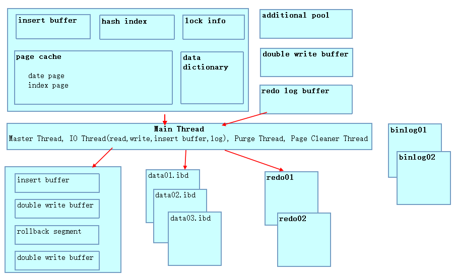

# 从innodb1.0.x开始，可以使用命令show engine innodb status;来查看master thread的状态信息

## mysql有4根主要线程

线程 | 功能描述  |相关数据库参数
:--|:--|:--
Master Thread |是核心的后台线程，主要负责异步刷新和数据一致性处理 |
IO Thread| 使用了异步IO模型，负责处理不同类型的IO请求回调|innodb_read_io_threads   innodb_write_io_threads
Purge Thread|事务提交后回收已经使用并分配的undo页,线程数从1提高到4，加快标记为废弃undo页的回收速度|innodb_purge_threads
Page Cleaner Thread|执行buffer pool里面脏页刷新操作,可以进行调整，默认为1，最大为64|innodb_page_cleaners

## innodb结构



#### 第一段是头部信息，它仅仅声明了输出的开始，其内容包括当前的日期和时间，以及自上次输出以来经过的时长

```mysql
=====================================
2020-07-21 16:52:12 7fcdbba95700 INNODB MONITOR OUTPUT
=====================================
Per second averages calculated from the last 3 seconds # 这一行显示的是计算出这一平均值的时间间隔，即自上次输出以来的时间，或者是距上次内部复位的时长
```


#### srv_master_thread loops是Master线程的循环次数,每次循环时会选择一种状态（active,shutdown,idle）执行,其中Active数量增加与数据变化有关，与查询无关，可以通过srv_active和srv_idle的差异可以看出，通过对比active和idle的值，来获得系统整体负载情况，如果Active的值越大，证明服务越繁忙。

```mysql
-----------------
BACKGROUND THREAD
-----------------
srv_master_thread loops: 187276 srv_active, 0 srv_shutdown, 24330405 srv_idle
srv_master_thread log flush and writes: 24517668
```


#### 如果有高并发的工作负载，你就要关注下接下来的段（SEMAPHORES信号量）,它包含了两种数据：事件计数器以及可选的当前等待线程的列表，如果有性能上的瓶颈，可以使用这些信息来找出瓶颈

- 如果有高并发工作负荷，就需要关注这一段信号量。
- 它包含了两种数据： 1 时间计数器　　　2 当前等待线程的列表
- OS WAIT ARRAY INFO : 这行给出了关于操作系统等待数组的信息，它是一个插槽数组，innodb在数组里为信号量保留了一些插槽，操作系统用这些信号量给线程发送信号，使线程可以继续运行，以完成它们等着做的事情，这一行还显示出innodb使用了多少次操作系统的等待：保留统计（reservation count）显示了innodb分配插槽的频度，而信号计数（signal count）衡量的是线程通过数组得到信号的频度，操作系统的等待相对于空转等待（spin wait）要昂贵些。

```mysql
----------
SEMAPHORES
----------
OS WAIT ARRAY INFO: reservation count 1745908
OS WAIT ARRAY INFO: signal count 2600587
Mutex spin waits 9887269, rounds 35088383, OS waits 806954  # 跟互斥量相关的几个计数器
RW-shared spins 1293948, rounds 29243077, OS waits 865360  # 显示读/写共享计数器
RW-excl spins 301097, rounds 5420069, OS waits 54472  # 排斥锁的计数器
Spin rounds per wait: 3.55 mutex, 22.60 RW-shared, 18.00 RW-excl
```

#### 外键错误

- 下面这一段外键错误的信息一般不会出现，除非你服务器上发生了外键错误，有时问题在于事务在插入，更新或删除一条记录时要寻找父表或子表，还有时候是当innodb尝试增加或删除一个外键或者修改一个已经存在的外键时，发现表之间类型不匹配，

```mysql
------------------------
LATEST FOREIGN KEY ERROR
------------------------
2020-04-06 20:43:24 7fcdbb35d700 Error in foreign key constraint of table credit_test/zsph_certificates:   #这行显示了最近一次外键错误的日期和时间和表
there is no index in referenced table which would contain
the columns as the first columns, or the data types in the
referenced table do not match the ones in table. Constraint:
,
  CONSTRAINT "FK_Reference_10" FOREIGN KEY ("customer_id") REFERENCES "zsph_customer" ("id") ON DELETE NO ACTION ON UPDATE NO ACTION
The index in the foreign key in table is "FK_Reference_10"
See http://dev.mysql.com/doc/refman/5.6/en/innodb-foreign-key-constraints.html
for correct foreign key definition.
```

##### 死锁错误

- 如果没有死锁不会出现这段
- innodb不仅会打印出事务和事务持有和等待的锁，而且还有记录本身，不幸的是，它至于可能超过为输出结果预留的长度（只能打印1M的内容且只能保留最近一次的死锁信息），如果你无法看到完整的输出，此时可以在任意库下创建innodb_monitor或innodb_lock_monitor表，这样innodb status信息会完整且每15s一次被记录到错误日志中。如：create table innodb_monitor(a int)engine=innodb;，不需要记录到错误日志中时就删掉这个表即可。

```mysql
------------------------
LATEST DETECTED DEADLOCK
------------------------
2020-03-26 15:49:27 7fcdbbb19700
*** (1) TRANSACTION:              # 第一个事务
TRANSACTION 2643097, ACTIVE 1 sec fetching rows
mysql tables in use 1, locked 1 # 这行表示事务2643097正在使用1个表，且涉及锁的表有1个
LOCK WAIT 27 lock struct(s), heap size 6544, 1896 row lock(s), undo log entries 3 # 表示等待27个锁,已锁定1896个锁,占用堆大小6544
MySQL thread id 28865, OS thread handle 0x7fce307fe700, query id 59419334 172.19.0.65 xindai_test # 在哪个库

# 执行的sql
UPDATE zsph_accountage_new SET allot_flag=0,allot_ready=0,trigger_flag=0,csy_id='',data_code='',cur_m_age='',cur_s_age='',cur_over_due=0,real_over_due=0,cur_over_day=0,
  collection_type=null,promise_repayment_date=null,focus=0,last_collection_date=null,new_case_first_collection_date=null 
where allot_flag=1 and cur_m_age !='C'

# 下面这一部分显示的是当死锁发生时，第一个事务正在等待的锁等信息
# 这行信息表示等待的锁是一个record lock，空间id是835，页编号为29，大概位置在页的152位处，锁发生在表`credit_test`.`zsph_accountage_new`的主键上，是一个X锁. waiting表示正在等待锁
*** (1) WAITING FOR THIS LOCK TO BE GRANTED: # 表示正在等待被授予锁
RECORD LOCKS space id 835 page no 29 n bits 152 index `PRIMARY` of table `credit_test`.`zsph_accountage_new` trx id 2643097 lock_mode X waiting

# 下面这一部分显示的是当死锁发生时，第二个事务正在等待的锁等信息
*** (2) TRANSACTION:
TRANSACTION 2643096, ACTIVE 7 sec starting index read
mysql tables in use 1, locked 1
12 lock struct(s), heap size 2936, 10 row lock(s), undo log entries 11
MySQL thread id 28869, OS thread handle 0x7fcdbbb19700, query id 59419353 192.168.31.61 xindai_test updating
update zsph_accountage_new
		 SET customer_id = '5cff7f62d9e540707cbedacb',
			
			
				cur_m_age = 'M6',
			
			
				cur_s_age = '',
			
			
				cur_over_due = 3,
			
			
				real_over_due = 6,
			
			
				cur_over_day = 189,
			
			
				his_over_due_all = 38,
			
			
				his_over_day_all = 0,
			
			
				his_over_due_high = 6,
			
			
				his_over_day_high = 0,
			
			
				over_age = 'M4+',
			
			
				his_age = 'M4',
			
			
				m_weight = 6,
			
			
			
			
			
				csy_id = '',
			
			
			
				create_by = 'd06bba82121b48c7ab61166134f41ef2',
			
			
				create_date = '2019-06-21 00:10:00.0',
			
			
			
				update_date = '2020-03-26 15:49:27.133',
			
			
				del_flag = '0',
			
			
				allot_flag = 1,
			
			
				trigger_flag = 1,
			
			
				allot_ready = 0,
			
			
				m1Count = 0,
			
			
				data_code = '',
			
		  	
			
			
				focus = 0,
			
			
				collection_type = '2',
			
			
				new_cas


# 下面这部分是事务二的持有锁信息
*** (2) HOLDS THE LOCK(S):
RECORD LOCKS space id 835 page no 29 n bits 152 index `PRIMARY` of table `credit_test`.`zsph_accountage_new` trx id 2643096 lock_mode X locks rec but not gap
*** (2) WAITING FOR THIS LOCK TO BE GRANTED:
RECORD LOCKS space id 835 page no 9 n bits 152 index `PRIMARY` of table `credit_test`.`zsph_accountage_new` trx id 2643096 lock_mode X locks rec but not gap waiting
*** WE ROLL BACK TRANSACTION (2) # 这个表示事务2被回滚，因为两个事务的回滚开销一样，所以选择了后提交的事务进行回滚，如果两个事务回滚的开销不同(undo 数量不同)，那么就回滚开销最小的那个事务。
```

#### 下面这部分包含了一些关于innodb事务的总结信息，紧随其后的是当前活跃事务列表

```mysql
------------
TRANSACTIONS
------------
Trx id counter 3633738
Purge done for trx's n:o < 3633676 undo n:o < 0 state: running but idle
History list length 1902
LIST OF TRANSACTIONS FOR EACH SESSION:
---TRANSACTION 0, not started
MySQL thread id 41576, OS thread handle 0x7fce30318700, query id 67624867 192.168.31.60 xindai_test cleaning up
---TRANSACTION 3632916, not started
MySQL thread id 41575, OS thread handle 0x7fcdbb885700, query id 67624869 192.168.31.60 xindai_test cleaning up
---TRANSACTION 0, not started
MySQL thread id 41572, OS thread handle 0x7fcdbba95700, query id 67625877 172.19.0.65 xindai_test init
show engine innodb status
---TRANSACTION 3633721, not started
MySQL thread id 41571, OS thread handle 0x7fce3077a700, query id 67625720 172.19.0.65 xindai_test cleaning up
---TRANSACTION 0, not started
MySQL thread id 41567, OS thread handle 0x7fcdbbb9d700, query id 67623020 172.19.0.65 xindai_test cleaning up
---TRANSACTION 3633724, not started
MySQL thread id 41565, OS thread handle 0x7fcdbbc21700, query id 67625778 172.19.0.65 xindai_test cleaning up
---TRANSACTION 3632242, not started
MySQL thread id 41569, OS thread handle 0x7fce34ba8700, query id 67623387 172.19.0.65 xindai_test cleaning up
---TRANSACTION 3632117, not started
MySQL thread id 41552, OS thread handle 0x7fce30948700, query id 67622538 192.168.23.173 xindai_test cleaning up
---TRANSACTION 0, not started
MySQL thread id 41550, OS thread handle 0x7fcdbbce7700, query id 67624178 172.19.0.65 xindai_test cleaning up
---TRANSACTION 3632320, not started
MySQL thread id 41551, OS thread handle 0x7fcdbb5af700, query id 67624180 172.19.0.65 xindai_test cleaning up
---TRANSACTION 3631805, not started
MySQL thread id 41545, OS thread handle 0x7fcdbb465700, query id 67618578 192.168.23.171 xindai_test cleaning up
---TRANSACTION 3632267, not started
MySQL thread id 41547, OS thread handle 0x7fcdbb98d700, query id 67623633 192.168.23.171 xindai_test cleaning up
---TRANSACTION 3631338, not started
MySQL thread id 41546, OS thread handle 0x7fcdbb35d700, query id 67614915 192.168.23.171 xindai_test cleaning up
---TRANSACTION 3633737, not started
MySQL thread id 41549, OS thread handle 0x7fce302d6700, query id 67625875 192.168.23.171 xindai_test cleaning up
---TRANSACTION 3630331, not started
MySQL thread id 41459, OS thread handle 0x7fce30ce4700, query id 67601876 172.19.0.66 xindai_test cleaning up
---TRANSACTION 3632119, not started
MySQL thread id 41458, OS thread handle 0x7fce304a4700, query id 67622546 192.168.23.173 xindai_test cleaning up
---TRANSACTION 3633735, not started
MySQL thread id 41387, OS thread handle 0x7fce305ee700, query id 67625865 192.168.23.173 xindai_test cleaning up
```

#### I/O线程信息

- 其中read thread默认4个，write thread默认4个，log thread和insert buffer thread各1个，read和wrtie线程都可以根据参数进行调整
- 对于Purge thread,默认会开启4个线程，提高了回收效率，但是也会带来一些副作用，MySQL对于空间重用机制和Oracle等数据库不同，如果执行了truncate和drop操作，因为开启了多个purge thread去回收空间，随着时间的推移会使得数据恢复的难度大大增加。
- 而对于Page Cleaner thread,默认值为1，如果在MySQL日志中看到如下的信息，说明我们的Cleaner Thread需要调整一下了。
- 2019-02-14T23:50:00.501209Z 0 [Note] InnoDB: page_cleaner: 1000ms intended loop took 28469710ms. The settings might not be optimal. (flushed=0 and evicted=0, during the time.)

--------
FILE I/O
--------
I/O thread 0 state: waiting for completed aio requests (insert buffer thread)
I/O thread 1 state: waiting for completed aio requests (log thread)
I/O thread 2 state: waiting for completed aio requests (read thread)
I/O thread 3 state: waiting for completed aio requests (read thread)
I/O thread 4 state: waiting for completed aio requests (read thread)
I/O thread 5 state: waiting for completed aio requests (read thread)
I/O thread 6 state: waiting for completed aio requests (write thread)
I/O thread 7 state: waiting for completed aio requests (write thread)
I/O thread 8 state: waiting for completed aio requests (write thread)
I/O thread 9 state: waiting for completed aio requests (write thread)
Pending normal aio reads: 0 [0, 0, 0, 0] , aio writes: 0 [0, 0, 0, 0] ,
 ibuf aio reads: 0, log i/o's: 0, sync i/o's: 0
Pending flushes (fsync) log: 0; buffer pool: 0
3388571 OS file reads, 18900274 OS file writes, 3771113 OS fsyncs
0.00 reads/s, 0 avg bytes/read, 0.00 writes/s, 0.00 fsyncs/s


-------------------------------------
INSERT BUFFER AND ADAPTIVE HASH INDEX
-------------------------------------
Ibuf: size 1, free list len 0, seg size 2, 33751 merges
merged operations:
 insert 646311, delete mark 342, delete 27
discarded operations:
 insert 0, delete mark 0, delete 0
0.00 hash searches/s, 0.00 non-hash searches/s
---
LOG
---
Log sequence number 210803211607
Log flushed up to   210803211607
Pages flushed up to 210803211607
Last checkpoint at  210803211607
Max checkpoint age    651585393
Checkpoint age target 631223350
Modified age          0
Checkpoint age        0
0 pending log writes, 0 pending chkp writes
2052044 log i/o's done, 0.00 log i/o's/second
----------------------
BUFFER POOL AND MEMORY
----------------------
Total memory allocated 2197815296; in additional pool allocated 0
Total memory allocated by read views 1760
Internal hash tables (constant factor + variable factor)
    Adaptive hash index 56412448 	(37845176 + 18567272)
    Page hash           277432 (buffer pool 0 only)
    Dictionary cache    13825888 	(8851664 + 4974224)
    File system         1426960 	(812272 + 614688)
    Lock system         5319536 	(5313416 + 6120)
    Recovery system     0 	(0 + 0)
Dictionary memory allocated 4974224
Buffer pool size        131064
Buffer pool size, bytes 2147352576
Free buffers            8192
Database pages          121739
Old database pages      44775
Modified db pages       0
Pending reads 0
Pending writes: LRU 0, flush list 0, single page 0
Pages made young 8131691, not young 94769564
0.00 youngs/s, 0.00 non-youngs/s
Pages read 3377693, created 10323081, written 15725842
0.00 reads/s, 0.00 creates/s, 0.00 writes/s
No buffer pool page gets since the last printout
Pages read ahead 0.00/s, evicted without access 0.00/s, Random read ahead 0.00/s
LRU len: 121739, unzip_LRU len: 0
I/O sum[0]:cur[0], unzip sum[0]:cur[0]
----------------------
INDIVIDUAL BUFFER POOL INFO
----------------------
---BUFFER POOL 0
Buffer pool size        16383
Buffer pool size, bytes 268419072
Free buffers            1024
Database pages          15218
Old database pages      5597
Modified db pages       0
Pending reads 0
Pending writes: LRU 0, flush list 0, single page 0
Pages made young 978730, not young 10758142
0.00 youngs/s, 0.00 non-youngs/s
Pages read 420839, created 1290245, written 1986953
0.00 reads/s, 0.00 creates/s, 0.00 writes/s
No buffer pool page gets since the last printout
Pages read ahead 0.00/s, evicted without access 0.00/s, Random read ahead 0.00/s
LRU len: 15218, unzip_LRU len: 0
I/O sum[0]:cur[0], unzip sum[0]:cur[0]
---BUFFER POOL 1
Buffer pool size        16383
Buffer pool size, bytes 268419072
Free buffers            1024
Database pages          15219
Old database pages      5597
Modified db pages       0
Pending reads 0
Pending writes: LRU 0, flush list 0, single page 0
Pages made young 1108893, not young 12202405
0.00 youngs/s, 0.00 non-youngs/s
Pages read 413820, created 1292365, written 1986221
0.00 reads/s, 0.00 creates/s, 0.00 writes/s
No buffer pool page gets since the last printout
Pages read ahead 0.00/s, evicted without access 0.00/s, Random read ahead 0.00/s
LRU len: 15219, unzip_LRU len: 0
I/O sum[0]:cur[0], unzip sum[0]:cur[0]
---BUFFER POOL 2
Buffer pool size        16383
Buffer pool size, bytes 268419072
Free buffers            1024
Database pages          15215
Old database pages      5596
Modified db pages       0
Pending reads 0
Pending writes: LRU 0, flush list 0, single page 0
Pages made young 989644, not young 12115189
0.00 youngs/s, 0.00 non-youngs/s
Pages read 417542, created 1291330, written 1895343
0.00 reads/s, 0.00 creates/s, 0.00 writes/s
No buffer pool page gets since the last printout
Pages read ahead 0.00/s, evicted without access 0.00/s, Random read ahead 0.00/s
LRU len: 15215, unzip_LRU len: 0
I/O sum[0]:cur[0], unzip sum[0]:cur[0]
---BUFFER POOL 3
Buffer pool size        16383
Buffer pool size, bytes 268419072
Free buffers            1024
Database pages          15214
Old database pages      5596
Modified db pages       0
Pending reads 0
Pending writes: LRU 0, flush list 0, single page 0
Pages made young 1011694, not young 12406691
0.00 youngs/s, 0.00 non-youngs/s
Pages read 433760, created 1287908, written 2078182
0.00 reads/s, 0.00 creates/s, 0.00 writes/s
No buffer pool page gets since the last printout
Pages read ahead 0.00/s, evicted without access 0.00/s, Random read ahead 0.00/s
LRU len: 15214, unzip_LRU len: 0
I/O sum[0]:cur[0], unzip sum[0]:cur[0]
---BUFFER POOL 4
Buffer pool size        16383
Buffer pool size, bytes 268419072
Free buffers            1024
Database pages          15217
Old database pages      5597
Modified db pages       0
Pending reads 0
Pending writes: LRU 0, flush list 0, single page 0
Pages made young 992427, not young 11380867
0.00 youngs/s, 0.00 non-youngs/s
Pages read 424250, created 1290842, written 1888372
0.00 reads/s, 0.00 creates/s, 0.00 writes/s
No buffer pool page gets since the last printout
Pages read ahead 0.00/s, evicted without access 0.00/s, Random read ahead 0.00/s
LRU len: 15217, unzip_LRU len: 0
I/O sum[0]:cur[0], unzip sum[0]:cur[0]
---BUFFER POOL 5
Buffer pool size        16383
Buffer pool size, bytes 268419072
Free buffers            1024
Database pages          15218
Old database pages      5597
Modified db pages       0
Pending reads 0
Pending writes: LRU 0, flush list 0, single page 0
Pages made young 1032742, not young 12526245
0.00 youngs/s, 0.00 non-youngs/s
Pages read 433924, created 1288395, written 2032861
0.00 reads/s, 0.00 creates/s, 0.00 writes/s
No buffer pool page gets since the last printout
Pages read ahead 0.00/s, evicted without access 0.00/s, Random read ahead 0.00/s
LRU len: 15218, unzip_LRU len: 0
I/O sum[0]:cur[0], unzip sum[0]:cur[0]
---BUFFER POOL 6
Buffer pool size        16383
Buffer pool size, bytes 268419072
Free buffers            1024
Database pages          15216
Old database pages      5596
Modified db pages       0
Pending reads 0
Pending writes: LRU 0, flush list 0, single page 0
Pages made young 993992, not young 11816214
0.00 youngs/s, 0.00 non-youngs/s
Pages read 414539, created 1290434, written 1814433
0.00 reads/s, 0.00 creates/s, 0.00 writes/s
No buffer pool page gets since the last printout
Pages read ahead 0.00/s, evicted without access 0.00/s, Random read ahead 0.00/s
LRU len: 15216, unzip_LRU len: 0
I/O sum[0]:cur[0], unzip sum[0]:cur[0]
---BUFFER POOL 7
Buffer pool size        16383
Buffer pool size, bytes 268419072
Free buffers            1024
Database pages          15222
Old database pages      5599
Modified db pages       0
Pending reads 0
Pending writes: LRU 0, flush list 0, single page 0
Pages made young 1023569, not young 11563811
0.00 youngs/s, 0.00 non-youngs/s
Pages read 419019, created 1291562, written 2043477
0.00 reads/s, 0.00 creates/s, 0.00 writes/s
No buffer pool page gets since the last printout
Pages read ahead 0.00/s, evicted without access 0.00/s, Random read ahead 0.00/s
LRU len: 15222, unzip_LRU len: 0
I/O sum[0]:cur[0], unzip sum[0]:cur[0]
--------------
ROW OPERATIONS
--------------
0 queries inside InnoDB, 0 queries in queue
0 read views open inside InnoDB
0 RW transactions active inside InnoDB
0 RO transactions active inside InnoDB
0 out of 1000 descriptors used
Main thread process no. 14466, id 140523662255872, state: sleeping
Number of rows inserted 432348711, updated 2946477, deleted 635102, read 773788677585
0.00 inserts/s, 0.00 updates/s, 0.00 deletes/s, 0.00 reads/s
----------------------------
END OF INNODB MONITOR OUTPUT
============================
