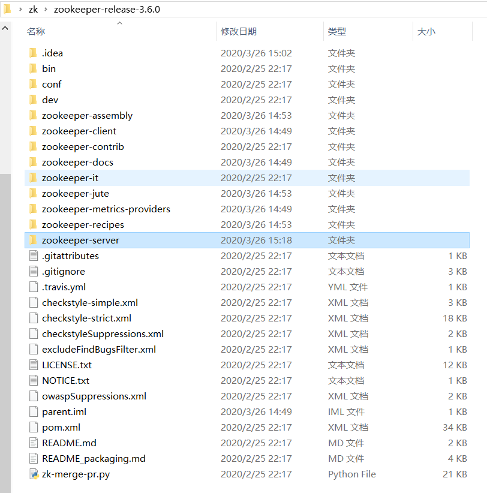

# zookeeper

- ZooKeeper是Hadoop的正式子项目,它是一个针对大型分布式系统的可靠协调系统,提供的功能包括：配置维护、名字服务、分布式同步、组服务等ZooKeeper的目标就是封装好复杂易出错的关键服务,将简单易用的接口和性能高效、功能稳定的系统提供给用户

[toc]

## 分布式系统基础理论

### CAP

- CAP原则又称CAP定理,指的是在一个分布式系统中,一致性（Consistency）、可用性（Availability）、分区容错性（Partition tolerance）CAP 原则指的是,这三个要素最多只能同时实现两点,不可能三者兼顾
  - C : 一致性分为强一致性,弱一致性,最终一致性
    - 比如向数据库集群mysqlA中写入"张三",在集群mysqlB中读取数据,如果需要一定能够读到张三,哪怕加锁等待数据同步也无所谓,这就是强一致性,CAP中C指的就是强一致性
    - 如果读取时,可以读到,也可以读不到,无所谓,就是弱一致性
    - 只要过段时间一定能从mysqlB中读到"张三",就是最终一致性,一般的,分布式系统保证最终一致性即可,也就是结果无需实时到达用户
  - A : 服务一直能够提供正常服务,即在正常时间段内做出正确的响应,就是可用性
  - P : 即分布式系统在遇到网络故障的时候,也能对外提供正常的服务,比如将服务做成集群,部署到多台机器,即使其中一台或多台机器因为某种原因挂掉了,也能够正常提供服务(比如 nginx负载均衡...)
  > 分区容错是必须保证的,相当于是CAP中必须保证的基础,CA可以理解为是单机环境,不做集群部署,一旦集群部署,就必须保证P
  > 在强一致性的基础上,无法保证可用性,因为网络不通,就会卡住用户请求,知道两边数据一致,这样无法满足可用性 , AP
  > 在可用性的基础上,还是上面例子,我不卡住用户请求,直接返回旧的结果,则无法满足强一致性,但是可以满足最终一致性 , CP

- CAP理论就是说在分布式系统中,最多只能实现上面的两点而由于网络硬件肯定会出现延迟丢包等问题,所以分区容错性是我们必须需要实现的所以我们只能在一致性和可用性之间进行权衡,分布式系统中,经常用到NoSQL,没有NoSQL系统能同时保证这三点对于web2.0网站来说,关系数据库的很多主要特性却往往无用武之地
  1. 数据库事务一致性需求
　　很多web实时系统并不要求严格的数据库事务,对读一致性的要求很低,有些场合对写一致性要求并不高允许实现最终一致性
  2. 数据库的写实时性和读实时性需求
　　对关系数据库来说,插入一条数据之后立刻查询,是肯定可以读出来这条数据的,但是对于很多web应用来说,并不要求这么高的实时性,比方说发一条消息之 后,过几秒乃至十几秒之后,我的订阅者才看到这条动态是完全可以接受的
  3. 对复杂的SQL查询,特别是多表关联查询的需求
　　任何大数据量的web系统,都非常忌讳多个大表的关联查询,以及复杂的数据分析类型的报表查询,特别是SNS类型的网站,从需求以及产品设计角 度,就避免了这种情况的产生往往更多的只是单表的主键查询,以及单表的简单条件分页查询,SQL的功能被极大的弱化了
  > 关系型数据库集群更加倾向于实现AP,因为关系型数据库强调强一致性,这样不可避免会牺牲可用性,也就是一旦出现问题用户体验会相当差
  > 而非关系型数据库,保证最终一致性,并且有高扩展性,高性能,高可用性,至少用户体验会很好

### BASE

- BASE：基本可用(Basically Available),软状态/柔性事务 (Soft-state), 最终一致性(Eventually Consistent)
- BASE理论基于CAP定律逐步演化而来,其核心思想是:既然无法做到强一致性,但每个应用都可以根据自身的业务特点,采用适当的方式来使系统达到最终一致性
  - 基本可用 : 在一个电商网站上,正常情况下,用户可以顺利完成每一笔订单但是到了大促期间,为了保护购物系统的稳定性,部分消费者可能会被引导到一个降级页面
  - 柔性事务 : 允许系统中的数据存在中间状态,并认为该状态不影响系统的整体可用性,即允许系统在多个不同节点的数据副本存在数据延时
  - 最终一致性 : 上面说软状态,然后不可能一直是软状态,必须有个时间期限在期限过后,应当保证所有副本保持数据一致性,从而达到数据的最终一致性这个时间期限取决于网络延时、系统负载、数据复制方案设计等等因素比如电商大促时,用户下单后可能无法立即查询到订单状态,但是在大促高峰结束后,就能正常查询了
  > 总体来说BASE理论面向的是大型高可用、可扩展的分布式系统与传统ACID特性相反,不同于ACID的强一致性模型,BASE提出通过牺牲强一致性来获得可用性,并允许数据段时间内的不一致,但是最终达到一致状态同时,在实际分布式场景中,不同业务对数据的一致性要求不一样因此在设计中,ACID和BASE理论往往又会结合使用

- 由于BASE理论需要在一致性和可用性方面做出权衡,因此有很多关于一致性的算法和协议
  - 2PC
  - 3PC
  - Paxos算法
  - ZAB协议

### ZAB

- Zookeeper Atomic Broadcast （Zookeeper原子广播）
- Zookeeper 是通过 Zab 协议来保证分布式事务的最终一致性
- Zab协议是为分布式协调服务Zookeeper专门设计的一种 **支持崩溃恢复** 的 **原子广播协议** ,是Zookeeper保证数据一致性的核心算法Zab借鉴了Paxos算法,但又不像Paxos那样,是一种通用的分布式一致性算法它是特别为Zookeeper设计的支持崩溃恢复的原子广播协议
- 基于该协议,zk实现了一种主备模型（即Leader和Follower模型）的系统架构来保证集群中各个副本之间数据的一致性(Observer不算在内)
- 这里的**主备系统架构模型**，就是指Leader负责处理外部的写事务请求，然后Leader将数据同步到其他Follower节点
- Zookeeper 客户端会随机的链接到 zookeeper 集群中的一个节点，如果是读请求，就直接从当前节点中读取数据；如果是写请求，那么节点就会向 Leader 提交事务，Leader 接收到事务提交，会广播该事务，只要超过半数节点写入成功，该事务就会被提交,然后从请求节点返回响应给客户端
- 链接地址 <https://www.jianshu.com/p/2bceacd60b8a>

#### Zab 协议的特性

- Zab 协议需要确保那些已经在 Leader 服务器上提交（Commit）的事务最终被所有的服务器提交 -- 最终一致性
- Zab 协议需要确保丢弃那些只在 Leader 上被提出而没有被提交的事务 -- 没过半认可的

#### Zab 协议原理

- Zab协议要求每个 Leader 都要经历三个阶段：发现，同步，广播 , **定义了事务请求的处理方式**
  - **发现**：要求zookeeper集群必须选举出一个 Leader 进程，同时 Leader 会维护一个 Follower 可用客户端列表将来leader可以和这些 Follower节点进行通信
  - **同步**：Leader 要负责将本身的数据与 Follower 完成同步，做到多副本存储这样也是提现了CAP中的高可用和分区容错Follower将队列中未处理完的请求消费完成后，写入本地事务日志中
  - **广播**：Leader服务器 负责将一个客户端事务请求，转换成一个 事务Proposal，并将该 Proposal 分发给集群中所有的 Follower 服务器，也就是向所有 Follower 节点发送数据广播请求（或数据复制）

  > 广播流程
  > 1. 客户端发起一个写操作请求如果连接L,就继续,如果连接O/F,会转发请求到L
  > 2. Leader 服务器将客户端的请求转化为事务 Proposal 提案，同时为每个 Proposal 分配一个全局的ID，即zxid
  > 3. Leader 服务器为每个 Follower 服务器分配一个单独的队列，然后将需要广播的 Proposal 依次放到队列中取，并且根据 FIFO 策略进行消息发送
  > 4. Follower 接收到 Proposal 后，会首**先将其以事务日志的方式写入本地磁盘中**，写入成功后向 Leader 反馈一个 Ack 响应消息
  > 5. Leader 接收到超过半数以上 Follower 的 Ack 响应消息后，即认为消息发送成功，可以发送 commit 消息
  > 6. Leader 向所有 Follower 广播 commit 消息，同时自身也会完成事务提交Follower 接收到 commit 消息后，会将上一条事务提交
  > zookeeper 采用 Zab 协议的核心，就是只要有一台服务器提交了 Proposal，(哪怕只有leadere成功了也算成功了),就要确保所有的服务器最终都能正确提交 Proposal这也是 CAP/BASE 实现最终一致性的一个体现
  > Leader 服务器与每一个 Follower 服务器之间都维护了一个单独的 FIFO 消息队列进行收发消息，使用队列消息可以做到异步解耦 Leader 和 Follower 之间只需要往队列中发消息即可如果使用同步的方式会引起阻塞，性能要下降很多

#### Zab协议内容

- Zab 协议包括两种基本的模式：**崩溃恢复** 和 **消息广播**
- 当整个集群**启动**过程中，或者当**Leader 服务器出现网络中弄断、崩溃退出或重启等异常**时,或是集群中不存在超过半数的服务器与Leader保存正常通信,Zab协议就会 进入崩溃恢复模式，选举产生新的Leader
- 当选举产生了新的 Leader，同时集群中有过半的机器与该 Leader 服务器完成了状态同步（即数据同步）之后，Zab协议就会退出崩溃恢复模式，进入消息广播模式
- 这时，如果有一台遵守Zab协议的服务器加入集群，因为此时集群中已经存在一个Leader服务器在广播消息，那么该新加入的服务器自动进入恢复模式：找到Leader服务器，并且完成数据同步同步完成后，作为新的Follower一起参与到消息广播流程中
- 保证消息有序
- 在整个消息广播中，Leader会将每一个事务请求转换成对应的 proposal 来进行广播，并且在广播 事务Proposal 之前，Leader服务器会首先为这个事务Proposal分配一个全局单递增的唯一ID，称之为事务ID（即zxid），由于Zab协议需要保证每一个消息的严格的顺序关系，因此必须将每一个proposal按照其zxid的先后顺序进行排序和处理

- Zab 协议崩溃恢复要求满足以下两个要求
  - 确保已经被 Leader 提交的 Proposal 必须最终被所有的 Follower 服务器提交
  - 确保丢弃已经被 Leader 提出的但是没有被提交的 Proposal
- 根据上述要求,Zab协议需要保证选举出来的Leader需要满足以下条件
  - 新选举出来的 Leader 不能包含未提交的 Proposal
    - 即新选举的 Leader 必须都是已经提交了 Proposal 的 Follower 服务器节点
  - 新选举的 Leader 节点中含有最大的 zxid
    - 这样做的好处是可以避免 Leader 服务器检查 Proposal 的提交和丢弃工作

#### Zab 与 2PC 区别

- 在zookeeper集群中，数据副本的传递策略就是采用消息广播模式zookeeper中农数据副本的同步方式与二段提交相似，但是却又不同二段提交要求协调者必须等到所有的参与者**全部反馈**ACK确认消息后，再发送commit消息要求所有的参与者要么全部成功，要么全部失败**二段提交会产生严重的阻塞问题**
- Zab协议中 Leader 等待 Follower 的ACK反馈消息是指“只要半数以上的Follower成功反馈即可，不需要收到全部Follower反馈

#### Zab 如何数据同步

- Zab 协议崩溃恢复要求满足以下两个要求
  - 确保已经被 Leader 提交的 Proposal 必须最终被所有的 Follower 服务器提交
  - 确保丢弃已经被 Leader 提出的但是没有被提交的 Proposal
- 根据上述要求,Zab协议需要保证选举出来的Leader需要满足以下条件
  - 新选举出来的 Leader 不能包含未提交的 Proposal
    - 即新选举的 Leader 必须都是已经提交了 Proposal 的 Follower 服务器节点
  - 新选举的 Leader 节点中含有最大的 zxid
    - 这样做的好处是可以避免 Leader 服务器检查 Proposal 的提交和丢弃工作

- 选举leader完成

  - 完成 Leader 选举后（新的 Leader 肯定是具有最高的zxid），在正式开始工作之前（接收事务请求，然后提出新的 Proposal），Leader 服务器会首先确认事务日志中的所有的 Proposal 是否已经被集群中过半的服务器 Commit
  - Leader 服务器需要确保所有的 Follower 服务器能够接收到每一条事务的 Proposal ，并且能将所有已经提交的事务 Proposal 应用到内存数据中等到 Follower 将所有尚未同步的事务 Proposal 都从 Leader 服务器上同步过啦并且应用到内存数据中以后，Leader 才会把该 Follower 加入到真正可用的 Follower 列表中

- Zab 数据同步过程中，如何处理需要丢弃的 Proposal

  - 在 Zab 的事务编号 zxid 设计中，zxid是一个64位的数字。
  - 其中低32位可以看成一个简单的单增计数器，针对客户端每一个事务请求，Leader 在产生新的 Proposal 事务时，都会对该计数器加1。而高32位则代表了 Leader 周期的 epoch 编号。
  > epoch 编号可以理解为当前集群所处的年代，或者周期。每次Leader变更之后都会在 epoch 的基础上加1，这样旧的 Leader 崩溃恢复之后，其他Follower 也不会听它的了，因为 Follower 只服从epoch最高的 Leader 命令。

  - 每当选举产生一个新的 Leader ，就会从这个 Leader 服务器上取出本地事务日志充最大编号 Proposal 的 zxid，并从 zxid 中解析得到对应的 epoch 编号，然后再对其加1，之后该编号就作为新的 epoch 值，并将低32位数字归零，由0开始重新生成zxid。
  > zxid达到最大值后会触发集群重新选举，然后zxid会变为0。Address the rollover issue. All lower 32bits set indicate a new leader election. Force a re-election instead
  - Zab 协议通过 epoch 编号来区分 Leader 变化周期，能够有效避免不同的 Leader 错误的使用了相同的 zxid 编号提出了不一样的 Proposal 的异常情况。

- 基于以上策略

  - 当一个包含了上一个 Leader 周期中尚未提交过的事务 Proposal 的服务器启动时，当这台机器加入集群中，以 Follower 角色连上 Leader 服务器后，Leader 服务器会根据自己服务器上最后提交的 Proposal 来和 Follower 服务器的 Proposal 进行比对，比对的结果肯定是 Leader 要求 Follower 进行一个回退操作，回退到一个确实已经被集群中过半机器 Commit 的最新 Proposal。

##### Zab 的四个阶段

1. 选举阶段（Leader Election）
  节点在一开始都处于选举节点，只要有一个节点得到超过半数节点的票数，它就可以当选准 Leader，只有到达第三个阶段（也就是同步阶段），这个准 Leader 才会成为真正的 Leader。
  Zookeeper 规定所有有效的投票都必须在同一个 轮次 中，每个服务器在开始新一轮投票时，都会对自己维护的 logicalClock 进行自增操作。
  每个服务器在广播自己的选票前，会将自己的投票箱（recvset）清空。该投票箱记录了所受到的选票。
  这一阶段的目的就是为了选出一个准 Leader ，然后进入下一个阶段。

2. 发现阶段（Descovery）
  在这个阶段，Followers 和上一轮选举出的准 Leader 进行通信，同步 Followers 最近接收的事务 Proposal 。
  一个 Follower 只会连接一个 Leader，如果一个 Follower 节点连接另一个 Follower 节点，则会在尝试连接时被拒绝。被拒绝之后，该节点就会进入 Leader Election阶段。
  这个阶段的主要目的是发现当前大多数节点接收的最新 Proposal，并且准 Leader 生成新的 epoch ，让 Followers 接收，更新它们的 acceptedEpoch。

3. 同步阶段（Synchronization）
  同步阶段主要是利用 Leader 前一阶段获得的最新 Proposal 历史，同步集群中所有的副本。
  只有当 quorum（超过半数的节点） 都同步完成，准 Leader 才会成为真正的 Leader。Follower 只会接收 zxid 比自己 lastZxid 大的 Proposal。

4. 广播阶段（Broadcast）
  到了这个阶段，Zookeeper 集群才能正式对外提供事务服务，并且 Leader 可以进行消息广播。同时，如果有新的节点加入，还需要对新节点进行同步。
  需要注意的是，Zab 提交事务并不像 2PC 一样需要全部 Follower 都 Ack，只需要得到 quorum（超过半数的节点）的Ack 就可以。

### zookeeper 的为啥要部署奇数台,和脑裂问题

- <https://www.cnblogs.com/maohuidong/p/11043049.html>
- 为什么zookeeper要部署基数台服务器 : 节省资源
  - **所谓的zookeeper容错是指，当宕掉几个zookeeper服务器之后，剩下的个数必须大于宕掉的个数，也就是剩下的服务数必须大于n/2，zookeeper才可以继续使用，无论奇偶数都可以选举leader。**5台机器最多宕掉2台，还可以继续使用，因为剩下3台大于5/2。说为什么最好为奇数个，是在以最大容错服务器个数的条件下，会节省资源，比如，最大容错为2的情况下，对应的zookeeper服务数，奇数为5，而偶数为6，也就是6个zookeeper服务的情况下最多能宕掉2个服务，所以从节约资源的角度看，没必要部署6（偶数）个zookeeper服务。
  - 集群数量越多,选举成本就会越大,所以在相同的容错能力下,尽量少部署机器
- zookeeper脑裂（Split-Brain）问题
  - **脑裂**就是比如当你的 cluster 里面有两个结点，它们都知道在这个 cluster 里需要选举出一个 master。那么当它们两之间的通信完全没有问题的时候，就会达成共识，选出其中一个作为 master。但是如果它们之间的通信出了问题，那么两个结点都会觉得现在没有 master，所以每个都把自己选举成 master。于是 cluster 里面就会有两个 master。
  - 对于Zookeeper来说有一个很重要的问题，就是到底是根据一个什么样的情况来判断一个节点死亡down掉了。 在分布式系统中这些都是有监控者来判断的，但是监控者也很难判定其他的节点的状态，唯一一个可靠的途径就是心跳，Zookeeper也是使用心跳来判断客户端是否仍然活着。
  - 使用ZooKeeper来做master HA基本都是同样的方式，每个节点都尝试注册一个象征master的临时节点其他没有注册成功的则成为slaver，并且通过watch机制监控着master所创建的临时节点，Zookeeper通过内部心跳机制来确定master的状态，一旦master出现意外Zookeeper能很快获悉并且通知其他的slaver，其他slaver在之后作出相关反应。这样就完成了一个切换。这种模式也是比较通用的模式，基本大部分都是这样实现的，但是这里面有个很严重的问题，如果注意不到会导致短暂的时间内系统出现脑裂，因为心跳出现超时可能是master挂了，但是也可能是master，zookeeper之间网络出现了问题，也同样可能导致。这种情况就是**假死**，master并未死掉，但是与ZooKeeper之间的网络出现问题导致Zookeeper认为其挂掉了然后通知其他节点进行切换，这样slaver中就有一个成为了master，但是原本的master并未死掉，这时候client也获得master切换的消息，但是仍然会有一些延时，zookeeper需要通讯需要一个一个通知，这时候整个系统就很混乱可能有一部分client已经通知到了连接到新的master上去了，有的client仍然连接在老的master上如果同时有两个client需要对master的同一个数据更新并且刚好这两个client此刻分别连接在新老的master上，就会出现很严重问题。

  - 假死：由于心跳超时（网络原因导致的）认为master死了，但其实master还存活着。
  - 脑裂：由于假死会发起新的master选举，选举出一个新的master，但旧的master网络又通了，导致出现了两个master ，有的客户端连接到老的master 有的客户端链接到新的master。
  
  - 要解决Split-Brain的问题，一般有3种方式
    - **Quorums**（法定人数）: 比如3个节点的集群，Quorums = 2, 也就是说集群可以容忍1个节点失效，这时候还能选举出1个lead，集群还可用。比如4个节点的集群，它的Quorums = 3，Quorums要超过3，相当于集群的容忍度还是1，如果2个节点失效，那么整个集群还是无效的
    - **Redundant communications** : 冗余通信的方式，集群中采用多种通信方式，防止一种通信方式失效导致集群中的节点无法通信。
    - **Fencing** :  共享资源的方式，比如能看到共享资源就表示在集群中，能够获得共享资源的锁的就是Leader，看不到共享资源的，就不在集群中。
  - ZooKeeper默认采用了Quorums这种方式，即只有集群中超过半数节点投票才能选举出Leader。这样的方式可以确保leader的唯一性,要么选出唯一的一个leader,要么选举失败。在ZooKeeper中Quorums有2个作用：
    - 集群中最少的节点数用来选举Leader保证集群可用
    - 通知客户端数据已经安全保存前集群中最少数量的节点数已经保存了该数据。一旦这些节点保存了该数据，客户端将被通知已经安全保存了，可以继续其他任务。而集群中剩余的节点将会最终也保存了该数据
    - 假设某个leader假死，其余的followers选举出了一个新的leader。这时，旧的leader复活并且仍然认为自己是leader，这个时候它向其他followers发出写请求也是会被拒绝的。因为每当新leader产生时，会生成一个epoch，这个epoch是递增的，followers如果确认了新的leader存在，知道其epoch，就会拒绝epoch小于现任leader epoch的所有请求。那有没有follower不知道新的leader存在呢，有可能，但肯定不是大多数，否则新leader无法产生。Zookeeper的写也遵循quorum机制，因此，得不到大多数支持的写是无效的，旧leader即使各种认为自己是leader，依然没有什么作用。

### Leader 的主动出让原则

- <https://blog.csdn.net/b1303110335/article/details/105209599/>
- 若集群中 Leader 收到的 Follower 心跳数量没有过半，此时 Leader 会自认为自己与集群的连接已经出现了问题，其会主动修改自己的状态为 LOOKING，去查找新的 Leader。为了防止集群出现脑裂。而其它 Server 由于有过半的主机认为已经丢失了 Leader，所以它们会发起新的 Leader选举，选出一个新的 Leader。

### 已被处理过的消息不能丢原则

- 当 Leader 收到超过半数 Follower 的 ACKs 后，就向各个 Follower 广播 COMMIT 消息，批准各个 Server 执行该写操作事务。当各个 Server 在接收到 Leader 的 COMMIT 消息后就会在本地执行该写操作，然后会向客户端响应写操作成功。但是如果在非全部 Follower 收到 COMMIT 消息之前 Leader 就挂了，这将导致一种后果：部分 Server 已经执行了该事务，而部分 Server 尚未收到 COMMIT 消息，所以其并没有执行该事务。当新的 Leader 被选举出，集群经过恢复模式后需要保证所有 Server 上都执行了那些已经被部分 Server 执行过的事务。

### 被丢弃的消息不能再现原则

- 当在 Leader 新事务已经通过，其已经将该事务更新到了本地，但所有 Follower 还都没有收到 COMMIT 之前，Leader 宕机了（比前面叙述的宕机更早），此时，所有 Follower 根本就不知道该 Proposal 的存在。当新的 Leader 选举出来，整个集群进入正常服务状态后，之前挂了的 Leader 主机重新启动并注册成为了 Follower。若那个别人根本不知道的 Proposal还保留在那个主机，那么其数据就会比其它主机多出了内容，导致整个系统状态的不一致。所以，该 Proposa 应该被丢弃。类似这样应该被丢弃的事务，是不能再次出现在集群中的，应该被清除

## 安装及使用

### 安装

- 官网下载 <https://zookeeper.apache.org/>
- 解压到指定目录
- 打开ZK_HOME/conf文件夹下的zoo_simple.cfg,复制一份并改名为zoo.cfg,修改相关内容

  ```shell
    # CS通信心跳时间
    tickTime=2000
    # 集群中的follower服务器与leader服务器之间初始连接时能容忍的最多心跳数（tickTime的数量）
    initLimit=10
    # 集群中的follower服务器与leader服务器之间请求和应答之间能容忍的最多心跳数（tickTime的数量）
    syncLimit=5
    # 数据目录,用来存放myid信息跟一些版本,日志,跟服务器唯一的ID信息
    dataDir=/zookeeper/data
    # 日志文件夹,目录必须存在
    dataLogDir=/zookeeper/log
    # 端口号
    clientPort=2181
  ```

- 启动服务器端
  - windows : zkServer.cmd

    ```shell
      ./zkServer.cmd start
      ./zkServer.cmd stop
      ./zkServer.cmd status  # 集群下显示是F or L
    ```

  - unix : zkServer.sh

    ```shell
      ./zkServer.sh start
      ./zkServer.sh stop
      ./zkServer.sh status
    ```

- 启动客户端

  - windows : zkServer.cmd

    ```shell
      ./zkCli.cmd
    ```

  - unix : zkServer.sh

    ```shell
      ./zkCli.sh
    ```

### 客户端CRUD操作

- 所有路径必须 / 开头 , {} 表示必须传, [] 表示可选

- 查看当前节点下节点, ls {path}

  ```shell
     ls /
  ```

- 获取某个节点中的数据及状态, get {path}

  ```shell
     get /test
  ```

  > new data9
  > cZxid = 0x4                                   创建节点的id
  > ctime = Thu Mar 26 10:37:53 CST 2020          节点的创建时间
  > mZxid = 0x1c                                  修改节点的id
  > mtime = Thu Mar 26 16:18:53 CST 2020          修改节点的时间
  > pZxid = 0x4                                   子节点的id
  > cversion = 0                                  子节点的版本
  > dataVersion = 9                               当前节点数据的版本
  > aclVersion = 0                                权限的版本
  > ephemeralOwner = 0x0                          判断是否是临时节点
  > dataLength = 9                                数据的长度
  > numChildren = 0                               子节点的数量

- 只获取某个节点的状态, stat {path}

  ```shell
    stat /test
  ```

- ls命令和stat命令的整合 , ls2 {path}

  ```shell
    ls2 /test
  ```

- 创建节点 , create [-s] [-e] {path} {data} [acl]

  ```shell
    # 创建普通节点
    create /test "test"
    # 创建顺序节点 ,这里的 /test 只是个前缀,zk会自动在后面跟上序列号
    create -s /test "test"
    # 创建临时节点 , 同一session中保持,session断掉,则节点消失
    create -e /test "test"
    # 创建临时顺序节点
    create -s -e /test "test"
  ```

- 修改节点数据 , set {path} {data} [version]

  ```shell
     set /test "test"
  ```

- 删除叶子节点 , delete {path} [version]

  ```shell
     delete /test
  ```

- 删除节点及其子节点 , rmr {path}

  ```shell
    rmr /test
  ```

- ACL权限控制
  - ZK的节点有5种操作权限：CREATE、READ、WRITE、DELETE、ADMIN 也就是 增、删、改、查、管理权限,这5种权限简写为crwda
  - 身份的认证有4种方式：
    - world：默认方式,相当于全世界都能访问
    - auth：代表已经认证通过的用户(cli中可以通过addauth digest user:pwd 来添加当前上下文中的授权用户)
    - digest：即用户名:密码这种方式认证,这也是业务系统中最常用的
    - ip：使用Ip地址认证
  - 使用[scheme:id:permissions]来表示acl权限

- 获取权限

  ```shell
    getAcl /test
  ```

  > 'world,'anyone   # 任何人都能访问
  > : cdrwa          # 全部权限

- 设置权限

  ```shell
    # 普通的设置权限
    setAcl /test world:anyone:crwa
    # 使用 digest 认证
    addauth digest test:test  # 得先设置一个用户名:密码,类似于当前session登陆一个用户,不登录不能访问
    setAcl /test auth:test:test:cdrwa # 然后就能设置用户名:密码方式访问了
    # 使用ip认证
    setAcl /test ip:127.0.0.1:cdrwa
  ```

- 如果权限忘记了,可以修改配置文件跳过Acl,可以设置super用户登录修改权限,可以直接磁盘删除相关文件

## 3.6版本 源码安装编译

- 看源码前需要明白的几个属性含义
  - sid 就是 myid 就是 serverid 就是你配置文件myid中写的那个数字
  - zxid 是个long类型的数,分高32位和低32位,高32位就是epoch,低32位就是当前epoch中的操作数,每处理一次事务请求都会+1,超过32位的上限会将换届,每次换届都会将操作数归零
  - epoch 每次有新的领导都是新的一届

- 源码地址 : <https://github.com/apache/zookeeper/tree/release-3.6.0>
- 可以下载zip包,或者git clone 将文件下载到本地
  - 打开可以看到结构跟3.6之前的版本不一样,以前只有一个项目,现在多个项目,我们只关注 `zookeeper-server` 这一个项目
  
  - 所以编译的时候不必全部编译,只需要将 `zookeeper-server` 这个项目导入idea即可
- 我使用的导入方式是直接使用idea打开这个项目
- 接着使用maven自动下载jar包
  - 其中某些全局变量的内容无法识别编译 `${}` ,直接在pom文件中删掉
  - 其中有些 `plugin` 无法编译 (codehaus相关的) ,直接在pom文件中将这些plugin删掉
  - 以上操作不影响我们使用源码
- 接着运行 mvn clean
- 运行 mvn compile
- 以上2个命令全部成功,说明源码编译完成

- 测试
  - 在当前项目任意位置新建一个Test类,运行以下代码,成功,则说明项目正常编译通过,可以运行

  ```java
    public class Test {
      public static void main(String[] args) throws InterruptedException {
        try {
            ZooKeeper zooKeeper = new ZooKeeper("localhost:2181",5000,(watchedEvent)->{
                System.out.println("成功连上"+watchedEvent);
            });
        } catch (IOException e) {
            e.printStackTrace();
        }
        Thread.currentThread().join();
      }
    }
  ```

```xml
  <dependency>
      <groupId>com.github.sgroschupf</groupId>
      <artifactId>zkclient</artifactId>
      <version>0.1</version>
      <exclusions>
        <exclusion>
          <groupId>org.apache.zookeeper</groupId>
          <artifactId>zookeeper</artifactId>
        </exclusion>
      </exclusions>
    </dependency>
    <dependency>
      <groupId>org.apache.curator</groupId>
      <artifactId>curator-framework</artifactId>
      <version>2.9.0</version>
    </dependency>
    <dependency>
      <groupId>org.apache.curator</groupId>
      <artifactId>curator-recipes</artifactId>
      <version>2.9.0</version>
      <exclusions>
        <exclusion>
          <groupId>org.apache.zookeeper</groupId>
          <artifactId>zookeeper</artifactId>
        </exclusion>
      </exclusions>
    </dependency>

    <!-- 运行客户端ZooKeeperMain时需要的jar,版本不要太高 -->
    <dependency>
        <groupId>commons-cli</groupId>
        <artifactId>commons-cli</artifactId>
        <version>1.2</version>
    </dependency>

    <!-- 运行服务器端 QuorumPeerMain 时需要的jar -->
    <dependency>
      <groupId>io.dropwizard.metrics</groupId>
      <artifactId>metrics-core</artifactId>
      <version>4.1.4</version>
    </dependency>

    <!--日志引入 -->
    <dependency>
      <groupId>org.slf4j</groupId>
      <artifactId>slf4j-log4j12</artifactId>
      <version>1.7.21</version>
    </dependency>
    <dependency>
      <groupId>mysql</groupId>
      <artifactId>mysql-connector-java</artifactId>
      <version>5.1.47</version>
    </dependency>

    <!-- 服务器端压缩/解压日志数据依赖 -->
    <dependency>
        <groupId>org.xerial.snappy</groupId>
        <artifactId>snappy-java</artifactId>
        <version>1.1.7.3</version>
    </dependency>

```

- log4j.properties,方便查看日志打印

  ```shell
    log4j.rootLogger=info, ServerDailyRollingFile, stdout
    log4j.appender.ServerDailyRollingFile=org.apache.log4j.DailyRollingFileAppender
    log4j.appender.ServerDailyRollingFile.DatePattern=‘.‘yyyy-MM-dd
    log4j.appender.ServerDailyRollingFile.File=logs/notify-subscription.log
    log4j.appender.ServerDailyRollingFile.layout=org.apache.log4j.PatternLayout
    log4j.appender.ServerDailyRollingFile.layout.ConversionPattern=%d - %m%n
    log4j.appender.ServerDailyRollingFile.Append=true
    log4j.appender.stdout=org.apache.log4j.ConsoleAppender
    log4j.appender.stdout.layout=org.apache.log4j.PatternLayout
    log4j.appender.stdout.layout.ConversionPattern=%d{yyyy-MM-dd HH\:mm\:ss} %p [%c] %m%n
  ```

### zkCli.sh 客户端源码分析

- zkCli.sh/zkCli.cmd 中主要是使用 java 命令,启动 `org.apache.zookeeper.ZooKeeperMain` 这个类的main方法,这里是入口
- 具体代码流程在3.6 `zookeeper-server` 源码里

- 大致流程
  1. 启动ZooKeeperMain的main方法
  2. 初始化Zookeeper对象
  3. 创建 SendThread 和 EventThread 两个守护线程
     1. SendThread 用来发送请求和接收响应,接收到的响应会放入packet中,能发送请求,说明NIO或者netty是在这个类中创建的
     2. EventThread 用来发布事件,这个就是单个客户端自己的对象了
  4. 调用 2个线程的 start方法
     1. 其中 SendThread 用来建立连接的 socket
     2. SendThread中的socket循环监听读写事件,如果读到数据就将数据写入packet,然后唤醒packet
     3. 如果写buffer就写入packet,将数据从outgoingdueue转换到panddingqueue
  5. 调用run方法,等待命令行中的输入
  6. 命令行中输入的命令会包装成一个packet,然后会调用packet的wait方法,让其等待响应(也就是等待通讯的处理),主要就是在submitRequest这个方法中wait,所有的命令都会调用这个方法

- SendThread
- EventThread
- processes链
- ACL
- -closesession

### zkServer.sh 服务器端源码分析

- zkCli.sh/zkCli.cmd 中主要是使用 java 命令,启动 `org.apache.zookeeper.server.quorum.QuorumPeerMain` 这个类的main方法,这里是入口
- 具体代码流程在3.6 `zookeeper-server` 源码里

- 服务器端接受请求大致流程
  1. 看图

- 服务器启动大致流程
  1. 看图

- **选举流程**
  1. 服务启动,默认状态是LOOKING,开始进行选举
  2. 选举时,先构造一个投给自己的提案,还没new出来vote
  3. 然后遍历自己配置文件中的集群,根据提案new出来选票,放入send队列中,由send队列将选票广播出去,(自己也会给自己一张选票)
  4. 开始进入循环
  5. 先到resv队列等着,接受别人传来的选票(包含自己的选票)
  6. 然后开始对比选票,就是自己的提案和接受到的选票按照顺序比epoch,zxid,sid
  7. 如果自己的小,就更新自己的提案,然后再把自己的选票广播出去一遍
  8. 以上过程中只是更新自己的提案接近最终的选择,但是不会动接受到的选票
  9. 将接受到的选票加入投票箱(map,key是sid,value是vote,表示谁投了谁一票),map同名key会覆盖
  10. 然后拿着仲裁器去对比选票箱中的票去对比,因为上面不断更新提案,所以自己的提案其实更加接近最终的领导,所以对比的过程就是看谁跟我提案一致,就记一票
  11. 然后拿着这个统计的结果去做过半验证,过半说明选举出来了,每台机器去更新自己的角色,没过半,继续4循环
总结就是:整个过程更新新的提案,不停去发布自己的提案,在投票箱中每次都会用新的选票覆盖旧的选票,由于自己认定的领导其实就是领导,所以只需要跟自己提案比就可以了
旧的选票会被那个人的新的选票覆盖

#### zk的消息种类

- Zookeeper的消息类型大体分为数据同步型、服务器初始化型、请求处理型和会话管理型。
  - 数据同步型。指在Learner和Leader服务器进行数据同步时，网络通信所用到的消息，通常有DIFF、TRUNC、SNAP、UPTODATE
    - DIFF : 由 Leader -> Learner , 用于通知Learner服务器,leader即将与其进行DIFF方式的同步数据
    - TRUNC : 由 Leader -> Learner , 用于触发Learner服务器进行内存数据库的回滚操作
    - SNAP : 由 Leader -> Learner , 用于通知Learner服务器,Leader即将与其镜像SNAP方式的数据同步
    - UPTODATE : 由 Leader -> Learner , 用于告知Learner服务器已经完成了数据同步,可以开始对外提供服务
  - 服务器初始化型。指在整个集群或是某些新机器初始化时，Leader和Learner之间相互通信所使用的消息类型，常见的有OBSERVERINFO、FOLLOWERINFO、LEADERINFO、ACKEPOCH和NEWLEADER五种。
    - OBSERVERINFO : 由 Observer -> Leader , 用于向Leader服务器注册自己,同时向Leader服务器表明当前自己的角色是Observer,消息中包含O的sid和zxid
    - FOLLOWERINFO :  由 Follower -> Leader , 用于向Leader服务器注册自己,同时向Leader服务器表明当前自己的角色是Follower,消息中包含F的sid和zxid
    - LEADERINFO : 由 Leader -> Learner , Learner接受到Leader发送的 OBSERVERINFO 和 FOLLOWERINFO 后,就会将自己的基本信息发给这些learner,这个类型就是LEADERINFO,消息中包含Leader的epoch值
    - ACKEPOCH : 由 Learner -> Leader , Learner接受到Leader发来的LEADERINFO后,就会将自己最新的zxid和epoch以ACKEPOCH方式响应Leader
    - NEWLEADER : 由 Leader -> Learner , Leader向learner发送阶段性的表示消息,Leader与Learner完成交互后,向Learner发送NEWLEADER消息,消息包含Leader最新的zxid
  - 请求处理型。指在进行清理时，Leader和Learner服务器之间互相通信所使用的消息，常见的有REQUEST、PROPOSAL、ACK、COMMIT、INFORM和SYNC六种。
    - REQUEST : 由 Learner -> Leader ,请求转发消息,Learner收到事务请求(写请求)后,将该请求以REQUEST的方式转发给Leader
    - PROPOSAL : 由 Leader -> Follower , ZAB协议中的提议,在处理事务请求时,Leader将事务请求以PROPOSAL的方式创建投票发送给集群中的所有Follower来进行事务日志的记录
    - ACK : 由 Follower -> Leader , Follower接受到PROPOSAL消息后,会进行事务日志记录,如果完成记录后,就会以ACK的方式反馈给Leader
    - COMMIT : Leader -> Follower , 用于通知集群中所有Follower可以进行事务提交了,Leader在接收到过半的Follower反馈的ACK之后,就进入事务请求的最终阶段---生成COMMIT消息,告知所有的Follower进行事务的提交
    - INFORM : 由 Leader -> Observer , 通知Observer可以提交事务请求,同时还会在消息中携带事务请求的内容
    - SYNC : 由 Leader -> Learner , 通知Learner服务器已经完成了sync操作
  - 会话管理型。指Zookeeper在进行会话管理时和Learner服务器之间互相通信所使用的消息，常见的有PING和REVALIDATE两种。
    - PING : 由 Leader -> Learner , 同步Learner上的客户端心跳检测,用以激活存活的客户端,客户端往往会随机的和任意一台服务器保持连接,因此leader无法直接接受到客户端的心跳检测,需要委托给Learner来保存这些客户端的心跳检测记录,Leader会定时的向Learner发送PING消息,Learner在接受到PING之后,会将这段时间内的保持心跳的客户端列表,同样以PING的方式反馈给Leader服务器,由Leader负责逐个对这些客户端进行会话激活
    - REVALIDATE : 由 Learner -> Leader , 检验会话是否有效,同时也会激活会话,通常发生在客户端重连的过程中,新的服务器需要向Leader发送REVALIDATE消息用于确认会话是否已经超时

#### TestCircularBlockingQueue 环形队列 : 选举过程中使用的

```java
  public static void main(String[] args) {
      final CircularBlockingQueue<Integer> queue = new CircularBlockingQueue<Integer>(1);
      try {
          for (Integer i = 0; i < 100; i++) {
              queue.offer(i); // 不停地插入对象,随便插,超过界限会将旧数据丢掉
          }

          System.out.println(queue.size()); // 还是1,0-98全部丢弃了
          System.out.println(queue.take()); // 能拿到99
          System.out.println(queue.take()); // 卡住了,没数据可以拿了
      } catch (Exception e) {
          e.printStackTrace();
      }
  }
```
