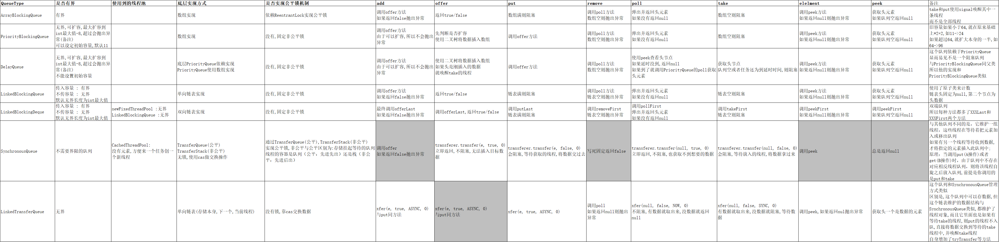

# Thread的构造函数
- 8个
- Thread Group

[toc]

# 守护线程
- 默认为非守护线程(setDaemon(false))
- 用来守护非守护线程,如果非守护线程已经结束,则守护线程也会跟着结束
- 不能在线程启动后再设置守护状态
- 注意线程是从哪个线程中创建的(因为默认会使用父线程的ThreadGroup)

# 线程优先级
- 一般不要设置


# join
A线程中调用B线程的join方法(B.join()),会让当前A线程等待B线程执行完毕后再执行

# 线程中断
- interrupt()方法用来主动打断线程
- isInterrupted()方法用来在线程内部判断是否已打断,如果打断执行打断后的逻辑
## 强制打断线程
```java
public class ThreadService {
    //执行线程
    private Thread executeThread;
    //线程是否已经终止
    private volatile boolean finished = false;
    //核心思想,不自己执行任务,而是让线程内部在创建一个线程去执行任务,内部线程是守护线程,由外部线程创建,
    //所以一旦外部线程结束,内部线程自动结束,即便内部线程现在在阻塞也会被终止
    public void execute(Runnable run){
        this.executeThread = new Thread(()->{

            Thread thread = new Thread(run);
            thread.setDaemon(true);
            thread.start();

            try {
                //让外部线程等待内部线程执行
                thread.join();
                //执行完毕后修改状态
                finished = true;
                System.out.println("执行完毕状态修改"+finished);
            } catch (InterruptedException e) {
                e.printStackTrace();
            }

        });
        //启动外部线程
        executeThread.start();
    }
    public void shutDown(long mills){
        long b = System.currentTimeMillis();
        while(!finished){
            long e = System.currentTimeMillis();
            if((e-b)>=mills){
                System.out.println("超时打断任务"+executeThread);
                //打断外部线程,使内部线程自动停止
                executeThread.interrupt();
                break;
            }
            //兼容main方法打断外部线程时使用
            try {
                executeThread.sleep(1);
            } catch (InterruptedException e1) {
                e1.printStackTrace();
                System.out.println("执行线程被打断");
                break;
            }
        }

    }
    //测试代码
    public static void main(String[] args) throws InterruptedException {
        ThreadService threadService = new ThreadService();
        threadService.execute(()->{
            try {
                Thread.currentThread().sleep(50000);
            } catch (InterruptedException e) {
                e.printStackTrace();
            }
        });
        threadService.shutDown(10000);
        System.out.println("mian");
    }
}
```


# 锁类型
- 类锁 
> 静态代码块中锁是类锁
- 对象锁
> this,或者Object对象

# 线程间通讯 
- notify(),wait()
> 生产者消费者,一个生产者和一个消费者可以用上面的方法,不会有问题,但是如果多个生产者,多个消费者,**就可能出现"假死"**(就是程序卡住了,但是有没有死锁,原因是大家全部都wait了,等待别人唤醒)
- notifyAll()
> 多个生产者,多个消费者,应该使用notifyAll()唤醒其他线程
```java
public class PAndC {
    //产品
    private int i = 0;
    //锁
    private final Object LOCK = new Object();
    //是否已生产
    private volatile boolean isP = false;
    public void product(){
        synchronized (LOCK) {
            while (isP) {

                try {
                    LOCK.wait();
                } catch (InterruptedException e) {
                    e.printStackTrace();
                }
            }
            i++;
            System.out.println(Thread.currentThread().getName() + "生产" + i);
            isP = true;
            LOCK.notifyAll();
        }
    }
    public void customer(){
        synchronized (LOCK){
            while (!isP){
                try {
                    LOCK.wait();
                } catch (InterruptedException e) {
                    e.printStackTrace();
                }
            }

            System.out.println(Thread.currentThread().getName()+"消费"+i);
            isP = false;

            LOCK.notifyAll();
        }
    }


    public static void main(String[] args) {
        PAndC pc = new PAndC();
        Arrays.asList("p1","p2","p3").stream().forEach(pName->{
            new Thread(()->{
                while (true){
                    pc.product();
                }
            },pName).start();
        });
        Arrays.asList("c1","c2").stream().forEach(cName->{
            new Thread(()->{
                while (true){
                    pc.customer();
                }
            },cName).start();
        });
    }
}
```


# wait和sleep的区别
1. sleep是线程的方法,wait是对象(Object)的方法
2. sleep不释放锁,wait会释放锁
3. sleep不需要监视器,但wait需要在监视器内调用
4. sleep不需要被唤醒,但wait需要被唤醒

# 自定义锁


# Runtime.getRuntime().addShutdownHook(Thread) 自定义钩子程序
- 这个方法的意思就是在jvm中增加一个关闭的钩子，当jvm关闭的时候，**会执行系统中已经设置的所有通过方法addShutdownHook添加的钩子**，当系统执行完这些钩子后，jvm才会关闭。所以这些钩子可以在jvm关闭的时候进行内存清理、对象销毁等操作
```java
public static void main(String[] args) {
    PAndC pc = new PAndC();
    Arrays.asList("p1","p2","p3").stream().forEach(pName->{
        new Thread(()->{
            while (true){
                pc.product();
            }
        },pName).start();
    });
    Arrays.asList("c1","c2").stream().forEach(cName->{
        new Thread(()->{
            while (true){
                pc.customer();
            }
        },cName).start();
    });

    Runtime.getRuntime().addShutdownHook(new Thread(()->{
        System.out.println("关闭资源操作,由于这个是新建一个线程来完成的,所以可以跟系统其它线程并行");
    }));

    System.exit(0);
}
```
# 外部捕获并处理异常信息
- new Thread().setUncaughtExceptionHandler();
```java
public static void main(String[] args) {
    Thread t = new Thread(() -> {
        try {
            Thread.currentThread().sleep(5000);
        } catch (InterruptedException e) {
            e.printStackTrace();
        }

        int a = 10 / 0;
    },"TName");
    t.start();

    //如果设置了这个对象,则线程不会再打印报错信息
    t.setUncaughtExceptionHandler( (thread, ex) -> {
        //thread 当前线程
        System.out.println(thread.getName());
        //ex 抛出的异常
        System.out.println(ex.getMessage());
    });
}
```

# 使用线程对象获取当前执行代码的堆栈信息
- new Thread().getStackTrace()
```java
//使用当前线程可以获取堆栈信息
Arrays.asList(thread.getStackTrace()).stream().forEach(c -> {
    Optional.of(c.getClassName()+"\t"+ c.getMethodName() +"\t"+ c.getLineNumber())
    .ifPresent(System.out::println);
});
```

# Thread Group


# 线程池
- 线程池中线程全部start,但是如果不满足条件就wait,等到别的执行完毕后在notify起来
- 任务放入 TASK\_QUEUE
- 线程放入 THREAD\_QUEUE
- 线程池初始化
- 初始化的时候先创建所有的线程放入THREAD\_QUEUE,将其全部启动起来,判断当前TASK\_QUEUE中是否有任务,没有就wait等待,有就执行任务
- 扩容:根据任务数和当前线程数来判断是否需要扩容(增加的线程放入THREAD\_QUEUE)
- 缩容:根据任务数和当前线程数来判断是否需要扩容(从THREAD\_QUEUE中删除线程[打断线程])
- 扩容缩容时需要写THREAD\_QUEUE对象,所以在扩容/缩容/销毁的时候需要将这个对象锁住,同理,在写TASK\_QUEUE的时候也需要锁住TASK\_QUEUE这个对象
- 销毁线程池,需要等待线程结束,然后再结束

```java
package com.pool;

import java.util.ArrayList;
import java.util.Iterator;
import java.util.LinkedList;
import java.util.List;
import java.util.concurrent.TimeUnit;
import java.util.concurrent.atomic.AtomicInteger;
import java.util.stream.IntStream;

/**
 * @program: com.pool
 * @description: MyThreadPool
 * @author: Mr.BULLET
 * @create: 2020-01-29 22:35
 * 一个线程池必备的要素:
 * 1. 任务队列
 * 2. 拒绝策略(抛出异常,直接丢弃,阻塞,放入临时队列)
 * 3. 初始化值
 * 4. 最大最小值
 * 5. 活跃数
 */
public class MyThreadPool extends Thread{
    //线程最大值
    private int max;
    private final static int INIT_MAX = 20;
    //线程最小值
    private int min;
    private final static int INIT_MIN = 10;
    //线程活跃数
    private int active;
    private final static int INIT_ACTIVE = 15;

    private int size;
    private int queueSize;
    //线程池销毁状态
    private volatile boolean destory;
    private DiscardPolicy discardPolicy;
    private final static int INIT_QUEUE_SIZE = 10;
    //任务队列
    private final static LinkedList<Runnable> TASK_QUEUE = new LinkedList<>();
    //线程队列
    private final static List<WorkTask> THREAD_QUEUE = new ArrayList<>();

    //默认的拒绝策略
    private final static DiscardPolicy INIT_DISCARD_POLICY = ()->{
        throw new DiscardException("MY_DISCARD_POLICY");
    };

    public MyThreadPool() {
        this(INIT_MIN,INIT_MAX,INIT_ACTIVE);
    }

    public MyThreadPool(int min,int max,int active) {
        this(min,max,active,INIT_QUEUE_SIZE,INIT_DISCARD_POLICY);
    }

    public MyThreadPool(int min,int max,int active,int queueSize,DiscardPolicy discardPolicy) {
        this.min = min;
        this.max = max;
        this.active = active;
        this.queueSize = queueSize;
        this.discardPolicy = discardPolicy;
        this.destory = false;
        this.init();
    }

    private static volatile AtomicInteger seq = new AtomicInteger(0);
    private final static String PREFIX = "MYTHREAD - ";
    private final static ThreadGroup THREAD_GROUP = new ThreadGroup("MyGroup");
    private void init() {
        //初始化为最小值
        for (int i = 0; i < min; i++) {
            this.createWorkTask();
        }
        this.size = min;
        //启动自己的线程,自己的这个线程用来检测线程活跃数
        this.setName("MY_POOL_LISTENER_THREAD");
        this.start();
    }
    private void createWorkTask(){
        WorkTask workTask = new WorkTask(THREAD_GROUP,PREFIX+getNextSeq());
        workTask.start();
        //启动后加入到线程队列
        THREAD_QUEUE.add(workTask);
    }

    private int getNextSeq(){
        return seq.addAndGet(1);
    }

    public int getSize() {
        return size;
    }

    public int getQueueSize() {
        return queueSize;
    }

    public boolean isDestory() {
        return destory;
    }

    public int getMax() {
        return max;
    }

    public int getMin() {
        return min;
    }

    public int getActive() {
        return active;
    }


    public void submit(Runnable run){
        if(this.destory){
            throw new IllegalStateException("pool is already down!!!!");
        }
        synchronized (TASK_QUEUE){
            if(TASK_QUEUE.size() > this.queueSize){
                try {
                    this.discardPolicy.discard();
                } catch (DiscardException e) {
                    e.printStackTrace();
                    return;
                }

            }
            TASK_QUEUE.addLast(run);
            TASK_QUEUE.notifyAll();
        }
    }

    //线程池停止
    public void shutdown() throws InterruptedException {
        while (!TASK_QUEUE.isEmpty()){
//            Thread.currentThread().sleep(1000);
            Thread.yield();
        }
        int size = this.THREAD_QUEUE.size();
        //停止线程的时候必须锁住 THREAD_QUEUE ,不让扩容和缩容影响
        synchronized (THREAD_QUEUE) {
            while (size > 0) {
                for (WorkTask workTask : THREAD_QUEUE) {
                    //只有在空闲的时候才会进入BLOCKED
                    if (workTask.taskStatus == TaskStatus.BLOCKED) {
                        //打断当前线程
                        workTask.interrupt();
                        //关闭当前线程
                        workTask.close();
                        size--;
                    } else {
//                        Thread.currentThread().sleep(1000);
                        Thread.yield();
                    }

                }
            }
        }
        this.destory = true;
        System.out.println("Pool is down!");
    }

    //线程池也是一个线程对象,重写run方法
    @Override
    public void run() {
        while (!destory){
            System.out.printf("POOL#MIN:%d,MAX:%d,ACTIVE:%d,CURRENT:%d,QUEUE_SIZE:%d\n",
                    this.min,this.max,this.active,this.size,TASK_QUEUE.size());
            try {
                Thread.sleep(100);
                //如果任务数大于活跃数阈值,且当前线程数小于活跃数阈值,就扩容一下
                if (TASK_QUEUE.size()>this.active && size < this.active){
                    for (int i = size; i < active; i++) {
                        this.createWorkTask();
                    }
                    System.out.println("=================The pool incremented!!!================");
                    this.size = active;
                }
                //如果任务数大于最大值,且当前线程数小于最大值,就扩容一下
                else if (TASK_QUEUE.size()>this.max && size < this.max){
                    for (int i = size; i < max; i++) {
                        this.createWorkTask();
                    }
                    System.out.println("=====================The pool MAXED!!!===================");
                    this.size = max;
                }
                //如果任务数小于活跃数阈值,且当前线程数大于活跃数阈值,就缩小一下
                else if (TASK_QUEUE.size()<this.active && size > this.active){
                    int s = size-active;
                    synchronized (THREAD_QUEUE){
                        Iterator<WorkTask> iterator = THREAD_QUEUE.iterator();
                        for(;iterator.hasNext();){
                            if(s<=0){
                                break;
                            }
                            WorkTask task = iterator.next();
                            if(task.taskStatus != TaskStatus.BLOCKED){
                                break;
                            }
                            task.close();
                            task.interrupt();
                            iterator.remove();
                            s--;
                            this.size--;
                        }
                    }
                    System.out.println("=================The pool released!!!=================");
                }
                //如果任务队列为空,且当前线程数大于最小值,就缩小为最小值
                else if(TASK_QUEUE.isEmpty() && size > min){
                    int s = size-min;
                    synchronized (THREAD_QUEUE){
                        Iterator<WorkTask> iterator = THREAD_QUEUE.iterator();
                        for(;iterator.hasNext();){
                            if(s<=0){
                                break;
                            }
                            WorkTask task = iterator.next();
                            if(task.taskStatus != TaskStatus.BLOCKED){
                                break;
                            }
                            task.close();
                            task.interrupt();
                            iterator.remove();
                            s--;
                            this.size--;
                        }
                    }
                    System.out.println("==============The pool reduce!!!=================");
                }

            } catch (InterruptedException e) {
                e.printStackTrace();
            }
        }


    }

    private enum TaskStatus {
        FREE,RUNNING,BLOCKED,DEAD
    }
    //拒绝异常
    public static class DiscardException extends RuntimeException{
        public DiscardException(String message) {
            super(message);
        }
    }

    //拒绝策略
    public interface DiscardPolicy{
        void discard() throws DiscardException;
    }


    //本身就是个线程对象 extends Thread
    private static class WorkTask extends Thread {
        private volatile TaskStatus taskStatus = TaskStatus.FREE;

        //复用父类构造函数
        public WorkTask(ThreadGroup group, String name) {
            super(group, name);
        }

        public TaskStatus getTaskStatus() {
            return taskStatus;
        }
        //关闭当前线程
        public void close() {
            this.taskStatus = TaskStatus.DEAD;
        }

        @Override
        public void run(){
            OUTER:
            while (this.taskStatus != TaskStatus.DEAD){
                Runnable runnable;
                synchronized (TASK_QUEUE){
                    while (TASK_QUEUE.isEmpty()){
                        try {
                            //修改状态为阻塞
                            this.taskStatus = TaskStatus.BLOCKED;
                            TASK_QUEUE.wait();
                        } catch (InterruptedException e) {
                            //如果被打断,需要跳转到外层while
                            break OUTER;
                        }
                    }
                    //移除并返回移除的对象
                    runnable = TASK_QUEUE.removeFirst();

                }
                //任务执行不需要被锁锁住
                if (runnable != null) {
                    this.taskStatus = TaskStatus.RUNNING;
                    runnable.run();
                    this.taskStatus = TaskStatus.FREE;
                }
            }
        }
    }

    public static void main(String[] args) {
        MyThreadPool pool = new MyThreadPool(1,10,5);
        IntStream.range(0,20).forEach(i->{
            pool.submit(()->{
                System.out.println(i + "\t" + Thread.currentThread().getName());
                try {
                    Thread.sleep(1000);
                } catch (InterruptedException e) {
                    e.printStackTrace();
                }
            });
        });
        try {
            Thread.sleep(5000);
            pool.shutdown();
        } catch (InterruptedException e) {
            e.printStackTrace();
        }

    }
}
```


# wait set 休息室
- 当线程中调用对象的wait()方法时,其实可以理解为是将当前线程放入到当前对象的wait set中
> 1. 所有对象都有一个wait set,用来存放调用了该对象wait方法之后进入block状态的线程
  2. 线程被notify之后不一定会立即执行
  3. 线程从notify唤醒的顺序不一定是进入的wait set的顺序(即不一定是FIFO)
```java
public class WaitSet {
    private static final Object LOCK = new Object();
    public static void main(String[] args) {
        IntStream.rangeClosed(1,10).forEach((i)->{
            new Thread(()->{
                synchronized (LOCK){
                    System.out.println(Thread.currentThread().getName()+"进入LOCK对象的休息室");
                    try {
                        LOCK.wait();
                    } catch (InterruptedException e) {
                        e.printStackTrace();
                    }
                    System.out.println(Thread.currentThread().getName()+"退出LOCK对象的休息室");
                }
            },"name"+i).start();
        });
        try {
            Thread.sleep(5000);
        } catch (InterruptedException e) {
            e.printStackTrace();
        }
        synchronized (LOCK){
            for (int i = 0; i <= 10; i++) {
                LOCK.notify();
                try {
                    Thread.sleep(1000);
                } catch (InterruptedException e) {
                    e.printStackTrace();
                }
            }
        }

    }
}
```
  
# volatile
- 保证单个指令原子性,无法保证多线程中的原子性
- 保证读写有序性
- 保证读写可见性
> 计算在CPU的寄存器中进行
  内存中存储ROM,RAM
  RAM : CPU缓存,电脑手机内存(断电后数据丢失)
  ROM : 固盘,U盘,手机存储空间(断电后数据依然在)
> 解决缓存一致性的问题
  1. 总线加锁 : 会降低CPU性能
  2. CPU缓存一致性协议(由Intel提出的MESI)  现在使用

- 原子性 : 对基本数据类型的变量赋值或者读取,能够保证原子性
> int a = 10      满足原子性
  int b = a       不满足,分两步,第一步读取a,第二步赋值b
  b++             不满足,分三步,第一步读取b,第二步add,第三步赋值b
  32位系统不能保证double和long的原子性
- 可见性
> 使用volitale保证可见性
- 有序性
> happens-before原则
  代码顺序执行,前面的代码先于后面代码执行
  unlock操作先于后一个加锁操作
  volitale的变量,对该变量的写操作必须发生在读操作之前


# 观察者模式


# 读写分离设计模式
- 减少竞争等待时间,能够提升线程效率
```java
/*读写锁*/
public class ReadWriteLock {
    //正在读的线程数
    private int readingNumber;
    //正在写的线程数
    private int writingNumber;
    //等待读的线程数
    private int waitReadNumber;
    //等待写的线程数
    private int waitWriteNumber;

    public synchronized void readLock(){
        //等待读的线程加一
        this.waitReadNumber++;
        try {
            //有线程正在写,就让出线程
            while (this.writingNumber > 0){
                this.wait();
            }
            //可以读了,正在读的线程数加一
            this.readingNumber++;
        } catch (InterruptedException e) {
            e.printStackTrace();
        }finally {
            //等待读的线程数减一
            this.waitReadNumber--;
        }
    }
    //不能直接调用解锁
    public synchronized void readUnLock(){
        //正在读的线程数减一
        this.readingNumber--;
        this.notifyAll();
    }
    public synchronized void writeLock(){
        //等待写的线程加一
        this.waitWriteNumber++;
        try {
            //有线程正在读或者正在写,就让出线程
            while (this.readingNumber > 0 || this.writingNumber > 0){
                this.wait();
            }
            //可以写了,正在写的线程数加一
            this.writingNumber++;
        } catch (InterruptedException e) {
            e.printStackTrace();
        }finally {
            //等待写的线程数减一
            this.waitWriteNumber--;
        }
    }
    //不能直接调用解锁
    public synchronized void writeUnLock(){
        //正在写的线程减一
        this.writingNumber--;
        this.notify();
    }
}
```
```java
/*测试对象*/
class ShareData{
    private final char[] buffer;
    private final ReadWriteLock LOCK = new ReadWriteLock();

    public ShareData(char[] buffer) {
        this.buffer = buffer;
        for (int i = 0; i < buffer.length; i++) {
            buffer[i] = '*';
        }
    }

    public char[] read (){
        try {
            LOCK.readLock();
            char[] newChar = new char[buffer.length];
            System.arraycopy(buffer,0,newChar,0,buffer.length);
            TimeUnit.MILLISECONDS.sleep(100);
            return newChar;
        } catch (Exception e) {
            e.printStackTrace();
        } finally {
            LOCK.readUnLock();
        }
        return null;
    }
    public void write (char c){
        try {
            LOCK.writeLock();
            for (int i = 0; i < buffer.length; i++) {
                buffer[i] = c;
            }
            TimeUnit.SECONDS.sleep(1);
        } catch (Exception e) {
            e.printStackTrace();
        } finally {
            LOCK.writeUnLock();
        }
    }

    /***  test  ***/
    public static void main(String[] args) {
        char[] buffer = new char[10];
        ShareData data = new ShareData(buffer);

        for (int i = 0; i < 5; i++) {
            Thread reader = new Thread(()->{
                while (true){
                    char[] read = data.read();
                    System.out.println("线程"+Thread.currentThread().getName()+"读取:"+String.valueOf(read));
                }
            });
            reader.start();
        }

        for (int i = 0; i < 3; i++) {
            Thread writer = new Thread(()->{
                int c = 97;
                while (true){
                    data.write((char)c);
                    System.out.println("线程"+Thread.currentThread().getName()+"写入:"+((char)c));
                    c++;
                }
            });
            writer.start();
        }
    }
}
```

# 不可变对象设计模式
- 不可变对象一定是线程安全的
    - final 标记后,不允许修改,没有写只有读,所以自然线程安全
    - 没有set方法,不能修改
    - 方法不允许被继承重写
    - String就是不可变对象
- 可变对象不一定线程不安全

# Future设计模式
```java
//类似凭据,等线程执行完后告诉我(done),之后调用我的get方法获取结果
public interface Future<T> {
    void done(T result);
    T get() throws InterruptedException;
}
```
```java
//子类实现
public class AsyncFuture<T> implements Future<T> {
    private volatile boolean done = false;
    private T result;
    @Override
    public T get() throws InterruptedException {
        synchronized (this){
            while (!done){
                this.wait();
            }
        }
        return result;
    }
    //用来通知我已经有结果了
    public void done(T result){
        synchronized (this){
            this.result = result;
            this.done = true;
            this.notifyAll();
        }
    }
}
```
```java
//将任务封装为一个方法,这个call类似于一个方法体的壳子
public interface FutureTask<T> {
    T call();
}
```
核心思想就是调用者调用封装好的call方法,异步返回来上面的Future对象,然后就可以调用Future对象了
```java
//调用者
public class FutureService<T> {
    /**
     * @author Mr.BULLET
     * 这个方法处理task,返回Future对象
     * 可以加入一个Consumer对象作为回调,这样我们无需主动get,而是在线程快要结束时可以主动通知出去消息
     */
    public Future<T> submit(FutureTask<T> task, final Consumer<T> consumer){
        AsyncFuture<T> asyncFuture = new AsyncFuture<T>();
        new Thread(()->{
            //调用方法
            T result = task.call();
            //执行完毕后通知Future对象
            asyncFuture.done(result);
            //执行完毕后主动执行某些回调函数
            consumer.accept(result);
        }).start();
        return asyncFuture;
    }

    public static void main(String[] args) {
        FutureService<String> service = new FutureService<>();
        Future<String> submit = service.submit(() -> {
            try {
                TimeUnit.SECONDS.sleep(5);
            } catch (InterruptedException e) {
                e.printStackTrace();
            }
            return "rrrrrr";
        },(r)->{
            System.out.println("主动告我"+r);
        });
        System.out.println("开始等待结果");
        try {
            String s = submit.get();
            System.out.println(s);
        } catch (InterruptedException e) {
            e.printStackTrace();
        }
    }
}
```

# Guarded Suspension模式
- guarded是“被保护着的”、“被防卫着的”意思，suspension则是“暂停”的意思。当现在并不适合马上执行某个操作时，**就要求想要执行该操作的线程等待**，这就是Guarded Suspension Pattern。
Guarded Suspension Pattern 会要求线程等候，以保障实例的安全性，其它类似的称呼还有guarded wait、spin lock等
- 做法就是增加一个队列用来存放数据,client放,server根据能力去取
```java
public class Request {
    private String sendValue;

    public Request(String sendValue) {
        this.sendValue = sendValue;
    }

    public String getSendValue() {
        return sendValue;
    }

    public void setSendValue(String sendValue) {
        this.sendValue = sendValue;
    }
}
```
```java
//核心,注意需要锁定资源queue
public class RequestQueue {
    private final LinkedList<Request> queue = new LinkedList();
    public Request getRequest(){
        synchronized (queue){
            while (queue.isEmpty()){
                try {
                    queue.wait();
                } catch (InterruptedException e) {
                    e.printStackTrace();
                }
            }
            return queue.removeFirst();
        }
    }
    public void putRequest(Request request){
        synchronized (queue){
            queue.addLast(request);
            queue.notifyAll();
        }
    }
    public int size(){
        return queue.size();
    }
}
```
```java
public class ClientThread extends Thread {
    public final RequestQueue queue;

    private String sendValue;

    public ClientThread(RequestQueue queue,String sendValue){
        this.queue = queue;
        this.sendValue = sendValue;
    }

    @Override
    public void run() {
        for (int i = 0; i < 10000; i++) {
            System.out.println("runing...");
            queue.putRequest(new Request(sendValue));
            System.out.println("send :"+sendValue);
        }
    }

}
```
```java
public class ServerThread extends Thread {
    private final RequestQueue queue;
    public ServerThread(RequestQueue queue){
        this.queue = queue;
    }

    @Override
    public void run() {

        while (true){
            Request request = queue.getRequest();
            System.out.println("server handle : "+request.getSendValue() + "   " + queue.size());
            try {
                TimeUnit.SECONDS.sleep(1);
            } catch (InterruptedException e) {
                e.printStackTrace();
            }
        }
    }
}
```
```java
    //test
    public static void main(String[] args) {
        RequestQueue queue = new RequestQueue();
        new ClientThread(queue,"sned1").start();
        new ServerThread(queue).start();
    }
```

# LocalThread


# balking
- 障碍,当现在不适合这个操作，或是没有必要进行这个操作时就直接放弃这个操作而回去。这个就是Balking模式
```java
public class MyFile {
    private String name;
    private String content;
    private volatile boolean changed;

    public MyFile(String name, String content) {
        this.name = name;
        this.content = content;
        this.changed = false;
    }


    public synchronized void changeFile(String content){
        this.content = content;
        this.changed = true;
    }


    public void save(){
        //此处体现balking
        if(!changed){
            return;
        }
        System.out.println("saved");
        this.changed = false;
    }
}
```

# 生产者消费者模式


# count down 设计模式 
```java
public class MyCountDown {
    private final int total;

    private int countor;

    public MyCountDown(int total) {
        this.total = total;
    }
    public void down(){
        synchronized (this){
            this.countor++;
            this.notifyAll();
        }
    }
    public void await(){
        synchronized (this) {
            while (countor != total) {
                try {
                    this.wait();
                } catch (InterruptedException e) {
                    e.printStackTrace();
                }
            }
        }
    }
}
```
以下两种方法均不影响子线程继续执行,只是放行了主线程
使用countdownlatch如何保证子线程陷入死循环,主线程还能继续跑1
```java
public class Test {
    public static void main(String[] args) {
        CountDownLatch c = new CountDownLatch(1);
        Thread cur = Thread.currentThread();


        new Thread(()->{
            try {
                //第一种打断线程的方式,使用主线程在当前线程中调用interrupt()方法
                //原因:因为现在不是我当前线程执行不动了,而是主线程c.await();了,所以这里打断的不是自己
                //而是主线程的await(),可以查看异常,是从await方法中抛出的
                //打断了主线程的block状态,才能让主线程继续执行
                cur.interrupt();
                TimeUnit.SECONDS.sleep(10);
                System.out.println("执行完毕");
            } catch (InterruptedException e) {
                e.printStackTrace();
            }
        }).start();

        try {
            c.await();
        } catch (InterruptedException e) {
            e.printStackTrace();
        }
        System.out.println("程序结束");
    }
}
```
使用countdownlatch如何保证子线程陷入死循环,主线程还能继续跑2
```java
public class Test {
    public static void main(String[] args) throws InterruptedException {
        CountDownLatch c = new CountDownLatch(1);
        Thread cur = Thread.currentThread();


        new Thread(()->{
            try {
                TimeUnit.SECONDS.sleep(10);
                System.out.println("执行完毕");
            } catch (InterruptedException e) {
                e.printStackTrace();
            }
        }).start();
        //只等待1s
        c.await(1,TimeUnit.SECONDS);
        System.out.println("程序结束");
    }
}
```


# per thread 设计模式
- 一个请求开辟一个新线程

# two phase termination 设计模式
```java
public class CounterIncream extends Thread{
    private volatile boolean terminated = false;

    private int count = 0 ;
    @Override
    public void run() {
        try {
            while (!terminated){
                System.out.println(Thread.currentThread().getName()+" : "+ count++);
                TimeUnit.MILLISECONDS.sleep(500);
            }
        } catch (InterruptedException e) {
            e.printStackTrace();
        } finally {
            //二段处理的核心思想就是在finally里
            //上面是第一段处理过程,不论正常执行还是出现异常,都会走二段finally来执行第二段逻辑
            this.clean();
        }

    }

    private void clean() {
        System.out.println(Thread.currentThread().getName()+" : two phase .");
    }

    public void close(){
        this.terminated = true;
        this.interrupt();
    }

    public static void main(String[] args) {
        CounterIncream counterIncream = new CounterIncream();
        counterIncream.start();
        try {
            Thread.sleep(5000);
        } catch (InterruptedException e) {
            e.printStackTrace();
        }
        counterIncream.close();

    }
}
```

# work thread 设计模式
- Work Thread模式和Thread-Per-Message模式类似，Thread-Per-Message每次都创建一个新的线程处理请求，而Work Thread模式预先会创建一个线程池（Thread Pool），每次从线程池中取出线程处理请求
```java
public class Channel {
    private final static int MAX_REQUEST = 100;
    //队列
    private final Request[] queue;

    //队头
    private int head;
    //队尾
    private int tail;
    //工作个数
    private int count;
    //工作线程池
    private final WorkThread[] workPool;


    public Channel(int workers) {
        this.queue = new Request[MAX_REQUEST];
        this.workPool = new WorkThread[workers];
        this.head = 0;
        this.tail = 0;
        this.count = 0;
        this.init();
    }

    private void init() {
        for (int i = 0; i < workPool.length; i++) {
            workPool[i] = new WorkThread("work"+i,this);
        }
    }


    public void start(){
        Arrays.asList(workPool).forEach((workThread)->{
            workThread.start();
        });
    }

    public synchronized void put(Request req){
        if(count >= queue.length){
            try {
                this.wait();
            } catch (InterruptedException e) {
                e.printStackTrace();
            }
        }

        this.queue[tail] = req;
        this.tail = (this.tail+1) % queue.length;
        this.count++;
        this.notifyAll();
    }

    public synchronized Request take(){
        while (this.count <= 0){
            try {
                this.wait();
            } catch (InterruptedException e) {
                e.printStackTrace();
            }
        }
        this.count--;
        Request head = this.queue[this.head];
        this.head = (this.head+1)% queue.length;
        this.notifyAll();
        return head;
    }
}
```

# Active Objects(太复杂)
- Active Object模式通过将方法的调用与执行分离，实现了异步编程。有利于提高并发性，从而提高系统的吞吐率。
- 接受异步消息的主动方法
> 1.Client（委托者）
Client角色调用ActiveObject角色的方法来委托处理，在示例程序中是MakerClinetThread类和DisplayClientThread类。

> 2.ActiveObject（主动对象）
ActiveObject定义了主动对象向Client提供的接口，在示例程序中是ActiveObject接口类。

> 3.Proxy（代理人）
Proxy负责将方法调用转换为MethodRequest角色的对象。在示例程序中，是Proxy类。

> 4.Scheduler
Scheduler负责将Proxy角色传递来的MethodRequest传给ActivationQueue角色，在示例程序中，是SchedulerThread类。

> 5.MethodRequest
是与来自Client角色的请求对应的角色，在示例程序中，是MethodRequest类。

> 6.ConcreteMethodRequest
ConcreteMethodRequest是使MethodRequest与具体的方法相对应的角色，在示例程序中是MakeStringRequest类和DisplayStringRequest类。

> 7.Servant（仆人）
Servant负责实际的处理请求，是示例程序中的Servant类。

> 8.ActivationQueue（主动列队）
ActivationQueue保存MethodRequest角色的类，是示例程序中的ActivationQueue类。

> 9.VirtualResult（虚拟结果）
VirtualResult与Future、RealResult角色共同构成了Future模式。是示例程序中的Result类。

> 10.Future（期货）
Future是Client在获取处理结果时实际调用的角色，是示例程序中的FutureResult类。

> 11.RealResult（真实结果）
RealResult表示处理结果的角色，Servant角色会创建一个RealResult角色作为处理结果，然后调用Future角色的setRealResult方法将其设置到Future角色中。是示例程序中的RealResult类


# AtomicInteger
- 使用volitale标记int value
- 使用UnSafe保证线程安全


# AtomicReferenceFieldUpdater
- 原子更新器
- 这是一个基于反射的工具类，它能对指定类的【指定的volatile引用字段】进行【原子更新】。(注意这个字段不能是private的,但是在当前类中使用 AtomicReferenceFieldUpdater 是允许属性是 private 的) ,简单理解：就是对某个类中，被volatile修饰的字段进行原子更新。
> 使用场景
    希望类的属性具备原子操作
    不希望使用显式锁或者 synchronized
    大量属性需要用到原子操作(自己写volatile太麻烦,而且浪费内存,就可以借助这个工具类),比如 ConcurrentSkipListMap(jdk1.6,1.8用unsafe,oracle 1.9把unsafe干掉了), BufferedInputStream
```java
public class MyDemo {
    private volatile String name;

    private AtomicReferenceFieldUpdater<MyDemo,String> updater = AtomicReferenceFieldUpdater.newUpdater(MyDemo.class,String.class,"name");

    public String getName() {
        return name;
    }

    public void setName(String newName) {
        updater.compareAndSet(this,this.name,newName);
    }

}
public class Test {
    public static void main(String[] args) {
        MyDemo demo = new MyDemo();
        demo.setName("张三");
        System.out.println(demo.getName());
        demo.setName("李四");
        System.out.println(demo.getName());
    }
}
```


# UnSafe
- 在1.9被干掉了
- 使用unsafe实现线程安全的自增
```java
//计数接口
public interface Counter {
    void increment();
    long getCount();
}
//计数子类
public class UnSafeCASCounter implements Counter {
    private volatile long count = 0;
    private Unsafe unsafe;
    private long offset;

    public UnSafeCASCounter() throws NoSuchFieldException {
        this.unsafe = getUnSafe();
        this.offset = unsafe.objectFieldOffset(UnSafeCASCounter.class.getDeclaredField("count"));
    }
    //通过反射获取UnSafe
    public static Unsafe getUnSafe(){
        try {
            Field theUnsafe = Unsafe.class.getDeclaredField("theUnsafe");
            theUnsafe.setAccessible(true);
            Object o = theUnsafe.get(null);
            return (Unsafe) o;
        } catch (NoSuchFieldException e) {
            e.printStackTrace();
        } catch (IllegalAccessException e) {
            e.printStackTrace();
        }
        return null;
    }

    @Override
    public void increment() {
        long cur = count;
        while (!unsafe.compareAndSwapLong(this,offset,cur,cur+1)){
            //赋值失败,需要重新赋值,所以将cur再赋值为当前的count
            cur = count;
        }
    }

    @Override
    public long getCount() {
        return count;
    }
}

//线程类
public class CounterRunnable implements Runnable{
    private final Counter counter;
    private final int num;

    public CounterRunnable(Counter counter, int num) {
        this.counter = counter;
        this.num = num;
    }

    @Override
    public void run() {
        for (int i = 0; i < num; i++) {
            counter.increment();
        }
    }
}
//测试类
public class UnSafeTest {
    public static void main(String[] args) throws NoSuchFieldException {
        ExecutorService service = Executors.newFixedThreadPool(100);
        Counter counter = new UnSafeCASCounter();
        long begin = Clock.systemDefaultZone().millis();
        for (int i = 0; i < 100; i++) {
            service.submit(new CounterRunnable(counter,100000));
        }
        service.shutdown();
        try {
            service.awaitTermination(1, TimeUnit.HOURS);
        } catch (InterruptedException e) {
            e.printStackTrace();
        }
        long end = Clock.systemDefaultZone().millis();
        System.out.println( (end-begin)+"   "+counter.getCount());
    }

}
```
- 使用UnSafe实例化对象
```java
public class UnSafeNewInstance {
    public static void main(String[] args) throws InstantiationException {
//        Demo demo = new Demo();
//        System.out.println(demo.getI());

        Unsafe unSafe = getUnSafe();
        //这种方式会绕过构造器,所以不会打印  "初始化了"
        Demo o = (Demo)unSafe.allocateInstance(Demo.class);
        //未经过初始化,所以是0
        System.out.println(o.getI());
        //有自己的类对象
        System.out.println(o.getClass());
        //会被AppClassLoader加载
        System.out.println(o.getClass().getClassLoader());
    }
    //通过反射获取UnSafe
    public static Unsafe getUnSafe(){
        try {
            Field theUnsafe = Unsafe.class.getDeclaredField("theUnsafe");
            theUnsafe.setAccessible(true);
            Object o = theUnsafe.get(null);
            return (Unsafe) o;
        } catch (NoSuchFieldException e) {
            e.printStackTrace();
        } catch (IllegalAccessException e) {
            e.printStackTrace();
        }
        return null;
    }
}
class Demo{
    private int i;

    public Demo() {
        System.out.println("初始化了");
        this.i = 1;
    }

    public int getI() {
        return i;
    }
}
```


# CyclicBarrier 循环屏障
```java
public class CyclicBarrierTest {
    public static void main(String[] args) {
        //每个部分互相等待
        CyclicBarrier cyclicBarrier = new CyclicBarrier(3);

        new Thread(()->{
            System.out.println("begin  1");
            try {
                TimeUnit.SECONDS.sleep(1);
                cyclicBarrier.await();
            } catch (InterruptedException e) {
                e.printStackTrace();
            } catch (BrokenBarrierException e) {
                e.printStackTrace();
            }
            System.out.println("end  1");
        }).start();
        new Thread(()->{
            System.out.println("begin  2");
            try {
                TimeUnit.SECONDS.sleep(10);
                cyclicBarrier.await();
            } catch (InterruptedException e) {
                e.printStackTrace();
            } catch (BrokenBarrierException e) {
                e.printStackTrace();
            }
            System.out.println("end  2");
        }).start();

        try {
            cyclicBarrier.await();
            System.out.println("程序结束");
        } catch (InterruptedException e) {
            e.printStackTrace();
        } catch (BrokenBarrierException e) {
            e.printStackTrace();
        }

    }
}
```
还可以通过回调函数通知
区别是,上面方法主线程是屏障中的参与者,所以是和2个线程同时运行的
    回调方法是会保证自己先执行完毕,才会放行2个线程
```java
public class CyclicBarrierTest {
    public static void main(String[] args) {
        //每个部分互相等待
        CyclicBarrier cyclicBarrier = new CyclicBarrier(2,()->{
            try {
                TimeUnit.SECONDS.sleep(10);
            } catch (InterruptedException e) {
                e.printStackTrace();
            }
            //这句话没输出之前,两个线程还在阻塞状态,未被唤醒
            System.out.println("程序结束");
        });

        new Thread(()->{
            System.out.println("begin  1");
            try {
                TimeUnit.SECONDS.sleep(1);
                cyclicBarrier.await();
            } catch (InterruptedException e) {
                e.printStackTrace();
            } catch (BrokenBarrierException e) {
                e.printStackTrace();
            }
            System.out.println("end  1");
        }).start();
        new Thread(()->{
            System.out.println("begin  2");
            try {
                TimeUnit.SECONDS.sleep(10);
                cyclicBarrier.await();
            } catch (InterruptedException e) {
                e.printStackTrace();
            } catch (BrokenBarrierException e) {
                e.printStackTrace();
            }
            System.out.println("end  2");
        }).start();

    }
}
```
> CL不能reset,CB可以重置
  CL工作线程之间没有关系,使用场景,卡住所有线程必须等到同一个点才去执行某个工作(所有线程先跑,跑完后通知主线程,主线程再开始跑)
  CB工作线程之间有关系,互相等待,等到所有线程就位,再开始各干各的工作(比如多条线程先await,然后所有人就位,再开始跑自己的任务)

# Exchager
- 两个线程交换数据,应当成对出现,才能互相发送接收数据,如果是奇数,会有线程一直阻塞,可以使用超时机制
- 注意:交换的数据是同一个对象,所以一方操作数据,会影响另一方的数据
```java
public class ExchagerTest {
    public static void main(String[] args) {
        Exchanger exchanger = new Exchanger();

        new Thread(()->{
            try {
                TimeUnit.SECONDS.sleep(5);
                Object a = exchanger.exchange("aaaaaaaaa",10,TimeUnit.SECONDS);
                System.out.println(Thread.currentThread().getName()+"接到"+a);
            } catch (InterruptedException e) {
                e.printStackTrace();
            } catch (TimeoutException e) {
                e.printStackTrace();
            }
        },"A").start();
        new Thread(()->{
            try {
                TimeUnit.SECONDS.sleep(1);
                Object a = exchanger.exchange("bbbbbbbb",10,TimeUnit.SECONDS);
                System.out.println(Thread.currentThread().getName()+"接到"+a);
            } catch (InterruptedException e) {
                e.printStackTrace();
            } catch (TimeoutException e) {
                e.printStackTrace();
            }
        },"B").start();
        new Thread(()->{
            try {
                TimeUnit.SECONDS.sleep(2);
                Object a = exchanger.exchange("ccccc",10,TimeUnit.SECONDS);
                System.out.println(Thread.currentThread().getName()+"接到"+a);
            } catch (InterruptedException e) {
                e.printStackTrace();
            } catch (TimeoutException e) {
                e.printStackTrace();
            }
        },"C").start();

    }
}
```


# Semaphore
- 和CountDownLatch一样,内部都使用了Sync对象,此对象继承自AQS(AbstractQueuedSynchronizer)
- 简单使用
```java
public class SemaphoreLock {
    Semaphore semaphore = new Semaphore(1);
    public void lock(){
        try {
            semaphore.acquire();
        } catch (InterruptedException e) {
            e.printStackTrace();
        }
    }

    public void unLock(){
        semaphore.release();
    }
}
```
- 构造函数
> Semaphore(int permits) 构造函数,permits初始许可证数量,默认非公平
  Semaphore(int permits, boolean fair)  构造函数,permits初始许可证数量,fair是否公平
- 常用方法
> acquire()  获取一个许可证
  acquire(int permits)   获取指定个数许可证
  注意由于获取许可证时如果剩余许可证数量不足,以上两个方法都会进入wait set,可以使用interupt打断,以下方法不会被打断
  acquireUninterruptibly() 获取一个许可证,不会被打断
  acquireUninterruptibly(int permits)  获取指定个数许可证,不会被打断
  availablePermits() 获取剩余的许可证数量,估计值
  getQueueLength()   获取等待队列长度,估计值
  release()  释放一个许可证
  release(int permits) 释放指定个数许可证
  drainPermits()   获取并返回所有立即可用的许可证
  isFair()  是否公平锁
  tryAcquire()   尝试获取一个许可证,获取不到立马返回false,不会进入 wait set
  tryAcquire(int permits)  尝试获取指定个数许可证,获取不到立马返回false,不会进入 wait set
  tryAcquire(long timeout, TimeUnit unit) 尝试获取一个许可证,指定时间内获取不到立马返回false,不会进入 wait set
  tryAcquire(int permits, long timeout, TimeUnit unit)  尝试获取指定个数许可证,指定时间内获取不到立马返回false,不会进入 wait set

# ReentrantLock  可重入锁
- jdk中的独占锁(也称排他锁)有:synchronized和ReentrantLock.虽然在性能上ReentrantLock和synchronized没有什么区别，但ReentrantLock相比synchronized而言功能更加丰富，使用起来更为灵活，也更适合复杂的并发场景。
> 相同点: 2者都是可重入且排他的
  不同点: ReentrantLock可以实现公平锁,ReentrantLock可响应中断,获取锁时可以限时等待(tryXXXX)

- 可以与Condition配合使用
- 注意 condition 对象调用 await 和 signalAll 方法时必须在持有lock的状态下,否则报IllegalMonitorStateException异常
```java
public class ReentrantLockTest {
    //类似于 synchronized
    private static final ReentrantLock reentrantLock = new ReentrantLock();
    //类似于 wait notify 功能
    private static final Condition MY_CONDITION = reentrantLock.newCondition();

    //是否已经生产
    private static AtomicBoolean flag = new AtomicBoolean(false);
    public static void produce(){
        try {
            reentrantLock.lock(); // sync begin
            while (flag.get()){
                MY_CONDITION.await(); // wait
            }
            System.out.println(Thread.currentThread().getName()+"  producing");
            flag.compareAndSet(false,true);
            MY_CONDITION.signalAll();    // notifyAll
        } catch (InterruptedException e) {
            e.printStackTrace();
        } finally {
            reentrantLock.unlock();  //sync end
        }
    }
    public static void take(){
        try {
            reentrantLock.lock(); // sync begin
            while (!flag.get()){
                MY_CONDITION.await(); // wait
            }
            System.out.println(Thread.currentThread().getName()+"  taking");
            flag.compareAndSet(true,false);
            MY_CONDITION.signalAll();    // notifyAll
        } catch (InterruptedException e) {
            e.printStackTrace();
        } finally {
            reentrantLock.unlock();  //sync end
        }
    }

    public static void main(String[] args) {
        ReentrantLockTest test = new ReentrantLockTest();
        for (int i = 0; i < 5; i++) {
            new Thread(()->{
                test.produce();
            }).start();
        }
        for (int i = 0; i < 5; i++) {
            new Thread(()->{
                test.take();
            }).start();
        }

    }
}
```


# ReentrantReadWriteLock 可重入读写锁
- jdk中的共享锁有: ReentrantReadWriteLock ,共享锁是指该锁可被多个线程所持有。如果线程T对数据A加上共享锁后，则其他线程只能对A再加共享锁，不能加排它锁。获得共享锁的线程只能读数据，不能修改数据。 独享锁与共享锁也是通过AQS来实现的，通过实现不同的方法，来实现独享或者共享。
```java
public class ReadwritelockTest {

    private final static ReentrantReadWriteLock reentrantReadWriteLock = new ReentrantReadWriteLock();
    //从同一个对象中获取读锁和写锁
    private final static Lock readLock = reentrantReadWriteLock.readLock();
    private final static Lock writeLock = reentrantReadWriteLock.writeLock();
    //独占
    public void read(){
        try {
            readLock.lock();
        } finally {
            readLock.unlock();
        }
    }
    //可共享
    public void write(){
        try {
            writeLock.lock();
        } finally {
            writeLock.unlock();
        }
    }
}
```


# StempedLock
- jdk1.8开始的
- 是对读写锁 ReentrantReadWriteLock 的增强，该类提供了一些功能，优化了读锁、写锁的访问，同时使读写锁之间可以互相转换，更细粒度控制并发
- 增加原因是,比如在读线程非常多，写线程很少的情况下，ReentrantReadWriteLock很容易导致写线程“饥饿”，虽然使用“公平”策略可以一定程度上缓解这个问题，但是“公平”策略是以牺牲系统吞吐量为代价的
- 该类的设计初衷是作为一个内部工具类，用于辅助开发其它线程安全组件，用得好，该类可以提升系统性能，用不好，容易产生死锁和其它莫名其妙的问题
- 依据LockSupport为基础,独立的一个锁
- StampedLocks 是不可重入锁(如果一个线程已经持有了写锁，再去获取写锁的话就会造成死锁),ReentrantReadWriteLock 是可重入锁
- 允许读写锁转换
```java
public class StampedLockTest {
    private static final StampedLock LOCK = new StampedLock();

    private static final List<Long> DATA = new ArrayList<>();

    public static void read(){
//        long stemp = -1;
//        try {
//            stemp = LOCK.readLock();
//            String collect = DATA.stream().map(String::valueOf).collect(Collectors.joining("#", "R-", ""));
//            System.out.println(collect);
//            TimeUnit.SECONDS.sleep(1);
//        } catch (InterruptedException e) {
//            e.printStackTrace();
//        } finally {
//            LOCK.unlockRead(stemp);
//        }
        //乐观锁实现方案
        long stemp = LOCK.tryOptimisticRead();
        if(LOCK.validate(stemp)){
            try {
                stemp = LOCK.readLock();
                String collect = DATA.stream().map(String::valueOf).collect(Collectors.joining("#", "R-", ""));
                System.out.println(collect);
                TimeUnit.SECONDS.sleep(1);
            } catch (InterruptedException e) {
                e.printStackTrace();
            } finally {
                LOCK.unlockRead(stemp);
            }
        }
    }


    public static void write(){
        long stemp = -1;
        try {
            stemp = LOCK.writeLock();
            long millis = Clock.systemDefaultZone().millis();
            DATA.add(millis);
            System.out.println("正在写..."+millis);
            TimeUnit.SECONDS.sleep(5);
        } catch (InterruptedException e) {
            e.printStackTrace();
        } finally {
            LOCK.unlockWrite(stemp);
        }
    }

    public static void main(String[] args) {
        ExecutorService executorService = Executors.newFixedThreadPool(10);
        Runnable read = ()->{
            while (true)
                read();
        };
        Runnable write = ()->{
            while (true)
                write();
        };
        for (int i = 0; i < 6; i++) {
            executorService.submit(read);
        }
        executorService.submit(write);
    }
}
```


# fork/join框架---分而治之
- ForkJoinPool是ExecutorService的实现类，因此是一种特殊的线程池。ForkJoinPool提供了如下两个常用的构造器。
    - public ForkJoinPool(int parallelism)：创建一个包含parallelism个并行线程的ForkJoinPool
    - public ForkJoinPool() ：以Runtime.getRuntime().availableProcessors()的返回值作为parallelism来创建ForkJoinPool
- 实例化好ForkJoinPool对象后,可以调用submit方法,传入ForkJoinTask对象来作为任务,ForkJoinTask有两个子抽象类
    - RecursiveTask  代表有返回值的任务
    - RecursiveAction  代表没有返回值的任务
- RecursiveTask
```java
public class RecursiveTaskTest {
    private static final int MAX_THRESHOLD = 10;

    //定义静态内部类,可获取外部类属性
    private static class CalculateRecursiveTask extends RecursiveTask<Integer> {
        private final int start ;
        private final int end ;
        public CalculateRecursiveTask(int start, int end) {
            this.start = start;
            this.end = end;
            System.out.printf("%d - %d\n",start,end);
        }
        @Override
        protected Integer compute() {

            if(end - start <= MAX_THRESHOLD){
                return IntStream.rangeClosed(start,end).sum();
            }
            int i = (start + end) / 2;


            CalculateRecursiveTask calculateRecursiveTask1 = new CalculateRecursiveTask(start,i);
            CalculateRecursiveTask calculateRecursiveTask2 = new CalculateRecursiveTask(i+1,end);
            calculateRecursiveTask1.fork();
            calculateRecursiveTask2.fork();
            return calculateRecursiveTask1.join()+calculateRecursiveTask2.join();
        }
    }

    public static void main(String[] args) {
        //需要使用ForkJoinPool进行调度
        ForkJoinPool forkJoinPool = new ForkJoinPool();
        ForkJoinTask<Integer> submit = forkJoinPool.submit(new CalculateRecursiveTask(1, 100));
        try {
            Integer integer = submit.get();
            System.out.println(integer);
        } catch (InterruptedException e) {
            e.printStackTrace();
        } catch (ExecutionException e) {
            e.printStackTrace();
        }
    }
}
```
- RecursiveAction
```java
public class RecursiveActionTest {
    private static final int MAX_THRESHOLD = 5;
    private static final AtomicInteger SUM = new AtomicInteger(0);

    //定义静态内部类,可获取外部类属性
    private static class CalculateActionTask extends RecursiveAction {
        private final int start ;
        private final int end ;
        public CalculateActionTask(int start, int end) {
            this.start = start;
            this.end = end;
        }
        @Override
        protected void compute() {

            if(end - start <= MAX_THRESHOLD){
                SUM.addAndGet(IntStream.rangeClosed(start,end).sum());
                //此处处理完逻辑一定要打断方法继续执行
                return;
            }
            int i = (start + end) / 2;


            CalculateActionTask calculateRecursiveTask1 = new CalculateActionTask(start,i);
            CalculateActionTask calculateRecursiveTask2 = new CalculateActionTask(i+1,end);
            calculateRecursiveTask1.fork();
            calculateRecursiveTask2.fork();
        }
    }

    public static void main(String[] args) {
        int i = Runtime.getRuntime().availableProcessors();
        //需要使用ForkJoinPool进行调度
        ForkJoinPool forkJoinPool = new ForkJoinPool();
        forkJoinPool.submit(new CalculateActionTask(1, 1000));

        for (;;){
            System.out.println(SUM.get());
            try {
                TimeUnit.SECONDS.sleep(1);
            } catch (InterruptedException e) {
                e.printStackTrace();
            }
        }

    }
}
```

# Phaser 相位器
- 一种可重用的同步屏障，在功能上类似于CyclicBarrier和countdownloct，但支持更灵活的使用。能够灵活的增加参与线程与灵活的退出线程
- 注册与取消注册。与其他屏障不同，在移相器上注册同步的参与方数量可能会随时间而变化。任务可以在任何时候注册（使用方法register、bulkRegister或建立初始参与方数量的构造函数形式），并且可以在任何到达时（使用arriveAndDeregister）选择性地取消注册。与大多数基本同步结构一样，注册和注销只影响内部计数；它们不建立任何进一步的内部记帐，因此任务无法查询它们是否已注册。（但是，您可以通过**子类继承**这个类来引入这样的簿记。
- 同步。像周期载波一样，相位载波可能会被反复等待。方法arriveandwaitadvance的作用类似于CyclicBarrier.await。相位器的每一代都有一个相关的相位号。相位号从零开始，当所有方到达相位器时，相位号前进，在达到Integer.MAX_值后返回到零。相位号的使用可以通过任何注册方可以调用的两种方法，在到达相位器和等待其他相位器时对动作进行独立控制：
    - 抵达。方法到达并到达并注销记录到达。这些方法不阻塞，但返回一个相关的到达相位号；即，应用到达的相位器的相位号。当给定阶段的最终参与方到达时，将执行可选操作，并且阶段前进。这些动作由触发相位提前的一方执行，并通过onAdvance（int，int）上的重写方法安排，后者还控制终止。重写此方法类似于但比为CyclicBarrier提供屏障操作更灵活。
    - 等待。方法awaidadvance需要一个表示到达阶段号的参数，并在移相器进入（或已经进入）另一个阶段时返回。与使用CyclicBarrier的类似构造不同，即使等待线程被中断，方法awaitAdvance也会继续等待。可中断和超时版本也可用，但任务以中断方式等待或超时时遇到的异常不会更改相位器的状态。如果需要，您可以在这些异常的处理程序中执行任何相关的恢复，通常在调用
- 强制终止。在ForkJoinPool中执行的任务也可以使用phaser，这将确保在其他任务被阻塞等待一个阶段前进时有足够的并行性来执行任务。
- 可以使用相位器代替倒计时锁来控制为可变数量的参与方服务的一次动作。典型的习惯用法是将其设置为首先注册，然后启动操作，然后取消注册，如下所示：
```java
 void runTasks(List<Runnable> tasks) {
   final Phaser phaser = new Phaser(1); // "1" to register self
   // create and start threads
   for (final Runnable task : tasks) {
     phaser.register();
     new Thread() {
       public void run() {
         phaser.arriveAndAwaitAdvance(); // await all creation
         task.run();
       }
     }.start();
   }

   // allow threads to start and deregister self
   phaser.arriveAndDeregister();
 }
 ```
- 一种使一组线程在给定的迭代次数内重复执行操作的方法是重写一个通知
```java
 void startTasks(List<Runnable> tasks, final int iterations) {
   final Phaser phaser = new Phaser() {
     protected boolean onAdvance(int phase, int registeredParties) {
       return phase >= iterations || registeredParties == 0;
     }
   };
   phaser.register();
   for (final Runnable task : tasks) {
     phaser.register();
     new Thread() {
       public void run() {
         do {
           task.run();
           phaser.arriveAndAwaitAdvance();
         } while (!phaser.isTerminated());
       }
     }.start();
   }
   phaser.arriveAndDeregister(); // deregister self, don't wait
 }
 ```
- 如果主任务稍后必须等待终止，则它可以重新注册，然后执行类似的循环
```java
   // ...
   phaser.register();
   while (!phaser.isTerminated())
     phaser.arriveAndAwaitAdvance();
```
- 相关的构造可用于等待特定的相位号，在这种情况下，您可以确定相位永远不会环绕Integer.MAX_值
```java 
 void awaitPhase(Phaser phaser, int phase) {
   int p = phaser.register(); // assumes caller not already registered
   while (p < phase) {
     if (phaser.isTerminated())
       // ... deal with unexpected termination
     else
       p = phaser.arriveAndAwaitAdvance();
   }
   phaser.arriveAndDeregister();
 }
```
- 每相器任务的最佳值主要取决于预期的同步速率。一个低至4的值可能适合于每个阶段非常小的任务体（因此高比率），或者对于非常大的任务体高达数百。实施说明：本次实施将缔约方的最大数量限制在65535个。试图注册其他方会导致非法状态异常。但是，您可以也应该创建分层相位器，以容纳任意大的参与者集
- 自己的例子
```java
public class PhaserTest {
    public static void main(String[] args) {
        //一般用法,不必创建子类,直接声明即可
        final Phaser phaser = new Phaser(){
            @Override
            protected boolean onAdvance(int phase, int registeredParties) {
                System.out.println("只有此阶段最后一个任务执行完毕后才调用,多个线程调用一次");
                System.out.println(Thread.currentThread().getName()+"调用了");
                return super.onAdvance(phase, registeredParties);
            }
        };
        //注册主线程,用来保证统一执行完毕
        phaser.register();
        IntStream.rangeClosed(1,5).forEach((i)->{
            MyTask task = new MyTask(phaser);
            task.start();
        });
        //这个方法有阻塞效果
        phaser.arriveAndAwaitAdvance();
        System.out.println("全部执行完毕了");
        //这个方法不会阻塞
        phaser.arriveAndDeregister();

    }
}
class MyTask extends Thread{
    private Phaser phaser ;

    public MyTask(Phaser phaser) {
        this.phaser = phaser;
        phaser.register();
    }

    @Override
    public void run() {

        System.out.println(getName()+"正在执行任务");
        try {
            TimeUnit.SECONDS.sleep(1);
        } catch (InterruptedException e) {
            e.printStackTrace();
        }
        System.out.println(getName()+"执行完毕...");
        phaser.arriveAndAwaitAdvance(); //这里相当于CountDownLatch.await()
    }
}
```
- 线程灵活退出
```java
public class PhaserTest {
    public static void main(String[] args) {
        //一般用法,不必创建子类,直接声明即可
        final Phaser phaser = new Phaser(){
            @Override
            protected boolean onAdvance(int phase, int registeredParties) {
                System.out.printf("phase %d,registeredParties %d\t",phase,registeredParties);
                System.out.println("只有此阶段最后一个任务执行完毕后才调用,不论当前线程是成功执行完毕,还是抛出异常都会调用,多个线程调用一次");
                System.out.println(Thread.currentThread().getName()+"调用了");
                return super.onAdvance(phase, registeredParties);
            }
        };
        //注册主线程,用来保证统一执行完毕
        phaser.register();
        IntStream.rangeClosed(1,5).forEach((i)->{
            MyTask task = new MyTask(phaser);
            task.start();
        });
        ErrorTask errorTask = new ErrorTask(phaser);
        errorTask.start();
        //这个方法有阻塞效果
        phaser.arriveAndAwaitAdvance();
        phaser.arriveAndAwaitAdvance();
        phaser.arriveAndAwaitAdvance();
        System.out.println("全部执行完毕了");
        //这个方法不会阻塞
        phaser.arriveAndDeregister();

    }
}
class MyTask extends Thread{
    private Phaser phaser ;

    public MyTask(Phaser phaser) {
        this.phaser = phaser;
        phaser.register();
    }

    @Override
    public void run() {

        try {
            System.out.println(getName()+"正在执行任务1");
            TimeUnit.SECONDS.sleep(1);
            System.out.println(getName()+"执行完毕...");
            phaser.arriveAndAwaitAdvance(); //这里相当于CountDownLatch.await()
            System.out.println(getName()+"正在执行任务2");
            TimeUnit.SECONDS.sleep(1);
            System.out.println(getName()+"执行完毕...");
            phaser.arriveAndAwaitAdvance(); //这里相当于CountDownLatch.await()
            System.out.println(getName()+"正在执行任务3");
            TimeUnit.SECONDS.sleep(1);
            System.out.println(getName()+"执行完毕...");
            phaser.arriveAndAwaitAdvance(); //这里相当于CountDownLatch.await()
        } catch (InterruptedException e) {
            e.printStackTrace();
        }
    }
}
class ErrorTask extends Thread{
    private Phaser phaser ;

    public ErrorTask(Phaser phaser) {
        this.phaser = phaser;
        phaser.register();
    }

    @Override
    public void run() {

        try {
            System.out.println(getName()+"正在执行任务1");
            TimeUnit.SECONDS.sleep(1);
            System.out.println(getName()+"执行完毕...");
            phaser.arriveAndAwaitAdvance(); //这里相当于CountDownLatch.await()
            System.out.println(getName()+"正在执行任务2");
            TimeUnit.SECONDS.sleep(1);
            throw new InterruptedException(getName()+"不行了,我线程被打断了,抛出异常");
        } catch (InterruptedException e) {
            e.printStackTrace();
            //被打断后的线程应当退出phaser的管理,否则参与线程没有全部到达同一个阶段,其他正常线程还会一直等待
            phaser.arriveAndDeregister();
        }
    }
}
```
- 常见用法一:一个阶段跑完跑另一个阶段
```java
public class PhaserTest {
    public static void main(String[] args) {
        //一般用法,不必创建子类,直接声明即可
        final Phaser phaser = new Phaser(){
            @Override
            protected boolean onAdvance(int phase, int registeredParties) {
                System.out.printf("phase阶段 %d,registeredParties参与线程数 %d\n",phase,registeredParties);
                System.out.printf("当前阶段完成了几个线程 %d\n",this.getArrivedParties());
                System.out.printf("当前阶段没完成了几个线程 %d\n",this.getUnarrivedParties());
                System.out.println("只有此阶段最后一个任务执行完毕后才调用,不论当前线程是成功执行完毕,还是抛出异常都会调用,多个线程调用一次");
                System.out.println(Thread.currentThread().getName()+"调用了");
                //此处返回false,相当于终止了,可以使用phaser.isTerminated获取phaser状态
                return super.onAdvance(phase, registeredParties);
            }
        };
        //注册主线程,用来保证统一执行完毕
        phaser.register();
        IntStream.rangeClosed(1,5).forEach((i)->{
            MyTask task = new MyTask(phaser);
            task.start();
        });
        ErrorTask errorTask = new ErrorTask(phaser);
        errorTask.start();
        //这个方法有阻塞效果
        phaser.arriveAndAwaitAdvance();
        phaser.arriveAndAwaitAdvance();
        phaser.arriveAndAwaitAdvance();
        System.out.println("全部执行完毕了");
        //这个方法不会阻塞
        phaser.arriveAndDeregister();

    }
}
class MyTask extends Thread{
    private Phaser phaser ;

    public MyTask(Phaser phaser) {
        this.phaser = phaser;
        //相当于单独增加一个参与者
        // 一个线程 Thread-0  记录一个参与者 1,但是这两者之前没有联系,
        // 线程 Thread-1 不注册,直接调用arriveAndAwaitAdvance()方法,也能让这个phaser的计数器减一
        // 所以我们可以不用register()注册,使用构造器注册也行 Phaser phaser = new Phaser(10);
        // 或者,另外批量注册 phaser.bulkRegister(10);
        phaser.register();
    }

    @Override
    public void run() {

        try {
            System.out.println(getName()+"正在执行任务1");
            TimeUnit.SECONDS.sleep(1);
            System.out.println(getName()+"执行完毕...");
            phaser.arriveAndAwaitAdvance(); //这里相当于CountDownLatch.await()
            System.out.println(getName()+"正在执行任务2");
            TimeUnit.SECONDS.sleep(1);
            System.out.println(getName()+"执行完毕...");
            phaser.arriveAndAwaitAdvance(); //这里相当于CountDownLatch.await()
            System.out.println(getName()+"正在执行任务3");
            TimeUnit.SECONDS.sleep(1);
            System.out.println(getName()+"执行完毕...");
            phaser.arriveAndAwaitAdvance(); //这里相当于CountDownLatch.await()
        } catch (InterruptedException e) {
            e.printStackTrace();
        }
    }
}
class ErrorTask extends Thread{
    private Phaser phaser ;

    public ErrorTask(Phaser phaser) {
        this.phaser = phaser;
        phaser.register();
    }

    @Override
    public void run() {

        try {
            System.out.println(getName()+"正在执行任务1");
            TimeUnit.SECONDS.sleep(1);
            System.out.println(getName()+"执行完毕...");
            phaser.arriveAndAwaitAdvance(); //这里相当于CountDownLatch.await()
            System.out.println(getName()+"正在执行任务2");
            TimeUnit.SECONDS.sleep(1);
            throw new InterruptedException(getName()+"不行了,我线程被打断了,抛出异常");
        } catch (InterruptedException e) {
            e.printStackTrace();
            //被打断后的线程应当退出phaser的管理,否则参与线程没有全部到达同一个阶段,其他正常线程还会一直等待
//            phaser.arriveAndDeregister();
        }
    }
}
```
- 常见用法二:只关心其中第一/二个阶段跑完,后面的任务不关心
```java
public class PhaserTest {
    public static void main(String[] args) {
        //一般用法,不必创建子类,直接声明即可
        final Phaser phaser = new Phaser(){
            @Override
            protected boolean onAdvance(int phase, int registeredParties) {
                System.out.printf("phase阶段 %d,registeredParties参与线程数 %d\n",phase,registeredParties);
                System.out.printf("当前阶段完成了几个线程 %d\n",this.getArrivedParties());
                System.out.printf("当前阶段没完成了几个线程 %d\n",this.getUnarrivedParties());
                System.out.println("只有此阶段最后一个任务执行完毕后才调用,不论当前线程是成功执行完毕,还是抛出异常都会调用,多个线程调用一次");
                System.out.println(Thread.currentThread().getName()+"调用了");
                //此处返回false,相当于终止了,可以使用phaser.isTerminated获取phaser状态
                return super.onAdvance(phase, registeredParties);
            }
        };
        //注册主线程,用来保证统一执行完毕
        phaser.register();
        IntStream.rangeClosed(1,5).forEach((i)->{
            MyTask task = new MyTask(phaser);
            task.start();
        });
        //这个方法有阻塞效果
        phaser.arriveAndAwaitAdvance();
        try {
            TimeUnit.SECONDS.sleep(5);
        } catch (InterruptedException e) {
            e.printStackTrace();
        }
        phaser.arriveAndAwaitAdvance();
        System.out.println("全部执行完毕了");
        //这个方法不会阻塞
        phaser.arriveAndDeregister();

    }
}
class MyTask extends Thread{
    private Phaser phaser ;
    public MyTask(Phaser phaser) {
        this.phaser = phaser;
        //相当于单独增加一个参与者
        // 一个线程 Thread-0  记录一个参与者 1,但是这两者之前没有联系,
        // 线程 Thread-1 不注册,直接调用arriveAndAwaitAdvance()方法,也能让这个phaser的计数器减一
        // 所以我们可以不用register()注册,使用构造器注册也行 Phaser phaser = new Phaser(10);
        // 或者,另外批量注册 phaser.bulkRegister(10);
        phaser.register();
    }
    @Override
    public void run() {
        try {
            System.out.println(getName()+"正在执行任务1");
            TimeUnit.SECONDS.sleep(1);
            System.out.println(getName()+"执行完毕...");
            phaser.arriveAndAwaitAdvance(); //这里相当于CountDownLatch.await()
            System.out.println(getName()+"正在执行任务2");
            TimeUnit.SECONDS.sleep(1);
            System.out.println(getName()+"执行完毕...");
            //重点:这里通知了任务完成,但不阻塞后面任务继续执行
            phaser.arrive(); //这里无阻塞


            System.out.println(getName()+"正在执行任务3");
            TimeUnit.SECONDS.sleep(1);
            System.out.println(getName()+"执行完毕...");
        } catch (InterruptedException e) {
            e.printStackTrace();
        }
    }
}
```
- 不必作为参与者,也可以实现类似CountDownLatch的功能  
> phaser.awaitAdvance(0);判断依据是你传入的阶段是否等于当前阶段,等于->阻塞,不等于->直接放行,不阻塞
```java
public class Test {
    public static void main(String[] args) {
        //两个参与者
        final Phaser phaser = new Phaser(2);
        IntStream.rangeClosed(1,2).boxed().forEach((i)->{
            new Thread(()->{
                try {
                    TimeUnit.SECONDS.sleep(1);
                    System.out.println(Thread.currentThread().getName()+"1结束了");
                    //2个参与者同时完成了任务
                    phaser.arriveAndAwaitAdvance();
                    TimeUnit.SECONDS.sleep(1);
                    System.out.println(Thread.currentThread().getName()+"2结束了");
                    //2个参与者同时完成了任务
                    phaser.arriveAndAwaitAdvance();
                    TimeUnit.SECONDS.sleep(1);
                    System.out.println(Thread.currentThread().getName()+"3结束了");
                    //2个参与者同时完成了任务
                    phaser.arriveAndAwaitAdvance();
                } catch (InterruptedException e) {
                    e.printStackTrace();
                }
            }).start();
        });
        //这个不是参与者,等待第一阶段完毕后,我执行我的任务,我只是个旁观者
        //这句代码不会增加或者减少参与者个数,所以也不用注册,类似于旁观者,等待某个阶段后执行任务
        //但是阻塞还是不阻塞不是准确的,他判断依据是你传入的阶段是否等于当前阶段,等于就阻塞住,之后放开
        //不等于,比如在前在后,都不会阻塞任务继续执行
        phaser.awaitAdvance(2);//这时阻塞不住,因为现在的阶段是0  0!=2
        System.out.println("阻塞不住");
        phaser.awaitAdvance(phaser.getPhase());
        System.out.println("================");
    }
}
```
- 打断线程等待
> phaser.awaitAdvanceInterruptibly(phaser.getPhase());
```java
public class Test {
    public static void main(String[] args) {
        //两个参与者
        final Phaser phaser = new Phaser(2);
        //但只提供一个参与者
        Thread thread = new Thread(() -> {
            try {
                TimeUnit.SECONDS.sleep(1);
                System.out.println(Thread.currentThread().getName() + "1结束了");
//                phaser.arriveAndAwaitAdvance();  // 打不断
                phaser.awaitAdvanceInterruptibly(phaser.getPhase());  //可以打断
            } catch (InterruptedException e) {
                e.printStackTrace();
            }
        });
        thread.start();

        System.out.println("================");
        try {
            TimeUnit.SECONDS.sleep(10);
        } catch (InterruptedException e) {
            e.printStackTrace();
        }
        thread.interrupt();
        System.out.println("打断了");
    }
}
```
- 结束 Phaser
```java
public class Test {
    public static void main(String[] args) {
        //两个参与者
        final Phaser phaser = new Phaser(2);
        //但只提供一个参与者
        Thread thread = new Thread(() -> {
            try {
                TimeUnit.SECONDS.sleep(1);
                System.out.println(Thread.currentThread().getName() + "1结束了");
                phaser.arriveAndAwaitAdvance();  // 打不断
            } catch (InterruptedException e) {
                e.printStackTrace();
            }
        });
        thread.start();

        System.out.println("================");
        try {
            TimeUnit.SECONDS.sleep(5);
        } catch (InterruptedException e) {
            e.printStackTrace();
        }
        //强制结束所有的线程
        phaser.forceTermination();
        System.out.println(phaser.isTerminated());
    }
}
```

# Executors 框架
- 用于此包中定义的Executor、ExecutorService、ScheduledExecutorService、ThreadFactory和可调用类的工厂和实用程序方法
- 线程池有个定义,如果队列中任务未满,即使能开辟新线程,也不会开辟新线程去执行任务的,所以不建议直接使用一下4种线程池(orkStealingPool除外),自定义还有个好处就是能定义线程池名字,方便监控
- 线程池执行流程 : 调用submit,scheduleWithFixedDelay之类的方法,传入任务,将任务加入队列,同时调用addWorker方法,这里添加的worker其实是一个线程,内部逻辑就是将worker和Thread绑定,将任务传入worker中,然后启动线程
- WorkStealingPool 可以窃取任务,所以会有线程可以抢占执行别的任务,会乱序打印01234,但是WorkStealingPool在构造线程池工厂的时候会设置所有线程为守护线程,所以主线程停止,这个线程池就死掉了
    ```java
    ThreadPoolExecutor executor = new ThreadPoolExecutor(
            1, //corePoolSize
            100, //maximumPoolSize
            100, //keepAliveTime
            TimeUnit.SECONDS, //unit
            new LinkedBlockingDeque<>(100));//workQueue

    for (int i = 0; i < 5; i++) {
        final int taskIndex = i;
        executor.execute(() -> {
            System.out.println(taskIndex);
            try {
                Thread.sleep(Long.MAX_VALUE);
            } catch (InterruptedException e) {
                e.printStackTrace();
            }
        });
    }
    // 输出: 0,因为队列未满,不开辟新线程,第一个任务sleep中,第二个也不能执行
    ```
## ThreadPoolExecutor
- 参数解释
> corePoolSize : 即使它们处于空闲状态也要保留在池中的线程数，除非设置了allowCoreThreadTimeOut=true,使用allowCoreThreadTimeOut时必须设置keepAliveTime>0,否则报错
>  maximumPoolSize : 池中允许的最大线程数
>  keepAliveTime : 当线程数大于核心时，这是多余空闲线程最大存活时间
>  unit : keepAliveTime参数的时间单位
>  workQueue : 在执行任务之前用于保存任务的队列。此队列将仅包含execute方法提交的可运行任务。
>  thread factory : 执行器创建新线程时要使用的工厂
>  handler : 丢弃策略.在执行被阻止时使用的处理程序，因为已达到线程边界和队列容量, ThreadPoolExecutor类的内部类
- 简单使用
```java
public class ThreadPoolExecutorTest {
    public static void main(String[] args) {
        ThreadPoolExecutor executor =
                new ThreadPoolExecutor(1,
                2,
                5,
                TimeUnit.SECONDS,
                new ArrayBlockingQueue<>(1),
                new ThreadFactory(){
                    @Override
                    public Thread newThread(Runnable r) {
                        return new Thread(r);
                    }
                },
                new ThreadPoolExecutor.AbortPolicy());
        System.out.println("the threadpool builded");


        Thread listener = new Thread(() -> {
            while (true) {
                System.out.println("========================================");
                System.out.println("executor.getActiveCount() = " + executor.getActiveCount());
                System.out.println("executor.getCorePoolSize() = " + executor.getCorePoolSize());
                System.out.println("executor.getQueue().size() = " + executor.getQueue().size());
                System.out.println("executor.getMaximumPoolSize() = " + executor.getMaximumPoolSize());
                try {
                    TimeUnit.SECONDS.sleep(1);
                } catch (InterruptedException e) {
                    e.printStackTrace();
                }
            }
        });
        //设置为守护线程,主线程跑完他也不执行了
        listener.setDaemon(true);
        listener.start();

        //任务提交时会阻塞
        for (int i = 0; i < 10; i++) {
            try {
                executor.execute(()->{
                    try {
                        TimeUnit.SECONDS.sleep(10);
                        System.out.println(Thread.currentThread().getName()+"完了");
                    } catch (InterruptedException e) {
                        e.printStackTrace();
                    }
                });
            } catch (Exception e) {
                e.printStackTrace();
            }
        }
        System.out.println("任务提交完毕");

        try {
            executor.shutdown();
            executor.awaitTermination(1,TimeUnit.HOURS);
        } catch (InterruptedException e) {
            e.printStackTrace();
        }
        System.out.println("线程池结束");
    }
}
```
- shutdown() 和 shutdownNow()区别
> shutdown只是将线程池的状态设置为SHUTWDOWN状态，正在执行的任务会继续执行下去，没有被执行的则中断,不会尝试打断任务。
> 而shutdownNow则是将线程池的状态设置为STOP，正在执行的任务能被打断则被停止，不能打断的线程依然在执行,没被执行任务(在QUEUE中的)的则返回。执行中被打断的任务不会返回
> 一般配合awaitTermination(1,TimeUnit.HOURS) 方法使用

## CachedThreadPool
- 构造器
```java
new ThreadPoolExecutor(0, Integer.MAX_VALUE,60L, TimeUnit.SECONDS,new SynchronousQueue<Runnable>());
```
>  使用0个核心线程数 : 所有超过60s没使用的线程会被回收
>  创建的最大线程数 : 为Integer.MAX_VALUE
>  使用的Queue : SynchronousQueue,SynchronousQueue是一个内部只能包含一个元素的队列。插入元素到队列的线程被阻塞，直到另一个线程从队列中获取了队列中存储的元素.同样，如果线程尝试获取元素并且当前不存在任何元素，则该线程将被阻塞，直到线程将元素插入队列。
>  使用默认线程工厂
>  使用默认丢弃策略 : AbortPolicy,拒绝时抛出异常
>> ```所以这个队列特点就是进来一个任务,其他任务都得阻塞,但是CachedThreadPool可以无限开线程,所以马上这个任务被处理,然后新任务才能进来,让下一个线程处理```


- SynchronousQueue 的使用
```java
public static void main(String[] args) throws InterruptedException {
    SynchronousQueue queue = new SynchronousQueue();
    AtomicInteger c = new AtomicInteger();
    new Thread(()->{
        while (true) {
            try {
                //不生产不获取
                TimeUnit.SECONDS.sleep(10);
                System.out.println("生产...."+c.get());
                queue.put(c.get());
                c.incrementAndGet();
            } catch (InterruptedException e) {
                e.printStackTrace();
            }
        }
    }).start();
    new Thread(()->{
        while (true) {
            try {
                //不获取不生产
                //TimeUnit.SECONDS.sleep(10);
                Object take = queue.take();
                System.out.println("获取"+take);
            } catch (InterruptedException e) {
                e.printStackTrace();
            }
        }
    }).start();
}
```
## FixedThreadPool
- 构造器
```java
new ThreadPoolExecutor(nThreads, nThreads, 0L, TimeUnit.MILLISECONDS,new LinkedBlockingQueue<Runnable>());
```
> 使用n个核心线程数和n个最大线程数 : 两者相等,不会被回收
>  超过n个的线程会在1毫秒内被回收,也不可能超过,最大值限定死了
>  使用的Queue : LinkedBlockingQueue,LinkedBlockingQueue不指定容量,默认为Integer.MAX_VALUE,算是个无界队列.当前执行的线程数量达到corePoolSize的数量时，剩余的元素会在阻塞队列里等待。每个线程完全独立于其他线程。生产者和消费者使用独立的锁来控制数据的同步，即在高并发的情况下可以并行操作队列中的数据
>  使用默认线程工厂
>  使用默认丢弃策略 : AbortPolicy,拒绝时抛出异常
```java
    public static void main(String[] args) {
        ThreadPoolExecutor executor = (ThreadPoolExecutor)Executors.newFixedThreadPool();
        System.out.println("the threadpool builded");
        Thread listener = new Thread(() -> {
           while (true) {
               System.out.println("========================================");
               System.out.println("executor.getActiveCount() = " + executor.getActiveCount());
               System.out.println("executor.getCorePoolSize() = " + executor.getCorePoolSize());
               System.out.println("executor.getQueue().size() = " + executor.getQueue().size());
               System.out.println("executor.getMaximumPoolSize() = " + executor.getMaximumPoolSize());
               try {
                   TimeUnit.SECONDS.sleep(1);
               } catch (InterruptedException e) {
                   e.printStackTrace();
               }
           }
        });
       //设置为守护线程,主线程跑完他也不执行了
       listener.setDaemon(true);
       listener.start();

        //任务提交时会阻塞
        for (int i = 0; i < 1000; i++) {
            try {
                executor.execute(()->{
                    try {
                        TimeUnit.SECONDS.sleep(1);
                        System.out.println(Thread.currentThread().getName()+"完了");
                    } catch (InterruptedException e) {
                        e.printStackTrace();
                    }
                });
            } catch (Exception e) {
                e.printStackTrace();
            }
        }
        System.out.println("任务提交完毕");

        try {
            executor.shutdown();
            executor.awaitTermination(1,TimeUnit.HOURS);
        } catch (InterruptedException e) {
            e.printStackTrace();
        }
        System.out.println("线程池结束");
    }
```

## SingleThreadExecutor
- FixedThreadPool的单线程版,newSingleThreadExecutor()等价于newFixedThreadPool(1)
- 在 ThreadPoolExecutor 外面又包了一层 FinalizableDelegatedExecutorService 所以ThreadPoolExecutor各种方法都无法调用了,相当于做了一层屏障(牛逼)
- 构造器
```java
new ThreadPoolExecutor(1, 1, 0L, TimeUnit.MILLISECONDS, new LinkedBlockingQueue<Runnable>())
```
> 使用1个核心线程数和1个最大线程数 : 所以线程就只有一个,也不会被回收
>  超过n个的线程会在1毫秒内被回收,也不可能超过,最大值限定死了
>  使用的Queue : LinkedBlockingQueue,LinkedBlockingQueue不指定容量,默认为Integer.MAX_VALUE,算是个无界队列.当前执行的线程数量达到corePoolSize的数量时，剩余的元素会在阻塞队列里等待。每个线程完全独立于其他线程。生产者和消费者使用独立的锁来控制数据的同步，即在高并发的情况下可以并行操作队列中的数据
>  使用默认线程工厂
>  使用默认丢弃策略 : AbortPolicy,拒绝时抛出异常
```java
public class ExecutorsTest {
    public static void main(String[] args) {
        ExecutorService executor = Executors.newSingleThreadExecutor();
        System.out.println("the threadpool builded");
        //监控方法都不能用了
//        Thread listener = new Thread(() -> {
//            while (true) {
//                System.out.println("========================================");
//                System.out.println("executor.getActiveCount() = " + executor.getActiveCount());
//                System.out.println("executor.getCorePoolSize() = " + executor.getCorePoolSize());
//                System.out.println("executor.getQueue().size() = " + executor.getQueue().size());
//                System.out.println("executor.getMaximumPoolSize() = " + executor.getMaximumPoolSize());
//                try {
//                    TimeUnit.SECONDS.sleep(1);
//                } catch (InterruptedException e) {
//                    e.printStackTrace();
//                }
//            }
//        });
//        //设置为守护线程,主线程跑完他也不执行了
//        listener.setDaemon(true);
//        listener.start();

        //任务提交时会阻塞
        for (int i = 0; i < 1000; i++) {
            try {
                executor.execute(()->{
                    try {
                        TimeUnit.SECONDS.sleep(1);
                        System.out.println(Thread.currentThread().getName()+"完了");
                    } catch (InterruptedException e) {
                        e.printStackTrace();
                    }
                });
            } catch (Exception e) {
                e.printStackTrace();
            }
        }
        System.out.println("任务提交完毕");

        try {
            executor.shutdown();
            executor.awaitTermination(1,TimeUnit.HOURS);
        } catch (InterruptedException e) {
            e.printStackTrace();
        }
        System.out.println("线程池结束");
    }
}
```
## WorkStealingPool
- jdk1.8中新增，使用的不是 ThreadPoolExecutor 线程池,而是 ForkJoinPool 
- java7中的fork/join task 和 java8中的并行stream都是基于ForkJoinPool。
- `工作窃取`属于算法，一种思想和套路，并不是特定语言特有的东西，所以不同的语言对应的实现也不尽一样，但核心思想一致
- 工作窃取核心思想是，自己的活干完了去看看别人有没有没干完的活，如果有就拿过来帮他干。
- 大多数实现机制是：为每个线程分配一个双端队列(本地队列)用于存放需要执行的任务，当自己的队列没有数据的时候从其它工作者队列中获得一个任务继续执行,一般是自己的本地队列采取LIFO(后进先出)，偷取时采用FIFO(先进先出)，一个从头开始执行，一个从尾部开始执行，由于偷取的动作十分快速，会大量降低这种冲突，也是一种优化方式
- WorkStealingPool在构造时,会通过线程池工厂来获取线程,而这个线程池工厂返回的ForkJoinWorkerThread都是被设置成**守护线程**的对象,所以主线程死了,这个线程池也跟着停止了
  ```java
    //构造器
    protected ForkJoinWorkerThread(ForkJoinPool pool) {
        // Use a placeholder until a useful name can be set in registerWorker
        super("aForkJoinWorkerThread");
        this.pool = pool;
        this.workQueue = pool.registerWorker(this);
    }
    //registerWorker方法
    final WorkQueue registerWorker(ForkJoinWorkerThread wt) {
        UncaughtExceptionHandler handler;
        //进来就先设置了一下守护线程
        wt.setDaemon(true);                           // configure thread
        ...
    }
  ```
- 构造器
```java
ForkJoinPool(int parallelism, ForkJoinWorkerThreadFactory factory, UncaughtExceptionHandler handler, boolean asyncMode)
//无参构造
public static ExecutorService newWorkStealingPool() {
    return new ForkJoinPool
        (Runtime.getRuntime().availableProcessors(),
            ForkJoinPool.defaultForkJoinWorkerThreadFactory,
            null, true);
}
//带参构造
public static ExecutorService newWorkStealingPool(int parallelism) {
    return new ForkJoinPool
        (parallelism,
            ForkJoinPool.defaultForkJoinWorkerThreadFactory,
            null, true);
}
```
>  parallelism : 并行级别,同一时刻可以并发的线程数,也可以理解为此pool创建的线程数。对于默认值，使用 java.lang.Runtime#availableProcessors
>  factory : 创建新线程的工厂。对于默认值，使用 defaultForkJoinWorkerThreadFactory
>  handler : 内部工作线程的处理程序,处理由于执行时遇到不可恢复的错误而终止任务。对于默认值，使用null。
>  asyncMode : 如果为true，在本地以先进先出的调度模式来fork从未加入的任务。对于默认值，请使用false
>  对于无参构造 : 使用系统的线程数,默认工厂,不设置异常处理器,以先进先出的方式fork任务
>  对于有参构造 : 使用指定的线程数,默认工厂,不设置异常处理器,以先进先出的方式fork任务

## ExecutorService 常用方法
- shutDown/isShutDown : 调用shutDown方法后isShutDown返回true,之后不在允许execute新任务,当前未完成的任务依然执行,线程池没有终止,isTerminated依然返回false,isTerminating方法返回true
- invokeAny(Collection<? extends Callable<T>> tasks) : 方法会阻塞,集合中的任务哪个先执行完,就返回哪个任务的结果,其他任务会在当前执行到的位置被cancel,如果无法cancel,会继续向下执行,只是拿不到结果
- invokeAny(Collection<? extends Callable<T>> tasks,long timeout, TimeUnit unit) : 方法会阻塞,在指定时间内获取结果,获取不到会抛出TimeoutException,其他线程会被cancel,如果无法cancel,会继续向下执行,只是拿不到结果
```java
public class Test {
    public static void main(String[] args) {
        ExecutorService executor = new ThreadPoolExecutor(1, 100,
                0L, TimeUnit.MILLISECONDS,
                new LinkedBlockingQueue<Runnable>());
        List<Callable<Integer>> list = new ArrayList<>();
        list.add(() -> {
            boolean b = true;
            TimeUnit.SECONDS.sleep(10);
            System.out.println(1);
            return 1;
        });
        list.add(() -> {
            TimeUnit.SECONDS.sleep(10);
            System.out.println(2);
            return 2;
        });
        list.add(() -> {
            boolean b = true;
            TimeUnit.SECONDS.sleep(10);
            System.out.println(3);
            return 3;
        });
        try {
            Integer integer = executor.invokeAny(list,1,TimeUnit.SECONDS);
            System.out.println("\t\t\t"+integer);
            System.out.println("出来了");
        } catch (InterruptedException e) {
            e.printStackTrace();
        } catch (ExecutionException e) {
            e.printStackTrace();
        } catch (TimeoutException e) {
            e.printStackTrace();
        }
        executor.shutdown();
        System.out.println(executor.isShutdown());
        System.out.println(executor.isTerminated());
        System.out.println(((ThreadPoolExecutor) executor).isTerminating());
    }
}
```
- invokeAll(Collection<? extends Callable<T>> tasks) : 方法会阻塞,执行全部任务
- invokeAll(Collection<? extends Callable<T>> tasks, long timeout, TimeUnit unit) : 方法会阻塞,执行全部任务,在指定时间内获取结果,获取不到会抛出CancellationException
```java
public class Test {
    public static void main(String[] args) {
        ExecutorService executor = new ThreadPoolExecutor(1, 100,
                0L, TimeUnit.MILLISECONDS,
                new LinkedBlockingQueue<Runnable>());

        List<Callable<Integer>> list = new ArrayList<>();
        list.add(() -> {
            boolean b = true;
            TimeUnit.SECONDS.sleep(5);
            System.out.println(1);
            return 1;
        });
        list.add(() -> {
            TimeUnit.SECONDS.sleep(10);
            System.out.println(2);
            return 2;
        });
        list.add(() -> {
            boolean b = true;
            TimeUnit.SECONDS.sleep(10);
            System.out.println(3);
            return 3;
        });
        try {
            List<Future<Integer>> integer = executor.invokeAll(list,10,TimeUnit.SECONDS);
            System.out.println("11");
            for (int i = 0; i < integer.size(); i++) {
                System.out.println(integer.get(i).get());
            }
            System.out.println("出来了");
        } catch (InterruptedException e) {
            e.printStackTrace();
        } catch (ExecutionException e) {
            e.printStackTrace();
        }
        while (true){
            try {
                System.out.println(executor);
                TimeUnit.SECONDS.sleep(1);
            } catch (InterruptedException e) {
                e.printStackTrace();
            }
        }
        executor.shutdown();
        System.out.println(executor.isShutdown());
        System.out.println(executor.isTerminated());
        System.out.println(((ThreadPoolExecutor) executor).isTerminating());
    }
}
```
- submit(Runnable task) : 异步执行方法,执行完毕后返回Future对象,但是因为传入的是Runnable,所以返回为 NULL
```java
public class Test {
    public static void main(String[] args) {
        ExecutorService executor = new ThreadPoolExecutor(1, 100,
                0L, TimeUnit.MILLISECONDS,
                new LinkedBlockingQueue<Runnable>());
        Future<?> runnable = executor.submit(() -> {
            System.out.println("runnable");
        });
        try {
            //虽然返回了Future对象,但是因为传入的是Runnable,所以返回为 NULL
            Object o = runnable.get();
            System.out.println(o);
        } catch (InterruptedException e) {
            e.printStackTrace();
        } catch (ExecutionException e) {
            e.printStackTrace();
        }

        while (true){
            try {
                System.out.println(executor);
                TimeUnit.SECONDS.sleep(1);
            } catch (InterruptedException e) {
                e.printStackTrace();
            }
        }
        executor.shutdown();
        System.out.println(executor.isShutdown());
        System.out.println(executor.isTerminated());
        System.out.println(((ThreadPoolExecutor) executor).isTerminating());

    }
}
```
- submit(Runnable task, T result) : 作为上面方法的补充,上面返回null,这个方法可以指定一个固定的返回值替代null
```java
public class Test {
    public static void main(String[] args) {
        ExecutorService executor = new ThreadPoolExecutor(1, 100,
                0L, TimeUnit.MILLISECONDS,
                new LinkedBlockingQueue<Runnable>());
        Future<?> runnable = executor.submit(() -> {
            System.out.println("runnable");
        },"默认结果,用来替代null");
        try {
            Object o = runnable.get();
            System.out.println(o);
        } catch (InterruptedException e) {
            e.printStackTrace();
        } catch (ExecutionException e) {
            e.printStackTrace();
        }

        while (true){
            try {
                System.out.println(executor);
                TimeUnit.SECONDS.sleep(1);
            } catch (InterruptedException e) {
                e.printStackTrace();
            }
        }
        executor.shutdown();
        System.out.println(executor.isShutdown());
        System.out.println(executor.isTerminated());
        System.out.println(((ThreadPoolExecutor) executor).isTerminating());

    }
}
```

## Future & Callable
- get() : 阻塞,等待获取结果
- get(long timeout, TimeUnit unit) : 阻塞指定时间,获取结果,如果时间到了,则抛出TimeoutException异常,不获取结果不等于线程不执行,线程还会继续执行下去
- isDone() : 线程是否结束,正常结束,抛出异常结束,取消,都返回true
```java
    public static void main(String[] args) {
        ExecutorService executorService = Executors.newFixedThreadPool(1);
        Future<Integer> submit = executorService.submit(() -> {
            TimeUnit.SECONDS.sleep(1);
            System.out.println("完毕");
            return 1;
        });
        try {
            TimeUnit.SECONDS.sleep(2);
        } catch (InterruptedException e) {
            e.printStackTrace();
        }
        System.out.println(submit.isDone());
    }
```
- cancel(boolean mayInterruptIfRunning) : 传入true或者false,表示是否可以尝试去打断线程
- isCancelled()
```java
    //线程正常结束->尝试取消
    public static void main(String[] args) {
        ExecutorService executorService = Executors.newFixedThreadPool(1);
        Future<Integer> submit = executorService.submit(() -> {
            TimeUnit.SECONDS.sleep(1);
             System.out.println("完毕");
            return 1;
        });
        try {
            TimeUnit.SECONDS.sleep(2);
        } catch (InterruptedException e) {
            e.printStackTrace();
        }
        boolean cancel = submit.cancel(true);
        System.out.println(cancel);//false 线程已经正常结束,所以取消失败
        System.out.println(submit.isDone()); //true
    }
```
```java
    //线程正常运行中->尝试取消并尝试不打断
    public static void main(String[] args) throws ExecutionException, InterruptedException {
        ExecutorService executorService = Executors.newFixedThreadPool(1);
        Future<Integer> submit = executorService.submit(() -> {
            TimeUnit.SECONDS.sleep(4);
             System.out.println("完毕");
            return 1;
        });
        try {
            TimeUnit.SECONDS.sleep(2);
        } catch (InterruptedException e) {
            e.printStackTrace();
        }
        boolean cancel = submit.cancel(false);
        System.out.println(cancel);//true 线程运行中,取消成功
        System.out.println(submit.isDone()); //true 线程已经down了
        System.out.println(submit.get()); //这里调用get会直接抛出CancellationException异常
        //但是由于不尝试去打断线程,所以  完毕  还是会输出
    }
```
```java
    //线程正常运行中->尝试取消并尝试打断
    public static void main(String[] args) throws ExecutionException, InterruptedException {
        ExecutorService executorService = Executors.newFixedThreadPool(1);
        Future<Integer> submit = executorService.submit(() -> {
            TimeUnit.SECONDS.sleep(4);
             System.out.println("完毕");
            return 1;
        });
        try {
            TimeUnit.SECONDS.sleep(2);
        } catch (InterruptedException e) {
            e.printStackTrace();
        }
        boolean cancel = submit.cancel(true);
        System.out.println(cancel);//true 线程运行中,取消成功
        System.out.println(submit.isDone()); //true 线程已经down了
        System.out.println(submit.get()); //这里调用get会直接抛出CancellationException异常
        //由于尝试去打断线程,所以  完毕  不会输出
    }
```

## CompletionService
- 独立的接口,执行完任务后,会将最先完成的任务放入阻塞队列,这个类的好处就是你可以最先拿到最先执行完任务的结果,而不必自己去猜那个任务执行的快
- 主要功能是依靠阻塞队列实现的
```java
    public static void main(String[] args) {
        ExecutorService executorService = Executors.newFixedThreadPool(2);
        //构造ExecutorCompletionService需要传入一个Executor对象
        ExecutorCompletionService service = new ExecutorCompletionService(executorService);
        //或者同时制定一个阻塞队列
//        ExecutorCompletionService service2 = new ExecutorCompletionService(executorService,new LinkedBlockingQueue<Future<Integer>>());

        List<Callable<Integer>> calllist = Arrays.asList(
                ()->{
                    TimeUnit.SECONDS.sleep(10);
                    return 1;
                },
                ()->{
                    TimeUnit.SECONDS.sleep(2);
                    return 2;
                },
                ()->{
                    TimeUnit.SECONDS.sleep(3);
                    return 3;
                }
        );
        List<Future<Integer>> futures = new ArrayList<>();
        calllist.stream().forEach((callable)->{
            futures.add(service.submit(callable));
        });

        try {
            for (;;){
                System.out.println("take");
                Future take = service.take();//会阻塞,虽然任务1会被先调用,但是任务2 3会先完成,所以先打印任务2 3,最后打印任务1
                System.out.println("take.get");
                System.out.println(take.get());
            }
        } catch (InterruptedException e) {
            e.printStackTrace();
        } catch (ExecutionException e) {
            e.printStackTrace();
        }
    }
```
- 更好的写法
```java
    public static void main(String[] args) {
        ExecutorService executorService = Executors.newFixedThreadPool(2);
        //构造ExecutorCompletionService需要传入一个Executor对象
        CompletionService service = new ExecutorCompletionService(executorService);
        //或者同时制定一个阻塞队列
//        ExecutorCompletionService service2 = new ExecutorCompletionService(executorService,new LinkedBlockingQueue<Future<Integer>>());

        List<Callable<Integer>> calllist = Arrays.asList(
                ()->{
                    TimeUnit.SECONDS.sleep(10);
                    return 1;
                },
                ()->{
                    TimeUnit.SECONDS.sleep(2);
                    return 2;
                },
                ()->{
                    TimeUnit.SECONDS.sleep(3);
                    return 3;
                }
        );
        List<Future<Integer>> futures = new ArrayList<>();
        calllist.stream().forEach((callable)->{
            futures.add(service.submit(callable));
        });
        //获取数据建议写法
        try {
            Future<Integer> future = null;
            while((future = service.take()) != null){
                System.out.println(future.get());
            }
        } catch (InterruptedException e) {
            e.printStackTrace();
        } catch (ExecutionException e) {
            e.printStackTrace();
        }

    }
```

## ScheduleExecutorService
- 继承自 ThreadPoolExecutor 
- 构造器
```java
    public ScheduledThreadPoolExecutor(int corePoolSize) {
        super(corePoolSize, Integer.MAX_VALUE, 0, NANOSECONDS,
              new DelayedWorkQueue());
    }
```
>  - 使用指定个数核心线程
>  - 使用int最大值为最大线程数
>  - 超过int最大值个数的线程会在1纳秒内被回收,也不可能超过,最大值太大
>  - 使用的Queue : DelayedWorkQueue,DelayedWorkQueue基于堆的数据结构，如DelayQueue和PriorityQueue中的数据结构，除了每个ScheduledFutureTask还将其索引记录到堆数组中。这消除了在取消时找到任务的需要，大大加快了移除（从O（n）到O（log n）），并减少了垃圾保留，否则通过等待元素在清除之前升至顶部而发生垃圾保留。但是因为队列也可能包含不是ScheduledFutureTasks的RunnableScheduledFutures，所以我们不能保证有这样的索引可用，在这种情况下我们会回到线性搜索。 （我们希望大多数任务都不会被装饰，而且更快的情况会更常见。）所有堆操作都必须记录索引更改 - 主要在siftUp和siftDown中。删除后，任务的heapIndex设置为-1。请注意，ScheduledFutureTasks最多可以出现在队列中一次（对于其他类型的任务或工作队列，这不一定是这样），
>  - 使用默认线程工厂
>  - 使用默认丢弃策略 : AbortPolicy,拒绝时抛出异常

- schedule(Runnable command,long delay, TimeUnit unit) : 延迟指定时间后执行任务(run)
```java
    public static void main(String[] args) {
        ScheduledExecutorService scheduledExecutorService = Executors.newScheduledThreadPool(1);
        ScheduledFuture<?> schedule = scheduledExecutorService.schedule(() -> {
            System.out.println("2s后执行");
            try {
                TimeUnit.SECONDS.sleep(5);
            } catch (InterruptedException e) {
                e.printStackTrace();
                return; //如果被打断需要自己return防止后面代码执行,因为catch后程序会正常跑
            }
            System.out.println("执行完毕");
        }, 2, TimeUnit.SECONDS);


        //执行run方法还有返回值ScheduledFuture<?>目的是让你有取消任务的能力
        try {
            TimeUnit.SECONDS.sleep(3);
        } catch (InterruptedException e) {
            e.printStackTrace();
        }
        boolean cancel = schedule.cancel(true);
        System.out.println(cancel);
    }
```
- ScheduledFuture<V> schedule(Callable<V> callable,long delay, TimeUnit unit) : 延迟指定时间后执行任务(call)
```java
    public static void main(String[] args) {
        ScheduledExecutorService scheduledExecutorService = Executors.newScheduledThreadPool(1);
        ScheduledFuture<Integer> schedule = scheduledExecutorService.schedule(() -> {
            System.out.println("2s后执行");
            TimeUnit.SECONDS.sleep(5);
            System.out.println("执行完毕");
            return 10;
        }, 2, TimeUnit.SECONDS);

        try {
            System.out.println(schedule.get());
        } catch (InterruptedException e) {
            e.printStackTrace();
        } catch (ExecutionException e) {
            e.printStackTrace();
        }
    }
```
- scheduleAtFixedRate(Runnable command,long initialDelay,long period,TimeUnit unit) : 指定时间后开始执行任务,每次任务间隔指定时间,可以取消任务
- 如果任务时间为50s,但是间隔是2秒,则不会每两秒执行一次,而是第一次完毕后才会执行第二次任务,如果需要每两秒执行一次,可以使用quartz框架
```java
    public static void main(String[] args) {
        ScheduledExecutorService scheduledExecutorService = Executors.newScheduledThreadPool(1);
        ScheduledFuture<?> schedule = scheduledExecutorService.scheduleAtFixedRate(() -> {
            System.out.println("2s后执行");
            try {
                TimeUnit.SECONDS.sleep(5);
            } catch (InterruptedException e) {
                e.printStackTrace();
                //这里没啥操作,可以保证第三遍完整执行,但打断后不会执行第四遍
            }
            System.out.println("执行完毕");
        }, 2,10, TimeUnit.SECONDS); //2s后开始,每隔10秒执行一次

        try {
            TimeUnit.SECONDS.sleep(25);
        } catch (InterruptedException e) {
            e.printStackTrace();
        }
        schedule.cancel(true); //打断后后面的任务不再重复执行
    }
```
- scheduleWithFixedDelay(Runnable command,long initialDelay,long delay,TimeUnit unit) : 指定时间后开始执行任务,每次任务执行完毕后延迟指定时间再执行,可以取消任务
```java
    public static void main(String[] args) {
        ScheduledExecutorService scheduledExecutorService = Executors.newScheduledThreadPool(1);
        ScheduledFuture<?> schedule = scheduledExecutorService.scheduleWithFixedDelay(() -> {
            System.out.println("2s后执行"+ Clock.systemDefaultZone().millis());
            try {
                TimeUnit.SECONDS.sleep(5);
            } catch (InterruptedException e) {
                e.printStackTrace();
                //这里没啥操作,可以保证第三遍完整执行,但打断后不会执行第四遍
            }
            System.out.println("执行完毕"+ Clock.systemDefaultZone().millis());
        }, 2,10, TimeUnit.SECONDS); //2s后开始,执行完毕后延迟10秒再执行

        try {
            TimeUnit.SECONDS.sleep(25);
        } catch (InterruptedException e) {
            e.printStackTrace();
        }
        schedule.cancel(true); //打断后后面的任务不再重复执行
    }
```
- setContinueExistingPeriodicTasksAfterShutdownPolicy(boolean value) : 线程池停止后,定时任务线程能否继续执行
```java
    public static void main(String[] args) {
        ScheduledThreadPoolExecutor scheduledExecutorService = (ScheduledThreadPoolExecutor)Executors.newScheduledThreadPool(1);
        //默认为false
        System.out.println(scheduledExecutorService.getContinueExistingPeriodicTasksAfterShutdownPolicy());
        //设置成true,表示即使线程池停止也会继续执行
        scheduledExecutorService.setContinueExistingPeriodicTasksAfterShutdownPolicy(true);
        ScheduledFuture<?> schedule = scheduledExecutorService.scheduleWithFixedDelay(() -> {
            System.out.println("2s后执行"+ Clock.systemDefaultZone().millis());
            try {
                TimeUnit.SECONDS.sleep(5);
            } catch (InterruptedException e) {
                e.printStackTrace();
                //这里没啥操作,可以保证第三遍完整执行,但打断后不会执行第四遍
            }
            System.out.println("执行完毕"+ Clock.systemDefaultZone().millis());
        }, 2,10, TimeUnit.SECONDS); //2s后开始,执行完毕后延迟10秒再执行

        try {
            TimeUnit.SECONDS.sleep(3);
        } catch (InterruptedException e) {
            e.printStackTrace();
        }
        scheduledExecutorService.shutdown();

        try {
            TimeUnit.SECONDS.sleep(30);
        } catch (InterruptedException e) {
            e.printStackTrace();
        }
        System.out.println("线程池已经停止"+scheduledExecutorService.isShutdown());

        schedule.cancel(true); //打断后后面的任务不再重复执行
        try {
            TimeUnit.SECONDS.sleep(3);
        } catch (InterruptedException e) {
            e.printStackTrace();
        }
        System.out.println("线程池已经停止"+scheduledExecutorService.isTerminated());
    }
```
- setExecuteExistingDelayedTasksAfterShutdownPolicy(boolean value) :
- 设置当此线程池已关闭后,是否继续执行现有延迟任务的策略。在这种情况下，这些任务仅在立即关机时终止，或者在已关机时将策略设置为false后终止。默认情况下，此值为true

## CompletableFuture (jdk1.8)
- CompletableFuture 如果支持并行,则会借助ForkJoinPool.commonPool()作为线程池,这个线程池从DefaultForkJoinWorkerThreadFactory线程池工厂获取线程,所以同 WorkStealingPool 一样,CompletableFuture 中的线程也是守护线程
- 一般使用 CompletableFuture 的工厂方法,不new对象

- 常用方法
    - public static CompletableFuture<Void> runAsync(Runnable runnable) : 使用默认的守护线程执行任务
    ```java
        public static void main(String[] args) {
            CompletableFuture.runAsync(()->{
                try {
                    System.out.println("开始执行");
                    TimeUnit.SECONDS.sleep(2);
                    System.out.println("结束");
                } catch (InterruptedException e) {
                    e.printStackTrace();
                }
            }).whenComplete((returnValue,throwable)->{
                System.out.println("DOWN");
            });
            //whenComplete  线程结束后回调方法

            try {
                //守护线程,所以需要卡住main方法别结束
                Thread.currentThread().join();
            } catch (InterruptedException e) {
                e.printStackTrace();
            }
        }
    ```
    - CompletableFuture<Void> runAsync(Runnable runnable,Executor executor) : 传入指定的线程池,可以解决线程是守护线程的问题
    ```java
        public static void main(String[] args) {
            ExecutorService executorService = Executors.newFixedThreadPool(10);
            CompletableFuture.runAsync(()->{
                try {
                    System.out.println("开始执行");
                    TimeUnit.SECONDS.sleep(2);
                    System.out.println("结束");
                } catch (InterruptedException e) {
                    e.printStackTrace();
                }
            }).whenComplete((returnValue,throwable)->{
                System.out.println("DOWN");
            });
        }
    ```
    - public static <U> CompletableFuture<U> supplyAsync(Supplier<U> supplier)
    - public static <U> CompletableFuture<U> supplyAsync(Supplier<U> supplier,Executor executor)
    > 与上面 runAsync 功能类似, 只不过传入Runable接口的方法不能有返回值,而supplyAsync中传入的Supplier是可以有返回值的
    ```java
        public static void main(String[] args) {
            ExecutorService executorService = Executors.newFixedThreadPool(10);
            CompletableFuture.supplyAsync(()->{
                try {
                    System.out.println("开始执行");
                    TimeUnit.SECONDS.sleep(2);
                    System.out.println("结束");
                } catch (InterruptedException e) {
                    e.printStackTrace();
                }
                return 10;
            },executorService).whenComplete((returnValue,throwable)->{
                System.out.println(returnValue);
            });
        }
    ```
    - public <U> CompletableFuture<U> thenApply(Function<? super T,? extends U> fn)  : 可以对返回值结果进行进一步操作
    ```java
        public static void main(String[] args) {
            ExecutorService executorService = Executors.newFixedThreadPool(10);
            CompletableFuture.supplyAsync(()->{
                try {
                    System.out.println("开始执行");
                    TimeUnit.SECONDS.sleep(2);
                    System.out.println("结束");
                } catch (InterruptedException e) {
                    e.printStackTrace();
                }
                return 10;
            },executorService)
                .thenApply(v->2*v)
                .whenComplete((returnValue,throwable)->{

                System.out.println(returnValue);
            });
        }
    ```

    - public CompletableFuture<T> whenComplete(BiConsumer<? super T, ? super Throwable> action) :  对结果和异常的处理,使用非守护线程
    - public CompletableFuture<T> whenCompleteAsync(BiConsumer<? super T, ? super Throwable> action) : 使用守护线程
    - public CompletableFuture<T> whenCompleteAsync(BiConsumer<? super T, ? super Throwable> action, Executor executor) : 接受指定的线程池
    > 同步异步指这个whenCompleteXXXX方法是同步执行还是异步执行,会不会对后续的方法进行阻塞
    ```java
        public static void main(String[] args) {
            CompletableFuture.supplyAsync(()->{
                    <!-- 这里如果进入等待,因为是守护线程,直接就会停止方法 -->
                    <!-- try {
                        TimeUnit.SECONDS.sleep(1);
                    } catch (InterruptedException e) {
                        e.printStackTrace();
                    } -->
                    System.out.println("CompletableFutureTest.supplyAsync-"+ Thread.currentThread().isDaemon());
                    return 1;
                })
                .thenApply(i->{
                    <!-- 这里如果进入等待,因为是非守护线程,会等待方法结束 -->
                    try {
                        TimeUnit.SECONDS.sleep(1);
                    } catch (InterruptedException e) {
                        e.printStackTrace();
                    }
                    System.out.println("CompletableFutureTest.thenApply-"+ Thread.currentThread().getName());
                    System.out.println("CompletableFutureTest.thenApply-"+ Thread.currentThread().isDaemon());
                    return i+1;
                })
                .whenCompleteAsync((v,t)->{
                    <!-- 这里如果进入等待,因为是守护线程,直接就会停止方法 -->
                    try {
                        TimeUnit.SECONDS.sleep(1);
                    } catch (InterruptedException e) {
                        e.printStackTrace();
                    }
                    System.out.println("CompletableFutureTest.whenCompleteAsync-"+ Thread.currentThread().isDaemon());
                    System.out.println("CompletableFutureTest.whenCompleteAsync-"+ Thread.currentThread().getName());
                    System.out.println(v);
                });

    }
    ```

    - public <U> CompletableFuture<U> handle(BiFunction<? super T, Throwable, ? extends U> fn) : 对结果和异常的处理,使用方法和whenComplete类似
    - public <U> CompletionStage<U> handleAsync(BiFunction<? super T, Throwable, ? extends U> fn)
    - public <U> CompletionStage<U> handleAsync(BiFunction<? super T, Throwable, ? extends U> fn,Executor executor)
    > 与whenComplete 区别 : 与whenComplete传入BiConsumer,导致结果作为入参,入参什么类型返回值就是什么类型,固定的
    >                       handlee传入BiFunction,返回值类型可以自定义,更加灵活
    ```java
        public static void main(String[] args) {
            ExecutorService executorService = Executors.newFixedThreadPool(10);
            CompletableFuture.supplyAsync(()->{
                    int i = 1/0;
                    System.out.println("CompletableFutureTest.supplyAsync-"+ Thread.currentThread().isDaemon());
                    return 1;
                },executorService)
                .thenApply(i->{
                    try {
                        TimeUnit.SECONDS.sleep(1);
                    } catch (InterruptedException e) {
                        e.printStackTrace();
                    }
                    System.out.println("CompletableFutureTest.thenApply-"+ Thread.currentThread().getName());
                    System.out.println("CompletableFutureTest.thenApply-"+ Thread.currentThread().isDaemon());

                    return i+1;
                })
                .whenCompleteAsync((v,t)->{
                    try {
                        TimeUnit.SECONDS.sleep(1);
                    } catch (InterruptedException e) {
                        e.printStackTrace();
                    }
                    System.out.println("CompletableFutureTest.whenCompleteAsync-"+ Thread.currentThread().isDaemon());
                    System.out.println("CompletableFutureTest.whenCompleteAsync-"+ Thread.currentThread().getName());
                    System.out.println(v);
                })
                .handle((v,t)->{
                    t.printStackTrace();
                    return v;
                });

    }
    ```

    - public CompletableFuture<Void> thenRun(Runnable action) : 增加一个可回调的run方法,无返回值,所以只能加在链条最后
    - public CompletableFuture<Void> thenRunAsync(Runnable action)
    - public CompletableFuture<Void> thenRunAsync(Runnable action, Executor executor)
    - public CompletableFuture<Void> thenAccept(Consumer<? super T> action) : 比上面增加一个接受上一步结果的能力,也是无返回值,所以只能加在链条最后
    - public CompletableFuture<Void> thenAcceptAsync(Consumer<? super T> action)
    - public CompletableFuture<Void> thenAcceptAsync(Consumer<? super T> action, Executor executor)
    ```java
        CompletableFuture.supplyAsync(()->{
                return 1;
            },executorService)
            .thenApply(i->{
                return i+1;
            })
            .thenAccept(System.out::println)
    ```

    - public <U> CompletableFuture<U> thenCompose( Function<? super T, ? extends CompletionStage<U>> fn) : 从一个CompletableFuture中获取的结果,传递给另一个 CompletableFuture 对象作为参数,将两个CompletableFuture对象组合起来
    ```java
        public static void main(String[] args) {
            ExecutorService executorService = Executors.newFixedThreadPool(10);
            CompletableFuture.supplyAsync(()->{
                    System.out.println(Thread.currentThread().isDaemon()); //false
                    return 1;
                },executorService)
                .thenCompose(v->CompletableFuture.supplyAsync(()->{
                    System.out.println(Thread.currentThread().isDaemon()); //true
                    return v*0;
                }))
                .thenApply(i->{
                    return i+1;
                })
                .thenAccept(System.out::println);
        }
    ```

    - public <U,V> CompletableFuture<V> thenCombine(CompletionStage<? extends U> other,BiFunction<? super T,? super U,? extends V> fn) : 联合两个独立的 CompletableFuture 对象,将他们的结果进行联合处理
    ```java
        ExecutorService executorService = Executors.newFixedThreadPool(10);
        CompletableFuture.supplyAsync(()->{
                System.out.println(Thread.currentThread().isDaemon()); //false
                return 1;
            },executorService)
            .thenCombine(CompletableFuture.supplyAsync(()->{
                System.out.println(Thread.currentThread().isDaemon()); //true
                return 0;
            }),(v1,v2) -> {
                return v1+v2;
            })
            .thenApply(i->{
                return i+1;
            })
            .thenAccept(System.out::println);
    ```
    - public <U> CompletableFuture<Void> thenAcceptBoth(CompletionStage<? extends U> other,BiConsumer<? super T, ? super U> action) : 与thenCombine功能类似,只不过thenCombine使用的是BiFunction,有返回值,而thenAcceptBoth使用的是BiConsumer,有入参,说明可以接受2个任务的结果,但没有返回值,也就是之后不能有数据处理的方法了
    -  public <U> CompletableFuture<Void> thenAcceptBothAsync(CompletionStage<? extends U> other,BiConsumer<? super T, ? super U> action)
    -  public <U> CompletableFuture<Void> thenAcceptBothAsync(CompletionStage<? extends U> other,BiConsumer<? super T, ? super U> action, Executor executor) 这个executor是为BiConsumer函数提供的
    > 这里的Async异步,指的是这个方法传入的BiConsumer函数,跟主线程之间是同步还是异步
    > 首先 , supplyAsync 和 thenAcceptBoth 肯定是异步,如果不使用async,则BiConsumer和supplyAsync之间使用同步调用,如果使用async,则则BiConsumer和supplyAsync之间使用异步调用
    > 与 thenAcceptBoth 区别 : acceptEither,要求2个CompletionStage 返回值类型一致
    >                         thenAcceptBoth 2个 CompletionStage 返回值可以不一致
    ```java
        public static void main(String[] args) {
            ExecutorService executorService = Executors.newFixedThreadPool(10);
            CompletableFuture.supplyAsync(()->{
                    System.out.println(Thread.currentThread().isDaemon()); //false
                    return 1;
                },executorService)
                .thenAcceptBoth(CompletableFuture.supplyAsync(()->{
                    System.out.println(Thread.currentThread().isDaemon()); //true
                    return 0;
                }),(v1,v2) -> {
                    System.out.println("thenAcceptBoth"+ (v1+v2) );
                })
                .thenAccept(System.out::println);

        }
    ```
    - public CompletableFuture<Void> runAfterBoth(CompletionStage<?> other, Runnable action) : 与上面功能类似,唯一区别就是上面传入的是BiConsumer可以获取到2个任务的执行结果,而这里使用run方法,无法获取到任务执行结果,适合不关心任务结果,,只关心任务同时结束时使用
    - public CompletableFuture<Void> runAfterBothAsync(CompletionStage<?> other,Runnable action) : 
    - public CompletableFuture<Void> runAfterBothAsync(CompletionStage<?> other, Runnable action, Executor executor) : 
    ```java
        public static void main(String[] args) {
            ExecutorService executorService = Executors.newFixedThreadPool(1);

            CompletableFuture.supplyAsync(()->{
                try {
                    TimeUnit.SECONDS.sleep(1);
                } catch (InterruptedException e) {
                    e.printStackTrace();
                }
                System.out.println("supplyAsync : "+Thread.currentThread().getName());
                System.out.println(Thread.currentThread().isDaemon()); //false
                    return 1;
                },executorService)
                .runAfterBothAsync(CompletableFuture.supplyAsync(()->{
                    System.out.println(Thread.currentThread().isDaemon()); //true
                    System.out.println("thenAcceptBoth : "+Thread.currentThread().getName()); //true
                    return 0;
                }),()->{
                    System.out.println("以上两个都执行完了"+Thread.currentThread().getName());
                })
                .thenAccept(System.out::println);
        }
    ```


    - public <U> CompletableFuture<U> applyToEither(CompletionStage<? extends T> other, Function<? super T, U> fn) : 外面的 CompletableFuture 和 方法内的 CompletableFuture 任务同时进行,其中只要有一个任务执行完毕,就会执行此处的Function(所以这里Function只需要一个入参),第二个依然执行,但是结果已经不关心了
    - public <U> CompletableFuture<U> applyToEitherAsync(CompletionStage<? extends T> other, Function<? super T, U> fn)
    - public <U> CompletableFuture<U> applyToEitherAsync( CompletionStage<? extends T> other, Function<? super T, U> fn, Executor executor)
    
    ```java
        public static void main(String[] args) {
            ExecutorService executorService = Executors.newFixedThreadPool(1);
            CompletableFuture.supplyAsync(()->{
                try {
                    TimeUnit.SECONDS.sleep(1);
                } catch (InterruptedException e) {
                    e.printStackTrace();
                }
                System.out.println("supplyAsync : "+Thread.currentThread().getName());
                System.out.println(Thread.currentThread().isDaemon()); //false
                    return 1;
                },executorService)
                .applyToEitherAsync(CompletableFuture.supplyAsync(()->{
                    System.out.println(Thread.currentThread().isDaemon()); //true
                    System.out.println("thenAcceptBoth : "+Thread.currentThread().getName()); //true
                    return 0;
                }),(v)->{
                    System.out.println("其中一个执行完了"+Thread.currentThread().getName());
                    return v*10;
                })
                .thenAccept(System.out::println);
        }
    ```
    - public CompletableFuture<Void> acceptEither(CompletionStage<? extends T> other, Consumer<? super T> action) : 与上面功能类似,只是第二个参数变为Consumer,没有返回值了
    - public CompletableFuture<Void> acceptEitherAsync(CompletionStage<? extends T> other, Consumer<? super T> action)
    - public CompletableFuture<Void> acceptEitherAsync(CompletionStage<? extends T> other, Consumer<? super T> action,Executor executor)
    > 与 thenAcceptBoth 区别 : acceptEither,要求2个CompletionStage 返回值类型一致
     >                         thenAcceptBoth 2个 CompletionStage 返回值可以不一致 
    ```java
        public static void main(String[] args) {
            ExecutorService executorService = Executors.newFixedThreadPool(1);
            CompletableFuture.supplyAsync(()->{
                try {
                    TimeUnit.SECONDS.sleep(1);
                } catch (InterruptedException e) {
                    e.printStackTrace();
                }
                System.out.println("supplyAsync : "+Thread.currentThread().getName());
                System.out.println(Thread.currentThread().isDaemon()); //false
                    return 1;
                },executorService)
                .acceptEither(CompletableFuture.supplyAsync(()->{
                    System.out.println(Thread.currentThread().isDaemon()); //true
                    System.out.println("thenAcceptBoth : "+Thread.currentThread().getName()); //true
                    return 0;
                }),(v)->{
                    System.out.println("其中一个执行完了"+Thread.currentThread().getName());
                })
                .thenAccept(System.out::println);
        }
    ```
    - public CompletableFuture<Void> runAfterEither(CompletionStage<?> other,Runnable action) : 与上面类似,不过这里传入的是Runnable,任务结果不关心,也没有返回值
    - public CompletableFuture<Void> runAfterEitherAsync(CompletionStage<?> other, Runnable action) 
    - public CompletableFuture<Void> runAfterEitherAsync(CompletionStage<?> other,Runnable action, Executor executor)

    - public static CompletableFuture<Void> allOf(CompletableFuture<?>... cfs) : 静态方法,当传入的所有 CompletableFuture 都有值后,才会继续触发下面的任务
    ```java
        public static void main(String[] args) {
            ExecutorService executorService = Executors.newFixedThreadPool(10);
            //这里获取到的是CompletableFuture类型的list,不方便我们取值
            List<CompletableFuture<Integer>> collect = IntStream.rangeClosed(1, 10).boxed().parallel()
                    .map(i -> {
                        return CompletableFuture.supplyAsync(() -> {
                            try {
                                TimeUnit.SECONDS.sleep(1);
                            } catch (InterruptedException e) {
                                e.printStackTrace();
                            }
                            return i;
                        }, executorService);
                    })
                    .map(future -> {
                        return future.thenApply((i) -> {
                            System.out.println(Thread.currentThread().getName() + "   " + i);
                            return i * 10;
                        });
                    })
                    .collect(Collectors.toList());

            CompletableFuture.allOf(collect.toArray(new CompletableFuture[collect.size()]))
                    .thenRun(()->{
                        System.out.println("数据全部有结果了");
                    });
            System.out.println("上面方法不会阻塞,我会被先输出");
        }
    ```
    - public static CompletableFuture<Object> anyOf(CompletableFuture<?>... cfs) : 静态方法,当传入 CompletableFuture 中其中一个有结果后,就会继续触发下面的任务
    ```java
        public static void main(String[] args) {
            ExecutorService executorService = Executors.newFixedThreadPool(10);
            //这里获取到的是CompletableFuture类型的list,不方便我们取值
            List<CompletableFuture<Integer>> collect = IntStream.rangeClosed(1, 10).boxed().parallel()
                    .map(i -> {
                        return CompletableFuture.supplyAsync(() -> {
                            try {
                                TimeUnit.SECONDS.sleep(1);
                            } catch (InterruptedException e) {
                                e.printStackTrace();
                            }
                            return i;
                        }, executorService);
                    })
                    .map(future -> {
                        return future.thenApply((i) -> {
                            System.out.println(Thread.currentThread().getName() + "   " + i);
                            return i * 10;
                        });
                    })
                    .collect(Collectors.toList());

            CompletableFuture.anyOf(collect.toArray(new CompletableFuture[collect.size()]))
                    .thenAccept((result)->{
                        System.out.println("其中一个数据有结果了,结果是"+result);
                    });
            System.out.println("上面方法不会阻塞,我会被先输出");
        }
    ```

    - get()
    - join()
    > get 和 join 都是获取Future中的值,只不过get允许打断,join不允许打断 
    ```java
        public T get() throws InterruptedException, ExecutionException {
            Object r;
            return reportGet((r = result) == null ? waitingGet(true) : r);
        }

        public T join() {
            Object r;
            return reportJoin((r = result) == null ? waitingGet(false) : r);
        }
    ```

    - public boolean completeExceptionally(Throwable ex) : 
    ```java
        public static void main(String[] args) {
            CompletableFuture<Integer> integerCompletableFuture = CompletableFuture.supplyAsync(() -> {
                try {
                    TimeUnit.SECONDS.sleep(1);
                } catch (InterruptedException e) {
                    e.printStackTrace();
                }
                System.out.println(1);
                return 1;
            });
            boolean b = integerCompletableFuture.completeExceptionally(new RuntimeException());
            try {
                if(b){ //true 表示执行completeExceptionally方法成功了,成功设置好了异常,上面的方法会被cancel,调用get时抛出异常
                    Integer integer = integerCompletableFuture.get(); //这里抛出异常
                    System.out.println(integer);
                }else{ //false 表示设置异常失败,原因是设置的时候任务已经有了结果,这里get也能获取到正确结果了
                    Integer integer = integerCompletableFuture.get();
                    System.out.println(integer);
                }
            } catch (InterruptedException e) {
                e.printStackTrace();
            } catch (ExecutionException e) {
                e.printStackTrace();
            }

        }
    ```
    - public void obtrudeException(Throwable ex) ： 不论任务有没有结果,都抛出异常,等于放弃获取结果直接抛出异常
     ```java
        CompletableFuture<Integer> integerCompletableFuture = CompletableFuture.supplyAsync(() -> {
                try {
                    TimeUnit.SECONDS.sleep(1);
                } catch (InterruptedException e) {
                    e.printStackTrace();
                }
                System.out.println(1);
                return 1;
            });

            try {
                TimeUnit.SECONDS.sleep(2);
            } catch (InterruptedException e) {
                e.printStackTrace();
            }

            integerCompletableFuture.obtrudeException(new RuntimeException());
            try {
                Integer integer = integerCompletableFuture.get(); //这里肯定抛出异常
                System.out.println(integer);
            } catch (InterruptedException e) {
                e.printStackTrace();
            } catch (ExecutionException e) {
                e.printStackTrace();
            }
        }
    ```


    - 配合stream使用
    > 实际就是将链式调用一个CompletableFuture.supplyAsync的方法,通过map方法不断传递结果到下一层,下一层处理完返回,接着处理,直到收集到结果
    ```java
        public static void main(String[] args) {
            ExecutorService executorService = Executors.newFixedThreadPool(10);
            List<CompletableFuture<Integer>> collect = IntStream.rangeClosed(1, 10).boxed().parallel()
                .map(i -> {
                    return CompletableFuture.supplyAsync(() -> {
                        return i;
                    }, executorService);
                })
                .map(future -> {
                    return future.thenApply((i) -> {
                        System.out.println(Thread.currentThread().getName() + "   " + i);
                        return i * 10;
                    });
                })
                .collect(Collectors.toList());
        }
    ```


# 队列
- 阻塞队列 : 扩展自接口BlockingQueue,BlockingQueue接口继承了Queue,除了继承了Queue的add remove等方法,主要添加了 put 和 take 这两个阻塞方法,子类实现了这两个方法则具备阻塞队列的条件;队列直接继承自Queue,则不会有 put , take 方法,就是非阻塞队列
- 有界队列(自己指定容量,且插入操作无法超过容量) 
    - 数组实现
        - ArrayBlockingQueue : 手动指定容量
        - 
    - 链表实现
        - LinkedBlockingQueue : 手动指定容量时,则是有界队列
        - SynchronousQueue : 底层是TransferStack和TransferQueue,而这两个数据结构又是基于SNode和QNode实现的(SNode和QNode是静态类,自定义的Node节点),容量只有1
- 无界队列(自己无需指定容量,但是有默认容量是int最大值,插入操作可自动扩容)
    - 数组实现
        - PriorityBlockingQueue : 可以指定容量,也可以默认11,插入会自动扩容
    - 链表实现
        - LinkedBlockingQueue : 不指定容量时,则是无界队列,默认传入int最大值作为容量,所以无界


## ArrayBlockingQueue
- 构造器 : 至少传入一个队列长度(有界队列) , 可选是否公平锁(利用ReentrantLock来实现公平锁机制) , 可选初始化集合
- FIFO : 数组实现
- 常用方法
    - public boolean `add`(E e) : 立即加入到队列中,加入成功返回true,如果队列满了,直接抛出异常java.lang.IllegalStateException: Queue full ,也就是永远不会返回false,add底层使用offer方法
    - public boolean `offer`(E e) : 立即加入到队列中,加入成功返回true,如果队列满了,返回false
    > 这两个方法都不会阻塞
    - public void `put`(E e) throws InterruptedException : 立即加入到队列中,如果队列满了,就阻塞等待,无返回值


    - public E `poll`() : 与 offer 对应,立即获取队列头数据,如果队列为空,则直接返回null
    - public E `take`() throws InterruptedException  : 与 put 对应,立即获取队列头的值,如果队列为空,则阻塞等待
    - public E `remove`() : 删除队列头的元素,并返回队列头元素,如果队列为空,则抛出NoSuchElementException异常,底层依赖poll方法实现


    - public E `peek`() : 查看队列头数据,不像上面的方法一样会删除头数据,而是只是看一下,多次执行获得到的数据一样,如果队列为空,则返回null 
    - public E `element`() : 与peek类似,只是获取不到对象时,抛出NoSuchElementException异常

    -  public int `drainTo`(Collection<? super E> c, int maxElements) : 抽干,表示从队列里抽取若干个数据到传入的集合中

## PriorityBlockingQueue 
- 构造器 : 无参构造,默认是长度11,且无比较器的队列
- 无界队列 : 数组实现
- 使用限制,传入的对象必须要么实现了Comparable接口,要么在创建Queue的时候,主动声明一个Comparator比较器
```java
    //传入容量和比较器
    //比较器用来实现优先级
    public PriorityBlockingQueue(int initialCapacity, Comparator<? super E> comparator)
```
- 常用方法
    - add : 直接调用offer
    - put : 直接调用offer
    - offer : 将数据加入队列,如果超过边界值,则尝试扩容,无阻塞
    > 扩容大小为如果队列当前长度小于64,则是本身加(本身长度+2) => N+(N+2) 相当于扩容了一倍
    >          如果大于64,则是本身+(本身长度/2) => N+(N*0.5) => 1.5N ,则是扩容队列容量的50%,不是无限扩容,上限为 Integer.MAX_VALUE - 8

    - public E `take`() throws InterruptedException : 立即获取队列头的值,如果队列为空,则阻塞等待
    - public E `poll`() : 立即获取队列头数据,如果队列为空,则直接返回null,无阻塞
    - public E `remove`() : 删除队列头的元素,并返回队列头元素,如果队列为空,则抛出NoSuchElementException异常,底层依赖poll方法实现


    - public E `peek`() : 查看队列头数据,不像上面的方法一样会删除头数据,而是只是看一下,多次执行获得到的数据一样,如果队列为空,则返回null 
    - public E `element`() : 与peek类似,只是获取不到对象时,抛出NoSuchElementException异常
    ```java
        public static void main(String[] args) {
            List<Integer> list = new ArrayList<>();
            list.add(1);
            list.add(2);
            list.add(3);
            PriorityBlockingQueue<Integer> queue = new PriorityBlockingQueue<>(3,
                    Comparator.comparingInt(o -> o));
            try {
                queue.add(3);
                queue.add(2);
                queue.add(1);

                System.out.println(queue.remove());
                System.out.println(queue.peek());
                System.out.println(queue.take());
                System.out.println(queue.take());
                System.out.println(queue.take());
                System.out.println(queue.peek());
            } catch (Exception e) {
                e.printStackTrace();
            }
        }
    ```

## LinkedBlockingQueue
- 可以有界也可以无界,无界长度默认是int最大值,在构造对象的时候如果不传容量大小,就是无界,传了就是有界
- 链表实现
- 构造器
```java
    public LinkedBlockingQueue() {
        this(Integer.MAX_VALUE);
    }
    public LinkedBlockingQueue(int capacity) {
        if (capacity <= 0) throw new IllegalArgumentException();
        this.capacity = capacity;
        last = head = new Node<E>(null);
    }
    public LinkedBlockingQueue(Collection<? extends E> c) {
        this(Integer.MAX_VALUE);
        ...
    }
```
- 常用方法
    - public boolean `add`(E e) : 立即加入到队列中,加入成功返回true,如果队列满了,直接抛出异常java.lang.IllegalStateException: Queue full ,也就是永远不会返回false,add底层使用offer方法
    - public boolean `offer`(E e) : 立即加入到队列中,加入成功返回true,如果队列满了,返回false
    - public void `put`(E e) throws InterruptedException : 立即加入到队列中,如果队列满了,就阻塞等待,无返回值

    - public E `poll`() : 与 offer 对应,立即获取队列头数据,如果队列为空,则直接返回null
    - public E `take`() throws InterruptedException  : 与 put 对应,立即获取队列头的值,如果队列为空,则阻塞等待
    - public E `remove`() : 删除队列头的元素,并返回队列头元素,如果队列为空,则抛出NoSuchElementException异常,底层依赖poll方法实现


    - public E `peek`() : 查看队列头数据,不像上面的方法一样会删除头数据,而是只是看一下,多次执行获得到的数据一样,如果队列为空,则返回null 
    - public E `element`() : 与peek类似,只是获取不到对象时,抛出NoSuchElementException异常

    -  public int `drainTo`(Collection<? super E> c, int maxElements) : 抽干,表示从队列里抽取若干个数据到传入的集合中

## SynchronousQueue
- 同步队列 : 链表实现
- 构造器 : 传入公平与非公平, 默认非公平,SynchronousQueue的内部实现了两个类，一个是TransferStack类，使用LIFO顺序存储元素，这个类用于非公平模式；还有一个类是TransferQueue，使用FIFI顺序存储元素，这个类用于公平模式
```java
    public SynchronousQueue() {
        this(false);
    }
    public SynchronousQueue(boolean fair) {
        transferer = fair ? new TransferQueue<E>() : new TransferStack<E>();
    }
```
- CachedThreadPool基于同步队列实现
- 这个类更像是一个点,队列中只能存储一个元素,插入元素必须等待之前元素被获取,获取元素必须等待唯一一个元素被插入
- 核心是使用transfer方法实现的
- 常用方法
    - offer : 无法插入数据,队列长度一直是0
    - add : 会一直阻塞队列
    - 一般使用put 插入元素 take 获取元素

- 核心transfer
  
```java
  E transfer(E e, boolean timed, long nanos) {
    /*
     * 基础算法，循环尝试下面三种操作中的一个：
     *
     * 1. 如果头节点为空或者已经包含了相同模式的结点，尝试将结点
     *    增加到栈中并且等待匹配。如果被取消，返回null
     *
     * 2. 如果头节点是一个模式不同的结点，尝试将一个`fulfilling`结点加入
     *    到栈中，匹配相应的等待结点，然后一起从栈中弹出，
     *    并且返回匹配的元素。匹配和弹出操作可能无法进行，
     *    由于其他线程正在执行操作3
     *
     * 3. 如果栈顶已经有了一个`fulfilling`结点，帮助它完成
     *    它的匹配和弹出操作，然后继续。
     */

    SNode s = null; // constructed/reused as needed
    // 传入参数为null代表请求获取一个元素，否则表示插入元素
    int mode = (e == null) ? REQUEST : DATA;

    for (;;) {
        SNode h = head;
        // 如果头节点为空或者和当前模式相同
        if (h == null || h.mode == mode) {  // empty or same-mode
            // 设置超时时间为 0，立刻返回
            if (timed && nanos <= 0L) {     // can't wait
                if (h != null && h.isCancelled())
                    casHead(h, h.next);     // pop cancelled node
                else
                    return null;
            // 构造一个结点并且设为头节点
            } else if (casHead(h, s = snode(s, e, h, mode))) {
                // 等待满足
                SNode m = awaitFulfill(s, timed, nanos);
                if (m == s) {               // wait was cancelled
                    clean(s);
                    return null;
                }
                if ((h = head) != null && h.next == s)
                    casHead(h, s.next);     // help s's fulfiller
                return (E) ((mode == REQUEST) ? m.item : s.item);
            }
        // 检查头节点是否为FULFILLIING
        } else if (!isFulfilling(h.mode)) { // try to fulfill
            if (h.isCancelled())            // already cancelled
                casHead(h, h.next);         // pop and retry
            // 更新头节点为自己
            else if (casHead(h, s=snode(s, e, h, FULFILLING|mode))) {
                // 循环直到匹配成功
                for (;;) { // loop until matched or waiters disappear
                    SNode m = s.next;       // m is s's match
                    if (m == null) {        // all waiters are gone
                        casHead(s, null);   // pop fulfill node
                        s = null;           // use new node next time
                        break;              // restart main loop
                    }
                    SNode mn = m.next;
                    if (m.tryMatch(s)) {
                        casHead(s, mn);     // pop both s and m
                        return (E) ((mode == REQUEST) ? m.item : s.item);
                    } else                  // lost match
                        s.casNext(m, mn);   // help unlink
                }
            }
        // 帮助满足的结点匹配
        } else {                            // help a fulfiller
            SNode m = h.next;               // m is h's match
            if (m == null)                  // waiter is gone
                casHead(h, null);           // pop fulfilling node
            else {
                SNode mn = m.next;
                if (m.tryMatch(h))          // help match
                    casHead(h, mn);         // pop both h and m
                else                        // lost match
                    h.casNext(m, mn);       // help unlink
            }
        }
    }
}
```


## PriorityQueue
- 与 [PriorityBlockingQueue](#priorityblockingqueue) 实现类似,数组实现,都是默认11个长度,能够扩容,扩容策略一致,唯一不同就是 PriorityBlockingQueue 实现了 BlockingQueue接口的 put,take 方法,所以不具备阻塞的功能

## DelayQueue 
- 无界队列
- 基于 PriorityQueue 实现,上面介绍,这个队列并不具备阻塞的功能,所以DelayQueue能够阻塞是自己实现了BlockingQueue接口并重写了put和take方法,底层使用的是PriorityQueue的poll和peek方法获取数据
- 构造器
```java
    public DelayQueue() {

    }
    public DelayQueue(Collection<? extends E> c) {
        this.addAll(c);
    }
```
- 这个队列作用是存放的数据有一个延迟时间,只有延迟时间到了才能处理这个任务,所以这个队列中不是什么数据都能放,得实现 Delayed 接口的数据才行,同时因为多个任务延迟时间不同,肯定的延迟时间小的先获取,大的后获取,所以还得有根据延迟时间排序的功能,所以 Delayed 接口自己已经实现了 Comparable<Delayed> 接口,我们的实现直接实现 Delayed 接口,重写两个方法即可
```java
    class MyDelayedObject implements Delayed{

        private String value;
        private long expireTime;
        /**
        * @author Mr.BULLET
        * 这里传入延迟时间,我们内部处理一下,增加当前时间为时间基础,表示可以执行任务的时间点
        */
        public MyDelayedObject(String value, long delayTime) {
            this.value = value;
            //表示从当前时间开始,增加指定秒后到达的时间,才是我这任务的过期时间
            //到达过期时间,才能对我这个任务进行处理
            this.expireTime = Clock.systemDefaultZone().millis() + delayTime;
        }
        /**
        * @author Mr.BULLET
        * 判断这个任务是否能被执行,跟当前时间做比较,如果负数说明时间过了,就可以执行这个任务了
        */
        @Override
        public long getDelay(TimeUnit unit) {
            long diffValue = this.expireTime - Clock.systemDefaultZone().millis();
            return diffValue;
        }
        /**
        * @author Mr.BULLET
        * 根据任务执行时间点排序,小的在前,大的在后
        */
        @Override
        public int compareTo(Delayed o) {
            MyDelayedObject object = (MyDelayedObject)o;
            if (this.expireTime - object.expireTime < 0) {
                return -1;
            }else if(this.expireTime - object.expireTime > 0){
                return 1;
            }else {
                return 0;
            }
        }

        public String getValue() {
            return value;
        }
    }
```

- 常用方法
    - add : 底层调用offer
    - offer : 插入数据,插入成功返回true,底层调用PriorityQueue#offer方法插入数据,然后通过PriorityQueue#peek方法查看是否是刚插入的数据,是表示成功,返回true
    - peek : 查看队列头数据,调用PriorityQueue#peek
    ```java
        DelayQueue<MyDelayedObject> queue = new DelayQueue();
        queue.add(new MyDelayedObject("1",2000));
        //等同
        queue.offer(new MyDelayedObject("2",1000));
        System.out.println(queue.size());
        long begin = Clock.systemDefaultZone().millis();
        System.out.println(queue.peek().getValue()+"\t"+ (Clock.systemDefaultZone().millis() - begin));
        System.out.println(queue.size());
    ```


    - take : 获取的阻塞方法,先peek看下数据存在不,如果peek到的是null,则调用Condition#await方法,否则,通过poll从队列获取数据并返回,如果获取到对象但是还没到调用时间,还是会陷入阻塞等待被唤醒
    ```java
        DelayQueue<MyDelayedObject> queue = new DelayQueue();
        queue.add(new MyDelayedObject("1",2000));
        //等同
        queue.offer(new MyDelayedObject("2",1000));
        System.out.println(queue.size());
        try {
            long begin = Clock.systemDefaultZone().millis();
            System.out.println(queue.take().getValue()+"\t"+ (Clock.systemDefaultZone().millis() - begin));
            System.out.println(queue.size());
        } catch (InterruptedException e) {
            e.printStackTrace();
        }
    ```
    - poll : 不会阻塞,先是通过peek获取对象头数据,且查看数据是否已经到期,如果数据不到期,即便获取到数据也返回null
    ```java
        DelayQueue<MyDelayedObject> queue = new DelayQueue();
        queue.add(new MyDelayedObject("1",2000));
        //等同
        queue.offer(new MyDelayedObject("2",1000));
        System.out.println(queue.size());
        long begin = Clock.systemDefaultZone().millis();
        //此处poll返回null
        System.out.println(queue.poll()+"\t"+ (Clock.systemDefaultZone().millis() - begin));
        System.out.println(queue.size());
    ```
    - remove :  不会阻塞,调用DelayQueue#poll方法获取对象头数据,poll先是通过peek获取对象头数据,且查看数据是否已经到期,如果数据不到期,即便获取到数据也返回null,remove方法接到对象后,判断是否为null,如果是null,则抛出异常,否则返回对象
    ```java
        DelayQueue<MyDelayedObject> queue = new DelayQueue();
        queue.add(new MyDelayedObject("1",2000));
        //等同
        queue.offer(new MyDelayedObject("2",1000));
        System.out.println(queue.size());
        long begin = Clock.systemDefaultZone().millis();
        //此处remove抛出异常
        System.out.println(queue.remove().getValue()+"\t"+ (Clock.systemDefaultZone().millis() - begin));
        System.out.println(queue.size());
    ```

    - iterator : 会将queue中数据复制到数组中返回,所以不会阻塞,也不会影响队列中数据

## LinkedBlockingDeque
- 双向队列 : 能从头插也能从尾插
- 可选的有界队列
- 构造器
```java
    //无界队列
    public LinkedBlockingDeque() {
        this(Integer.MAX_VALUE);
    }
    //无界队列
    public LinkedBlockingDeque(Collection<? extends E> c) {
        this(Integer.MAX_VALUE);
        ...
    }
    //有界队列
    public LinkedBlockingDeque(int capacity) {
        if (capacity <= 0) throw new IllegalArgumentException();
        this.capacity = capacity;
    }
```
- 常用方法
    - add : 调用addLast
    - addFirst : 调用 offerFirst ,队列满会抛出异常
    - addLast : 调用 offerLast ,队列满会抛出异常

    - offer : 调用offerLast
    - `offerFirst` : 无阻塞,插入队列头
    - `offerLast` : 无阻塞,插入队列尾

    - put : 调用 putLast
    - `putFirst` : 有阻塞,插入队列头
    - `putLast` : 有阻塞,插入队列尾

    - remove : 调用 removeFirst
    - removeFirst : 调用 pollFirst 会抛出异常
    - removeLast : 调用 pollLast 会抛出异常

    - poll : 调用 pollFirst 
    - `pollFirst` : 无阻塞,弹出对象头
    - `pollLast` : 无阻塞,弹出对象尾

    - take : 调用 takeFirst
    - `takeFirst` : 有阻塞 , 获取对象头
    - `takeLast` : 有阻塞 , 获取对象尾

    - peek : 调用 peekFirst
    - `peekFirst` : 无阻塞,查看对象头
    - `peekLast` : 无阻塞,查看对象尾

    - element : 调用 getFirst 
    - getFirst : 调用 peekFirst , 会抛出异常
    - getLast : 调用 peekLast , 会抛出异常
    - push : 调用 addFirst
    - pop : 调用 removeFirst

## LinkedTransferQueue jdk1.7
- 阻塞队列 : LinkedTransferQueue 实现了 TransferQueue 接口,这个 TransferQueue 接口是 BlockingQueue 的子接口,所以这个是一个阻塞队列
- 无界队列 : 基于链表
- 构造器
```java
    public LinkedTransferQueue() {
    }
    public LinkedTransferQueue(Collection<? extends E> c) {
        this();
        addAll(c);
    }
```
- LinkedTransferQueue采用一种预占模式。意思就是消费者线程取元素时，如果队列不为空，则直接取走数据，若队列为空，那就生成一个节点（节点元素为null）入队，然后消费者线程被等待在这个节点上，后面生产者线程入队时发现有一个元素为null的节点，生产者线程就不入队了，直接就将元素填充到该节点，并唤醒该节点等待的线程，被唤醒的消费者线程取走元素，从调用的方法返回。我们称这种节点操作为“匹配”方式。
- 构造器 : 
```java
    public LinkedTransferQueue() {
    }
    public LinkedTransferQueue(Collection<? extends E> c) {
        this();
        addAll(c);
    }
```
- 和SynchronousQueue相比，LinkedTransferQueue多了一个可以存储的队列，与LinkedBlockingQueue相比，LinkedTransferQueue多了直接传递元素，少了用锁来同步。
- 常用方法
    - TransferQueue特有方法
        - tryTransfer : 如果存在一个消费者已经等待接收它，则立即传送指定的元素，否则直接返回false，并且数据不进入队列
        - transfer : 如果存在一个消费者已经等待接收它，则立即传送指定的元素，否则一直等待消费者消费
        - boolean tryTransfer(E e, long timeout, TimeUnit unit) throws InterruptedException : 设置超时时间
        - hasWaitingConsumer : 如果至少有一位消费者在等待，则返回true
        - getWaitingConsumerCount : 获取所有等待获取元素的消费线程数量,估算值
        ```java
            public static void main(String[] args) throws InterruptedException {
                LinkedTransferQueue<String> queue = new LinkedTransferQueue();

                new Thread(()->{
                    try {
                        String take = queue.take(); //此处会阻塞
                        System.out.println(
                                "获取到"+take
                        );
                    } catch (InterruptedException e) {
                        e.printStackTrace();
                    }
                }).start();

                try {
                    TimeUnit.SECONDS.sleep(5);
                    queue.transfer("111");
                } catch (InterruptedException e) {
                    e.printStackTrace();
                }
                System.out.println(queue.size());
            }


            public static void main(String[] args) throws InterruptedException {
                LinkedTransferQueue<String> queue = new LinkedTransferQueue();
                new Thread(()->{
                    try {
                        TimeUnit.SECONDS.sleep(5);
                        String take = queue.take(); //此处会一直阻塞
                        System.out.println(
                                "获取到"+take
                        );
                    } catch (InterruptedException e) {
                        e.printStackTrace();
                    }
                }).start();
                boolean b = queue.tryTransfer("111");
                System.out.println(b); //数据没有放进去
                System.out.println(queue.size()); //0
            }
        ```
    - 通用方法
        - add : 添加到队列尾,调用 xfer 方法,永远返回true
        - put : 添加到队列尾,调用 xfer 方法,无返回值
        - offer : 添加到队列尾,调用 xfer 方法,永远返回true

        - take : 阻塞方法,等待获取头元素
        - poll : 立即返回头元素,获取到返回对象,否则返回null
        - remove : 删除头元素,底层调用poll方法,如果队列为空,抛出异常

        - peek : 查看头元素,调用firstDataItem方法,没有返回null
        - element : 查看头元素,调用peek方法,如果返回null,则抛出异常

- 核心 xfer

```java
private E xfer(E e, boolean haveData, int how, long nanos) {
    // 如果haveData但是e为null，则抛出NullPointerException异常
    if (haveData && (e == null))
        throw new NullPointerException();
    // s是将要被添加的节点，如果需要
    Node s = null;                        // the node to append, if needed
 
    retry:
    for (;;) {                            // restart on append race
        // 从首节点开始匹配
        for (Node h = head, p = h; p != null;) { // find & match first node
            boolean isData = p.isData;
            Object item = p.item;
            // 判断节点是否被匹配过
            // item != null有2种情况：一是put操作，二是take的item被修改了(匹配成功)
            // (itme != null) == isData 要么表示p是一个put操作，要么表示p是一个还没匹配成功的take操作
            if (item != p && (item != null) == isData) { // unmatched
                // 节点与此次操作模式一致，无法匹配
                if (isData == haveData)   // can't match
                    break;
                // 匹配成功
                if (p.casItem(item, e)) { // match
                    for (Node q = p; q != h;) {
                        Node n = q.next;  // update by 2 unless singleton
                        // 更新head为匹配节点的next节点
                        if (head == h && casHead(h, n == null ? q : n)) {
                            // 将旧节点自连接
                            h.forgetNext();
                            break;
                        }                 // advance and retry
                        if ((h = head)   == null ||
                            (q = h.next) == null || !q.isMatched())
                            break;        // unless slack < 2
                    }
                    // 匹配成功，则唤醒阻塞的线程
                    LockSupport.unpark(p.waiter);
                    // 类型转换，返回匹配节点的元素
                    return LinkedTransferQueue.<E>cast(item);
                }
            }
            // 若节点已经被匹配过了，则向后寻找下一个未被匹配的节点
            Node n = p.next;
            // 如果当前节点已经离队，则从head开始寻找
            p = (p != n) ? n : (h = head); // Use head if p offlist
        }
 
        // 若整个队列都遍历之后，还没有找到匹配的节点，则进行后续处理
        // 把当前节点加入到队列尾
        if (how != NOW) {                 // No matches available
            if (s == null)
                s = new Node(e, haveData);
            // 将新节点s添加到队列尾并返回s的前驱节点
            Node pred = tryAppend(s, haveData);
            // 前驱节点为null，说明有其他线程竞争，并修改了队列，则从retry重新开始
            if (pred == null)
                continue retry;           // lost race vs opposite mode
            // 不为ASYNC方法，则同步阻塞等待
            if (how != ASYNC)
                return awaitMatch(s, pred, e, (how == TIMED), nanos);
        }
        // how == NOW，则立即返回
        return e; // not waiting
    }
}
```


## 总结



# Lock Free  无锁队列
- 无锁队列利用的就是CAS
```java
    public class LockFreeQueue<E> {
        private AtomicReference<Node<E>> head;
        private AtomicReference<Node<E>> tail;
        private AtomicInteger size = new AtomicInteger(0);

        public LockFreeQueue() {
            Node<E> eNode = new Node<>(null,null);
            head = new AtomicReference<>(eNode);
            tail = new AtomicReference<>(eNode);
        }

        public int size(){
            return size.get();
        }

        public boolean isEmpty(){
            return size() == 0;
        }

        public boolean addLast(E ele){
            Objects.requireNonNull(ele,"数据不能为null");
            Node<E> eNode = new Node<>(ele,null);
            //此处通过getAndSet方法保证原子性,确保数据能够被添加到链表
            Node<E> oldTailNode = tail.getAndSet(eNode);
            oldTailNode.setNext(eNode);
            size.incrementAndGet();
            return true;
        }
        public E removeFirst(){
            if(size() == 0){
                throw new NoSuchElementException();
            }
            Node<E> headNode,valueNode;
            //如果头节点的下一个节点不为null的话,就把头结点替换为下一个节点
            do{
                headNode = head.get();
                valueNode = headNode.getNext();
            }while (valueNode != null && !head.compareAndSet(headNode,valueNode));

            E value = (valueNode != null ? valueNode.element : null);
            if(valueNode != null){
                valueNode.setElement(null);
            }
            size.decrementAndGet();
            return value;
        }


        @Data
        @ToString
        private static class Node<E>{
            private E element;
            private volatile Node<E> next;

            public Node(E element, Node<E> next) {
                this.element = element;
                this.next = next;
            }
        }

        public static void main(String[] args) {
            LockFreeQueue<String> queue = new LockFreeQueue();

            ExecutorService executorService = Executors.newFixedThreadPool(20);
            AtomicInteger c = new AtomicInteger(0);

            IntStream.rangeClosed(1,10).parallel().forEach(i->{
                for (int j = 0; j < 100000; j++) {
                    executorService.submit(()->{
                        queue.addLast(Thread.currentThread().getName() +"\t"+ c.get()+"");
                    });
                    c.incrementAndGet();
                }
            });
            //sleep(1),确保先添加入数据再删除
            IntStream.rangeClosed(1,10).parallel().forEach(i->{
                for (int j = 0; j < 100000; j++) {
                    executorService.submit(()->{
                        System.out.println(queue.removeFirst());
                    });
                }
            });
            executorService.shutdown();
            try {
                executorService.awaitTermination(1, TimeUnit.HOURS);
            } catch (InterruptedException e) {
                e.printStackTrace();
            }
            System.out.println("============= 最终为0,则线程安全 ============");
            System.out.println(queue.size());
        }
    }   
```
> 对比普通队列
```java
    public class MyQueue<E> {
        private Node<E> head;
        private Node<E> tail;
        private int size;

        public int size(){
            return size;
        }

        public boolean isEmpty(){
            return this.head == null;
        }
        public E peekFirst(){
            return head == null ? null : head.getElement();
        }
        public E peekLast(){
            return tail == null ? null : tail.getElement();
        }
        public boolean addLast(E ele){
            Objects.requireNonNull(ele);
            Node<E> eNode = new Node<>(ele,null);
            if(head == null){
                head = eNode;
            }else{
                tail.setNext(eNode);
            }
            tail = eNode;
            size++;
            return true;
        }
        public E removeFirst(){
            if(head == null){
                throw new NoSuchElementException();
            }
            Node<E> oldNode = head;
            Node<E> next = head.getNext();
            head = next;
            if(head == null){
                tail = null;
            }
            size--;
            return oldNode.getElement();
        }


        @Data
        @ToString
        private static class Node<E>{
            private E element;
            private Node<E> next;

            public Node(E element, Node<E> next) {
                this.element = element;
                this.next = next;
            }
        }

        public static void main(String[] args) {
            MyQueue<String> queue = new MyQueue<>();
            ExecutorService executorService = Executors.newFixedThreadPool(8);
            AtomicInteger c = new AtomicInteger(0);
            IntStream.rangeClosed(1,10).forEach(i->{
                for (int j = 0; j < 100; j++) {
                    executorService.submit(()->{
                        queue.addLast(c.get()+"");
                    });
                    c.incrementAndGet();
                }
            });
            IntStream.rangeClosed(1,10).forEach(i->{
                for (int j = 0; j < 100; j++) {
                    executorService.submit(()->{
                        System.out.println(queue.removeFirst());
                    });
                }
            });
            executorService.shutdown();
            try {
                executorService.awaitTermination(1, TimeUnit.HOURS);
            } catch (InterruptedException e) {
                e.printStackTrace();
            }
            System.out.println(queue.size());
        }

    }
```